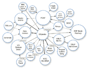

# 语义网或:为什么雅虎！抵制微软的收购

> 原文：<https://www.sitepoint.com/semantic-web-or-why-yahoo-resisted-microsofts-takeover/>

随着最近来自雅虎的[公告](http://www.ysearchblog.com/archives/000527.html)和[随后的](http://www.readwriteweb.com/archives/yahoo_supports_semantic_web.php) [疾风](http://www.techcrunch.com/2008/03/13/yahoo-embraces-the-semantic-web-expect-the-web-to-organize-itself-in-a-hurry/)的[帖子](http://blogs.zdnet.com/semantic-web/?p=114)接踵而至，一些事情变得清晰起来。雅虎！我没有接受微软的提议，因为它有王牌在手。语义技术。

有了这种技术，谁还需要微软或者谷歌呢？雅虎！能够超越 Web 2.0 世界中的可能性。我之前在[的博客](https://www.sitepoint.com/one-small-step-for-yahoo-one-giant-leap-for-embedded-metadata/)上写过关于[彼得·米卡](http://research.yahoo.com/bouncer_user/66)推出[微搜索](http://www.yr-bcn.es/demos/microsearch/)的文章，这是即将推出的 [SearchMonkey](http://tools.search.yahoo.com/newsearch/open.html) 的测试平台。SearchMonkey 将允许在全球范围内快速访问网络上几乎所有形式的元数据。

在上个月的一篇文章中，我沉思着雅虎或微软可能是第一个拥抱数据网络/语义网络的。现在很明显，雅虎！已经在下一代网络的战争中处于领先地位。

#### 关联数据为王

雅虎！维护一个庞大的内容网络。Flickr 是网络上最常用的照片分享网站。随着开关的翻转(好吧，也许比这更复杂一点)，雅虎的所有内容都可能变成一个巨大的图表，随时可以被 SearchMonkey 从语义上挖掘出来。这对雅虎来说是一个巨大的战略利益，这是谷歌和微软都无法比拟的。

一夜之间，雅虎可能成为世界上最大的[链接数据](http://en.wikipedia.org/wiki/Linked_Data)客户端——准备好接入下一代网站，如 [Twine](http://twine.com/) 、 [Dbpedia](http://dbpedia.org/About) 、 [Freebase](http://www.freebase.com/) 、 [Revyu](http://revyu.com/) 以及 [Drupal 7](https://www.sitepoint.com/drupal-7-a-living-breathing-semantic-web-citizen) 的每一个安装(由于 [Dries](http://buytaert.net/) )等。

雅虎的高管们！必须真的喜欢这些东西。更准确的搜索结果，更多我想要的东西**——全部免费。仅仅通过使用一个叫做 [RDF](http://en.wikipedia.org/wiki/Resource_Description_Framework "Resource Description Framework") 的小东西和嵌入的元数据，比如[微格式](http://microformats.org/)和 [RDFa](http://rdfa.info/wiki/RDFa_Wiki) 。我们这些可怜的笨蛋将会为他们工作:)**

 **我现在就能听到他们(甚至在我昆士兰海岸的小角落里)重复 A 队的汉尼拔的不朽话语…

> “我喜欢有计划的时候”** 

## **分享这篇文章**