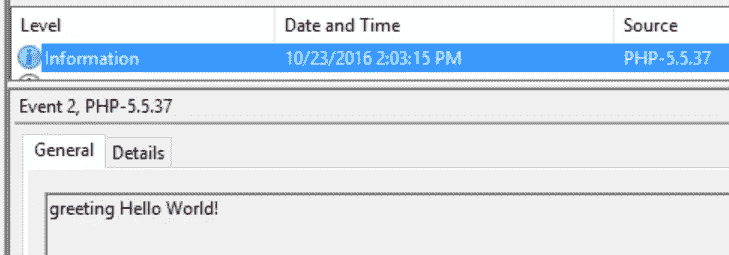
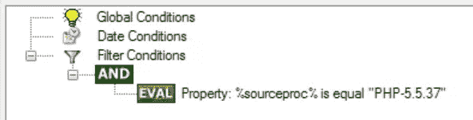
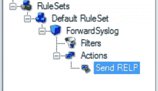
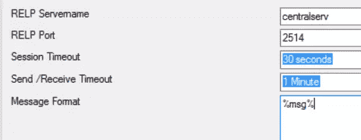

# 向 Windows 上的远程日志发送 PHP 事件消息

> 原文：<https://www.sitepoint.com/sending-php-event-messages-to-remote-logstash-on-windows/>

*这篇文章由[沃恩·安切塔](https://www.sitepoint.com/author/wancheta)、[斯科特·莫利纳里](https://www.sitepoint.com/author/smolinari)和[杰夫·麦德森](https://github.com/jrmadsen67)进行了同行评审。感谢 SitePoint 的所有同行评审员使 SitePoint 的内容尽可能做到最好！*

* * *

通过阅读这篇文章，你已经努力扩展了你对 PHP 应用程序的知识，这些应用程序是基于*事件* *分布式*系统的一部分。当我们说*事件消息*时，你会得到一个快速的介绍，什么是 *Logstash* ，为什么它这么酷。

如果你已经听说过 *Beats* 或者知道你可以在本地运行 Logstash 来将日志发送到另一个 Logstash 实例或者直接发送到一个数据存储库，比如 *Elasticsearch* ，那么这篇文章仍然适合你，它将向你展示一个易于配置和运行的、有希望更有效并且使用起来肯定很有趣的替代方法。


## 事件消息和日志的快速介绍

通过事件消息，我们可以收集关于应用程序中发生的*事件*的信息，无论是应用程序用户面向业务的决策、应用程序自身做出的决策，还是它们的失败。每个事件，除了它传达的消息之外，通常由时间戳和类型(如信息、警告或错误)来确定。事件的记录就是事件*日志*。

> 此外，还有[事件源](https://www.sitepoint.com/event-sourcing-in-a-pinch/)——一个有些不同但又有些相似的概念，您可能想了解一下。

有许多工具是专门为将日志传送到数据存储库以供以后分析和做出基于知识的决策而构建的。Logstash 就是其中之一，因为它提供了大量的输入、输出、编解码器和过滤器插件，所以最受欢迎。开箱即用，它可以从 *Heroku 应用日志*、 *GitHub webhooks* 或 *Twitter 流媒体 API* 中读取，创建新事件并将其发送到 *Graylog* 、 *IRC* 或 *JIRA* 。

应用程序的用户通常也会对事件消息感兴趣。在应用程序中，一个页面会生成事件，另一个页面会以聚合的形式显示它们。

让我们考虑一个例子，其中第一个页面发布新的博客文章，另一个页面列出上个月发布的所有与 PHP 相关的博客文章。应用程序可以直接与关系数据库进行读写对话。但是对于事件消息，它与数据库是分离的，因此其他*订户*可以很容易地添加，例如电子邮件列表或更高性能的数据存储，如 Elasticsearch。

## 发布事件

为了快速比较，让我们首先考虑使用 *Rsyslog* 在 Linux 上发布事件，这是许多计算机系统最喜欢的 syslog。

运行这个简单的命令行程序将会写下“Hello Wold！”到系统日志。

```
php -r "openlog('greeting', LOG_NDELAY, LOG_USER); syslog(LOG_INFO, 'Hello World!');" 
```

因为 Rsyslog 和 Logstash 都使用 *RELP* ，这是一种基于 TCP 的协议，用于可靠地传递事件消息，所以向 Logstash 发送消息只需要向 Rsyslog 配置文件添加两个简短的语句。

```
$ModLoad omrelp
if $source == 'PHP-5.5.37' then :omrelp:centralserv:2514 
```

假设 Logstash 正在监听端口`2514`上的`centralserv`。

在这个例子中，我们还通过*源*过滤消息，这样只有那些用我们的 PHP 制作的消息才会被发送过来。

我们不会在这里给你更多的细节。这不应该是那种派对。相反，让我们暂时切换到 Windows。我们会给你一步一步的指导，告诉你如何做同样的事情。

但是如果你想了解更多关于 Linux 的设置，这里有两个链接。

*   20.6。使用 Rsyslog 模块
*   [omrelp: RELP 输出模块— rsyslog 8.22.0 文档](http://www.rsyslog.com/doc/v8-stable/configuration/modules/omrelp.html)

### 在 Windows 上发布事件

我们将在这一点上得到指导。给自己找一个 Windows 盒子，在*命令提示符*中运行 oneliner。PHP 是跨平台的。这一次，这意味着问候被 Windows *事件日志*服务记录下来，你可以在*事件查看器*中看到它。

事件查看器可以从 *Cortana 搜索框*中找到。或者，按 Windows 键+ R 打开*运行框*，键入`eventvwr`并点击 OK 打开事件查看器。

打开事件查看器后，在左侧的控制台树视图中展开 Windows 日志，单击应用程序并向下滚动窗口中部显示的日志(如果需要),以找到您之前创建的日志。

此时，您应该会看到类似这样的内容:



*级别* `Information`匹配我们传递给`syslog()`调用的第一个参数`LOG_INFO`，而*源* `PHP-5.5.37`匹配我们运行的 PHP CLI 版本(更新以匹配您的版本)。了解这一点后，您可能还想过滤应用程序日志，或者通过单击右侧操作窗格中的相应操作来创建自定义视图。

注意:如果您也看到这样的消息:

> 找不到来自源 PHP-5.5.37 的事件 ID 2 的描述。

那么您的 PHP 安装没有将所需信息添加到 *Windows 注册表*中，因此您必须手动添加。从 PHP 源代码库中下载`/win32/syslog.reg`，在文本编辑器中打开，调整 PHP 版本和 *dll* 文件的路径，例如将*键名*从`HKEY_LOCAL_MACHINE\SYSTEM\CurrentControlSet\Services\EventLog\Application\PHP-5.3.99-dev`更改为`HKEY_LOCAL_MACHINE\SYSTEM\CurrentControlSet\Services\EventLog\Application\PHP-5.5.37`，将 *EventMessageFile 值*从`g:\\test\\srctrunkinstall\\php7ts.dll`更改为`C:\\xampp\\php\\php5ts.dll`，双击文件图标将*键*导入注册表。

## 使用 Rsyslog Windows 代理将事件消息流式传输到 Logstash

剩下的步骤是将这样的消息传输到 Logstash。我们将向您展示如何使用 Rsyslog Windows 代理来完成这项工作，这是一项 Windows 服务，由 Rsyslog 和 RELP 的创建者提供。代理将自动监控事件日志，并允许您定义规则和操作。

从[这里](http://www.rsyslog.com/windows-agent/windows-agent-download/)下载代理，安装它，然后运行服务附带的*配置客户端*，以便告诉服务发送哪些消息以及发送到哪里。

### 过滤

我们将只发送 PHP 生成的消息，因此，一旦配置客户端打开，单击窗口左侧树形视图中的*过滤器*标签，进入过滤器对话框。点击中央树形视图的*和*节点，这是我们将要制作的布尔表达式的图形表示。

现在点击*右边的>添加滤镜*按钮。从下拉菜单中选择*添加过滤器>* > *事件日志监视器【V2】*>*事件源*。单击以聚焦新创建的表达式，并在下面的*详细信息*选项卡中，将*比较操作*从`contains`更改为`is equal`，并在*设置属性值*字段中键入日志的源名称。在我们的例子中，它是`PHP-5.5.37`。



我们定了一个规则。接下来，我们将创建一个操作。

### 行动

右键点击左侧树形视图中*动作*标签下的默认动作，然后从下拉菜单中选择*删除动作*即可。然后，通过右击动作标签并从上下文菜单中选择*添加动作* > *发送 RELP* 来添加一个新动作。



现在，发送 RELP 动作已经聚焦，您可以设置 *RELP 服务器名*和 *RELP 端口*。此外，作为开始，将*消息格式*改为`%msg%`。这将按原样将消息传递到 RELP 服务器，而不进行修改。



### 启动服务和调试

还有一件事要做:点击蓝色三角形来启动服务。从这一点开始，消息应该会飞到 Logstash，你甚至不需要在下一次 Windows 启动时启动该服务，它会自动启动。

当您确认设置确实有效时，最好知道在 RELP 服务器无法接收到消息(您的应用程序的消息)的情况下，代理会自己发出一条错误消息。您可以在事件查看器中看到预期的服务消息，也可以通过单击配置客户端窗口左侧树形视图的*服务事件*节点来查看。

## 结论

到目前为止，您已经对 Logstash 和 Rsyslog 有了基本的了解，了解到它们可以用于构建基于事件的分布式系统，并获得了一些实践经验。

现在让我们听听你要说什么。您是在 Windows 上开发并在生产中使用 Logstash，还是现在有兴趣使用它？太好了！我们也希望在下面的评论中听到您的使用案例或问题。

## 参考

*   【Logstash 如何工作
*   [5 个 Logstash 备选方案](https://sematext.com/blog/2016/09/13/logstash-alternatives/)
*   [可靠的事件记录协议](https://en.wikipedia.org/wiki/Reliable_Event_Logging_Protocol)
*   [relp | Logstash 参考[5.0] |弹性](https://www.elastic.co/guide/en/logstash/current/plugins-inputs-relp.html)
*   [事件记录(Windows)](https://msdn.microsoft.com/en-us/library/windows/desktop/aa363652)
*   [Rsyslog](https://en.wikipedia.org/wiki/Rsyslog)
*   [关于 Rsyslog Windows 代理](http://www.rsyslog.com/windows-agent/about-rsyslog-windows-agent/)
*   [PHP :: Bug #72806::事件查看器的系统日志问题](https://bugs.php.net/bug.php?id=72806&edit=3)

## 分享这篇文章