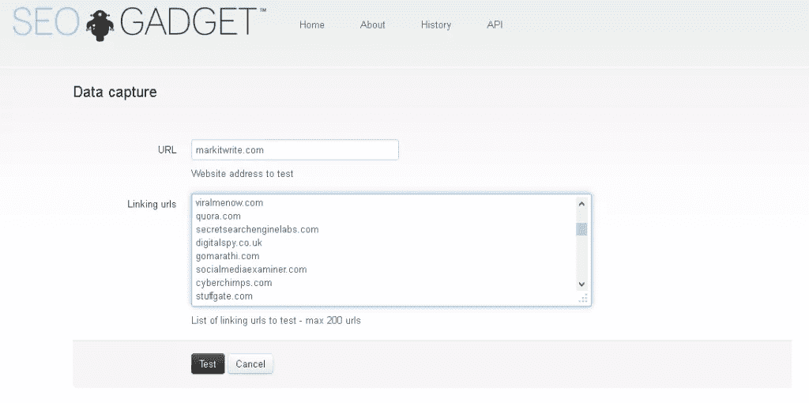

# 搜索引擎优化灾难:当谷歌对你的网站去索引时会发生什么

> 原文：<https://www.sitepoint.com/seo-disasters-happens-google-de-indexes-site/>

对于许多 SEO 公司来说，这是艰难的一年左右——尤其是那些不遵守黑帽技术规则的公司，尤其是在链接方面。我一直认为，质量胜于一切，虽然你可以调整搜索引擎优化，但通过糟糕的内容追踪链接总是会引起谷歌的注意，甚至更糟——这是一种人工惩罚。

搜索引擎近年来在内容方面的主要算法变化意味着许多公司发现他们的网站几乎从索引中消失了。为什么？因为他们没有遵守规则，不管是有意还是无意。

[熊猫](https://www.sitepoint.com/forums/showthread.php?906496-What-should-i-do-to-tackle-Google-Panda)、[企鹅](https://www.sitepoint.com/can-negative-seo-really-get-your-site-penalized/)和[蜂鸟](https://www.sitepoint.com/what-googles-hummingbird-update-means-for-seo/)，谷歌最近最著名的算法更新，已经改变了游戏。他们要求网站架构和内容的高质量。更重要的是，只要嗅一嗅购买的链接，很有可能网站就会被取消索引。有时，这是代理公司的过错，他们使用了一种不太道德的方法来进行搜索引擎优化。在其他情况下，这是由于网站所有者缺乏知识，或者他们犯了简单的错误。

白帽 SEO 是唯一可以采用的方法，除非你想冒被惩罚的风险。这不仅适用于链接建设，也适用于其他搜索引擎优化技术，如:

*   隐藏/网关页面
*   旋转内容
*   购买链接
*   重复内容
*   关键词填充

许多站长仍然使用伪装和网关页面作为爬 SERPs 的手段，但这真的不可取。不要只相信我的话，看看谷歌的马特·卡茨是怎么说的:

[//www.youtube.com/embed/QHtnfOgp65Q](//www.youtube.com/embed/QHtnfOgp65Q)

## 链接建筑

今年一月，Matt Cutts 也终止了使用客座博文为 SEO 建立反向链接的做法。

> 好吧，我称之为:如果你在 2014 年使用客座博客作为获得链接的一种方式，你可能应该停止。为什么？因为随着时间的推移，这已经成为一种越来越垃圾的做法，如果你写了很多客座博文，那么你就是在和非常糟糕的公司交往。

因此，虽然客座博文仍然可以作为推广内容和公共关系的一种手段，但它已经不能仅仅用于建立链接了。垃圾邮件制造者毁了所有人。

## 如果你被罚了

[根据谷歌](https://support.google.com/webmasters/answer/35665)的说法，如果你的网站:

> [D]不符合分配准确等级所需的质量标准。[谷歌]不能对你的页面被删除的个别原因发表评论。但是，某些行为，如伪装、以搜索引擎可以看到但用户看不到的方式书写文本，或者以欺骗搜索引擎为唯一目的建立页面/链接，可能会导致从索引中永久删除。

一个手动惩罚将出现在你的网站管理员工具帐户。根据处罚的原因，你可以清理并重新将网站提交给谷歌。然而，这并不一定是一件容易的工作，重要的是你要把它做好。鉴于可疑链接是你可能会受到处罚的一个非常常见的原因，让我们来看看你如何处理这个问题。

首先，谷歌建议你使用基于文本的浏览器 Lynx T1，它可以让你像搜索机器人一样浏览网站。但是，请记住，您将无法查看脚本、会话 id、Flash 等等(就像搜索机器人无法查看一样)。

另一种选择是使用[Open Site Explorer](http://www . opensiteexplorer . org/)来检查链接。这个免费的工具(Moz(http://Moz . com/)套件的一部分)允许您将入站链接导出为. CSV 文件，这对于检查您的链接并开始解决问题非常有用。

### 变得有条理

在你开始之前，先建立一个包含所有链接信息的电子表格，让自己有条理。这为您提供了所做更改的记录，这在提交重新考虑请求时很有帮助。

您的电子表格应包括:

*   与 URL 的链接
*   锚文本详细信息
*   “链接自”网站的详细联系信息
*   删除/不跟踪发送到网站的请求，包括提出请求的日期和次数
*   链接状态(已删除/未关注/实时)

## 删除不良链接

在你可以删除“坏链接”之前，你必须确定哪些是造成损害的。为了帮助你做到这一点， [SEOgadgets 工具](http://tools.seogadget.com/)是众多坏链接工具中声誉最好的，它允许你一次上传 200 个保存为 Excel/CSV 文件的链接。你可以通过上面提到的打开站点浏览器来完成，或者如果你愿意，你可以直接从网站管理员工具下载链接。

该工具使用特殊的算法来决定哪些链接是安全的，哪些是不安全的。它从 SEOMoz(一个可信的来源)获取链接信息，然后对它们进行评分。该工具试图找到每个链接的联系信息，并收集其他信息，如锚文本、社交媒体详细信息、作者身份和链接指标，如 Google Pagerank 和 SEOMoz 域权限。最重要的是，SEOgadgets 来自一家值得信赖的公司，而且是免费的，不像其他许多工具，有些工具每个链接收费 10-20 美元，如果你有很多链接可以使用，这是一大笔钱。

在下一个屏幕上，您可以等待该工具分析每个链接，或者您可以输入您的电子邮件地址，并要求在报告生成时得到通知。

然后，您可以从该工具中导出所有信息，并通过联系网站所有者/网站管理员来处理不良链接，要求将该链接取消关注或完全删除。一定要小心，因为当我测试这个工具时，我发现它指向的链接是坏的，而我知道它们不是，所以也要手动检查网站。

最后，如果你真的有必要，你也可以使用[谷歌否认工具](https://support.google.com/webmasters/answer/2648487?hl=en)，但是除非你非常精通 SEO，否则不推荐使用。这个工具是为那些你绝对没有办法清理的链接准备的，而且你**确定**这些链接对网站的排名有不利影响。这些必须作为. txt 文件提交给谷歌，每行包含一个链接。

它还必须是 UTF-8 或 7 位 ASCII 编码，您可以添加更多信息来解释为什么此链接被拒绝，方法是使用#符号来表示它是一个描述性行，而不是一个链接。使用该工具可以指导谷歌忽略那些你无法删除的不良链接，但不要期望立竿见影，它需要一段时间才能产生效果。

## 重新提交前

在你求助于谷歌并重新提交网站之前，你也应该看看以下内容:

*   站点架构
*   在整个内容中使用关键词
*   元描述和标题中包含什么
*   元关键字中不使用关键字

网站架构应该遵循一个逻辑模式，并包括内部链接。应该测量整个网站的关键词密度，如果有必要的话，降低密度，以确保它读起来自然。关键词仍然是一个很受欢迎的 SEO 策略，但是你应该想出一两个关键短语，而不是反复使用一个单词。相似且相关的短语也能很好地发挥作用。

元描述和页面标题都应该反映页面的内容，并且对于网站上的每个页面都是不同的。

链接并不是唯一会给你带来手动惩罚的东西。你还应该看看:

*   潜在的恶意软件攻击/注入
*   写得不好或“单薄”的内容没有任何价值
*   隐藏文本(如元信息/隐藏页面/黑色背景上的黑色文本等。)
*   用户在网站的评论或社区区域生成的垃圾邮件
*   '垃圾免费主机'

不幸的是，免费主机服务经常与垃圾邮件有关，因为它们似乎吸引了低质量的网站。

## 棘手的部分

好了，你已经做了所有你能做的链接清理工作，你已经仔细检查了网站，并且在必要的时候移动了主机。现在是时候问谷歌是否会重新考虑索引你的网站了。

你可以直接从网站管理员工具中的**手动操作**页面进行操作。在您的复议申请中，您应该包括尽可能多的信息，以便如 Matt Cutts 所说，提供:

> 清晰、令人信服的证据[使]谷歌更容易做出评估

如果不自然的链接导致了处罚，把你的链接跟踪电子表格做成谷歌文档，并在你的请求中分享。

你也应该详细说明你得到不自然链接的原因。如果你使用了代理机构，请通知谷歌。如果是你的员工把链接放在适当的位置，告诉谷歌你做了什么，以确保错误不会在未来发生。你的工作是让搜索引擎人员相信这种事情不会再发生。你能提供的支持你的要求的信息越多越好。不遗余力地创造一个论点，证明你的网站和它的管理员可以百分之百地被信任，以确保这个问题不会再次出现。

如果你已经很彻底，查看了所有不自然的链接，清理了网站的每个方面，那么谷歌没有理由拒绝。如果他们这样做了，你可以上诉，但首先要绝对确保网站是干净的。

受到谷歌的处罚并不令人愉快，如果你的网站有很多反向链接，这将是一个费力而漫长的过程。然而，如果你想维持一个网站，尤其是如果你在做生意，这是必须的。

避免受到人工处罚的最好方法是确保你按照规则做每一件事，密切关注链接到你的内容的网站，忘记追逐链接是一种 SEO 形式。相反，如果你想为其他网站写文章，并希望他们链接回你的网站，那就和你的专业领域的编辑和网站建立关系。使用简历并注册谷歌作者身份，确保你提供高质量的内容——也不要坚持链接，否则很明显这就是你真正想要的。

SEO 现在变得越来越难，就我而言，这是积极的一步。它为我们所有人创造了一个更好的网络，一个更有用的，高质量的工作可以上升到顶端的网络。

## 分享这篇文章