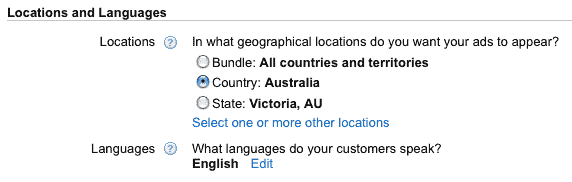
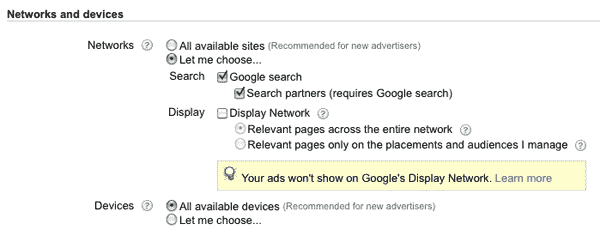
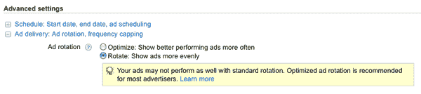

# 成功 PPC 活动的 8 个步骤

> 原文：<https://www.sitepoint.com/seo-ppc-strategy/>

本文节选自 SitePoint 最新发布的 SEO 商业指南 。文章的整个章节，加上两个额外的章节，可以从[免费下载](https://www.sitepoint.com/kits/seo-business-guide/samplechapters.php)。如果你喜欢你在这里读到的，一定要去看看！

在一次 PPC 活动中取得成功是一个很大的成就，但是一次又一次地交付结果完全是另外一回事。业余搜索引擎营销人员和专业搜索引擎营销人员的不同之处在于，他们能够持续不断地开展营销活动并取得成效。

为了获得一致的结果，您需要遵循一个系统化的过程，涵盖研究、实施和优化这三个核心过程。

每当启动新活动时，请使用以下清单:

*   研究:商业目标

*   研究:目标受众

*   研究:关键词研究

*   实施:市场活动结构

*   实施:广告文案

*   实施:登录页面开发

*   实施:活动设置

*   优化:统计分析

*   优化:细化

*   优化:投标管理

## 研究:商业目标

在你担心谁是你的目标受众，或者你想锁定什么关键词之前，你需要了解这个行业希望通过 PPC 活动达到什么目的。

如果没有一个潜在的商业目标来衡量成功，PPC 活动是没有用的。您应该问自己和业务中涉及的关键利益相关者的一些重要问题是:

*   PPC 活动应该实现什么目标？

*   用户在网站上应该采取哪些目标行动？

*   每个行动对企业的价值是多少？

理解一些标准的商业目标，比如上面的那些，可以让你开始开发一个对商业有意义的活动，并交付可测量的结果。

## 研究:目标受众

定义你的受众是制定你的 PPC 活动背后的基本策略的重要的第一步。回答关于目标受众的问题通常会揭示更广泛的见解，这些见解可以在整个活动中全面使用。

在你开始使用关键词工具和开发关键词列表之前，你应该回答以下问题:

*   我这次活动的目标是谁？

*   我的理想用户住在哪里？

*   为什么我的目标受众需要这种产品或服务？

*   我的客户的心态是怎样的？

在进行更细致的关键词研究之前，回答其中的一些问题有助于优化您与潜在用户的沟通，以及定向广告、登录页面和其他元素，以便它们直接针对您的受众。

## 研究:关键词研究

在本指南的前面部分，您学习了如何使用谷歌关键词工具来识别与特定短语相关的关键词，并选择相关术语作为目标。使用相同的过程并记住你的目标受众，你现在可以使用相同的工具来开发关键词列表。

深入用户的思维模式。想想如果你想从你推广的网站上购买一件产品，你会输入哪些搜索词。将这些关键字分组到逻辑捆绑包或广告组中，每个组都有自己的主题、话题或特定于企业产品和用户需求的产品。

在进行关键词研究时，同样有必要列出一个负面关键词列表来隔离，并阻止任何不相关的关键词组合。拥有一份完整的负面关键词列表通常可以减少浪费的点击，提高点击率，并有助于降低成本。

## 实施:活动结构

现在你已经有了与目标受众相关的关键词列表，你需要围绕这些主题合理地组织你的活动。一次使用不超过五到十个关键词，将你的关键词列表分成特定的广告组，充实广告活动的结构。

没有所谓的太多的广告组，所以没有限制，以符合一定的最小或最大数量的广告组。这将取决于你的网站的复杂程度，以及你的活动所针对的产品和受众的数量。

## 实施:广告文案

现在，您已经有了一个围绕最合理的主题和产品开发的营销活动结构，每个广告组中都包含相关的关键词。现在是时候开始开发与这些关键词和你的登陆页面相关的广告了。

每个主题或产品都有自己独特的价值主张——也就是说，有别于竞争对手的特定优势——你需要通过文案向潜在用户传达这一点。对于你网站上的每个广告群和目标页面，写下一个价值主张或独特的卖点，作为你广告文案的目标。

去 google.com，对你的每个目标关键词进行搜索，看看你的竞争对手在使用哪种广告文案。这是一个很好的起点，有助于你构思自己的广告。你的工作是在 100 个字符的广告空间内传达你的产品和服务的好处——比你的竞争对手更好。

首先，为每个广告组写至少两个广告。尽可能使这些变体不同；通过这样做，你在测试不同的主张，你的用户对每条信息的反应方式将有助于你在以后优化搜索活动时确定改进。

我们来看一些例子，这样你就能看出好广告和坏广告的区别。以之前鲍勃的绿茶为例，假设你正在为公司的有机茶产品写一个广告，目标是“有机茶”关键词。

**例 1。一个糟糕的付费搜索广告**

鲍勃的绿茶

自 1997 年开始销售绿茶

来看看我们全部的选择。

`bobsgreentea.com`

**例二。一个好的付费搜索广告**

鲍勃的好有机茶

高品质、清爽的有机食品

茶产品只在今天出售。

`bobsgreentea.com/organic`

请注意，第二个广告在整个文案中使用了“有机”一词，并且有一个更引人注目的行动号召。当然，这只是一个例子，但你应该看到这个想法:专注于你的关键词，以增加广告的相关性，并确保你把重点放在你的客户的产品或服务的独特卖点。

## 实施:登陆页面开发

理想情况下，你将推广一个拥有高质量原创内容的网站，该网站结构良好，用户友好。这将使你通过 PPC 活动交付的客户能够轻松地进行购买或浏览网站。

不幸的是，你并不总是面对理想的情况，有时你需要调整登录页面，以向你的客户提供最大的回报。确保任何给定广告组的主要关键词都包含在页面标题和 HTML 标题标签中。

每个登录页面需要:

*   有效地宣传你试图吸引用户的产品或服务

*   尽可能减少点击次数，轻松采取所需行动或实现业务目标

*   包含与产品或服务相关的原创内容

*   快速加载——记住，页面加载时间是决定质量分数和广告排名的一个因素

简而言之，登陆页面应该传达你的提议是什么，以及为什么它与访问者相关。一个好的测试是问你自己，“访问者能在十秒钟内理解这个产品或服务的主要好处吗？”如果答案是肯定的，那么你的登陆页面很有可能是正确的。

## 实施:活动设置

现在你已经有了一个强有力的计划、一份好的文案和一个精心设计的登录页面，你几乎已经准备好开始你的活动了。当你这样做的时候，谷歌会询问你一些具体的设置，这些设置会影响你的广告活动的运行。由于您已经完成了之前的研究和实施步骤，您已经回答了与您的活动设置相关的大多数问题；现在是应用它们的时候了。

如果您还没有创建您的活动，请在 AdWords 仪表盘的活动选项卡中点击创建您的第一个活动来创建您的活动。

您的目标受众信息将决定您发起的每个活动的地理位置和语言。继续设置特定于您的活动的国家或地区以及语言首选项，如[图 1，“位置和语言”](#fig_ppc-languages "Figure 1. Locations and languages")所示。

**图一。地点和语言**

一般来说，你的关键词竞价应该基于你的关键词研究和其他市场因素，所以这里没有一个通用的答案。一个好的、实用的方法是从低水平开始，然后逐步提高。这将节省你在广告活动开始时浪费点击的钱。提高你的出价，因为你决定了广告的表现和投资回报，具体到每个登陆页面，关键词和网站。

你还需要为你的活动确定预算。我们强烈建议设定一个小的每日预算；一旦你进一步优化了每一个活动，你就可以提升它。这将减少无谓点击的花费。

如前所述，在你的最初几个活动中，限制自己只在谷歌搜索和搜索合作伙伴网络上展示你的广告是一个好主意，避免展示网络。相关设置如[图 2“网络和设备”](#fig_ppcnetworks "Figure 2. Networks and devices")所示。

**图二。网络和设备**

接下来，在高级设置部分，选择旋转:更均匀地显示广告，如图[图 3，“定制广告投放”](#fig_ppcrotation "Figure 3. Customizing ad delivery")。这将确保你上传的每一个广告都显示偶数次。选择此选项可让您真正确定每个广告组中每个广告的表现，这是优化活动时学习过程的一个重要部分。默认(优化)选项将广告投放基于点击率——点击越多的广告将显示得越频繁。虽然这可能是一个很有吸引力的选择，但现在你最好了解是什么让广告文案发挥作用。您还可以跟踪不同广告文案的转化，因此最好坚持使用 Rotate 。

**图 3。定制广告投放**

## 优化:统计分析

与理解一个活动为什么能实现或不能实现其目标相比，组织一个活动相对容易。幸运的是，AdWords 有一整套的报告，可以帮助你确定你的活动的哪些部分给你带来了最大的价值。

最初，对任何营销活动来说，最重要的信息都围绕着以下关键因素:质量分数、转化率和每次点击成本。使用 AdWords 主界面可以轻松确定所有这些要素。一次浏览一个广告组和活动将突出显示每个关键元素。

记住要监控单个广告的表现:通常一个广告会胜过一组中其他类似的广告。如果是这种情况，你可以暂停——也就是说，暂时关闭——表现不佳的广告，并根据表现最佳的广告中提到的关键信息和好处撰写新的变体。然后，用新的副本对以前的冠军重复测试。

可以在关键字级别执行类似的优化。表现较好的关键词可以提高其出价，而表现不佳的关键词可以暂停或降低其出价。你也可以挑出最好的关键词，形成新广告群的基础；这些群体将从较低的 CPC 中受益。

## 优化:细化

成功的 PPC 活动是建立在市场数据和表现的基础上的。这些信息是基于现实世界中与广告文案、登录页面和您选择的关键词的互动。

每一个单一的运动将有成功和不成功的元素和关键字，需要优化。有第三方程序和许多不同的思想流派围绕如何进行持续的 PPC 优化，但基本原则是直截了当的:测试，测试，测试。即使你的第一次活动表现远远超出你的预期——转换率很高，成本很低，你立即获得了正的投资回报——你仍然可以从测试替代方案中受益。广告文案、关键词和登陆页面的反复会对你的底线产生巨大的影响。如果你不能测试这些不同的元素，你永远不会有一个真正优化的活动。

质量分数总是可以提高的，广告也变得更加相关。永远不要停止测试新想法！

## 优化:投标管理

竞价管理的科学决定了你应该为每次点击付费支付多少钱。为了确定你的网站可以为每次点击支付多少钱，你需要首先了解当访问者采取你寻求的目标行动时，你赚了多少利润。

如果你每笔销售收入 100 美元，每次点击花费你 2 美元，那么你需要转化每 50 个访问者中的一个来平衡你的营销努力。这是 2%的转化率。如果你的活动转化率为 4%,点击仍然花费你 2 美元，你将为每个转化行为支付 50 美元——导致 50 美元的利润。因此，你仍然可以有效地为每次点击出价 4 美元，并保持正的投资回报率，尽管你为每次点击支付的费用越少，显然越好。

没有什么复杂的东西被用来计算这个。你能支付的每次点击费用直接取决于你的网站和广告活动中每个特定关键词的广告表现。这里没有你应该使用的规则；常识将指导你决定你能为每个关键词的点击支付多少钱。

本文节选自我们最新发布的第五章，[*《SEO 商业指南》*](https://www.sitepoint.com/kits/seo-business-guide/) 。整个章节名为*付费搜索*，可作为[免费 PDF 下载](https://www.sitepoint.com/kits/seo-business-guide/samplechapters.php)以及另外两个章节。如果这件作品吸引你，一定要看看我们的报价！

## 分享这篇文章