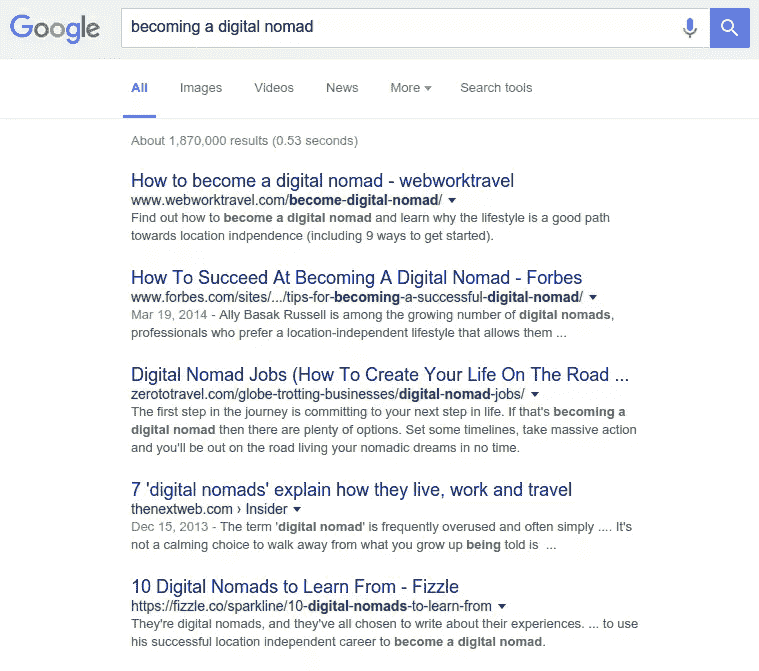
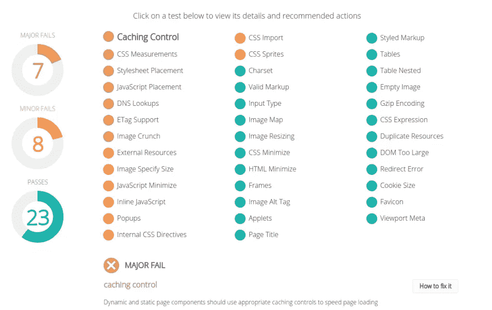
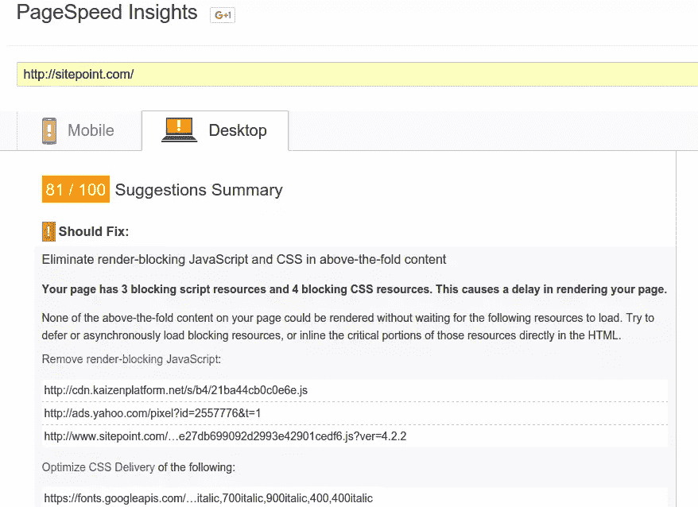

# 2016 年值得关注的 6 大搜索引擎优化趋势

> 原文：<https://www.sitepoint.com/seo-trends-in-2016/>

这些天，我们经常听说搜索引擎优化不再是你业务营销的重要组成部分。但是不要被愚弄了——它仍然是重要的，就像许多网络技能一样，你不能一次学会诀窍就收工。SEO 规则和搜索引擎算法每年都在改变。跟随最新的变化并对你的网站进行必要的修改是显而易见的。

今年，搜索引擎优化将一如既往地强大，但搜索引擎变得越来越聪明——比以往任何时候都更难使用狡猾的伎俩来愚弄他们。2016 年的 SEO 不仅仅是针对搜索引擎优化网站，而是让你的网站适合人们。

如果你对 2016 年 SEO 会带来什么感兴趣，这里有 6 个不会让你失望的小技巧。

## 内容营销

那么什么是[内容营销](https://en.wikipedia.org/wiki/Content_marketing)？

> 内容营销是指任何涉及创建和共享媒体和发布内容以获取和保留客户的营销。

在我们的案例中，内容营销的目标是为访问者提供价值。

如果你想创建一个伟大的内容营销活动，你应该专注于提供答案。你写的每一个字都应该有价值，并回答你的读者可能会有的问题。花点时间在谷歌上搜索你感兴趣的东西。你会看到第一页上的许多文章都是操作指南和列表文章。这些帖子出现在谷歌首页是有原因的:它们提供了价值。

在你开始写作之前，想想你所在市场的读者想要什么，并试着找出他们的问题。有一些工具可以帮助您找到受众最关心的问题:

*   [Quora](https://www.quora.com/) 。Quora 是市场研究最重要的资源之一。如果你在 Quora 上找到了自己的位置，你可以看看人们在问什么，然后利用这一点。试着写一些有价值的文章，并回答与你的主题相关的问题。
*   [Reddit](https://www.reddit.com) 。Reddit 被称为互联网的头版不是白叫的。有[2.31 亿独立访客和 3600 万会员](http://expandedramblings.com/index.php/reddit-stats/)可以提交内容，如文本帖子或直接链接，并提出问题。不仅如此，每个特定的领域和兴趣都有一个子编辑。这是一个发现用户需求的好地方。
*   论坛。在网上你可以找到许多不同主题和领域的论坛。写文章回答利基论坛中常见问题的好处之一是，如果你做得好，你可能会发现你的文章出现在线程中。

关键是要弄清楚你的观众到底想要什么——然后给他们。

你的访问者是回去点击其他搜索结果，还是在你的网站上找到他们想要的答案？如果前者是真的，你就在正确的轨道上。提供价值的更长、更有结构的帖子会从谷歌获得更好的结果。

## 移动友好是必须的

自 2015 年 5 月以来，[移动搜索已经在包括美国和日本在内的十个国家超过了桌面搜索](http://adwords.blogspot.al/2015/05/building-for-next-moment.html)，这种[趋势将会持续](https://www.sitepoint.com/5-seo-trends-you-need-to-consider-for-2015/)是事实。在这一点上，它是每个网站管理员必须保持他们的网站移动友好。

你可以使用三个工具来检查你的网站是否是手机友好的，它们是[必应的手机友好测试工具](https://www.bing.com/webmaster/tools/mobile-friendliness)、[谷歌的手机友好测试工具](https://www.google.com/webmasters/tools/mobile-friendly/)和 [mobiReady](http://ready.mobi/) 。第一个和第二个是好的，但是他们没有告诉你为什么你的网站是移动友好的或者不是。mobiReady 是一个更复杂的工具。我推荐使用它，因为它给你一个网站分析的增强视图，并使用一个评级系统。当你的网站得分越高，它就越有能力在移动设备上提供高质量的用户体验。此外，它给你一个网站性能故障的详细列表，以及为什么这些因素会降低你的页面结果。

为了让你的网站在手机友好的测试工具中表现良好，请遵循以下提示:

*   避免在移动设备上不常用的软件，尤其是 Flash。
*   如果你是从零开始编码，记得让你的站点有响应性，或者使用一个响应性的框架/主题。
*   确保内容适合屏幕视窗，这样用户就不必水平滚动或缩放。
*   以无需缩放即可阅读的方式设置文本格式。
*   将链接放在彼此相距足够远的地方，这样访问者可以很容易地找到正确的链接。

如果你的网站使用 CMS，请查看谷歌提供的这些[指南](https://developers.google.com/webmasters/mobile-sites/website-software/)。

别忘了:一个手机友好的方法会让你的网站在谷歌的排名大幅提升。一个不支持移动设备的竞争对手没有机会对抗一个支持移动设备的网站。

## 更快的加载时间，更好的结果

加载速度慢的网站不仅会惹恼访问者，还会降低搜索引擎优化排名。顶级页面的加载时间大约为 1.1 秒，但另一方面，40%的人会放弃一个加载时间超过 3 秒的网站。你的网站可能介于这两个极限之间。检查这些工具来分析你的站点的页面速度，看看你能改进什么。

PageSpeed Insights 是谷歌提供的一个工具，可以帮助你定位网站的速度问题。它有一个从 0 到 100 的排名系统，其中 100 是最高分。Google 的 PageSpeed 最大的特点是它显示了哪些地方需要关键的修复。它还展示了您可以进行的其他改进以及如何修复它们。

YSlow 是一个浏览器插件，可以根据分数来建议提高性能的方法。每个成分分析都有它的等级。当您想要根据组件的类型查看组件的大小时，YSlow 非常有用。如果你对你的网站的性能很认真，我建议把 YSlow 加入你的武器库，因为它是基于由[雅虎创建的规则。■卓越的表演团队](https://developer.yahoo.com/performance)。

GTmetrix 是另一个免费的工具，它提供了提高网站速度的方法。这是一个有效的工具，因为它显示了由 PageSpeed Insights 和 YSlow 测量的性能问题。它还显示了一个瀑布图和其他三个衡量网站性能的图表。对于更详细的瀑布分析，[网页性能测试](http://www.webpagetest.org/)是另一个有用的工具。

[要让你的网站加载更快](https://www.sitepoint.com/10-ways-to-speed-up-your-site/)，有很多因素你要考虑。这里有几个。

*   使用 [YUI 压缩器](http://yui.github.io/yuicompressor/)压缩来减小 CSS、HTML 和 JavaScript 文件的大小。
*   一定要减少网站上的 HTTP 请求。此外，减少需要加载的外部文件，如样式表、脚本和图像。
*   改善您的服务器响应时间。这种延迟通常是由缓慢的路由、缺乏足够的内存或缓慢的数据库查询造成的。
*   使用浏览器缓存，这样当用户再次访问您的站点时，浏览器不必重新加载整个页面，只需重新加载一些组件。
*   当你优化你的图片时，确保图片大小不要太大或太小，并根据图片的用途使用正确的格式。建议照片用 JPEG，图形用 PNG。

## 不要落下本地搜索引擎优化

自从谷歌的鸽子更新以来，[本地搜索引擎优化](https://moz.com/blog/category/local-seo)对于每一个想要排名靠前的企业来说变得越来越重要。地理位置和搜索历史在人们看到的结果类型中扮演着重要的角色。 [20%的桌面搜索有本地意图](https://www.sitepoint.com/basics-local-seo/)。在移动设备上，这一比例跃升至 50%。个性化结果的崛起，将是本地 SEO 的崛起。

这里有一些有用的提示，让你的当地业务相关。

确保你创建了一个[谷歌商业页面](https://www.google.com/business/)，并在那里添加你的商业描述。请务必添加您的地址和链接到您的信息。

提高本地 SEO 的另一个重要因素是在你的网站上列出你的名字、地址和电话号码。还可以在点评网站上创建你当地的企业简介，比如猫途鹰、T2、雅虎本地、T4 和 Yelp。这是一个很好的主意，参与到你当地的社区中，从当地的新闻网站或社区网站上获取入站链接。没有这些步骤，你的企业在当地的排名不会很好。

关于本地 SEO 的更多信息，我推荐阅读以下两篇文章:

*   [本地 SEO:基础知识](https://www.sitepoint.com/basics-local-seo/)
*   [本地 SEO:高级组件](https://www.sitepoint.com/local-seo-advanced/)

## 社交内容促进搜索引擎优化

自从 Twitter 与谷歌达成交易以来，Twitter 的指数化正在快速增长。谷歌正在索引标签、推文和个人资料，比以往任何时候都多。人们认为，2016 年将是谷歌和社交媒体在 SEO 方面打破壁垒的一年。

在与谷歌达成协议后，现在我们可以看到官方 Twitter 个人资料显示在前三名的结果中。谷歌不需要抓取 Twitter 的信息，因为它可以自动找到信息。

除了谷歌，Twitter 还向必应和雅虎的搜索服务提供数据。预计随着时间的推移，我们将看到搜索引擎使用 Twitter 数据的方式发生重大变化。

当一个访问者在社交媒体上分享你的一个页面时，更多的人会看到这个页面，阅读它，其中一些人可能会分享它。这种行为会导致入站链接和提及，这对排名有直接影响。

## 关键词很重要，但不要试图愚弄谷歌

站长试图用关键词“愚弄”谷歌的时代已经一去不复返了。现在，他们必须明白尽可能在正确的上下文中使用关键字。

自从[谷歌蜂鸟](https://en.wikipedia.org/wiki/Google_Hummingbird)更新后，与其在一个问题中追逐特定关键词的排名，不如搞清楚一个问题的上下文。回答问题对任何 SEO 策略都是至关重要的。与其专注于几个短语或关键词，不如集思广益，找出人们可以用来寻找你的网站的对话短语。

关键词策略还是很有必要的。以下是一些你会发现有用的关键词研究工具:[谷歌的关键词规划器](https://adwords.google.com/KeywordPlanner)、 [SEMrush](https://www.semrush.com/) 和 [Ubersuggest](https://ubersuggest.io) 。它们将帮助你找到流行的关键词和短语，你可以围绕它们制定策略。当你开始计划关键词策略的时候，留意一下[长尾和 LSI 关键词](https://www.sitepoint.com/5-seo-trends-you-need-to-consider-for-2015/)。

## 结论

那些说 2016 年 SEO 会死的人错了。他们在 2015 年也说过同样的话。也就是说，2016 年的 SEO 与老派 SEO 完全不同，在老派 SEO 中，你会找到“神奇”关键词，并围绕它制定整个策略。

今年，你的 SEO 策略应该是不同方法的混搭，它们有一个共同点:为用户提供价值。

## 分享这篇文章