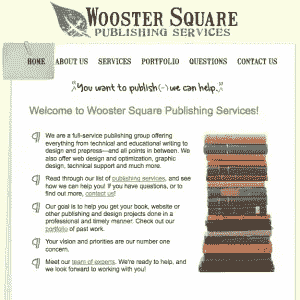
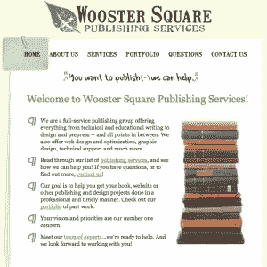
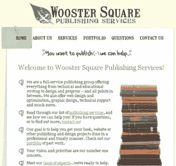

# 衬线字体与无衬线字体:工作案例研究

> 原文：<https://www.sitepoint.com/serif-fonts-vs-sans-serif-fonts-a-working-case-study/>

网络上大多数内容的标准样式是无衬线字体，如 Arial 或 Verdana。这种情况是合理的，原因有很多:无衬线字体更容易在屏幕上阅读，当它们的尺寸减小时看起来很好，并且它们往往在不同的平台和浏览器上保持它们的视觉吸引力。

衬线字体用于许多网站的标题和副标题，这可以在大量无衬线的页面上产生很好的效果。但是使用衬线字体作为主要内容有用吗？我能找到的成功做到这一点的网站数量有限，其中一个是卡梅隆·摩尔的博客。在戴维·罗德里格斯的《[不要害怕衬线字体](http://www.wpdfd.com/issues/86/dont_be_afraid_of_serif_fonts)》这篇为设计师设计的网页帖子中，几乎没有几个网站列出了衬线字体虽然我喜欢衬线字体适合布局和设计时的样子，但我承认我的眼睛需要几秒钟来适应阅读这些网站上的副本。

**案例研究**

这让我想到了我当前的问题。我考虑过在我工作的网站上使用衬线字体，但是我不完全相信我应该走这条路。有几个原因可以解释为什么在这个特殊的网站上有这个选项:

1.  这是客户的偏好。
2.  它适合公司的服务(出版支持)。
3.  它可能与设计配合得很好。

我已经创建了两个测试页面，所以你可以明白我上面的第二和第三点是什么意思。以下是详细信息和一些截图(点击放大)。

|  
现场:【www.woosterpublishing.com】T4
字体:Arial
H1: 22px
H2: 18px
正文:12px | 测试页面:[首页](http://www.woosterpublishing.com/font-test.html)和[关于我们](http://www.woosterpublishing.com/font-test2.html)
字体:佐治亚
H1: 22px
H2: 18px
正文:12px |

这些屏幕截图是在我的 Mac 上拍摄的，但我也在 PC 上看过，测试页面看起来明显不同(见下文)。

总的来说，我喜欢 Georgia 的这种设计，尤其是在我的 Mac 上，但我并不完全相信这是正确的选择。我关心的是保持跨平台的美观，使用无衬线字体更容易实现，尤其是当 Windows 用户的 PC 上没有启用 ClearType 时。但是你有什么看法？使用衬线字体还有其他的优点和缺点吗？

## 分享这篇文章