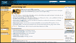
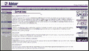

# 您最喜欢的服务器端语言的 3 大参考网站

> 原文：<https://www.sitepoint.com/server-side-language-2/>

当你使用服务器端语言时，拥有一个关于该平台的最新信息的良好来源是非常宝贵的。尽管 SitePoint 有很棒的教程和活跃的论坛社区，但我们不能像致力于单一语言的网站那样提供同样的关注。所以这里是我个人为每个主要的服务器端 Web 开发平台挑选的 3 个最好的专用网站:

##### 动态服务器页面

**[【4GuysFromRolla.com】—Internet.com 的一部分](http://www.4guysfromrolla.com/)**

无视域名惯例，这个奇怪命名的网站长期以来一直是 ASP 开发者的首选资源。这个网站唯一的缺点是它没有给初学者提供太多的内容。然而，这个网站上的专家文章、常见问题解答和建议是首屈一指的，任何不经常访问这个网站的 ASP 开发人员都将错过这个机会。4GuysFromRolla 是 Internet.com 托管的众多 ASP 站点中最好的一个。15Seconds.com(简短有用的答案和代码片段)和 ASP101.com(ASP 初学者)也不错。

**[ASPToday.com——每日 ASP 文章来自 WROX 出版社](http://www.asptoday.com/)**

ASPToday 是一个巨大的 ASP 知识库，每天都有新的、深入的 ASP 文章！问题是你必须订阅(一年 99 美元)才能访问这个超过 500 篇文章的档案。等等，回来！ASPToday.com 免费提供最近的两篇文章(昨天的和今天的)，并允许你注册接收新文章发表时的电子邮件摘要，所以即使你没有能力订阅，你也不必错过从现在开始发表的任何文章！

**[MSDN——微软开发者网络](http://msdn.microsoft.com/asp/)**

尽管你很反感，微软自己仍然有最好的 ASP 网站！花些时间在 MSDN 图书馆，了解那里有什么。熟悉适用于您选择的脚本语言(VBScript 或 JScript)的参考资料的布局，并阅读最新一期的《MSDN》杂志。有很多东西要看，在这浩瀚的知识海洋中导航有时会有点棘手，所以给自己一些时间来适应这种布局。

##### 服务器端编程语言（Professional Hypertext Preprocessor 的缩写）

**[【PHP.net】T2——PHP 官方网站](http://www.php.net/)**

很少发现致力于开发像 PHP 这样的开源技术的网站也是最有用的参考资料，但是对于 PHP 来说，这绝对是真的！这样做的主要原因是方便的 PHP 在线手册，世界各地的开发人员不断发布关于该语言各个方面的评论和有用的代码片段。关于 PHP 语言中任何函数的完整信息都可以通过在您选择的 Web 浏览器中键入`http://php.net/functionName`来访问！

**[PHPBuilder.com——PHP 开发者的资源](http://www.phpbuilder.com/)**

看起来没什么，但是这个站点提供了迄今为止最全面的关于 PHP 的技术文章！如果你想用 PHP 做些什么，但又不确定具体时间，那么 PHPBuilder 上有一篇文章会告诉你怎么做。如果没有，在他们的论坛上有一个蓬勃发展的 PHP 开发人员社区，几乎肯定有答案。

**[php.weblogs.com–PHP 无处不在](http://php.weblogs.com/)**

另一个网站更多的是关于信息而不是吸引人的设计，PHP Everywhere 是每个工作日查看 PHP 和相关技术最新消息的好地方。在这个网站上，您可以找到从下一个 PHP 版本中出现的最新新特性到您的基于 PHP 的服务器的最奇特的新扩展。现在，如果你能通过电子邮件订阅每周文摘就好了…

##### Java 语言(一种计算机语言，尤用于创建网站)

**[IBM developer works:Java 技术专区](http://www.ibm.com/developerworks/java/)**

IBM 长期以来一直是 Java 技术的倡导者，这个网站证明了他们比以往任何时候都更加支持 Java 技术！如果您经常使用 Java，或者对学习新的和现有的 Java 技术感兴趣，您至少应该订阅他们的每周时事通讯。这个站点提供了我所见过的介绍性教程和高级技巧和技术的最佳组合，它对服务器端 Java 技术的强烈关注使它成为 Java Web 开发人员理想的一站式商店。

**[onJava.com——企业 Java 的独立来源](http://www.onJava.com/)**

由 O'Reilly 主持，BEA Systems 赞助，这个网站背后有很多行业力量，它显示！这个网站不是一般的 Java 资源，而是侧重于 Java 2 企业版(J2EE)，这是一组 API，它们共同使 Java 成为 Web 服务器端不可忽视的力量。无价的文章以及最新资源和事件的链接，onJava.com 应该是任何 Java 开发人员的书签之一。

**[TheServerSide.com——你的 J2EE 社区](http://www.TheServerSide.com/)**

这是一个有用的、经常更新的新闻站点，涵盖了与 Java 2 Enterprise Edition (J2EE)相关的日常开发、产品发布和其他新闻。它还有一个“模式”库——解决 Java Web 开发世界中常见问题的代码片段。

##### 冷聚变

**[CF Advisor——cold fusion 信息和工作的头号来源！](http://www.cfadvisor.com/)**

CF Advisor 每两周更新一次，每个月有五篇新文章，自 1998 年 5 月开始运行，其中包含有价值的文章、资源、工作列表和 ColdFusion Web 主机索引。这是网上最古老的 CF 资源网站，它对高质量内容的承诺使它一直处于领先地位。

**[CFHub.com——冷聚变开发者的天堂](http://www.cfhub.com/)**

我不能说我很关心他们的布局或导航，但 CFHub 在他们的(有点隐藏的)[目录](http://cfhub.com/Directory/)中提供了网上最大的 ColdFusion 资源集合。

**[cfm！中央-在线冷聚变资源](http://www.cfmcentral.com/)**

虽然仍在增长，但这个有吸引力的网站提供了最新的 ColdFusion 新闻、工作、标签库等。他们也有很好的技巧集，绝对值得一读。

##### Perl 语言

**[【Perl.com】T2——Perl 的来源](http://www.perl.com/)**

这是由 O'Reilly 赞助的 Perl 官方网站。除了庞大的原创文章库，Perl.com 还链接到网上其他网站上的好文章。

**[使用 Perl——提取并报告](http://use.perl.org/)** 所有实用的 Perl

跟踪 Perl 世界的标题，这是阅读和评论这种语言的新内容和正在发生的事情的地方。

**[TPJ.com——Perl 期刊](http://www.tpj.com/)**

Sys Admin 杂志季刊增刊的官方网站，*Perl Journal*。最新一期总是可以在网上免费阅读，所以如果你使用 Perl，你一定要确保每隔几个月就去阅读最新一期。

## 分享这篇文章