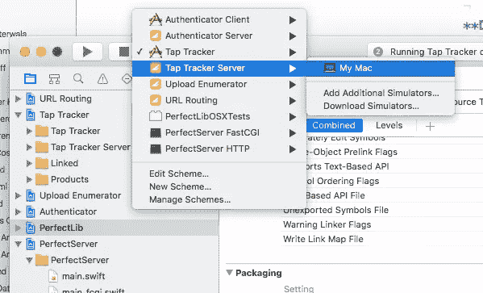
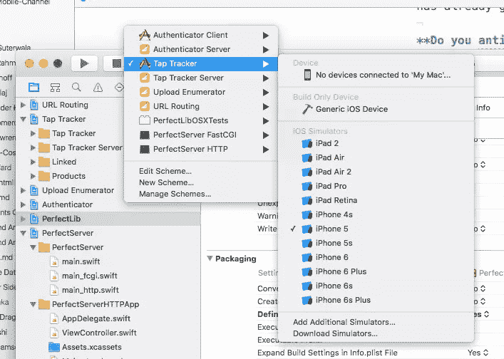

# 下一个全栈语言？完美的服务器端 Swift

> 原文：<https://www.sitepoint.com/server-side-swift-with-perfect/>

我会不断重申(至少在接下来的 6 个月内),虽然 Swift 不是第一个来自商业公司的开源语言，但迄今为止的热情和成果令人震惊。

一个多月前，Swift 2.2 在 Apache 2.0 许可下于 2015 年 12 月 3 日[开源。目前很难找到一个解释和编译 Swift 而不是用 Swift 编写的项目的确切列表，但是查看](https://en.wikipedia.org/wiki/Apache_License)[项目的 GitHub](https://github.com/apple/swift) 库可以看出在如此短的时间内对该项目的兴趣、活动和贡献的程度。

JavaScript 的重大突破之一是发布了 [node.js](https://nodejs.org) ，允许跨应用程序堆栈的通用语言。服务器端的 Swift 能对苹果的语言做到同样的事情吗？

## 完美介绍

一个冒昧的名字来自 PerfectlySoft Inc,“PerfectlySoft”公司，这是一家专门为 Swift 开发人员提供工具的开发机构，发布了第一个服务器端 Swift 实现。

在我们深入研究代码和使用之前，我问了他们的 CEO Sean Stephens 一些关于他们的计划和想法的问题。

**为什么要创建 Swift 后端项目？**

> 我们认为 Swift 是一种美丽的语言，但要吸引企业开发生态系统，它需要一个强大的服务器端框架。

**您的 Swift 后端项目处于什么状态？**

> 我们有一个早期版本，数百人已经在他们的项目中使用它。我们相信在接下来的几个月里会有更多的人采用它。

该项目将一直保持开源还是将成为一个商业项目？

> 它将永远是开源的，但我们计划将其商业化。我们相信企业许可和配置实用程序有机会建立强大的业务，我们正在执行一项计划来推动这一进程。

你希望完成什么？

> 我们将接管服务器端开发世界。

有人正在使用这个项目的任何应用程序吗？表现如何？

> 我们正在生产中使用该项目，在所有情况下，它都表现得很好。还在早期，所以更新比较频繁，但是核心产品很扎实。Swift 是一种很好的工作语言，Perfect 已经大大降低了我们的上市速度。

**你认为移动设备和服务器之间更明显的分离会成为整合前端和后端的一个问题吗？而不是 node.js / JavaScript？**

> node/Javascript 示例类似于 Swift/Perfect。但是，node/Javascript 是高级语言，而 Swift/Perfect 是原生编译的。Swift/Perfect 将比 node/Javascript 具有速度和可靠性优势，因为 Swift 是一种强静态类型语言，这使得它更适合在 Javascript 上构建企业系统。随着移动和服务器端代码库的增长，Swift/Perfect 联盟应该会减少前端和后端开发之间的距离和不协调，这在其他迟钝的堆栈配对(如 ObjC/Java 或 Java/PHP)中是常见的。Perfect 的存在使 Swift 变得越来越强大和有用，这意味着每个项目的代码更少，结果更具可扩展性。

下一步是什么，你现在需要什么？

> 投资者已经接触了我们，目前正在雇用更多的工程师来构建更多更好的库，以从整体上改进产品，并为我们的新兴生态系统构建企业产品。

## 使用完成式

### 麦克·OS X

将 Swift 存储库克隆到您的机器上:

```
git clone https://github.com/PerfectlySoft/Perfect.git
```

在项目文件夹中打开 *Examples.xcworkspace* ，其中包含了许多您可以研究的示例项目。

最简单的例子是“Tap Tracker”应用程序，在 Xcode 中选择服务器组件并点击 *run* 按钮:



并启动匹配的应用程序:



在 [Perfect 的文档](https://github.com/PerfectlySoft/Perfect/tree/master/Examples/Tap%20Tracker#tap-tracker)中找到更多关于‘Tap Tracker’应用程序如何工作的信息。快速浏览将显示两个应用程序组件之间关注点的分离程度。服务器端应用程序处理数据库事务，用一个[小胡子](https://mustache.github.io/)模板文件控制传递给 iOS 应用程序的 JSON 输出。这允许移动应用程序只处理获取位置并将其发送到 Swift 服务器端点。下一步要尝试的是添加一个视图，查询端点上的点击并显示它们。

### Linux 操作系统

这是一个很好的开始，但是实际上，有多少人在 Mac OS X 上运行服务器端服务呢？Swift 的 Linux 支持是真正的游戏规则改变者，Perfect 支持这一点。首先确保您已经安装了 [Linux Swift 编译器](https://swift.org/getting-started/#installing-swift)，然后安装 PerfectLib 所需的依赖项:

```
sudo apt-get install libssl-dev libevent-dev libsqlite3-dev libicu-dev libcurl4-openssl-dev uuid-dev git
```

克隆并构建 PerfectLib:

```
git clone https://github.com/PerfectlySoft/Perfect.git
cd Perfect/PerfectLib
make
sudo make install
```

构建完美的服务器:

```
cd ../PerfectServer
make
```

接下来，我们从想要运行的项目中为完美的服务器创建一个共享对象，因此继续使用 tap 示例:

```
cd ../Examples/Tap\ Tracker/
make
```

并将结果输出复制到服务器目录中新的 *PerfectLibraries* 文件夹中:

```
cd ../../PerfectServer
mkdir PerfectLibraries
cp ../Examples/Tap\ Tracker/TapTrackerServer.so ./PerfectLibraries
```

最后运行服务器:

```
./perfectserverhttp
```

在 Xcode 中 Tap Tracker 应用程序的 *ViewController.swift* 中，将`END_POINT_HOST`值更改为您的 Linux 服务器的 IP 地址并运行它。一切都应该和运行 Mac 服务器时一样，但当然我们是在两台独立的机器上运行 Swift！

## 完美还支持什么？

我们在这些例子中所做的只是启动一个现有项目，但对于有经验的 Swift 开发人员，我希望你们已经开始看到连接前端和服务器端 Swift 的一些潜力。这里有一些其他的功能，完美的优惠，以甜蜜的交易。

### Apache 支持

如果你不想使用内置的 http 服务器，那么 Perfect 通过 [FastCGI](http://www.fastcgi.com/) 、[提供了一个 Apache 模块。](https://github.com/PerfectlySoft/Perfect/tree/master/PerfectServer#fastcgi)

### 到通用服务器组件的连接

服务器端应用程序很少孤立存在，Perfect 已经为 [MySQL](https://github.com/PerfectlySoft/Perfect/blob/master/Connectors/MySQL/#mysql) 、 [PostgreSQL](https://github.com/PerfectlySoft/Perfect/blob/master/Connectors/PostgreSQL/#postgresql) 和 [MongoDB](https://github.com/PerfectlySoft/Perfect/blob/master/Connectors/MongoDB/#mongodb) 提供了连接器，并且还会有更多。

### JSON 对象封送

服务器和客户端之间的通信发生在标准的 JSON 中。这意味着没有新的“标准”需要学习。这也意味着您的 Swift 后端不必仅仅向基于 Swift 的前端应用程序提供数据。服务器端 Swift 喂安卓应用有人吗？

## 少了什么？

正如我在上面的采访中提到的，完美是新的。开发进展迅速(双关语),但是文档是不完整的，需要探索和推断才能让事情正常进行。幸运的是,[发布队列](https://github.com/PerfectlySoft/Perfect/issues)并不是一个死亡地带，在那里你的求助会被忽略。

如果您是一名经验丰富的 Swift 开发人员，那么您应该能够将可用的信息整理成可用的东西，甚至可以投入生产。如果您是 Swift 新手，那么现在事情会花费您多一点时间，但是请放心，您正在学习 2015 年最流行的编程语言之一，现在它可以在整个堆栈中处理您的应用程序。

如果你喜欢 Perfect 试图完成的事情，那么他们有一个[综合页面](http://perfect.org/get-involved.html)详细介绍你如何伸出援手。

*你对服务器端 Swift 有什么想法？伟大的承诺还是跟风炒作？*

## 分享这篇文章