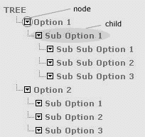

# 用 JavaScript 阅读和显示服务器端 XML 文章

> 原文：<https://www.sitepoint.com/server-side-xml-javascript/>

XML 是 Web 服务工作的一个非常重要的基础，结合一些客户端和服务器端的语言，可以很好地发挥作用。

让我们看看如何使用 XML 和客户端 JavaScript 来显示 XML 文件的内容、访问子元素、操作元素等等！

##### 浏览器问题

当谈到客户端语言时，浏览器不兼容是一个主要问题。但是在这里，使用 XML 和 JavaScript，XML 才是问题所在:不是所有的浏览器都支持 XML 文档的解析。

我会用 IE6 来解释代码。不支持 XML 的浏览器无法读取这些，所以当您在这样的浏览器中查看 XML 文件时，它会简单地忽略所有的标签。

##### 示例 XML 文件

让我们考虑一个样本 XML 文件，它显示了一家公司的员工数据和营业额:

```
<?xml version="1.0" ?>  

<company> 

<employee id="001" sex="M" age="19">Premshree Pillai</employee> 

<employee id="002" sex="M" age="24">Kumar Singh</employee> 

<employee id="003" sex="M" age="21">Ranjit Kapoor</employee> 

<turnover> 

<year id="2000">100,000</year> 

<year id="2001">140,000</year> 

<year id="2002">200,000</year> 

</turnover> 

</company>
```

##### 使用 JavaScript 操作 XML 文件数据

***加载 XML 文件***

您可以像这样从 JavaScript 加载一个 XML 文件:

```
var xmlDoc = new ActiveXObject("Microsoft.XMLDOM"); 

function loadXML(xmlFile) 

{ 

  xmlDoc.async="false"; 

  xmlDoc.onreadystatechange=verify; 

  xmlDoc.load(xmlFile); 

  xmlObj=xmlDoc.documentElement; 

}
```

实际上，函数的最后两行就足以加载 XML 文件了。前面两行确保我们以后可能用来操作 XML 文件数据的任何 JavaScript 函数不会对未初始化的对象执行任何功能。因此函数`verify()`被调用:

```
function verify() 

{ 

  // 0 Object is not initialized 

  // 1 Loading object is loading data 

  // 2 Loaded object has loaded data 

  // 3 Data from object can be worked with 

  // 4 Object completely initialized 

  if (xmlDoc.readyState != 4) 

  { 

    return false; 

  } 

}
```

现在可以加载 XML 文件了:

```
loadXML('xml_file.xml');
```

***显示 XML 文件的内容***

使用`alert(xmlObj.xml);`查看 XML 文件的全部内容。整个 XML 文件将按原样显示在一个警告框中，带有适当的缩进。

***子节点***

在上面的 XML 文件中，`<company>`是顶层标签，所有其他标签都在它下面。这些标签被称为孩子。这个 XML 文件可以像文件夹树一样用图形表示:



在上面的 XML 文件中，顶级标签`<company>`有 4 个子标签。

子节点的编号(在所有语言中都是这样)从 0(零)开始。标签下有 3 个子标签。

我们可以通过使用`childNodes.length`属性找到一个标签拥有的子标签的数量。因此，可以通过使用`xmlObj.childNodes.length`找到`<company>`标签的子标签的数量(这里是 4)

通过使用`xmlObj.childNodes(3).childNodes.length`可以找到`<turnover>`标签的子标签的数量(这里是 3)

这里我们使用`childNodes(3)`，因为`<turnover>`是`<company>`的第三个孩子

***为孩子考试***

您可以使用`childNodes(i).hasChildNodes`测试特定节点的子节点是否有任何子节点

因此，`xmlObj.childNodes(3).hasChildNodes()`将返回 true。`xmlObj.childNodes(2).hasChildNodes()`将返回 false，因为`<employee>`标签没有任何子标签。

***获取标记名***

你可以用`childNodes(i).tagName`得到一个孩子的标签名。由此，`xmlObj.tagName`将返回“公司”。`xmlObj.childNodes(0).tagName`将返回“雇员”。`xmlObj.childNodes(3).childNodes(0).tagName`将返回“年”。

***显示一个标签的内容***

在 XML 文件中，第一个`<employee>`标签的内容是“Premshree Pillai”。您可以使用`xmlObj.childNodes(0).firstChild.text`获得该值

```
xmlObj.childNodes(2).firstChild.text will return "Suhasini Pandita". Similarly, xmlObj.childNodes(3).childNodes(1).firstChild.text will return "140,000".
```

***属性***

在 XML 文件中，`<employee>`标签有 3 个属性。可以使用`childNodes(i).getAttribute("AttributeName")`访问一个属性。由此，`xmlObj.childNodes(0).getAttribute("id")`将返回“001”。`xmlObj.childNodes(1).getAttribute("age")`将返回“24”。而`xmlObj.childNodes(2).getAttribute("sex")`会返回“F”。

**Go to page:** [1](/server-side-xml-javascript) | [2](/server-side-xml-javascript-2/)

## 分享这篇文章