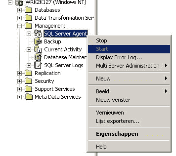
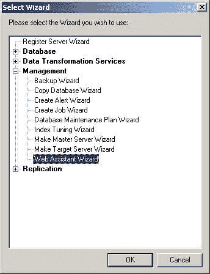
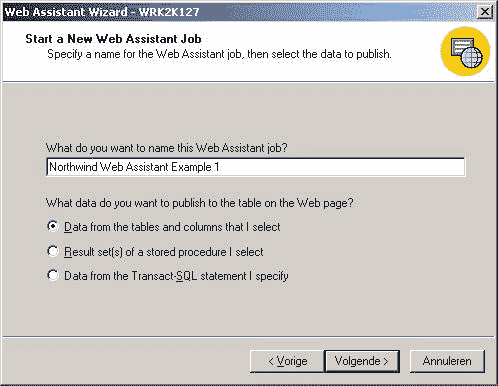
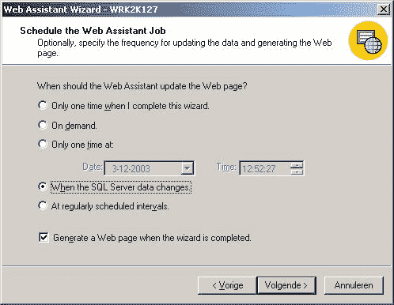
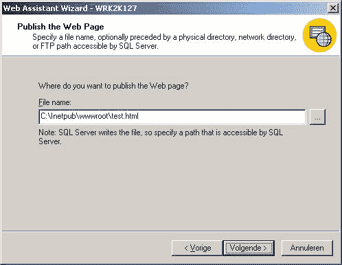
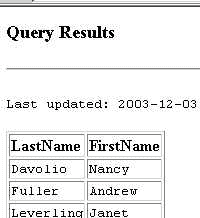
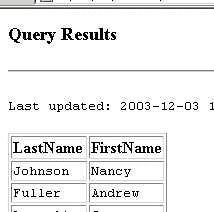

# 使用 SQL Server 的 Web 助手向导发布动态数据

> 原文：<https://www.sitepoint.com/servers-web-assistant-wizard/>

随着 Web 及其开发的成熟，越来越多的系统和应用程序发布了自己的 Web 接口。例如，如果您购买了一个无线接入点，它可以通过网页进行配置。或者，考虑 Internet Information Server，它在标准的 Windows 控制台旁边有自己的本地网站。从更广泛的意义上来说，你很可能已经通过在线界面访问了你的邮件或新闻服务器。

数据库应用程序通常使用 Web 界面。例如，MySQL 可以将其成功的一部分归功于方便的在线数据库管理工具 [PHPMyAdmin](http://www.phpmyadmin.net/) 。它的老大哥 SQL Server 缺少这样一个有用的界面，尽管它提供了经常被忽视的[网络助手向导](http://msdn.microsoft.com/library/default.asp?url=/library/en-us/adminsql/ad_web_asst_8390.asp)。

Microsoft SQL Server 的 Web 助手向导根据数据库数据动态生成 HTML。它的主要好处是你不需要编写任何程序。为了在 HTML 页面中显示您的动态数据，您通常需要编写 ASP、PHP 或其他服务器端代码来创建对象并连接到数据库。在那之后，你需要打开一个记录集并遍历它。这一切都由 SQL Server 自己来完成:数据在数据库中更新的那一刻就被转发到 Web 服务器。

另一个关键优势是性能。该向导不是连接到数据库并在每个页面请求上创建适当的对象，而是对每个更改采取主动。每当更新相关数据时，SQL Server 将确保基础网页也是最新的。这意味着网站的访问者将得到更快的服务:只有一个静态的 HTML 页面供服务器处理。

##### 它是如何工作的？

***第一步:先决条件***

要使用 Web 助手向导，您显然需要用 SQL Server 来装备自己。您不需要成为一个有经验的 SQL Server 用户来理解 Web 助手向导，但是如果您是一个初学者，您可能会发现 Mitchell Harper 的文章“[您的第一个 SQL Server 2000 数据库](https://www.sitepoint.com/blog/)”很有趣。我在这里使用的示例基于 SQL Server 2000，但是该向导也存在于 SQL Server 的早期版本中。请注意，SQL Server 代理应该正在运行。

除此之外，直接访问 Web 服务器的虚拟目录也很方便。SQL Server 可以将其 HTML 输出写入普通文件夹，但在这种情况下，您必须自己自动将文件传输到 Web 服务器。

***第二步:入门***

打开 SQL Server 企业管理器，选择“工具”下的“向导”。这将为您提供可用向导的概述。当您打开管理树视图项目时，您会发现 Web 助手向导。

***第三步:选择您要在线发布的数据源***

对于这个示例，我们将使用 Northwind 数据库，它是在安装 SQL Server 时默认创建的。选择上述数据库后，您会注意到向导有三种不同的数据选择方式:

*   表中的数据
*   存储过程的结果
*   来自 T-SQL 语句的数据

如果您知道如何编写自己的存储过程和 T-SQL 语句(SQL Server 自己的普通结构化查询语言的方言)，这些可以为您提供强大的功能。然而，在这里，我们将继续使用简单得多的第一个选项。

***第四步:选择要在线发布的数据***

在选择了第一个也是最简单的选项之后，您将有机会选择合适的表和列。选择 Employees，添加包含名字和姓氏的列，然后单击 Next 两次。

***第五步:安排更新***

通常，您希望在 SQL Server 数据发生变化时更新页面，因此在本例中选择第四个选项。如您所见，还可以定期安排更新。请确保“向导完成时生成网页”选项处于打开状态，这样一旦我们完成，您就可以看到结果。

***第六步:指明要监控哪些变化***

最后但同样重要的是，SQL Server 需要知道 HTML 页面应该实现哪些更改。对任何列的数据修改都将导致新网页的生成。再次添加 Employees 表的名字和姓氏列，然后单击 Next。

***第七步:选择你的网页位置***

为 SQL Server 应该生成的 HTML 页选择一个新名称。如前所述，理想情况下，您应该在这里引用 Web 服务器上的目录，以确保您可以在线访问已发布的数据。

正如您所看到的，影响 SQL Server 生成的 HTML 页面的布局是可能的。在接近结束阶段时，我们将只使用默认选项。单击“下一步”,直到到达“完成”, SQL Server 将确认它已成功完成任务。

***第 8 步:验证你的文件是被创建的***

使用浏览器找到您在上一步中创建的文件。

***第九步:进行修改并检查更新***

请注意，您的网页中的第一个雇员是 Nancy Davolio。

现在，返回到企业管理器，查看 Northwind 数据库中 Employees 表的数据。例如，将 Davolio 的 LastName 值更改为 Johnson。

刷新你的网页，你会看到南希现在也叫约翰逊在线。

##### 高级选项

为了使例子简单，我忽略了很多 Web 助手的额外选项。我不会在这里详细介绍，但是该向导包含了初学者和高级用户的许多可能性。一旦您熟悉了 Web 助手向导和 SQL Server，您可以考虑尝试以下更高级的应用程序:

*   调整 HTML 输出的布局
*   模板的使用
*   使用您自己的 T-SQL 查询和存储过程
*   定期更新，例如一天一次
*   在“管理”->“SQL Server 代理”->“作业”下编辑所有选项的可能性
*   在线发布数据库维护信息的可能性
*   在 T-SQL 查询中使用预定义的'`sp_make_webtask`'存储过程

这些选项都值得在一篇文章中单独讨论。有些已经以这样或那样的形式出现在 SitePoint 上——例如，在大卫·克拉克的 PHP 和微软 SQL Server 的存储过程中。

##### 结论

Web 助手向导是一个很好的工具，可以帮助您快速方便地发布数据库数据。它使您能够以您选择的任何形状或形式查看和共享最新数据，但不能更改或删除它。对我来说，这个限制是巫师最大的缺点。

性能上的胜利显然是一个巨大的奖励。对于较大的 Web 开发团队来说，Web 助手向导还允许责任分担。数据库管理员将负责生成数据，而 Web 开发人员可以专注于构建网页，即本例中的模板。

网络助手是一个强大的工具。尽管如此，使用 SQL Server 的 Web 开发人员对该向导及其优点知之甚少。既然您已经知道了如何使用它，那么考虑一下它能做些什么来改进您的在线应用程序。

## 分享这篇文章