# 使用更智能的唤醒功能设置闹钟和更多功能

> 原文：<https://www.sitepoint.com/set-alarms-and-much-more-with-wake-smarter/>

由于智能手机的出现，不起眼的闹钟正逐渐淡出人们的视线。研究公司[Prosper Mobile Insights](https://www.biginsight.com/)2011 年 7 月[的一份报告](https://www.prweb.com/releases/2011/7/prweb8620690.htm)称，61%的智能手机/平板电脑用户表示，他们的移动设备已经取代了传统的闹钟。对于那些仍然喜欢那种可靠的床头柜设备的人来说，你现在可以购买那些[会从你身边滚走的闹钟](https://www.clocky.net/products/clocky/index.php?color=almond)，或者是[制作在木块](https://watch.brando.com/wooden-sound-box-clock_p00176c015d002.html)内的闹钟，或者是[可以将时间投射在墙壁或天花板上的闹钟](https://www.amazon.com/Crosse-Technology-WT-5220U-Projection-Temperature/dp/B001JQX0MO/)。甚至还有[闹钟，可以兼作你的智能手机或平板电脑的基座！](https://www.google.com/search?ix=icb&sourceid=chrome&ie=UTF-8&q=iphone+ipad+smartphone+dock#q=iphone+ipad+smartphone+clock+dock&hl=en&safe=off&prmd=imvns&source=univ&tbm=shop&tbo=u&sa=X&ei=5ukyT7_yK8OftwfzouWSBw&ved=0CF4QrQQ&bav=on.2,or.r_gc.r_pw.r_cp.r_qf.,cf.osb&fp=d5716e0608df46dc&ix=icb&biw=1920&bih=995)尽管闹钟市场有这些创新，但智能手机在便携性、外形和易用性方面都胜过它们。

[Wake Smarter](https://wakesmarter.com/) 被称为 iPhone、iPod Touch 和 iPad 的首款声控闹钟。当你想要闹钟的时候，只要告诉 Wake Smarter 就行了！但这款应用的内幕比你想象的要多。让我们来看看到底是什么让它脱颖而出。

* * *

<iframe width="640" height="360">
 
 
(在 App Store 中，有针对 iPad 和 iPhone/iPod Touch 的 Wake Smarter 版本。在这篇评论中，我使用的是 iPad 版的应用程序。)
 <h3>首次运行和主屏幕</h3> 
一旦你启动应用程序，你会看到唤醒智能启动页面，然后直接进入主屏幕。这里显示了三个重要的注意事项:
 <ol> <li>此应用程序必须保持打开，闹钟才能工作。这不会损害你的屏幕。</li> <li>语音命令是特定且有限的。有关说明，请查看“设置”下的帮助手册。</li> <li>如果您有任何问题，请通过“设置”选项卡中的“告诉我们”请求支持。</li> </ol> 
 
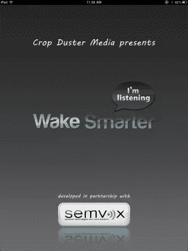 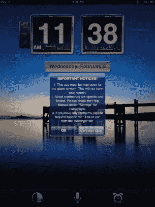
 
 
因为该应用程序的主要控制方法是用你的声音，所以最好先检查一下设置，以了解如何最好地导航该应用程序。主屏幕底部有三个图标:半阴影圆圈、麦克风和闹钟。点击半阴影圆圈将应用程序从白天模式切换到夜晚模式。正如你在下面看到的，白天模式有一个带摄影背景的时钟，夜晚模式有一个全黑的屏幕，上面有 LED 模拟的数字。
 
轻按麦克风会触发应用程序的语音识别引擎，轻按闹钟会将您带到设置面板。语音识别面板为您提供了一些短语建议，例如“今天的日历”或“脸书”。语音识别技术由德国语义技术和语音解决方案公司 SemVox 提供。让我们来看看设置面板。
 
 
 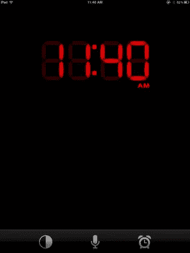
 
 <h3>设置</h3> 
该应用程序的大部分功能都在设置面板中。共有四类:<strong>报警</strong>、<strong>报警动作</strong>、<strong>睡眠定时器</strong>、<strong>设置</strong>。首先显示<strong>警报</strong>类别选项卡，您可以点击“添加警报”按钮来创建您的第一个警报。键入闹钟的名称，设置闹钟的重复周期和时间，然后单击“保存”按钮完成。您可以在新闹钟创建后激活或停用它。点击<strong>报警动作</strong>，你会看到一个空白的“添加动作”按钮。按下这个按钮，你就可以添加下面列出的七个闹铃动作中的任何一个。如果您为一个警报安装了多个操作，您也可以从该面板将这些操作拖到您喜欢的执行顺序中。
 
 
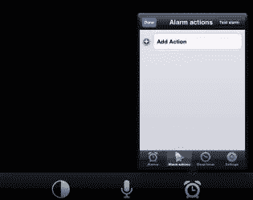 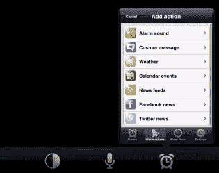
 
 <h4>警报声</h4> 
对于闹钟声音，您可以选择闹钟的持续时间，或者从三种音频模式(收音机、播放列表、闹钟声音)中选择一种。收音机选项令人印象深刻，包括 140 个网络电台，涵盖 18 种不同的风格。这里有适合每个人的东西，无论你喜欢脱口秀、另类音乐、嘻哈音乐还是古典音乐。“播放列表”选项会选取您在 iOS 设备上创建的任何播放列表，闹钟声音让您从 21 首已安装的小歌曲中进行选择。
 
 
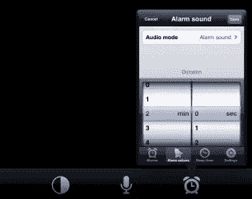 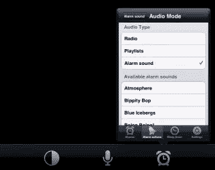
 
 <h4>自定义消息</h4> 
自定义消息警报操作为您提供了三个选项:您可以键入消息、录制消息或使用预设的录制消息。如果您键入自定义信息，应用程序将使用内置语音引擎朗读该信息。您也可以录制长达三十秒的信息，或使用七个预先录制的唤醒信息之一，如巴拉克·奥巴马或荷马·辛普森。
 
 
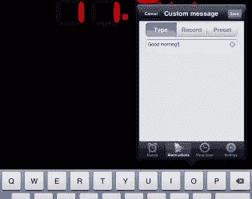 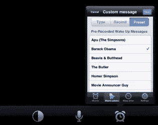
 
 <h4>天气</h4> 
天气警报操作使用您的当前位置为您提供当前温度或当天的最高和最低温度。温度和风速单位可以用英制或公制指定。
 <h4>日历事件</h4> 
“日历事件提醒”操作使用 iOS 设备上的日历，并规定您的每日日程。它只会列出当天的日程。
 
 
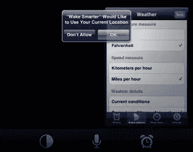 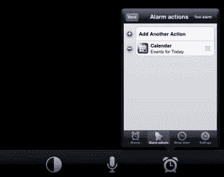
 
 <h4>新闻提要</h4> 
新闻提要警报动作将 Wake Smarter 变成了一个新闻收报机。在 Category 部分，您可以从 21 个类别的几十个提要中选择任何一个。在源部分，您可以按国家选择您的新闻源，在自定义部分，您可以添加自己的 RSS 源。一旦你选择了你的新闻来源，你就可以设置提醒动作来阅读该来源的 1-10 条消息。
 <h4>脸书饲料</h4> 
一旦你用你的脸书信息登录，Wake Smarter 可以读出你的朋友最近发布的多达 30 个事件。你也可以选择让闹钟决定脸书事件和你脸书朋友的生日。
 
 
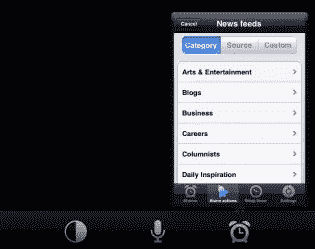 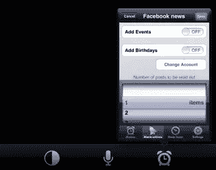
 
 <h4>推特新闻</h4> 
通过连接你的 Twitter 账户，该应用程序将从你的时间线中读取多达 30 条最近的推文。
 
<strong>睡眠计时器</strong>允许您设置应用程序在进入睡眠模式前播放音频长达 2 小时。你可以选择设备上的任何电台或播放列表来实现这一功能，或者你可以播放应用程序的 11 种睡眠声音中的任何一种(包括雨声、环境音或丛林声)。
 
 
 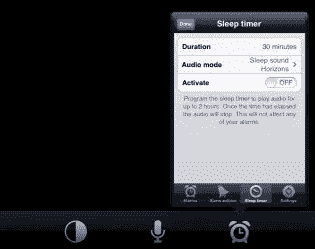
 
 
<strong>设置</strong>选项卡有四个部分:<em>报警</em>、<em>常规</em>、<em>语音交互</em>、<em>支持</em>。在“常规”部分，您可以更改白天视图的时钟样式和背景，以及更改夜晚视图中 LED 模拟显示屏的颜色。对于语音交互部分，你可以控制 Wake Smarter 的语音引擎的音量、音高和节奏，并启用“魔法词模式”，这可以让应用程序的语音识别一直保持开启，用户可以通过说出七个包含的魔法词短语中的任何一个来提示 Wake Starter 进行语音识别。最后，支持部分包括一个应用内支持通道(由<a href="https://www.crittercism.com/" target="_blank">critercism</a>提供支持),用于向开发者发送建议。
 
 
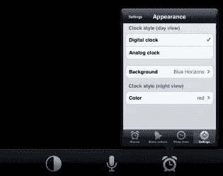 
 
 <h3>缺点</h3> 
我发现的一些缺点特别与这款应用的 iPad 版本有关。首先，设置面板只占 iPad 屏幕的 1/4，感觉像是面向 iPhone 或 iPod Touch。此外，该应用程序没有 iPad 的横向视图，所以一切都停留在纵向视图。
 
我发现的另一个缺点是，帮助手册(包括应用程序的语音控制)离主屏幕只有 4 次点击。有 18 个语音命令，所以需要一点点点击和说话的尝试和错误，以获得使用语音识别的诀窍。我发现手动设置闹钟比大声说出来更容易。通过我自己的反复试验，我发现有一个语音命令的小教程。只需点击麦克风按钮，说“帮助”，应用程序将开始列出一些命令。但是，您必须重复这个过程三次，以便让它通过所有的命令。简单地说，语音识别需要花点功夫来掌握。
 
 
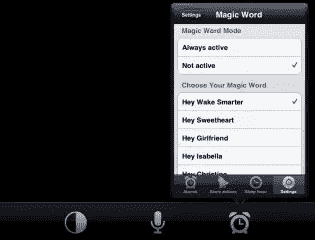 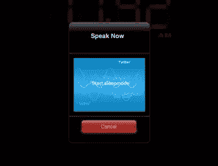
 
 
有些报警动作有一些小缺点。例如，虽然您可以将播放列表设置为闹钟声音，但您不能单独选择一首歌曲。如果您键入自定义消息，您将听不到语音引擎尝试说出该短语，直到您将它设置为提醒操作，并且您的提醒响起。此外，我发现语音引擎在一些事情上打嗝，比如 Twitter 用户名(它完全忽略它们)。这个问题可能会在未来的应用程序版本中得到解决。
 
我发现的最后一个缺点是关于神奇的单词功能。您不能添加自己的神奇单词短语，包含的短语范围有限(嘿 Wake Smarter，嘿 Computer)，其他人的名字(嘿 Isabella，嘿 Christine，嘿 Jennifer)，或甜言蜜语(嘿甜心，嘿女朋友)。保持魔字功能活跃也是巨大的电池消耗；在我的测试中，当这项功能处于活动状态时，我的 iPad 在不到一个小时的时间里从充满电变为零电。除非你真的喜欢用这种方式和你的 iOS 设备对话，否则这有点浪费功能。
 <h3>结论</h3> 
Wake Smarter 是一款语音控制的应用程序，允许您设置闹钟、查看日历、收听网络广播等。不幸的是，语音识别有一点学习曲线，如果你保持自动语音识别功能太长时间，应用程序很容易耗尽你设备的电池。参差不齐的语音识别也意味着你可能会花更多的时间在设置上，而不是像预期的那样用语音控制应用程序。
 
 
在 iOS 应用商店上，Wake Smarter 售价 2.99 美元，需要 iOS v5.0 或更高版本才能运行。从下面的 App Store 链接或使用 App Store 按钮下载应用程序。
 
<a href="https://itunes.apple.com/us/app/wake-smarter-voice-controlled/id479032853?mt=8" target="_blank">下载唤醒更聪明</a>
 
<aside class="flex space-x-4"><h2 class="text-lg my-2 mr-2">分享这篇文章</h2><button aria-label="Share Sitepoint on facebook" data-network="facebook" class="social-share-button mr-2 cursor-pointer transform transition duration-200 hover:scale-125 text-primary-700"><svg aria-hidden="true" focusable="false" data-prefix="fab" data-icon="facebook-square" class="svg-inline--fa fa-facebook-square fa-w-14 fa-lg share-icon" role="img" viewbox="0 0 448 512"><path fill="currentColor" d="M400 32H48A48 48 0 0 0 0 80v352a48 48 0 0 0 48 48h137.25V327.69h-63V256h63v-54.64c0-62.15 37-96.48 93.67-96.48 27.14 0 55.52 4.84 55.52 4.84v61h-31.27c-30.81 0-40.42 19.12-40.42 38.73V256h68.78l-11 71.69h-57.78V480H400a48 48 0 0 0 48-48V80a48 48 0 0 0-48-48z"/></svg></button><button aria-label="Share Sitepoint on reddit" data-network="reddit" class="social-share-button mr-2 cursor-pointer transform transition duration-200 hover:scale-125 text-primary-700"><svg aria-hidden="true" focusable="false" data-prefix="fab" data-icon="reddit" class="svg-inline--fa fa-reddit fa-w-16 fa-lg share-icon" role="img" viewbox="0 0 512 512"><path fill="currentColor" d="M201.5 305.5c-13.8 0-24.9-11.1-24.9-24.6 0-13.8 11.1-24.9 24.9-24.9 13.6 0 24.6 11.1 24.6 24.9 0 13.6-11.1 24.6-24.6 24.6zM504 256c0 137-111 248-248 248S8 393 8 256 119 8 256 8s248 111 248 248zm-132.3-41.2c-9.4 0-17.7 3.9-23.8 10-22.4-15.5-52.6-25.5-86.1-26.6l17.4-78.3 55.4 12.5c0 13.6 11.1 24.6 24.6 24.6 13.8 0 24.9-11.3 24.9-24.9s-11.1-24.9-24.9-24.9c-9.7 0-18 5.8-22.1 13.8l-61.2-13.6c-3-.8-6.1 1.4-6.9 4.4l-19.1 86.4c-33.2 1.4-63.1 11.3-85.5 26.8-6.1-6.4-14.7-10.2-24.1-10.2-34.9 0-46.3 46.9-14.4 62.8-1.1 5-1.7 10.2-1.7 15.5 0 52.6 59.2 95.2 132 95.2 73.1 0 132.3-42.6 132.3-95.2 0-5.3-.6-10.8-1.9-15.8 31.3-16 19.8-62.5-14.9-62.5zM302.8 331c-18.2 18.2-76.1 17.9-93.6 0-2.2-2.2-6.1-2.2-8.3 0-2.5 2.5-2.5 6.4 0 8.6 22.8 22.8 87.3 22.8 110.2 0 2.5-2.2 2.5-6.1 0-8.6-2.2-2.2-6.1-2.2-8.3 0zm7.7-75c-13.6 0-24.6 11.1-24.6 24.9 0 13.6 11.1 24.6 24.6 24.6 13.8 0 24.9-11.1 24.9-24.6 0-13.8-11-24.9-24.9-24.9z"/></svg></button><button aria-label="Share Sitepoint on twitter" data-network="twitter" class="social-share-button mr-2 cursor-pointer transform transition duration-200 hover:scale-125 text-primary-700"><svg aria-hidden="true" focusable="false" data-prefix="fab" data-icon="twitter-square" class="svg-inline--fa fa-twitter-square fa-w-14 fa-lg share-icon" role="img" viewbox="0 0 448 512"><path fill="currentColor" d="M400 32H48C21.5 32 0 53.5 0 80v352c0 26.5 21.5 48 48 48h352c26.5 0 48-21.5 48-48V80c0-26.5-21.5-48-48-48zm-48.9 158.8c.2 2.8.2 5.7.2 8.5 0 86.7-66 186.6-186.6 186.6-37.2 0-71.7-10.8-100.7-29.4 5.3.6 10.4.8 15.8.8 30.7 0 58.9-10.4 81.4-28-28.8-.6-53-19.5-61.3-45.5 10.1 1.5 19.2 1.5 29.6-1.2-30-6.1-52.5-32.5-52.5-64.4v-.8c8.7 4.9 18.9 7.9 29.6 8.3a65.447 65.447 0 0 1-29.2-54.6c0-12.2 3.2-23.4 8.9-33.1 32.3 39.8 80.8 65.8 135.2 68.6-9.3-44.5 24-80.6 64-80.6 18.9 0 35.9 7.9 47.9 20.7 14.8-2.8 29-8.3 41.6-15.8-4.9 15.2-15.2 28-28.8 36.1 13.2-1.4 26-5.1 37.8-10.2-8.9 13.1-20.1 24.7-32.9 34z"/></svg></button><button aria-label="Share Sitepoint on linkedin" data-network="linkedin" class="social-share-button mr-2 cursor-pointer transform transition duration-200 hover:scale-125 text-primary-700"><svg aria-hidden="true" focusable="false" data-prefix="fab" data-icon="linkedin" class="svg-inline--fa fa-linkedin fa-w-14 fa-lg share-icon" role="img" viewbox="0 0 448 512"><path fill="currentColor" d="M416 32H31.9C14.3 32 0 46.5 0 64.3v383.4C0 465.5 14.3 480 31.9 480H416c17.6 0 32-14.5 32-32.3V64.3c0-17.8-14.4-32.3-32-32.3zM135.4 416H69V202.2h66.5V416zm-33.2-243c-21.3 0-38.5-17.3-38.5-38.5S80.9 96 102.2 96c21.2 0 38.5 17.3 38.5 38.5 0 21.3-17.2 38.5-38.5 38.5zm282.1 243h-66.4V312c0-24.8-.5-56.7-34.5-56.7-34.6 0-39.9 27-39.9 54.9V416h-66.4V202.2h63.7v29.2h.9c8.9-16.8 30.6-34.5 62.9-34.5 67.2 0 79.7 44.3 79.7 101.9V416z"/></svg></button><button aria-label="Share Sitepoint on email" data-network="email" class="social-share-button mr-2 cursor-pointer transform transition duration-200 hover:scale-125 text-primary-700"><svg aria-hidden="true" focusable="false" data-prefix="fas" data-icon="envelope" class="svg-inline--fa fa-envelope fa-w-16 fa-lg share-icon" role="img" viewbox="0 0 512 512"><path fill="currentColor" d="M502.3 190.8c3.9-3.1 9.7-.2 9.7 4.7V400c0 26.5-21.5 48-48 48H48c-26.5 0-48-21.5-48-48V195.6c0-5 5.7-7.8 9.7-4.7 22.4 17.4 52.1 39.5 154.1 113.6 21.1 15.4 56.7 47.8 92.2 47.6 35.7.3 72-32.8 92.3-47.6 102-74.1 131.6-96.3 154-113.7zM256 320c23.2.4 56.6-29.2 73.4-41.4 132.7-96.3 142.8-104.7 173.4-128.7 5.8-4.5 9.2-11.5 9.2-18.9v-19c0-26.5-21.5-48-48-48H48C21.5 64 0 85.5 0 112v19c0 7.4 3.4 14.3 9.2 18.9 30.6 23.9 40.7 32.4 173.4 128.7 16.8 12.2 50.2 41.8 73.4 41.4z"/></svg></button></aside> </body> </html></iframe>