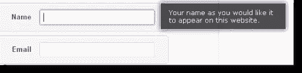

# 用 jQuery 将焦点设置在第一个字段上

> 原文：<https://www.sitepoint.com/set-focus-field-jquery/>

这就是如何“用 jQuery 将焦点设置在第一个字段上！”

这是一个简单的代码片段，它在网页上表单的第一个字段被加载时，用鼠标光标设置焦点。它可以在 Internet Explorer、Firefox 和 Safari 浏览器中运行。

你可能认为这段代码可以工作，但是它没有在输入框中设置光标:
$('#input ')。焦点()；

相反，使用以下代码可以正常工作:

```
//set focus to first input box
        $('#input').focus();
	$("#input:text:visible:first").focus();
```

[](http://blogoola.com/signup/ "blogoola signup")

[观看现场演示](http://blogoola.com/signup/)

事件处理程序
这是你如何添加一个事件处理程序来捕捉用户点击输入字段的时候。

```
$('#target').focus(function() {
  alert('Handler for .focus() called.');
});
```

有用的 HTML

```
< !DOCTYPE html> 
```

## 分享这篇文章