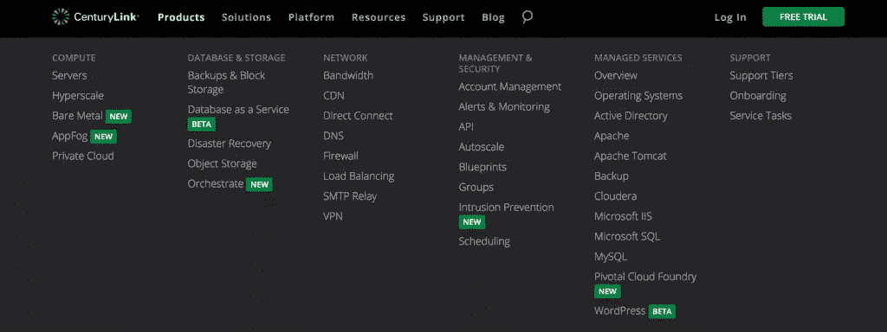
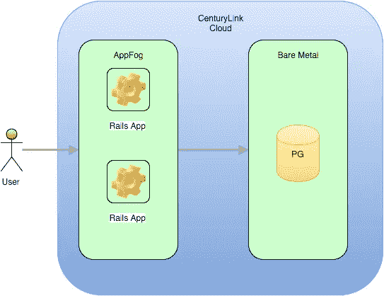
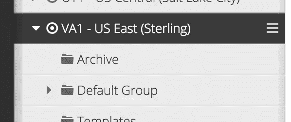
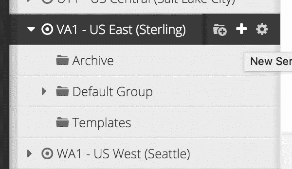
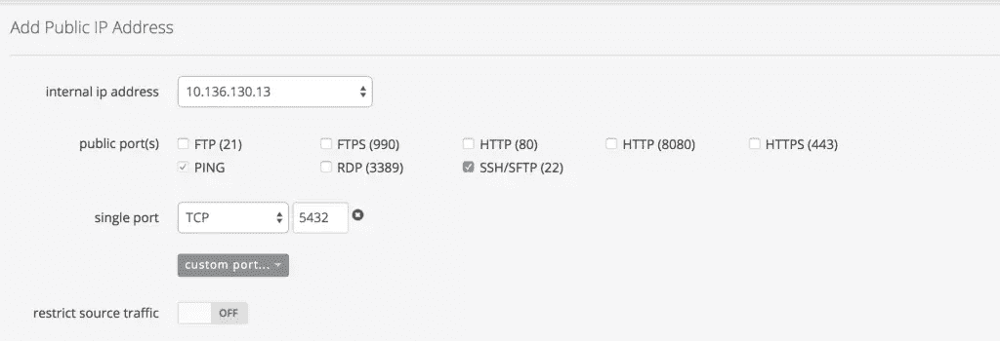
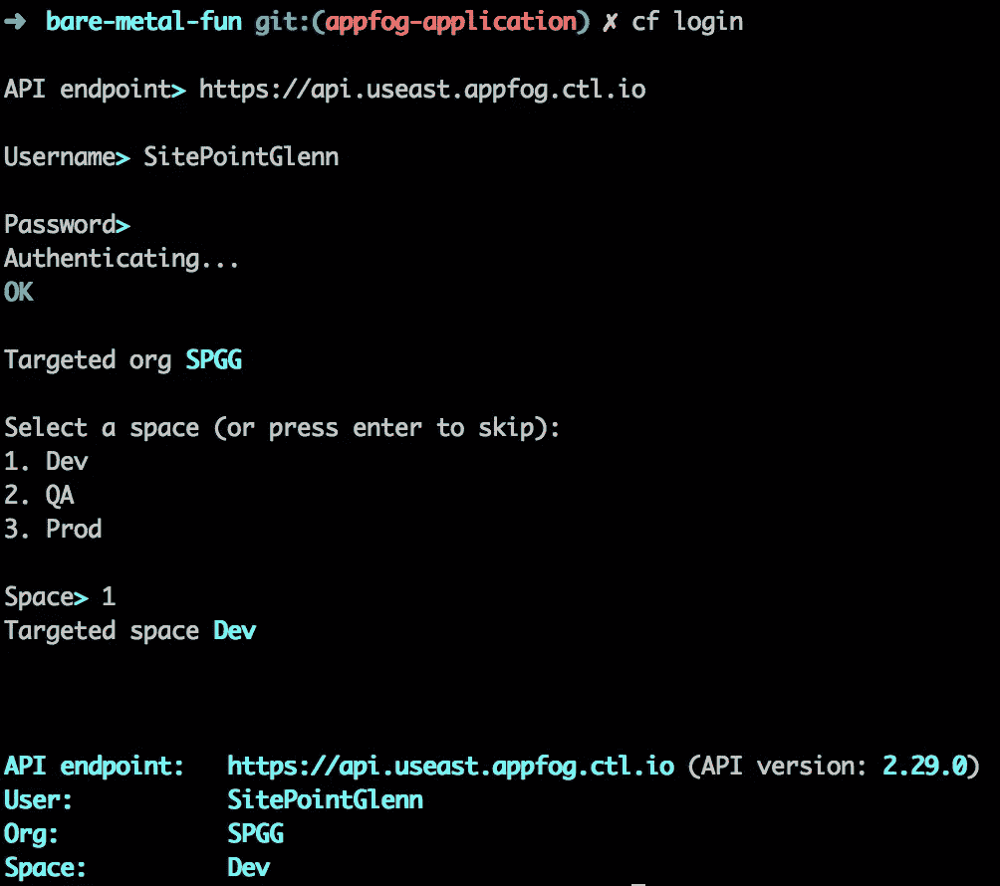
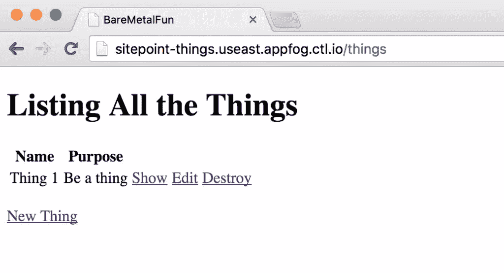

# 如何用 CenturyLink 的 AppFog & Bare Metal 设置 Rails 应用

> 原文：<https://www.sitepoint.com/set-rails-app-centurylinks-appfog-bare-metal/>

*本文由 [AppFog](https://www.ctl.io/appfog/) 赞助。感谢您对使 SitePoint 成为可能的赞助商的支持。*

有许多云平台提供商。最完整和最庞大的产品之一是 CenturyLink 云平台。关于范围，只需看看 CenturyLink 网站上的菜单:



CenturyLink 不断寻找新的服务添加到平台中，最近发布了裸机服务器。之前，[我写了一个教程](https://www.sitepoint.com/deploying-ruby-apps-bare-metal-self-sufficient-containers-right-way/)关于提供一个裸机服务器和在那个服务器上部署一个简单的 Rails 应用。裸机服务器介于共享虚拟机和专用服务器之间。它们具有物理机箱的隔离性，但扩展和配置更像共享虚拟机。我建议您阅读那篇文章，了解裸机服务器是如何融入其中的。

在本文中，我将把上一篇文章中的应用程序带入下一个体系结构步骤，即分离存储库和应用服务器。CenturyLink 提供 AppFog，这是一个类似 Heroku 的平台即服务(PaaS ),因此将 Rails 应用程序迁移到那里是有意义的。应用程序数据库将从 SQLite 迁移到 PostgreSQL。PostgreSQL 实例将在裸机服务器上创建，所以这个应用程序将会增长，只是一点点。

这是一个展示新架构的简单图像:



## CenturyLink 设置

参考[第一篇帖子](https://www.sitepoint.com/deploying-ruby-apps-bare-metal-self-sufficient-containers-right-way/)注册 CenturyLink，确保裸机启用。

### 裸机数据库服务器:PostgreSQL

如果您已经学习了第一个教程，那么您应该知道如何部署裸机服务器。在这里，我将为我们的 PostgreSQL 数据库部署一个新的。我想将新服务器添加到现有的 VA1–US East 部署(在第一篇文章中创建),因此我单击该地区的汉堡包图标:



然后显示:



从现在开始，只需要选择一些基本选项:

*   为服务器类型选择“裸机”
*   我选择了最小的配置(4GB)
*   对于操作系统，我选择了 Ubuntu 14

完成资源调配需要几分钟时间。同样，这与第一篇教程中描述的过程相同，所以如果需要的话可以参考一下。
查看仪表盘，我现在有了一个新的裸机服务器，名为`VA1SPGGSPPG202`。您的服务器将有一个不同的名称。让我们在上面安装 PostgreSQL。我们需要 SSH 到机器中进行安装，这意味着分配一个公共 IP 地址并打开适当的端口。众所周知，SSH 的默认端口是 22。请记住，PostgreSQL 将位于这台机器上，默认情况下使用端口 5432。



公共 IP 的配置需要几分钟时间。添加公共 IP 不是安全最佳做法。不要在真实的生产场景中这样做。对于这个机器，您至少要将源 IP 限制在您的应用服务器上。更有可能的是，只有您的服务器可以看到您的服务器，并且应用程序服务器是单一入口点的私有虚拟网络是有价值的。即使在学习教程时，您也应该养成使用创建服务器时为您提供的 VPN 的习惯。为了保持教程的简洁，我会让你参考 CenturyLink 关于[设置客户端 VPN](https://www.ctl.io/knowledge-base/network/how-to-configure-client-vpn/) 的说明。

CenturyLink 提供了许多保护网络访问的选项，因此请查看[文档](https://www.ctl.io/knowledge-base/network/network-access-options-for-connecting-to-centurylink-clouds-platform/)以了解更多信息，或者联系 CenturyLink 支持人员以获得这些选项的帮助。

添加公共 IP 地址后，使用用户名和密码(可在服务器的仪表板条目上找到)将 SSH 添加到框中。

```
 ssh root@<your public ip>

root@<public ip>'s password:
Welcome to Ubuntu 14.04.3 LTS (GNU/Linux 3.13.0-68-generic x86_64)

 * Documentation:  https://help.ubuntu.com/
 *
 * The programs included with the Ubuntu system are free software;
 * the exact distribution terms for each program are described in the
 * individual files in /usr/share/doc/*/copyright.
 *
 * Ubuntu comes with ABSOLUTELY NO WARRANTY, to the extent permitted by
 * applicable law.

root@VA1SPGGSPPG202:~# 
```

太好了，我们进去了。安装 PostgreSQL 非常简单:

```
 apt-get update
...lots of updates...

sudo apt-get install postgresql postgresql-contrib
....lots of installation fodder... 
```

您可以通过切换到`postgres`用户并运行`psql`来验证 PostgreSQL 正在工作:

```
 root@VA1SPGGSPPG202:~# sudo -i -u postgres
postgres@VA1SPGGSPPG202:~$ psql
psql (9.3.10)
Type "help" for help.

postgres=# 
```

是的，都很好。然而，`postgres`角色与`postgres` Linux 用户相关联(这被称为“对等认证”)，并且具有一定的特权。因此，让我们创建一个可以在应用程序中使用的角色。通过键入`\q`退出`psql`，这样你就回到了 Ubuntu 命令提示符下，然后键入:

```
vi /etc/postgresql/9.3/main/pg_hba.conf
```

这将在 vi 中打开文件。默认情况下，PostgreSQL 被配置为仅使用对等身份验证，但我们希望使用密码身份验证。找到下面一行:

```
local  all  postgres  peer
```

将其更改为:

```
local  all  postgres  md5
```

另外，将下面一行添加到文件中:

```
host  all  all  all  md5
```

这使 PostgreSQL 能够接受来自远程主机的传入连接。

保存并退出文件(`:wq`)。

接下来，需要配置 PostgreSQL 来监听远程连接。这是在主配置文件中完成的:

```
vi /etc/postgresql/9.3/main/postgresql.conf
```

找到带有`listen_addresses`的行，取消注释，并将其改为:

```
listen_addresses='*'
```

*注意:对于生产 PostgreSQL 实例，这些不是推荐的安全实践。这纯粹是为了说明 dev PostgreSQL 环境。*

回到命令提示符处:

```
 postgres@VA1SPGGSPPG202:~$ createuser --interactive
Enter name of role to add: thingsuser
Shall the new role be a superuser? (y/n) n
Shall the new role be allowed to create databases? (y/n) y
Shall the new role be allowed to create more new roles? (y/n) n
Password: 
postgres@VA1SPGGSPPG202:~$ 
```

现在，您应该能够使用该用户和`psql`登录了:

```
 psql -U thingsuser -d postgres
Password for user thingsuser:
psql (9.3.10)
Type "help" for help.

postgres=> 
```

我们准备在 AppFog 上设置我们的 Rails 应用程序。

## Rails 应用

Rails 应用程序的 GitHub 库在这里是。我已经[创建了一个名为`appfog-application`的分支](https://github.com/sitepoint-editors/bare-metal-fun/tree/appfog-application),用于本文所需的修改。没有太多。

### AppFog 要求

1.  请确定您的帐户已启用 AppFog，并选择一个地区。
2.  安装 CloudFoundry CLI(可使用下载链接:[https://github . com/cloud foundry/CLI/blob/master/readme . MD # downloads](https://github.com/cloudfoundry/cli/blob/master/README.md#downloads)或 homebrew —我用的是 homebrew)。

```
 brew tap pivotal/tap
brew install cloudfoundry-cli

cf -v
cf version 6.13.0-e68ce0f-2015-10-15T22:53:29+00:00 
```

使用 CLI 登录 AppFog。您将需要启用 AppFog 的地区的 URL。我的在美国东部，看起来像:



### Gemfile 中的更改

由于应用程序正在从 SQLite 迁移到 PostgreSQL，因此删除了`sqlite` gem 并添加了`pq` gem。此外，卡皮斯特拉诺不再被使用，所以删除所有这些宝石。

### 数据库配置

让我们将应用程序配置为指向我们新创建的 PostgreSQL 实例。

```
 # config/database.yml
default: &default
  adapter: postgresql
  pool: 5
  timeout: 5000
  host: 206.128.135.30
  port: 5432
  user: thingsuser
  password: <%=ENV["DB_PASS"] %>

development:
  <<: *default
  database: things_development

# Warning: The database defined as "test" will be erased and
# re-generated from your development database when you run "rake".
# Do not set this db to the same as development or production.
test:
  <<: *default
  database: things_test

production:
  <<: *default
  database: things_production 
```

为了这个例子，我在所有环境中使用裸机数据库服务器。如果您继续这样做，您需要为您的数据库密码设置一个名为`DB_PASS`的环境变量。添加此配置后，您可以创建和迁移数据库:

```
 rake db:create
rake db:migrate
== 20150928152221 CreateThings: migrating =====================================
-- create_table(:things)
   -> 0.0360s
== 20150928152221 CreateThings: migrated (0.0361s) ============================ 
```

现在 PostgreSQL 实例中应该有一个`things_development`数据库。

### 文件更改

不再需要部署文件，所以删除 *config/deploy.rb* 和 *config/deploy* 目录。

### 其他 AppFog 注意事项

#### 环境变量

将数据库连接字符串作为环境变量添加到我们的应用程序中是一个好主意。一种方法是使用`cf set-env`命令:

```
cf set-env sitepoint-things DATABASE_URL postgres://thingsuser:password@<bm-pg-ip>/things_production
```

#### 迁移数据库

迁移数据库时有几个选项。一种方法是用不同的“开始”命令调用`cf push`，就像这样:

```
cf push sitepoint-things -c 'rake db:create && rake db:migrate' -i 1
```

这将创建并迁移数据库。

### 部署到 AppFog

```
cf push sitepoint-things
```

在浏览器中打开您的应用程序 URL，查看运行中的您的东西服务器。



非常好。我们现在有了一个托管在 AppFog 上的 Rails 应用程序，它使用一个 PostgreSQL 数据库，而这个数据库又托管在一个裸机服务器上。

## 后续步骤

诚然，本教程本质上是基础性的。它只展示了 CenturyLink 云平台所能提供的一部分。事实上，它只显示了 AppFog 和裸机的一部分。从这一点出发，您可以采取许多后续步骤:

### Bare Metal

*   为数据库实施备份策略。
*   研究 CenturyLink API，特别是如何提供和操作裸机服务器。
*   为后台工作人员添加服务器。

### AppFog

*   了解如何在每次部署时使用清单来迁移数据库。
*   添加自定义域。
*   使用 Procfile 来声明和控制应用程序的启动命令。

### 其他的

*   调查其他 CenturyLink 产品，例如[数据库即服务](https://www.ctl.io/dbaas/)，它目前处于测试阶段，将很快全面推出。

## 结论

CenturyLink 云平台是一个庞大的基于云的托管和服务产品。如果您想要一个可靠的平台，能够在一个保护伞下控制您所有的应用程序和基础架构需求，这当然值得研究。此外，裸机服务器是针对需要隔离但可以快速调配的虚拟机的一种新的智能方法。

## 分享这篇文章