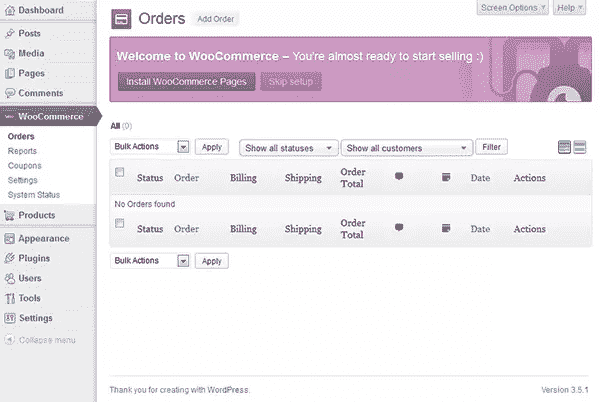
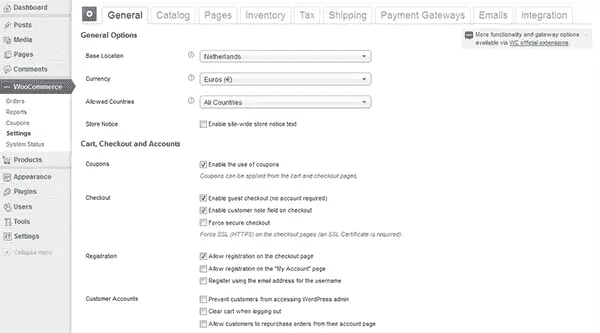
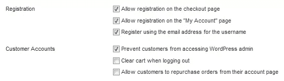
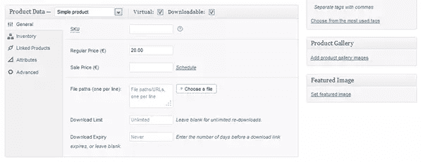
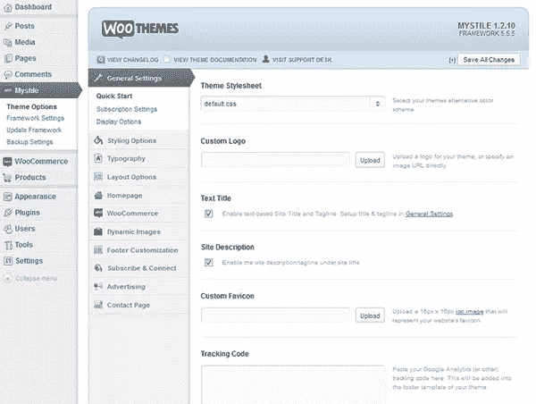
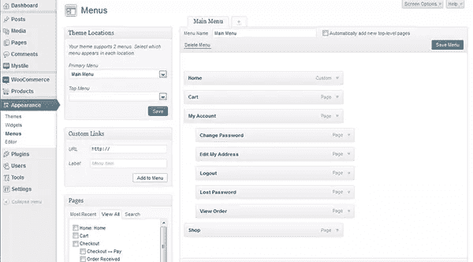

# 用 WordPress 和 WooCommerce 建立一个网店

> 原文：<https://www.sitepoint.com/set-up-a-webshop-with-wordpress-and-woocommerce/>

有时候你只是想要一个简单的网店。你需要它工作，仅此而已。无论你是想把它添加到现有的 WordPress 站点，还是想在建立 WordPress 站点的同时进行配置，WooCommerce 都能做到。让我告诉你如何建立一个简单的商店，包括实体和虚拟产品、税收和 PayPal 支持，而不依赖于任何以前的电子商务或 WordPress 经验。

## 安装 WordPress 电子商务插件

你需要做的第一件事是安装 WordPress。不用担心；这是一个直截了当的过程，这里有详细的记录:[codex.wordpress.org/Installing_WordPress](http://codex.wordpress.org/Installing_WordPress "Installing WordPress - WordPress Codex")。

除了安装 WordPress 以上版本)，你还需要以下东西:

*   fsockopen 支持(用于支付网关 IPN 接入)。
*   如果您选择安装任何直接支付网关，SSL 证书
*   cURL 支持(可选)WooCommerce 的一些插件需要 cURL。
*   SOAP 支持(可选)WooCommerce 的一些插件需要 SOAP。

一旦安装了 WordPress，用你选择的管理员密码登录到仪表板，熟悉左边的菜单。仪表板是一个重要的地方，在这里您可以定制和管理您的站点以满足您的需求。

接下来你需要安装 WooCommerce。有两种方法可以做到这一点:

1.  **自动安装器**——进入**插件——>添加新**，搜索“WooCommerce”，添加插件。如果这是您第一次这样做，您需要输入您的 FTP 凭据。
2.  **手动**——从[wordpress.org/extend/plugins/woocommerce](http://wordpress.org/extend/plugins/woocommerce "WordPress - WooCommerce - excelling eCommerce - WordPress Plugins")下载插件，解压存档，将文件夹放在`wp-content/plugins`中。

安装 WooCommerce 后，进入**插件- >已安装插件**并激活 WooCommerce 插件。

## 配置 WooCommerce

现在插件已经激活，点击侧边菜单中的 **WooCommerce** 。添加 WooCommerce 页面，在弹出的横幅中点击“安装 WooCommerce 页面”按钮。

然后按下欢迎页面上的设置按钮，进入以下页面:

在这个页面上有很多设置，但是让我们把重点放在你用 PayPal 作为你的支付提供商来开书店所需要的设置上。

### 一般

一般设置不言自明。对于我自己的设置，我唯一改变的是国家改为荷兰，货币改为欧元。

### 赋税

你需要有一点税务知识来经营一个网上商店。在 Tax 选项卡下，我点击顶部的小链接“Standard”输入标准税率，并添加了荷兰 BTW 税(21%)。税和他们的数额因地点而异，所以一定要检查适用于你的规则。因为税收规则根据你所在的地方而不同，所以除了你填写税率的地方之外，我不能提供详细的信息。

如果你不确定，我建议你打电话给当地的税务局，询问你允许挣多少钱，以及你具体的商店需要什么样的税务文件。建立一个网上商店是容易的，但是处理税务是比较困难的。毕竟，你不想被指控犯有税务欺诈！

### 客户

要启用客户，请返回“常规”选项卡，并选中“注册”和“客户帐户”部分中的相应框。对于我的商店，我选择了以下选项:

### 启用 PayPal

要启用 PayPal 集成，请转到支付网关选项卡，然后按顶部的小 PayPal 链接。为了这篇文章，我会告诉你如何启用贝宝沙盒，因为我们不想在一个假的商店处理真钱！

前往[developer.paypal.com](https://developer.paypal.com/ "Home | PayPal Developer")，使用您现有的 PayPal 帐户登录(如果您没有，请注册一个)。点击该网站的“应用程序”菜单项，然后“沙盒帐户”。您可以在这里创建一个新的测试帐户。

创建一个客户帐户来测试购买情况。像填写普通账户一样填写表格。说到输入余额，这都是假钱，所以我喜欢在这里输入 100 万。一个人可以做梦…

再次回到您的网店，在之前的 PayPal 链接中填写您创建的 sandbox 帐户的电子邮件地址。

如果你在本地测试，付费就不能完全发挥作用。一旦你在一个真正的域名上建立并运行了网站，他们就会开始工作。

## 定制您的商店

你现在有一个功能齐全的网上商店，但它看起来不太像一个商店。我们需要添加一些产品，并选择一个主题。

### 添加产品

在侧边菜单中，您会看到一个**产品**类别。点击它，然后选择**添加产品**，填写新产品信息。这是一个非常简单的过程。

为了举例，我们再加一本 20 欧的“PHP 书”。让我们也添加一个带有下载链接的“PHP 电子书”(选中“虚拟”和“可下载”框来制作一个可下载的产品)。您可以使用特色图像功能设置产品图像，并使用产品图库添加任何附加图像。

### 添加主题

在 woothemes.com/product-category/themes/woocommerce，WooCommerce 有几个主题，当然你也可以随意推出自己的主题或定制现有的主题。为了这篇文章的目的，我们想让商店尽快启动并运行，所以让我们使用 [mystile](http://www.woothemes.com/products/mystile/ "Mystile | WordPress themes, plugins and WooCommerce extensions | WooThemes") ，一个干净的免费主题。但是你需要在下载前注册。

添加主题的过程类似于添加插件；要手动安装，将其添加到`wp-content/themes`中，并通过进入侧边菜单中的**外观- >主题**并按下主题下的“激活”来激活它。

这个主题在 **Mystile** 下的侧边菜单中有一些设置，所以你可以随意尝试不同的选项，让它看起来和感觉起来都像你想要的那样。

如果你在新主页的底部得到一个 PHP 警告，这很可能意味着你需要更新你的 WooFramework。你可以去 **Mystile - >更新框架**来完成。

### 更改菜单

我们可能不需要结账页面出现在网站的菜单中，所以让我们通过进入**外观- >菜单**来改变菜单，并在加号标签中创建一个新菜单。随便你怎么命名；我选择将我的菜单命名为“主菜单”。

然后在“页面”框中选择所需的页面。我添加了主页:主页、购物车、商店、我的帐户以及我的帐户下的每个子页面。确保将子页面拖到我的帐户下。菜单保存后，在“主题位置主菜单”下拉菜单中选择它。

### 额外清理

通过进入侧边菜单中的**页面- >所有页面**移除样本页面，并将其从那里移除。您可能还想从某些页面中删除可见的边栏。您可以通过单击页面的快速编辑链接并将其模板设置为“全幅”来完成此操作。

网址看起来也不太好。你可能更喜欢 http://wordpress.dev/products 的*而不是 http://wordpress.dev/?post_type=produc 的* t。进入**设置-gt；在常用设置部分选择“文章名称”。**

您可能还想更改特定产品的永久链接。在“产品永久链接基础”部分，我选择了“分类购物基础”来获得一个漂亮的、可共享的链接。

## 结论

恭喜你，你已经成功创建了一个网店。如果你没有遇到任何问题，这个过程可能会花你不到一个小时，也许两个小时阅读这篇文章。使用 WordPress 和 WooCommerce 是多么容易啊！

WooCommerce 是一个开源项目，所以如果你想进一步扩展它，请在 GitHub 上查看！

图片 via[Fotolia](http://us.fotolia.com/?utm_source=sitepoint&utm_medium=website_link&utm=campaign=sitepoint "Royalty Free Stock Photos at Fotolia.com")

## 分享这篇文章