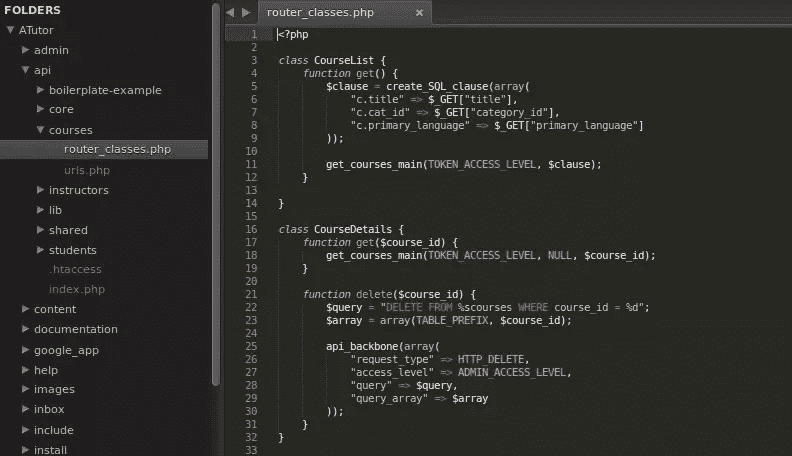
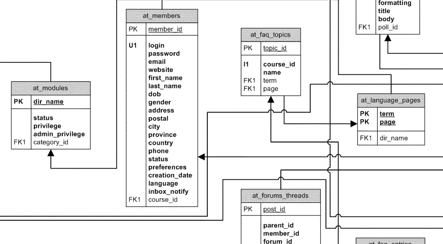

# 我如何设置我的开发机器

> 原文：<https://www.sitepoint.com/set-up-development-machine/>

每个开发人员都有一套让他们的生活变得轻松的工具，没有这些工具，他们的开发生活会变得举步维艰！多年来，我发展了自己的一套，我在这篇文章中描述了它。我开发相关任务的主要操作系统是 Ubuntu，我假设你有最新版本的 Ubuntu (12.04+)。

当我开始开发时，我只知道基本的 PHP。设置开发机器就像安装 PHP5、MySQL 和更改 Apache2 的主目录一样简单。

但是这些年来，作为一名开发人员，我已经发生了变化，我使用的工具也发生了变化——所以可以肯定地说，明年，我可能会读到这篇文章并微笑，其中充满了新的技巧和诀窍。

除了 Google Chrome 和 Sublime Text，列表中其他的都可以通过命令`apt-get`安装。因此，我编写了一个简单的 bash 脚本来按顺序安装它们。注意，有几个(比如`mysql-server`)要求您在安装完成之前设置某些选项(比如 root 用户的密码)。

这是我在开发机器中绝对需要的东西。

## 谷歌浏览器

毫无疑问,[谷歌 Chrome](http://en.wikipedia.org/wiki/Usage_share_of_web_browsers#Summary_table) 是最受欢迎的浏览器——的确如此。Chrome 有很多功能，但有一点比其他浏览器都强，那就是强大的同步功能。我真的很喜欢这样一个事实，如果我在我的桌面上进行谷歌搜索，过一会儿检查我的智能手机，我可以在我的 Chrome 搜索中看到它。

Firefox 的 sync 正在实现，但还远未实现。这是我安装的第一件东西，因为我列表上的许多其他东西可能会遇到问题，这通常需要大量的谷歌搜索来解决。

### Chrome 扩展

Chrome 附带了很多功能，但如果没有我使用的扩展，它真的是不完整的。最重要的扩展是 [AdBlock 加](https://chrome.google.com/webstore/detail/adblock-plus/cfhdojbkjhnklbpkdaibdccddilifddb)，从网络上移除广告。在开发时，你需要能够像你的用户一样看到网站，以正确测试变化，根据一些报告[五分之一的用户安装了广告拦截扩展](http://qz.com/120797/over-one-fifth-of-people-use-ad-blocking-software-and-its-beginning-to-hurt/)，所以测试有广告和没有广告都很好。

我安装的下一个插件是口袋。作为一名开发人员，你经常会发现有很多精彩的文章，但是你并不总是有时间去阅读它们——这就是 Pocket 发挥作用的地方。它保存这些文章，并与您的其他设备同步，以便您可以在以后任何时候阅读它们。

YSlow 是 Chrome 的另一个伟大的扩展，它告诉你为什么某个页面很慢。另一个重要的扩展是[屏幕捕捉](https://chrome.google.com/webstore/detail/screen-capture-by-google/cpngackimfmofbokmjmljamhdncknpmg?hl=en)，用于按下打印屏幕按钮还不够的情况。最后，我和[一起管理我的日常活动。](https://en.todoist.com/app?v=212)

一旦我登录 Chrome，这些扩展就会同步，我不必每次都安装它们。

Ubuntu 的新版本可能与 Chrome 的最新版本不兼容。在这种情况下，如果问题已经解决，您可以安装开发版，或者安装提供相同同步功能的 [Chromium](http://www.chromium.org/Home) 。

## 文本编辑器

此列表中许多其他工具和服务的安装可能涉及编辑基于文本的配置文件。没有我最喜欢的文本编辑器，我该怎么做呢？

当我在本地机器上工作时，我更喜欢[崇高的文本](http://www.sublimetext.com/)。但是，当您在远程服务器上工作时，需要一个基于 CLI 的文本编辑器。Ubuntu 安装了 VI，但更强大的是 [Vim](http://www.vim.org/) (Vi 改进版)。安装之后，我通过编辑`.vimrc`文件来配置 Vim，以设置某些属性，比如制表符间距。在 Sublime Text 中，通过更改其首选项文件(默认或用户级别)调整了类似的设置。

对于 Sublime 文本，您可以在首选项文件中更改许多设置。我更喜欢使用[苏打深色](http://buymeasoda.github.io/soda-theme/)主题。

接下来，您应该尝试一下可用于 Sublime Text 的插件范围。

*   [GitGutter](https://github.com/jisaacks/GitGutter) 在 Gutter 区域显示，一行是否被添加、修改或删除，根据 Git。

*   Pylinter 在保存 Python 文件时检查错误，并显示违规情况。

*   [All Autocomplete](https://github.com/alienhard/SublimeAllAutocomplete) 是一个插件，它将自动完成单词列表扩展到所有打开的文件。T

这些只是其中的几个，要描述崇高的文本插件还需要一个单独的帖子。建议你看看[前端专用](http://donnapeplinskie.com/sublime-text-shortcuts-packages-tweaks/)、 [PHP 专用](http://www.neverstopbuilding.com/sublime-plugins-for-php)或者 [Python 专用](http://dbader.org/blog/setting-up-sublime-text-for-python-development)崇高文字插件。

## 版本控制软件

下一步是安装版本控制软件。如果你参与开源开发，安装 [Git](http://git-scm.com) 、 [Mercurial](http://mercurial.selenic.com/) 和 [Bazaar](http://bazaar.canonical.com/) 就足够了，因为大多数项目使用这三个中的一个。您可以跳过安装 Subversion，因为现在的开源项目很大程度上是从 Subversion 发展而来的。

用 Ubuntu 包管理器安装它们非常容易。除非你想要测试版，否则你只需用`apt-get install`就可以设置它们。如果您想要不稳定的开发版本，您可能需要从他们的网站上获得一个 tarball 并在您的系统上构建它们。

## 数据库管理

来源: [atutor.ca](http://www.atutor.ca/development/documentation/database.gif)

大多数 web 应用程序需要一个数据库来存储数据。在安装任何此类软件之前，建议安装一个数据库。最受欢迎的关系数据库管理系统是 [MySQL](http://www.mysql.com) ，但你可能想继续使用类似 [MariaDB](https://mariadb.org/) (在甲骨文停止开发后，它从 MySQL 的一个分支开始)或 [PostgreSQL](http://www.postgresql.org) 的东西。

如果你想和 NoSQL 一起去，你可以安装 [MongoDB](http://www.mongodb.org) 或者 [Cassandra](http://cassandra.apache.org) 。

## PHP，Python，Ruby，Node.js

在建立了一个数据库之后，我得到了一些流行的基于 web 的项目运行的语言和框架。 [PHP](http://php.net/) 、 [Python](https://www.python.org/) 、 [Ruby](https://www.ruby-lang.org/) 和 [Node.js](http://nodejs.org/) 是首选。我不安装 Java SDK，除非我需要运行特别需要它的东西。

他们中的大多数都有不同的包来连接数据库(比如`php5-mysql`或`MySQL-Python`)。确保安装了所需的软件包。

## Python 特定的包

因为我使用 Python 作为我的首选语言，所以我安装了一些特定于 Python 的包。首先，我安装了`pip`，这是 Python 的一个包管理器。`easy_install`是另一个包管理器，我通过`pip`安装。然后，我继续安装`django`，这是 Python 中的一个 web 框架。此外，我得到了包`beautifulsoup`，它是 HTML(甚至 XML)文档的解析器。最后，`ipython`给了我一个更好的 python shell，而`ipdb`有助于更好的调试。

## 更改 Apache2 主目录

在 Ubuntu 中，默认安装 apache2 形式的 web 服务器。但是，有一个小问题，默认情况下主目录是`/var/www/`。目录`/var/www/`需要 root 权限才能创建或更改文件。如果你在开发机器上工作，在每个命令前面加上`sudo`会变得很麻烦。

解决这个问题的一个简单方法是将主目录转移到您的主文件夹(`/home/[username]/`)，这样管理文件和目录就更容易了。

## 在“终端”中设置自定替身

如果您经常使用终端，您会知道您经常需要键入某些单调的命令。例如，要用本地设置文件启动 Django 服务器，我们需要键入`python manage.py runserver --settings=settinngs.local`。为了避免每次都键入这个，您可以在您的`~/.bashrc`文件中添加一个别名。

您可以使用的另一组有用的别名是用`..`代表`cd ../..`，用`...`代表`cd ../../../`等等。这里有一个在 Unix 系统中使用`.bashrc`的指南。

## 多方面的

不管你的开发经验水平如何，你可能喜欢在工作的时候听音乐。虽然有些人更喜欢 Spotify、Rdio、YouTube 或 GrooveShark 播放流媒体音乐，但如果你对带宽敏感，你可以安装 [VLC](http://www.videolan.org/vlc/index.html) 。

我安装的最后一个程序在开发过程中可能需要，也可能不需要。GIMP 是一个图像处理软件，被广泛认为是 Photoshop 的替代品。有时候，开发人员可能需要执行微小的图像处理任务，比如裁剪，这可以通过 GIMP 快速完成。

至此，我在开发机器上安装的软件列表结束了。

你用了我错过的很酷的东西吗？请在下面的评论中告诉我们。

*更新:增加了一段解释测试时需要 AdBlock 的内容。*

## 分享这篇文章