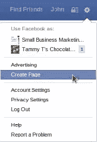
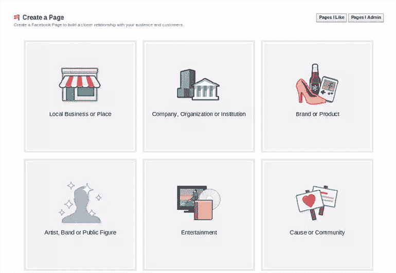
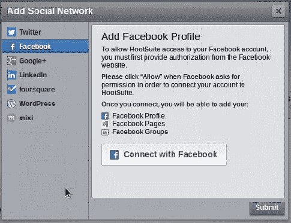
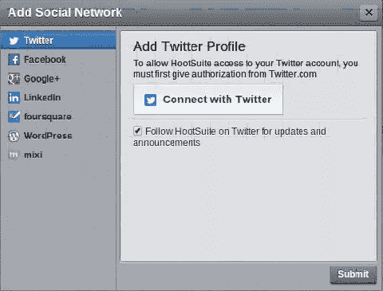
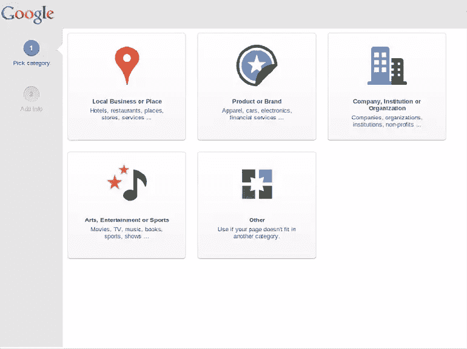
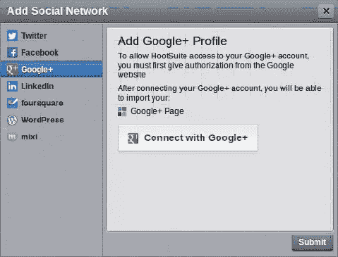
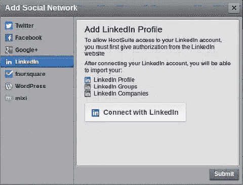
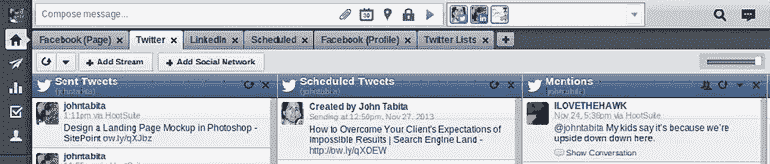
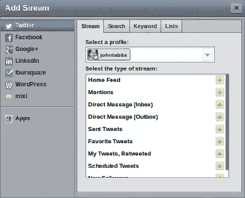

# 为内容营销的成功建立 HootSuite

> 原文：<https://www.sitepoint.com/setting-hootsuite-content-marketing-success/>

在我的上一篇文章[基本内容营销工具，第 2 部分](https://www.sitepoint.com/essential-content-marketing-tools-part-2/)中，我解释了如何使用许多有用的工具来查找、保存和分享内容到您的社交媒体档案，例如 [HootSuite](https://hootsuite.com/) 及其[浏览器扩展](https://hootsuite.com/features/extensions/hootlet)、 [Evernote](http://evernote.com) 和 [Evernote Web Clipper](http://evernote.com/webclipper/) ，以及新闻阅读器，如 [Zite](http://zite.com/) 和 [Feedly](http://feedly.com/) 。

其他的允许你查找和保存内容，HootSuite 允许你在一个界面上一次更新多个社交媒体资料。相信我，如果你管理着不止一个账户，你很快就会厌倦每次想分享文章时都要登录不同的账户。

设置 HootSuite 需要一些工作，但这是非常值得的。每个档案的工作方式都有所不同，所以这里是你建立 HootSuite 内容营销成功的综合指南。

## 与脸书一起使用 HootSuite

您可以使用 HootSuite 在您的个人资料或业务页面(如果有)上进行分享。要创建业务页面，请单击右上角的齿轮图标，然后从菜单中选择“创建页面”:

在那里，您可以选择页面类型:

建立页面后，在 HootSuite 中添加您的脸书个人资料:

1.  单击您的个人资料图标(左上角)
2.  点击“添加社交网络”
3.  连接您的帐户:

完成后，您可以选择添加您的业务页面和您所属的任何组。

然后，每个个人资料都会出现在 HootSuite 的“撰写消息”框中，您可以选择要分享到:

## 通过 Twitter 使用 HootSuite

将 HootSuite 连接到 Twitter 帐户要简单得多，因为 Twitter 没有单独的个人和商业帐户。

你必须做出的唯一决定是用你的个人名字还是公司名字创建一个 Twitter 账户。

那很容易。

## 通过 Google+使用 HootSuite

和脸书一样，Google+也有个人资料和商业页面。但是，您将无法使用 HootSuite 发布到您的个人资料。目前，谷歌的 API 只允许 HootSuite 等第三方应用程序连接并发布到页面。

假设这不是一个交易破坏者，去[这里](http://www.google.com/+/business/)创建一个 Google+商业页面。如果您尚未登录 Google 帐户，系统会提示您登录或创建一个。

在这里，您可以选择业务页面的类型:

创建后，在 HootSuite 中添加您的页面与其他社交网络一样:

## 在 LinkedIn 上使用 HootSuite

虽然 LinkedIn 同时拥有个人账户和公司页面，但它的真正力量在于群体。作为企业所有者，您可以创建公司简介，但您只能以个人身份与成员互动。

虽然公司不能联系会员或加入团体，但他们可以通过发起或赞助一个团体而受益。但作为个人，参加团体是你在 LinkedIn 上与他人联系的地方。

连接到您的帐户后，您可以导入您的个人资料、群组和公司页面(如果您创建了一个)，并开始使用 HootSuite 向其中任何或所有页面发布内容:

## 设置 HootSuite 接口

我不是 HootSuite 界面的超级粉丝，但它完成了工作。如果你要管理一个以上的个人资料，组织自己是至关重要的。

HootSuite 允许您设置选项卡，然后在每个选项卡中添加“流”(即列)。

我发现最有效的方法是为每个概要文件创建一个选项卡，然后为要监控的最重要的指标添加一个流。对我来说是这样的:

**脸书(Tab)**

*   墙柱(溪流)
*   预定帖子(流)
*   私人消息(流)

**推特**

*   发送推文
*   预定推文
*   提及
*   我的推文转发

**LinkedIn**

*   我的更新
*   计划的状态更新

您还可以添加新闻源、私人/直接消息等。但是我倾向于把它们放在最右边，不让它们挡道。

正如我在[基本内容营销工具，第 1 部分](https://www.sitepoint.com/essential-content-marketing-tools-part-1/)中所说，即使你只使用一个社交媒体档案，你也应该使用 HootSuite。为什么？因为尽管我们的社会联系紧密，但遗憾的是，许多网站缺乏社交分享按钮，让你可以发推特或分享页面。HootSuite 的[浏览器扩展](https://hootsuite.com/features/extensions/hootlet)允许你轻松地分享或安排任何你找到的文章，只需简单的右键点击——甚至不需要在你的 HootSuite 仪表板上。

内容营销是建立业务的有效手段，但它很容易成为 T2 的全职工作。所以聪明地工作，而不是努力。

Asking the right questions put you back in control of the meeting. If you haven’t picked up my free guide, **27.5 Must-Ask Questions for Consultative Selling**, just [follow me on Twitter](http://twitter.com/johntabita "Twitter | @johntabita") and I’ll send you the link.

## 分享这篇文章