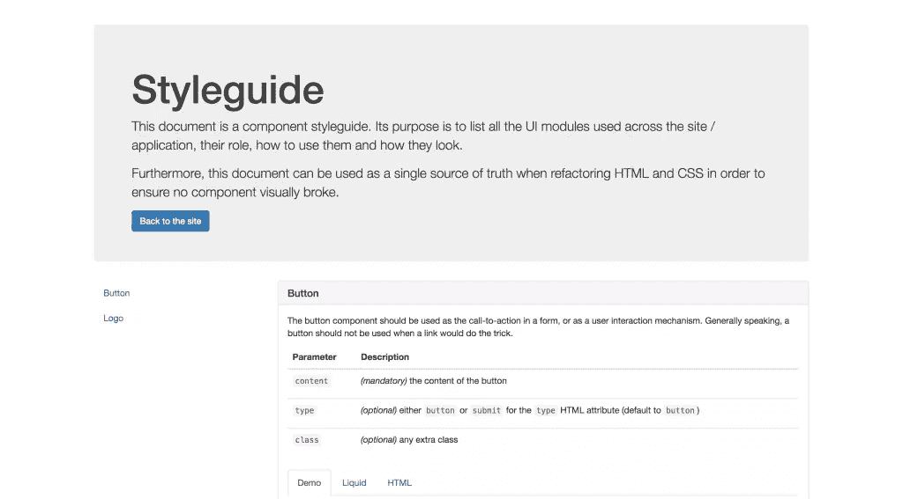
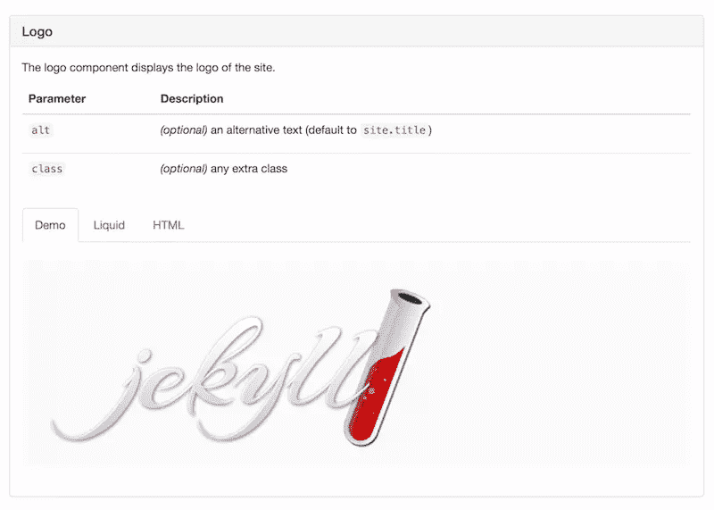

# 在 Jekyll 建立生活方式指南

> 原文：<https://www.sitepoint.com/setting-up-a-living-styleguide-in-jekyll/>

我最近在做一个小的 [Jekyll](http://jekyllrb.com/) 项目，想看看是否有可能有一个由 styleguide 驱动的非常*组件化的*方法，尽管事实上[Liquid](https://github.com/Shopify/liquid)(Jekyll 背后的模板引擎)并不打算这么做。

我发现这是可行的(虽然有些困难),我想向你展示如何在你的下一个 Jekyll 项目中使用类似的方法。



围绕这个例子有相当多的设置，所以我建议你检查一下[现场演示](http://hugogiraudel.com/jekyll-styleguide/styleguide/)，然后跟随 GitHub 上的这个[样板文件。](https://github.com/HugoGiraudel/jekyll-styleguide)

## 为什么是样式指南？

当在一个站点或应用程序上工作时，尝试找到通用的 UI 模式是一个好的实践，这样它们就可以被提取出来并在整个平台上重用。这有助于维护、扩展和降低整体复杂性。

当进一步推进时，这种实践可以导致“风格指南”(或“风格指南”)的创建。广义地说，根据维基百科的说法，风格指南是:

> [A]用于一般用途或特定出版物、组织或领域的一套文档编写和设计标准。风格指南建立并实施风格以改善沟通。

现在，没有一种方法可以做一个风格指南。问 10 个这个行业的人，你会有 10 个不同的答案。我想这也是它的美妙之处。有些人会告诉你样式指南不应该是技术性的，有些人会告诉你应该是。有人会称之为模式库…等等。

如果你问我，一个组件风格指南应该解释一个组件做什么，如何使用它，并提供一个例子。这就是我对这样一份文件的期望。

*注:如果你有兴趣阅读更多关于 styleguides 以及与之相关的一切，可以看看 [styleguides.io](http://styleguides.io/) 。*

## Jekyll 中的组件

我越来越习惯使用 React，它有一点让我非常喜欢——所有东西，甚至是最小的 UI 块，都是(或者可能是)一个组件。你很快就会意识到，正是这个概念推动了我在这里的研究。

任何理论上可以重用的接口模块最终都在自己的文件中，在 Jekyll `_includes`文件夹的`components`文件夹中。

```
my-project/
|
|– _includes/
|   |
|   |– components/
|   |   |
|   |   |– button.html
|   |   |– header.html
|   |   |– headline.html
|   |   |– nav.html
|   |   |– footer.html
|   |   |– …
|– …
```

举个例子，让我们一起构建按钮组件(`button.html`)。我们的按钮组件应该至少有一个`type`属性，一个`class`属性和一些内容。

我们将给按钮一个默认的类，它可以通过`class` include 参数来扩展，使它更加灵活。我们还将定义默认的`type`到`button`，以防它没有被传入。

最后但同样重要的是，如果没有传递内容，我们将确保不呈现按钮。

*注意:在 Jekyll 中，包含参数可以通过`include`对象访问。*

```





  <button class="{{ class }}" type="{{ type }}">{{ content }}</button>

```

当在页面中使用时，该文件通过``液体块被包含，用[包含参数](http://jekyllrb.com/docs/templates/#includes)定制。最终，这意味着页面基本上只是包含组件的通用容器。

```

```

## 构建样式指南

为了构建样式指南本身，我们需要几样东西:

*   所有文档组件的一个 [Jekyll 集合](https://jekyllrb.com/docs/collections/)。
*   集合中每个组件的一个条目。
*   样式指南页面。
*   专用于样式指南的布局。

### 创建一个专门的 Jekyll 集合

首先，让我们在配置中设置集合:

```
# Styleguide settings
collections:
  styleguide:
    output: true

defaults:
  -
    scope:
      path: ""
      type: "styleguide"
    values:
      layout: "default"
```

这告诉 Jekyll，我们将在项目根级别的一个`_styleguide`文件夹中拥有来自我们的`styleguide`集合的条目。每个文档化的组件都有一个匹配的文件(使用`default`布局)。

```
my-project/
|
|– _includes/
|   |
|   |– components/
|   |   |
|   |   |– button.html
|   |   |– header.html
|   |   |– headline.html
|   |   |– nav.html
|   |   |– footer.html
|   |   |– …
|
|– _styleguide/
|   |
|   |– button.html
|   |– header.html
|   |– headline.html
|   |– nav.html
|   |– footer.html
|   |– …
|
|– …
```

### 每个组件一个条目

让我们为按钮组件(`_styleguide/button.html`)创建页面。这一页并不是真的要自己看；它旨在显示我们需要的所有信息，以便能够在 styleguide 页面中显示关于组件的所有信息。

我们需要的是对 UI 模块的描述，它接受的参数，以及一个例子。页面本身的内容将是一个适当的液体包含，这是什么将被渲染为一个 iframe 内的演示。

```
---
description: | The button component should be used as the call-to-action in a form, or as a
  user interaction mechanism. Generally speaking, a button should not be used
  when a link would do the trick.
parameters:
  content: "*(mandatory)* the content of the button"
  type: "*(optional)* either `button` or `submit` for the `type` HTML attribute
        (default to `button`)"
  class: "*(optional)* any extra class"
example: | 
---


```

*注意:在 YAML，管道符号表示一个[文字样式值](http://www.yaml.org/spec/1.2/spec.html#id2795688)的开始。*

### “风格指南”页面

我们现在需要为 styleguide 创建页面。为了使它简单(因为我认为这是一个完美的场合)，我在这个页面上添加了 [Bootstrap](http://getbootstrap.com/) 以使它更容易样式化和更快构建。此页面包含三个部分:

*   介绍样式指南的标题。
*   导航的侧边栏。
*   一个主要内容区域，显示我们集合的所有条目。

为了避免页面过长和逻辑臃肿，我建议将这些部分放在一个`_includes/styleguide`文件夹中。

```
my-project/
|
|– _includes/
|   |
|   |– components/
|   |   |
|   |   |– button.html
|   |   |– header.html
|   |   |– headline.html
|   |   |– nav.html
|   |   |– footer.html
|   |   |– …
|   |
|   |– styleguide/
|   |   |
|   |   |– component.html   # HTML for a component display
|   |   |– header.html      # Styleguide header
|   |   |– navigation.html  # Styleguide navigation
|
|– _styleguide/
|   |
|   |– button.html
|   |– header.html
|   |– headline.html
|   |– nav.html
|   |– footer.html
|   |– …
|
|– …
```

我推荐这样做的原因是，它使我们页面的代码非常干净，并使它的功能非常明显。

```
---
layout: styleguide
---

<div class="container">

  <!-- Styleguide header introducing the content -->
    

  <div class="row">

    <!-- Styleguide aside navigation -->
    <div class="col-md-3">
        
    </div>

    <!-- Styleguide main content area -->
    <div class="col-md-9">
      
        
      
    </div>

  </div>

</div>
```

下面是标题(`_includes/styleguide/header.html`):

```
<div class="jumbotron">
  <h1>{{ page.title | default: "Styleguide" }}</h1>

  <p>
    This document is a component styleguide. Its purpose is to list all the UI
    modules used across the site / application, their role, how to use them and
    how they look.
  </p>

  <p>
    Furthermore, this document can be used as a single source of truth when
    refactoring HTML and CSS in order to ensure no component visually broke.
  </p>

  <a href="/" class="btn btn-primary">Back to the site</a>
</div>
```

下面是导航(`_includes/styleguide/navigation.html`):

```
<div class="scrollspy">
  <div class="s-styleguide-aside hidden-xs hidden-sm">
    <ul class="nav">
      
        
        <li>
          <a href="#{{ component.slug }}">{{ component_name }}</a>
        </li>
      
    </ul>
  </div>
</div>
```

*注意:如果你的组件名不一定与它们的文件名(`slug`)匹配，你可以给它们添加一个`title`或`name`键。*

最后，这里是一个组件展示的 HTML(`_includes/styleguide/component.html`)，这无疑是这个页面最复杂的部分:



```










<div class="s-styleguide-showcase" id="{{ slug }}">

  <div class="panel panel-default">
    <div class="panel-heading">
      <h2 class="panel-title">{{ title }}</h2>
    </div>

    <div class="panel-body">
      {{ description }}

      <!-- Component include parameters -->
      <table class="table">
        <thead>
          <tr>
            <th>Parameter</th>
            <th>Description</th>
          </tr>
        </thead>
        <tbody>
        
          
          
          <tr>
            <td><code>{{ parameter_name }}</code></td>
            <td>{{ parameter_desc }}</td>
          </tr>
        
        </tbody>
      </table>

      <!-- Nav tabs -->
      <ul class="nav nav-tabs" role="tablist">
        <li role="presentation" class="active">
          <a href="#{{ tab_name }}-demo" aria-controls="{{ tab_name }}-demo" role="tab" data-toggle="tab">Demo</a>
        </li>
        <li role="presentation">
          <a href="#{{ tab_name }}-liquid" aria-controls="{{ tab_name }}-liquid" role="tab" data-toggle="tab">Liquid</a>
        </li>
        <li role="presentation">
          <a href="#{{ tab_name }}-html" aria-controls="{{ tab_name }}-html" role="tab" data-toggle="tab">HTML</a>
        </li>
      </ul>

      <!-- Tab panes -->
      <div class="tab-content">

        <div role="tabpanel" class="tab-pane active" id="{{ tab_name }}-demo">
          <iframe src="{{ iframe_source }}" title="{{ title }}"></iframe>
        </div>

        <div role="tabpanel" class="tab-pane" id="{{ tab_name }}-liquid">
          {{ liquid_code }}
        </div>

        <div role="tabpanel" class="tab-pane" id="{{ tab_name }}-html">
          {{ html_code }}
        </div>

      </div>
    </div>
  </div>

</div>
```

### “样式向导”布局

这一步并不是强制性的。你的 styleguide 页面肯定可以使用你的站点的默认布局。在我们的例子中，因为它需要包含引导资产和处理程序，所以它与众不同，应该有一个单独的布局。

它需要包括:

*   Bootstrap 中的主样式表。
*   jQuery，因为它是一个引导依赖项。
*   Bootstrap 中的主 JavaScript 文件。
*   根据内容调整 iframes 大小的脚本。
*   初始化词缀导航的脚本。
*   用于增强导航的`body`元素上的`data-spy="scroll"`和`data-target=".scrollspy"`属性。

因为有相当多的 JavaScript 来使样式指南完美地工作，所以在`_includes/styleguide/scripts.html`中添加一个文件来完成这个任务可能是值得的:

```
<!-- jQuery -->
<script
  src="https://code.jquery.com/jquery-2.2.4.min.js"
  integrity="sha256-BbhdlvQf/xTY9gja0Dq3HiwQF8LaCRTXxZKRutelT44="
  crossorigin="anonymous"></script>

<!-- Bootstrap -->
<script
  src="https://maxcdn.bootstrapcdn.com/bootstrap/3.3.6/js/bootstrap.min.js" 
  integrity="sha384-0mSbJDEHialfmuBBQP6A4Qrprq5OVfW37PRR3j5ELqxss1yVqOtnepnHVP9aJ7xS" 
  crossorigin="anonymous"></script>

<!-- Iframes resizing -->
<script type='text/javascript'> $(function () {
    $('iframe').on('load', function () {
      var height = this.contentWindow.document.body.offsetHeight + 'px'
      $(this).css('height', height)
    })
  }) </script>

<!-- Affix sidebar initialisation -->
<script> var $nav = $('.c-styleguide-aside')

  $nav.affix({
    offset: { top: $nav.offset().top }
  }) </script>
```

## 包装东西

就是这样，伙计们！我希望你喜欢这个实验，并且已经考虑到在你的项目中有一个活的风格指南的好处。

由于 Liquid 的原因，Jekyll 并不是创建这样一个文档的最容易的地方，但是正如你所看到的，它仍然有可能以一个可爱的解决方案结束。

不可否认，设置这个样式指南需要做大量的基础工作，但是添加新的组件变得非常简单:

1.  在`_includes/components/`中创建您的组件。
2.  在`_styleguide/`中创建一个匹配页面，并填写您需要的所有信息。
3.  完成了！✨

如果你对如何改进有任何想法，一定要在评论中分享你的想法，甚至在 GitHub 上为[演示做贡献。](https://github.com/HugoGiraudel/jekyll-styleguide)

## 分享这篇文章