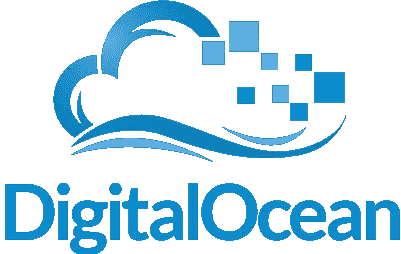
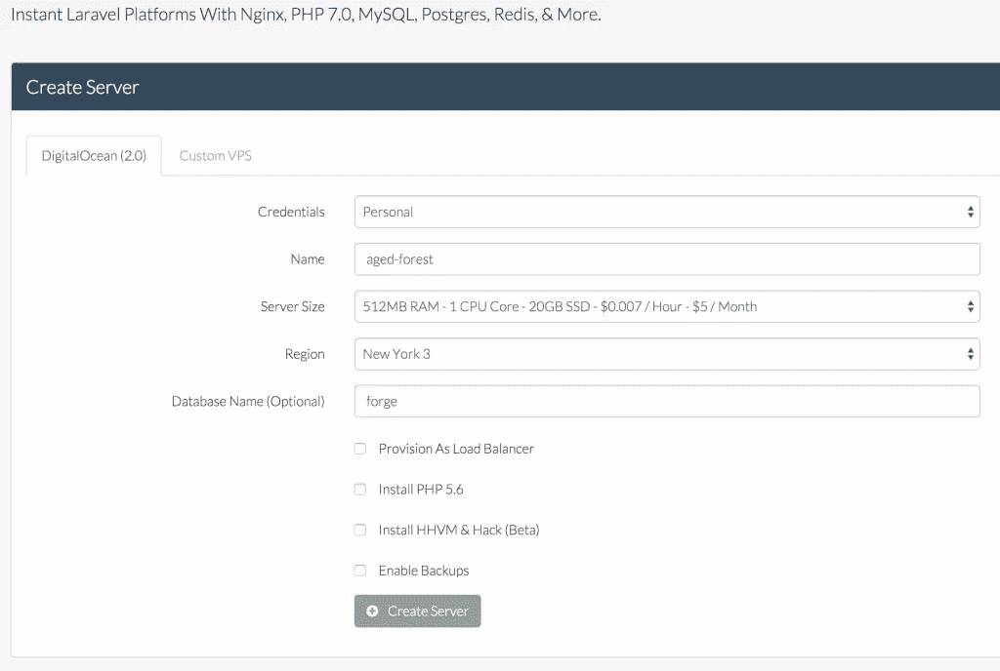
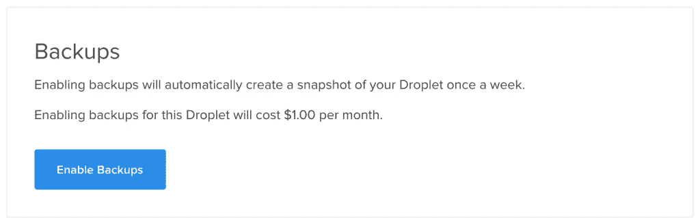
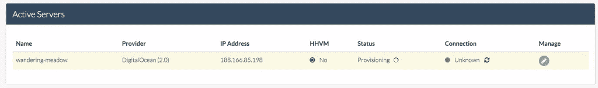
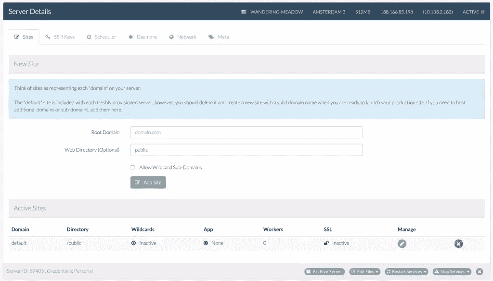
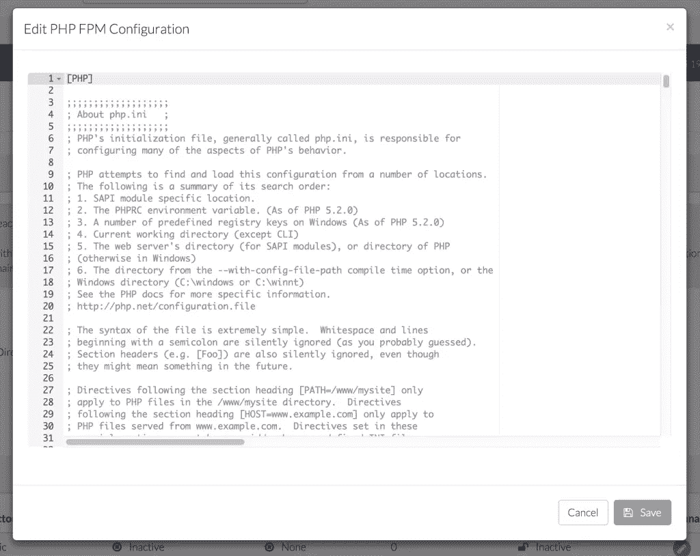
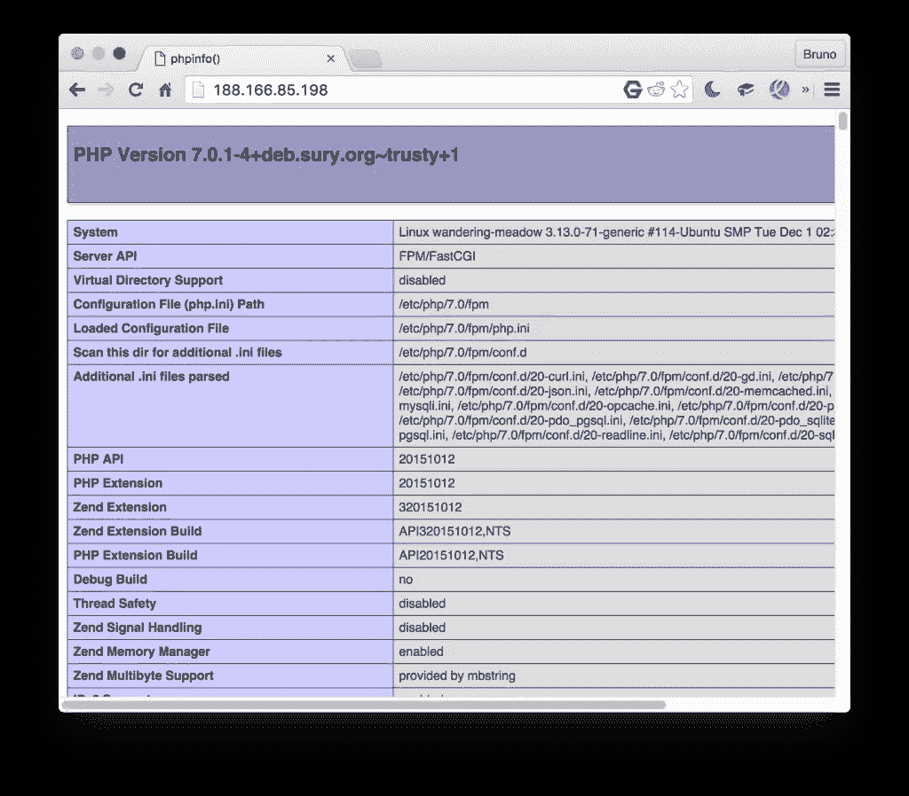
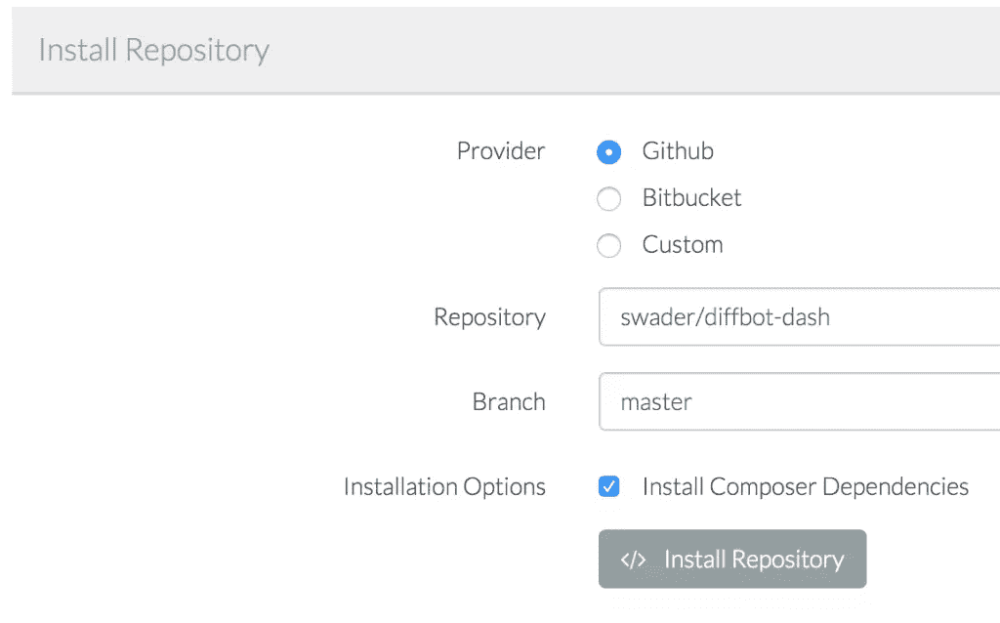
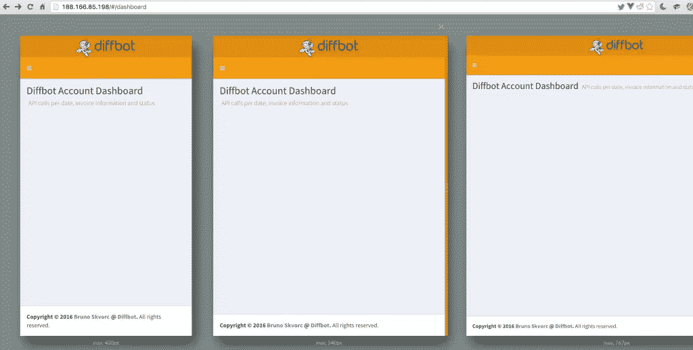
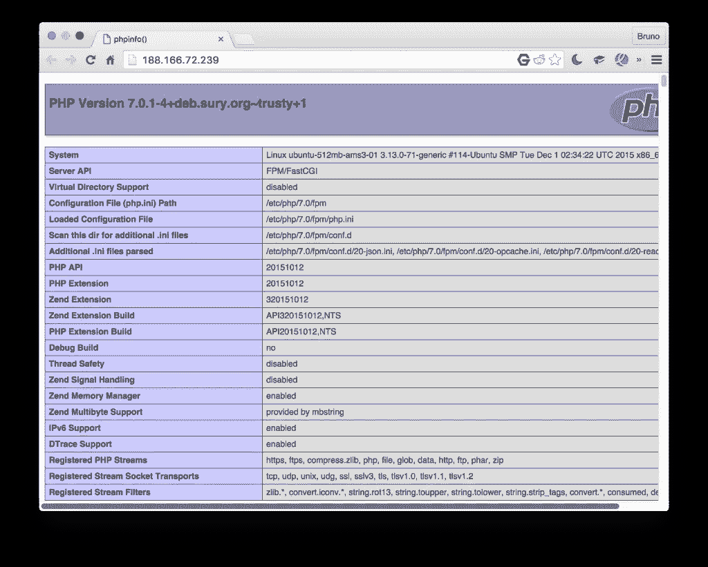

# 用 Laravel Forge 和 DigitalOcean 设置 PHP 7 服务器

> 原文：<https://www.sitepoint.com/setting-up-php-7-servers-with-laravel-forge-and-digitalocean/>

在我们的[年终读者满意度调查](https://www.sitepoint.com/what-a-year-help-us-make-2016-even-better)中，最受欢迎的请求之一是更多的 PHP 7 内容。在这个快速指南中，我们将介绍两种在 DigitalOcean 上使 PHP 7 服务器联机的方法 DigitalOcean 是一个流行的 VPS 提供商。

我们将使用两种方法，后者适用于任何 Ubuntu 安装，而前者只适用于 DigitalOcean。如果您没有 DigitalOcean 帐户，但想跟进，请通过此参考代码随意获取[两个月的免费服务。](https://www.digitalocean.com/?refcode=173851694812)

[](https://www.digitalocean.com/?refcode=173851694812)

## PHP 7 本地

如果你想在本地用 PHP 7 开发，使用我们的[家园改进版](https://www.sitepoint.com/quick-tip-get-homestead-vagrant-vm-running/)——它已经默认运行 PHP 7。更重要的是，使用下面的 Laravel Forge，你最终会得到几乎完全相同的设置。

## 拉勒韦尔锻造厂

Laravel Forge 是一项商业服务，用于部署和提供运行 PHP 的服务器。这是一个常见的误解，认为所有带有 Laravel 名字的东西都与 Laravel 直接相关，并需要它，但这不是真的。在这一点上，Laravel 只是一个品牌，一个包含许多工具的品牌——就像人们可以使用 Zend Studio 或 Zend Server 而不使用 Zend Framework 一样。因此，目前 Forge 可以用来为 DigitalOcean、AWS 或 Linode 建立服务器。正如我们在这篇文章的介绍中所说，我们将使用数字海洋。

一旦你注册了 Forge(有一个 5 天的试用期)并建立了你的账户，就直接进入服务器创建页面。

*请注意，虽然 5 天时间看起来很短，但对于测试一两个部署来说已经足够了。这并不意味着你的服务器会在 5 天后被关闭——这仅仅意味着你将无法从 Forge 管理它或者在试用期结束后制作新的服务器。这个试验实际上为你提供了一个完整的服务。不幸的是，它还需要信用卡——人们可以希望他们以后会取消这一要求，以方便新用户的加入。*

如果您只是为了这个实验而进行，请选择最底层的服务器。根据需要修改其他设置。



保持所有复选框未选中–只有高负载应用程序才需要第一个复选框。HHVM 是为那些喜欢生活在风口浪尖上，尝试另类运行时间的人准备的。“启用备份”是 DigitalOcean 的一个特定选项，它将液滴的价格提高了 20%，并每周拍摄液滴的快照，以便在出现问题时可以轻松恢复。



我不建议设置此选项-它不必要地增加了成本，并且在我们这样敏捷的世界中，每周备份并不那么有价值-相反，选择自定义每日备份选项可能是一个更好的主意。这是应该在服务器创建屏幕中明确指出的事情，因为它有可能成为一项意料之外的成本。此外，如果需要，它可以在创建后在数字海洋的控制面板中的液滴配置屏幕上激活。

单击“创建服务器”按钮后，配置和创建过程将开始。可能需要一段时间。



一旦提供了服务器，我们就可以通过类似于 [PuPHPet](https://www.sitepoint.com/5-easy-ways-getting-started-php-vagrant/) 这样的工具的界面来配置它。



在这一点上，Forge 提供了一些令人难以置信的实用功能，可以说一举证明了其价格的合理性。从图形用户界面编辑 PHP 配置…



…服务器之间的专用网络设置(因此很容易添加单独的服务器作为数据库，或者用于队列等)、SSH 密钥上传接口、用于保持服务活动的守护程序等。在你空闲的时候，请随意研究它们。

对于部署，我已经有了一个小的 [Diffbot](https://www.sitepoint.com/blog/) 帐户仪表板，我正在开发，因为我学习了 [VueJS](http://vuejs.org/) ，它看起来像是完美的尝试。你可以在这里克隆/分叉。

让我们试一试。首先，让我们确保我们的服务器启动并运行，并提供 PHP 7 内容。我们可以通过在浏览器中访问服务器的 IP 地址来做到这一点:



一切都好！现在，让我们添加一个新站点。不设置专用域，我们就用 IP，点击修改按钮，修改 forge 添加的默认站点。下一个屏幕将让我们将 Github repo 绑定到我们正在创建的应用程序，这就是前面提到的 Dash repo 的用武之地。



这种类型的绑定还将允许我们设置自动部署(快速部署，可在下一个屏幕上选择)，这将在推送回购时重新部署我们的应用程序。在我们部署之前，我们需要稍微修改一下部署脚本，删除提到`artisan`的那一行——我们没有使用 Laravel 应用程序，所以这会在部署过程中导致错误。现在，我们可以点击“立即部署”。

不幸的是，没有办法知道部署是否成功——只有错误显示在屏幕的顶部——但是在浏览器中刷新 IP 显示一切正常。



随着快速部署激活，我们推动的任何变化将立即反映在我们的应用程序。正如我们所说的，很遗憾我们没有收到任何新的成功部署的通知。就是这样——用 Forge 设置一个基本的应用程序就是这么简单。现在让我们手动做同样的事情——随意从主 Forge 屏幕上删除服务器——这将保存你的帐户信用。

## 手动安装

首先，我们在[https://cloud.digitalocean.com/droplets/new](https://cloud.digitalocean.com/droplets/new)手动创建一个新的水滴。与 Forge 相同的设置——Ubuntu 14.04，最近的区域，最低层服务器(5 美元)。所有复选框都可以保持未选中状态。一旦创建了液滴，需要经历几个步骤。首先也是最重要的，服务器[应该被保护](https://www.digitalocean.com/community/tutorials/initial-server-setup-with-ubuntu-14-04)和[额外的调整](https://www.digitalocean.com/community/tutorials/additional-recommended-steps-for-new-ubuntu-14-04-servers)被执行。当用 Forge 创建服务器时，这些步骤是不必要的。

然后，我们开始安装支持我们应用的软件:

```
sudo apt-get update
sudo apt-get install git nginx 
```

在此之后，我们的服务器将是活的，并可通过其 IP 地址访问。现在让我们安装 PHP 7。

```
sudo add-apt-repository ppa:ondrej/php-7.0
sudo apt-get update
sudo apt-get install php7.0-fpm 
```

现在，我们需要修改 Nginx 默认站点的 vhost 设置。

```
sudo vim /etc/nginx/sites-available/default 
```

一旦我们用`i`激活*插入模式*，我们改变如下:

*   在`index`下面，我们添加了`index.php`，所以现在这一行看起来像这样:

    ```
    index index.php index.html index.htm;` 
    ```

*   在“PHP”块下，我们取消了一些行的注释，并编辑了`.sock`行，因此该块现在看起来像这样:

    ```
     # pass the PHP scripts to FastCGI server listening on 127.0.0.1:9000

        location ~ \.php$ {
                fastcgi_split_path_info ^(.+\.php)(/.+)$;
                # NOTE: You should have "cgi.fix_pathinfo = 0;" in php.ini

                # With php5-cgi alone:
                # fastcgi_pass 127.0.0.1:9000;
                # With php5-fpm:
                fastcgi_pass unix:/var/run/php/php7.0-fpm.sock;
                fastcgi_index index.php;
                include fastcgi_params;
        } 
    ```

我们用`esc`退出`insert`模式，然后用`:x`保存并退出。最后，我们使用以下命令重新启动服务器:

```
sudo service nginx restart 
```

如果我们现在将一个`phpinfo`文件添加到这个默认服务器的位置，我们会看到一切正常:

```
sudo vim /usr/share/nginx/html/index.php 
```

…以及文件的内容:

```
<?php

phpinfo(); 
```



现在 PHP 7 可以运行了，让我们将默认服务器的根位置改为`/var/www/dash/public`。一般来说，我们会为我们部署的每个应用程序创建一个带有自定义根位置的新配置文件，但这也需要一个自定义域，这是我们目前还没有准备的。

然后，只需制作相关文件夹，并将应用程序直接克隆到其中:

```
mkdir /var/www
git clone https://github.com/swader/diffbot-dash dash
sudo service nginx restart 
```

一旦完成，应用程序应该像 Forge 一样工作——只有一个例外。将来对回购的推送必须手动拉至服务器。第三方连续部署超出了本教程的范围，但是我们以前用类似于 [Deploybot](https://www.sitepoint.com/deploying-php-apps-digitalocean-dploy-io/) 的工具讨论过。

与 Forge 方法的另一个不同之处是，我们在这里只安装了最少的软件——没有 MySQL，没有 Postgre，甚至没有 NodeJS 及其地狱般的后代 NPM。一切都是非常非常手动的——完全精细的控制，但不可否认的是不是每个人都喜欢。

你可能会想，手动部署似乎比 Forge 更简单、更便宜，在某种程度上，你是对的——对于像我们一直在处理的这样简单的应用程序来说，Forge 可能是多余的。但是，当事情变得复杂时，当您必须在每台服务器上维护几个应用程序，或者部署更大、更先进的应用程序，进行数据库迁移、备份等等时，Forge 的优势就显现出来了。

## 结论

在本教程中，我们使用流行的服务器部署服务 Laravel Forge 将我们的应用程序托管在运行于 DigitalOcean droplet 上的 PHP 7 服务器上。我们还使用传统的手动安装方法进行部署。后者可以很容易地应用到任何运行 Ubuntu 的服务器上——所以前进吧，7-ize！

为了简洁起见，我们跳过了一些高级步骤，比如自动化测试和部署钩子，或者数据库设置。如果你对此感兴趣，请在下面的评论中告诉我们，我们将发布后续文章，通过部署一个更具企业精神的应用程序来扩展上述两种方法。

你用拉弗尔锻造吗？或者您更喜欢以另一种方式部署？请在评论中告诉我们！

## 分享这篇文章