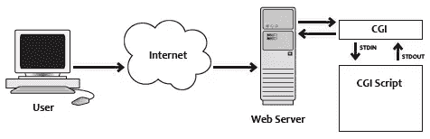
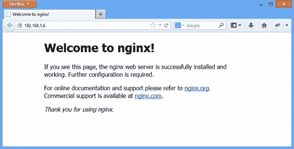
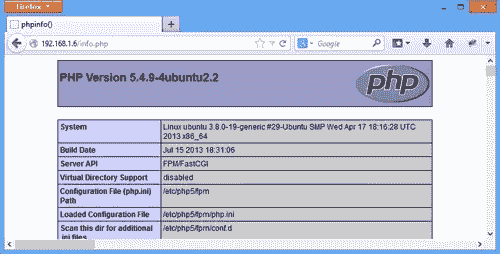

# 用 FastCGI 在 Nginx 后面设置 PHP

> 原文：<https://www.sitepoint.com/setting-up-php-behind-nginx-with-fastcgi/>

运行 PHP 的传统方式是在 Apache HTTP 服务器上使用 mod_php。事实上， [mod_php 是最受欢迎的](http://www.securityspace.com/s_survey/data/man.200902/apachemods.html) Apache 模块，直到 2009 年 mod_ssl 获得了这一权利。但是随着互联网的发展和技术的进步，其他服务于 PHP 站点和应用程序的方式变得可用。nginx，一个为解决 C10k 问题而编写的服务器，正在[蚕食 Apache 的市场份额](http://web.archive.org/web/20130520214349/http://w3techs.com/technologies/history_overview/web_server/ms/q)，在 nginx 后面用 FastCGI 运行 PHP 正成为一个越来越常见的选择。

配置 PHP 和 nginx 设置比传统的 Apache 设置要复杂一些，尽管最近随着更好的打包和默认配置，它变得更容易了。本文将指导您完成 PHP 和 nginx 的配置过程，为您自己的高性能网站提供服务。我假设你在用 [Ubuntu Server](http://www.ubuntu.com/download/server%20) (我用的是 Ubuntu 13.04，64 位)，我们会用 Apt 安装核心应用。

## 简单地说，FastCGI

在 web 的早期，开发人员需要一种在服务器上运行脚本的方式来生成页面内容和其他进程，因此 CGI(公共网关接口)协议被设计为一种促进这种方式的手段。

CGI 定义了环境(环境变量，特定于请求的变量，等等。)脚本将在中执行，以及数据如何在脚本和 web 服务器之间传递。对于每个请求，CGI 设置环境，生成脚本的一个运行实例并将任何传入的数据传递给它，然后捕获脚本的输出并将其发送给服务器。



当然，CGI 有利有弊。在专业方面，CGI 是独立于语言的，这意味着脚本可以用开发人员熟悉的任何编程语言编写(例如:Perl、C、bash 等)。)，并且每次执行都独立于 web 服务器运行，这可以防止脚本中的错误导致整个 web 堆栈崩溃。另一方面，会为每个请求创建一个新的进程，这可能会占用大量的 CPU 时间。

FastCGI 本质上是 CGI，它有一些改进，解决了 CGI 的缺点。它通过使用持久进程来执行脚本，减少了时间/CPU 开销，并且使用套接字在 web 服务器和 FastCGI 之间传递数据，这鼓励了更具可伸缩性的服务架构(服务器群和负载平衡、web 服务器和 FastCGI 之间的异步通信等)。).

关于 FastCGI 的更多信息，请查看 FastCGI 网站上的[白皮书](http://www.fastcgi.com/drupal/node/6?q=node/15)，关于 PHP 的实现，请特别查看 [PHP 手册](http://php.net/manual/en/install.fpm.php)。

## 基本安装和配置

要通过 Apt 安装 PHP，请在命令行执行以下命令:

```
sudo apt-get install php5-cli php5-fpm
```

然后，要安装 nginx，请执行:

```
sudo apt-get install nginx
```

Apt 将识别每种情况下所需的依赖项，并提示确认以继续。一旦授权，Apt 将下载并安装所请求的包及其依赖项。

Ubuntu 将 nginx 的配置文件放在`/etc/nginx`及其子目录中。共享的配置片段保存在这个根目录中，特定的服务器设置驻留在`sites-available`中，符号链接在`sites-enabled`中以激活它们。

避免编辑原始的配置文件是一个好主意，所以我建议使用副本并保持原始文件的原样。这样，您可以根据自己的喜好配置 nginx，而不用担心在将来的升级过程中 Apt 会覆盖您的成果。如果您不需要的话，还可以参考原始的默认配置。

删除`sites-enabled`中的符号链接，复制`sites-available`中的`default`文件，创建一个新的符号链接。

```
cd /etc/nginx
sudo rm sites-enabled/default
sudo cp sites-available/default sites-available/my-default
sudo ln -s /etc/nginx/sites-available/my-default sites-enabled/default
```

要让 nginx 代理对 FastCGI 服务的 PHP 请求，请打开新复制的配置文件，并找到以以下内容开头的部分:

```
# pass the PHP scripts to FastCGI server listening on 127.0.0.1:9000
#
#location ~ \.php$ {
```

取消对`location`行及其匹配的右括号、`fastcgi_split_path_info`行以及与 php5-fpm 相关的行的注释。完成后，该部分应该如下所示:

```
# pass the PHP scripts to FastCGI server listening on 127.0.0.1:9000
#
location ~ \.php$ {
    fastcgi_split_path_info ^(.+\.php)(/.+)$;
#   # NOTE: You should have "cgi.fix_pathinfo = 0;" in php.ini
#
#   # With php5-cgi alone:
#   fastcgi_pass 127.0.0.1:9000;
#   # With php5-fpm:
    fastcgi_pass unix:/var/run/php5-fpm.sock;
    fastcgi_index index.php;
    include fastcgi_params;
}
```

保存您的更改，然后启动 nginx。

```
sudo service nginx start
```

用你的浏览器连接到服务器，你应该会看到 nginx 的欢迎界面。



默认配置将`/usr/share/nginx/html`指定为 web 根目录。在该目录中，创建一个名为`info.php`的文件，调用`phpinfo()`，然后将其加载到您的 web 浏览器中，以验证 nginx 可以与 PHP 通信。在输出中，您应该看到服务器 API 被列为“FPM/FastCGI”。



## 附加配置

恭喜你！您已经有了一个基本的 nginx 和 PHP 安装设置和服务文件！但是我推荐几个额外的配置步骤。

### Web 根权限

快速检查网站根目录的权限显示，除了根目录，任何人都不能写它。持续不断的`sudo` -ing 变得令人厌烦，作为 root 用户瞎折腾通常不是个好主意，所以我建议执行以下命令:

```
sudo adduser *<username>* www-data
sudo chgrp -R www-data /usr/share/nginx/html
sudo chmod -R g+rw /usr/share/nginx/html
sudo chmod g+s /usr/share/nginx/html
```

`adduser`将你的用户名(用你自己的登录名替换`*<username>*`)添加到`www-data`组，在默认的 Ubuntu 安装中，nginx 运行在同一个组下。`chgrp`递归更新`html`目录及其子目录，使其属于`www-data`组。

然后，第一个`chmod`命令递归地向`html`及其子节点授予读写组权限，第二个命令设置 SGID 位，以便在`html`中创建的任何文件或目录都将把`www-data`组作为其组所有者。注意，第二个`chmod`不是递归运行的。

运行完这四个命令后，您需要重新加载您的 shell，以使您的用户帐户上的组关联生效。注销，然后再次登录。一旦你进入，你就可以在标准登录下随心所欲地创建、编辑和删除网络根目录中的文件，而无需任何升级权限。

### 不存在的脚本

我还建议在前面配置中取消注释的`location`块中添加一个`try_files`指令，如下所示:

```
location ~ \.php$ {
    fastcgi_split_path_info ^(.+\.php)(/.+)$;
    try_files $uri $uri/ =404;
...
```

这保护你免受一个[已知漏洞](https://nealpoole.com/blog/2011/04/setting-up-php-fastcgi-and-nginx-dont-trust-the-tutorials-check-your-configuration/)的影响，这个漏洞是由一个错误配置的系统造成的，nginx 在这个系统中尝试各种模式来满足一个请求。在阅读了`try_files` 的[文档后，您可能想要调整确切的值列表，并考虑您的应用程序的需求，但以上应该提供了最低级别的保护。](http://wiki.nginx.org/HttpCoreModule#try_files)

### 移植。htaccess 文件

在某些时候，您可能希望服务于一个以前由 Apache 服务的现有 PHP 应用程序，并且很可能在一个`.htaccess`文件或 Apache 的静态配置文件(例如 mod_rewrite 指令)中有一些服务器的配置细节。有几个在线[转换器](http://www.anilcetin.com/convert-apache-htaccess-to-nginx/)可以将 Apache 指令“翻译”到 nginx，这些是移植您的配置的良好起点。但是注意不要完全依赖它们。[俗话说](http://www.gdargaud.net/Humor/QuotesHardwareSoftware.html)，“将互联网上的代码粘贴到产品中就像在街上找到的口香糖一样。”熟悉 nginx 的文档，仔细检查转换器的输出，确保一切正常。

## 结论

传统的 PHP 运行方式(Apache 和 mod_php)是稳定和成熟的，对于大多数应用程序来说是一个优秀的平台。但是情况正在发生变化，像 nginx 这样更高性能的解决方案正在被广泛接受，甚至蚕食了 Apache 的市场份额。在本文中，您看到了如何使用 FastCGI 配置 PHP 在 nginx 后面运行。随着您全新的安装准备好为大众提供您自己的高性能网站，我祝您成功！

## 分享这篇文章