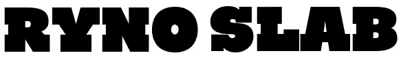
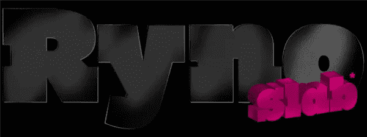
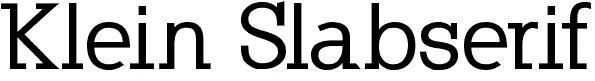
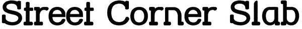
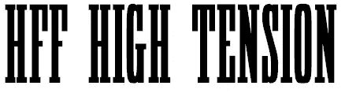
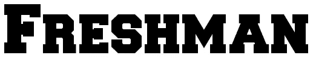
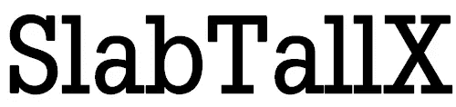
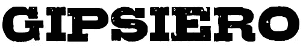

# 七种免费的平板字体给你的标题增添活力

> 原文：<https://www.sitepoint.com/seven-free-slab-fonts-to-give-oomph-to-your-headings/>

术语平板衬线是一个涵盖许多字体子类别的总括术语。平板字体与老海报有着密切的联系，比如美国西部荒野的著名的“通缉”海报。它们起源于 19 世纪，当时用于印刷的字母是用木头雕刻出来的。金属活字所能达到的又细又细的线条是木制字体所不能达到的，因此大而粗的字体成为流行的“显示”字体。最初，平板字体被创造为全大写，后来出现了小写字母。

**

 *平板字体在图形和网页设计中再次流行起来，经常被用来创建大而粗的标题和副标题。当它们与字体较浅的正文一起使用时，对比非常明显。当设置为较大的尺寸时，平板会引人注目并引起注意。

因此，这里有一个字体选择，所有适合的总括术语“板坯。”请注意，以下所有字体都可以免费下载供个人使用(例如您自己的网站)，但一如既往，请检查您下载的任何内容的许可，并将其用于商业用途。

ryno Slab Caps by[Philo type](http://www.philatype.com/)——此处下载

曼弗雷德·克莱恩的克莱恩 Slab 衬线字体对所有用户都是免费的，但是如果你在商业上使用这种字体，向无国界医生组织捐款是受欢迎的。你可以在这里下载字体。

街道拐角板宝石字体有十种风格。此处可下载[。](http://www.dafont.com/street-corner-slab.font)

HFF 高度紧张的乐趣与字体-下载[在这里](http://www.fontspace.com/have-fun-with-fonts/hff-high-tension)。

比利·博伊德设计的新生字体是学院/大学风格字体的变体——点击此处下载。

曼弗雷德·克莱因的《高大的平板 X》——点击此处下载。

Gipsiero 是一种由 Bumbayo Font Fabric 创建的重度扭曲字体–[下载此处](http://www.abstractfonts.com/font/12563)。

你觉得这些字体怎么样？你会在你的设计中使用它们吗？ **我去年在一个帖子里写过关于** [**Slab Serif 字体，你会在那里找到另一个字体集**](https://www.sitepoint.com/big-bold-and-sometimes-beautiful-serif-slab-fonts/) **。*** 

## *分享这篇文章*