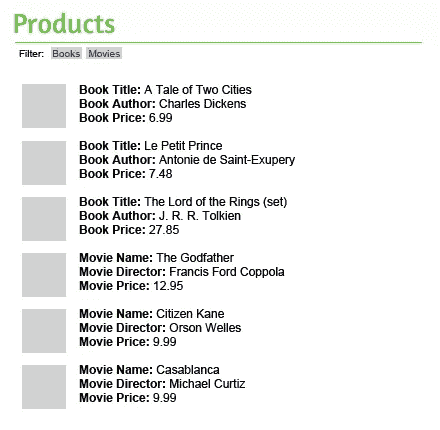

# 在 PHP 和 JavaScript 之间共享模板

> 原文：<https://www.sitepoint.com/sharing-templates-between-php-and-javascript/>

web 应用程序中的模板对于将业务逻辑从表示中分离出来至关重要。有两种类型的模板:服务器端模板，在初始页面加载期间通过服务器端模板引擎使用；客户端模板，用于处理基于 JavaScript 的应用程序或 Ajax 请求。

在 web 应用程序严重依赖 Ajax 的情况下，很难同时维护服务器端和客户端模板而不重复。因此，选择一个既提供客户端支持又提供服务器端支持的模板引擎是很有用的，这样可以实现最大的可重用性。

Mustache 正迅速成为可用的模板引擎中最受欢迎的一个，它提供了不同编程语言和平台的实现来满足我们的需求。

在我的文章[在](https://www.sitepoint.com/creating-html-templates-with-mustachejs/ "Creating HTML Templates with Mustache.js") [JSPro](https://www.sitepoint.com "JSPro - Only JavaScript ... Always JavaScript") 上用 Mustache.js 创建 HTML 模板中，我向您展示了如何在客户端代码中使用 Mustache 模板。如果你之前没有任何使用 Mustache 的经验，我推荐你读一下。在本文中，我将重点介绍如何创建服务器端的 Mustache 模板，以及如何与客户端的 JavaScript 共享同一套模板。

## Mustache.php 简介

PHP 中的 Mustache 实现被命名为 Mustache.php，你可以从官方的 [GitHub 项目页面](https://github.com/bobthecow/mustache.php "bobthecow/mustache.php - GitHub")获得这个库的副本。然而，如果你熟悉使用 Composer，我建议你使用它来安装 Mustache，以便更好地进行依赖管理(如果你不熟悉 Composer，我建议你阅读 [PHP 依赖管理与 Composer](https://www.sitepoint.com/php-dependency-management-with-composer/ "PHP Dependency Management with Composer") )。

将以下内容添加到您的`composer.json`文件中，并运行`composer install`或`composer update`(视情况而定):

```
{
    "require": {
        "mustache/mustache": "2.0.*"
    }
}
```

让我们先看一个用 Mustache.php 做模板的简单例子。

```
<?php
require 'vendor/autoload.php';

$tpl = new Mustache_Engine();
echo $tpl->render('Hello, {{planet}}!', array('planet' => 'World'));
```

首先包括 Composer 自动加载器(或者，如果您正在使用库的克隆或下载副本，您可以使用 Mustache 的自动加载器)。然后调用`Mustache_Engine`类的`render()`方法，通过传递模板数据和一些替换值来生成视图。

理想情况下，您不会像示例那样内联提供模板内容。模板应该保存在专用目录中它们自己的文件中。创建`Mustache_Engine`类的实例时，可以配置模板文件的路径。

```
<?php
$mustache = new Mustache_Engine(array(
   'loader' => new Mustache_Loader_FilesystemLoader('../templates')
));

$tpl = $mustache->loadTemplate('greeting');

echo $tpl->render(array('planet' => 'World'));
```

配置数组中的*加载器*定义了模板文件的路径(关于配置参数的更多细节可以在[Mustache.php 维基](https://github.com/bobthecow/mustache.php/wiki "bobthecow/mustache.php Wiki")中找到)。在这种情况下，模板文件位于 templates 目录中。`loadTemplate()`方法加载文件`templates/greeting.mustache`。

简要介绍了使用 Mustache 的必要理论之后，我们现在可以看看如何共享模板了。

## 在 PHP 和 JavaScript 之间共享模板

我们的主要目标是在 PHP(服务器端)和 JavaScript(客户端)之间共享模板。作为示例的基础，假设我们有一个电子商务网站，它有两个产品类别:书籍和电影。当用户第一次访问时，所有产品将显示在一个列表中，如下所示。



你可以看到每个产品类型的细节是不同的；因此，我们需要为这两个类别单独的模板。

创建两个模板，一个叫做`books.mustache`，另一个叫做`movies.mustache`。这就是`books.mustache`文件的样子:

```
{{#products}}
{{#book}}
<div>
<p>Book Title: {{title}}</p>
<p>Book Author: {{author}}</p>
<p>Book Price: {{price}}</p>
</div>
{{/book}}
{{/products}}
```

上面是一个简单的模板，有一个用于循环的部分和一些特定于模板的变量。`{{#products}}`用于遍历我们将提供的数组的产品部分中的所有元素。`{{#book}}`用于检查物品是否确实是一本书。如果 book 键不存在，那么不会向用户显示任何内容。

在初始页面加载时，需要检索所有产品并显示给用户，因此我们使用 PHP 通过模板和数据集生成初始显示。

```
<?php
$books = array();
$result = $db->query('SELECT title, author, price FROM books');
while ($row = $result->fetch(PDO::FETCH_ASSOC)) {
    $row['book'] = true;
    $books[] = $row;    
}
$result->closeCursor();

$movies = array();
$result = $db->query('SELECT name, price, cast FROM movies');
while ($row = $result->fetch(PDO::FETCH_ASSOC)) {
   $row['movie'] = true;
   $movies[] = $row;    
}

$booksTmpl = $this->mustache->loadTemplate('books');
$moviesTmpl = $this->mustache->loadTemplate('movies');

$data = array(
    'products' => array_merge($books, $movies)
);
$html = $booksTmpl->render($data);
$html .= $moviesTmpl->render($data);

echo $html;
```

我们使用两个数据库查询从数据库中提取书籍和电影数据，并将其保存到关联数组中，以便传递到模板中。我使用了基本的 PDO 方法来提取数据；如果愿意，您可以使用自己的数据库抽象层或 ORM。

书籍和电影的模板使用`loadTemplate()`方法分别加载到两个变量中，我将产品数组传递给每个模板的`render()`方法。它将模板应用于产品数据，并返回 HTML 输出。

为了根据产品类型过滤结果，我们可以从服务器获取所有过滤的书籍(或电影)作为 HTML，但是所有的标记都会为每个请求带来额外的开销。我们真的不想一遍又一遍地发送相同的标记。这就是客户端模板发挥作用的地方——我们可以将必要的模板加载到客户端的内存中，只使用 Ajax 从服务器加载数据。

为了使模板对客户端可用，可以将它们注入到初始页面请求的`<script>`标签中，供 JavaScript 将来使用。如果我们将类型设置为`text/mustache`，这些标签中的代码将不会显示，也不会被 JavaScript 执行。

```
<script id="booksTmpl" type="text/mustache">
<?php
echo file_get_contents(dirname(__FILE__) . '/templates/books.mustache');
?>
</script>
<script id="moviesTmpl" type="text/mustache">
<?php
echo file_get_contents(dirname(__FILE__) . '/templates/movies.mustache');?>
</script>
```

为了在 JavaScript 中使用这些模板，我们只需要在文档中包含 Mustache.js 库。您可以从 GitHub 页面中抓取一份`mustache.js`文件[的副本，并将其包含在您的 HTML 中，如下所示:](https://github.com/janl/mustache.js "janl/mustache.js - GitHub")

```
<script type="text/javascript" src="mustache.js"></script>
```

一旦用户选择了过滤器选项，我们就可以使用 Ajax 请求获取数据。但是与初始页面加载不同，我们不会在将数据发送到客户端之前将模板应用于数据，因为我们已经在客户端提供了模板。

```
<script>
$("#booksFilter").click(function () {
   $.ajax({
       type: "GET",
       url: "ajax.php?type=books"
   }).done(function (msg) {
       var template = $("#booksTmpl").html();
       var output = Mustache.render(template, msg);
       $("#products").html(output);
   });
});
</script>
```

从数据库中检索图书列表，并以 JSON 格式返回给客户端，然后我们使用`$("#booksTmpl").html()`从脚本标签中获取图书模板，并将模板和数据传递给客户端的 Mustache 渲染函数。然后，生成的输出被应用回页面上的产品部分。

## 摘要

在客户端和服务器端使用不同的模板引擎可能是一项困难的任务，并可能导致模板重复。幸运的是，Mustache 的各种实现允许我们在双方之间共享相同的模板。这增加了代码的可维护性。如果你想研究一下本文的一些示例代码，你可以在 [PHPMaster GitHub 账户](https://github.com/phpmasterdotcom/SharingTemplatesBetweenPHPAndJavaScript "phpmasterdotcom/SharingTemplatesBetweenPHPAndJavaScript - GitHub")上找到。

欢迎在下面的评论中分享你对小胡子模板的建议和以往的经验。

<small>图片 via[Fotolia](http://us.fotolia.com/?utm_source=sitepoint&utm_medium=website_link&utm=campaign=sitepoint "Royalty Free Stock Photos at Fotolia.com")</small>

## 分享这篇文章