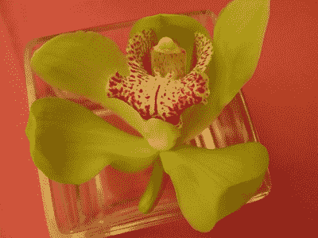
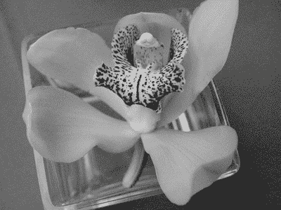
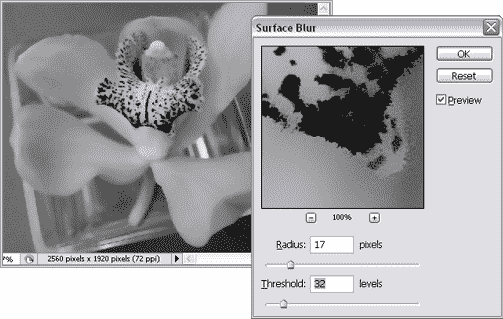
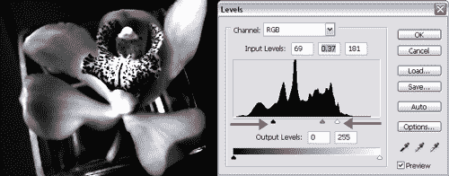
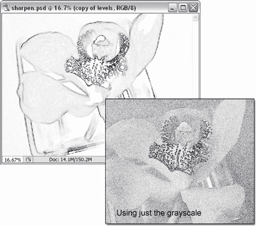
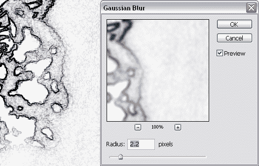
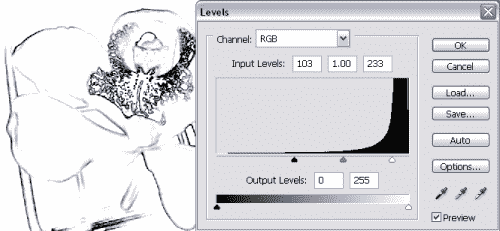
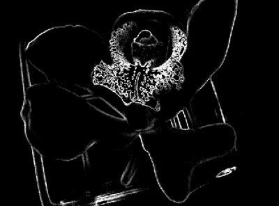
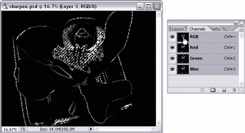
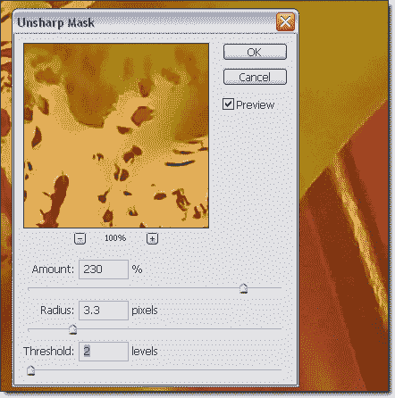

# 使用 Photoshop CS2 控制图像锐化

> 原文：<https://www.sitepoint.com/sharpening-photoshop-cs2/>

**如果你是一个 Photoshop 的普通用户，你很可能用过反锐化掩模滤镜(** **滤镜** > **锐化** > **反锐化掩模……**)。这是一种让照片看起来更平滑、更干净的简便方法，尤其是当照片由于应用了其他滤镜而变得柔和时。

但是，有时使用模糊蒙版滤镜可能不会产生令人满意的结果，例如，对于较大的图像或有噪声的图像。在本文中，我将带您完成一系列步骤，让您更好地控制模糊蒙版滤镜和应用它的图像区域。

我在本文中使用的 PSD 文件可以作为一个可下载的 zip 存档文件(7.5MB) 获得，如果你想在家一起玩的话。这是图像的样子。

*需要锐化的原始图像！*

正如你所看到的，这是一幅很好的画，但它失去了一些清晰。我们将通过这一系列步骤把它带回来。

**1。**在通道面板中，分别点击红色、绿色和蓝色层，找到对比度最大的通道。在这种情况下，绿色通道看起来效果最好。隐藏其他通道，只显示绿色通道，然后按 Ctrl-A(Mac 上的 Command-A)和 Ctrl-C (Command-C)来复制通道。

**2。**点击 RGB 图层返回全彩图像。返回图层面板，用 Ctrl-V (Command-V)粘贴。你现在应该有两个层:原始层，和一个灰度层。

*基于绿色通道的灰度图层*

接下来的几个步骤将平滑图像中的表面，并进一步增加对比度，所有这些都将在稍后帮助我们。

**3。**首先，通过键入 Ctrl-J(Mac 上的 Command-J)创建灰度层的副本作为备份。然后点击新建图层，选择**滤镜** > **模糊** > **表面模糊**。增加半径和阈值，直到大多数曲面变得平滑。

*使用表面模糊*

**4。**创建该图层的副本作为备份，选择**图像** > **调整** > **色阶**，或者按快捷键 Ctrl-L(Mac 上按 Command-L)。将图形正下方的黑色和白色滑块拖向中间，以增加对比度。如有必要，也可以拖动灰色滑块，直到图像在形状边缘具有尽可能高的对比度，但在表面上几乎没有变化。

*使用级别增加对比度*

**5。**创建该层的备份。现在，您将拥有原始颜色层、灰度层、模糊层、高对比度层和高对比度层的副本。

**6。**选择**滤镜** > **风格化** > **寻找边缘**。Photoshop 将自动运行滤镜并更改图层，以便定义边缘。如果前两个步骤应用得当，你现在应该有非常明显的优势。下图比较了将“查找边缘”滤镜应用于修改后的(模糊/色阶变化)图像的结果，以及将该滤镜应用于原始灰度图像的结果。你会希望你的图像看起来更像左边的。再次，复制这一层作为备份。

*使用查找边缘滤镜*

7 .**。**此时，如果您的图像仍然没有足够的对比度，您可能需要删除最后几个层，并通过重新应用表面模糊、色阶命令和查找边缘滤镜来重试。调整每一步的值，以达到高对比度的效果。当你对结果满意时，创建一个备份复制层。

**8。**接下来，选择**滤镜** > **模糊** > **高斯模糊**。增加半径，直到在“查找边缘”滤镜中创建的细小线条模糊成纯色。这也会模糊清晰的线条，但只要较暗的线条仍然可见(即使模糊)，你就不必担心。一旦你完成了，复制这一层。

*应用高斯模糊。*

**9。**再次使用 Ctrl-L(Mac 上的 Command-L)对新创建的图层应用 Levels 命令。向内移动图表正下方的黑色和白色滑块，直到轮廓非常清晰，浅灰色几乎全部变成白色。

*再次套用关卡。*

10。选中图层，按 Ctrl-I 反转图像(Mac 上按 Command-I)。在这个阶段，我们似乎只是在创作抽象的艺术品，但是请相信我——我们就快成功了！

*颠倒形象。*

**11。**打开通道调板，按住 Ctrl(Mac 上的 Command)点击 RGB 图层。这将基于该频道创建一个选择；你会看到白色区域周围的虚线。

*创建选择。*

**12。现在，回到图层面板，点击每个图层的眼睛图标，隐藏所有图层。然后单击眼睛图标显示原始层(最底层，这是我们开始工作的层)。在文档窗口中，您应该仍然可以看到所选内容的虚线。激活此选项后，进入**滤镜** > **锐化** > **反锐化掩模**，尝试设置直到图像看起来足够清晰。**

*应用模糊蒙版滤镜*

13。最后，点击 OK 应用过滤器。呼，我们完了！这种锐化技术的结果如下所示。

*最后锐化的图像*

##### 摘要

有时，简单地应用模糊蒙版滤镜并不能获得最佳效果，因为整个图像中的其他像素可能会受到不利影响。

在本文中，步骤 1-10(创建灰度图像，模糊图像，增加对比度，找到边缘，细化边缘，反转图像)的目的是创建图像轮廓的控制选择，以便我们可以应用模糊蒙版滤镜，只影响图像的边缘。用这一系列的步骤来实验和比较基本的反锐化掩模，我想你会发现额外的时间是值得的！

如果你喜欢这篇文章，一定要留意我的书，《Photoshop 选集:101 个网页设计技巧，诀窍&技术，这本书将于下个月出版。这是 SitePoint 的第一本全彩图书，像这本书一样，充满了 Photoshop 的技巧和技术，特别关注网页设计师。尽情享受吧！

## 分享这篇文章