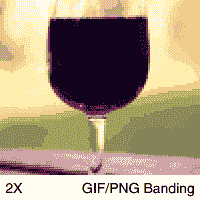
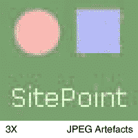
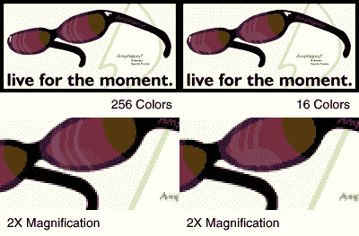
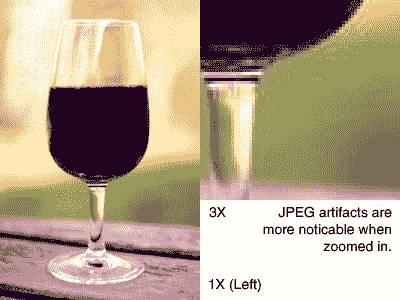

# 更清晰、更锐利的 GIF、JPEG 和 PNG 图像

> 原文：<https://www.sitepoint.com/sharper-gif-jpeg-png-images/>

虽然图片对于网站功能来说不是绝对必要的，但它有助于改善网站的外观。有了一些高质量、高度优化的图片，你可以给你的网站留下持久的印象。问题是，许多网站管理员，无论是新手还是有经验的，在创建外观整洁的图形并对其进行优化时，都没有信心。

在当今的网络上，GIF、PNG 和 JPEG 是最常见和最受支持的图像文件格式。但是应该用哪个呢？嗯，这个问题不多考虑几个是不可能回答的。在这篇文章中，我们将看看 GIF、PNG 和 JPEG 图像之间的一些重要区别，并讨论如何从所有的 Web 图形中获得最佳质量。

##### GIF 和 PNG 的斗争

GIF 和 PNG 格式是压缩包含纯色平面区域的图形和文本的理想格式。

***忠实的 GIF***

多年来，进出我们调制解调器的唯一数据是文本:ASCII 文本。从前，调制解调器的主要工作是发送和接收字母、数字和 66 种其他各种字符。

如果我们考虑到计算机图形显示器很少，调制解调器非常慢，传输一个句子需要 3 到 4 秒，这就不足为奇了。

GIF 文件格式是由 Compuserve 在 1987 年创建的，旨在将尽可能多的图像信息放入最小的空间。它使用无损压缩算法(LZW)，这在今天并不罕见。

GIF 文件中的颜色在调色板中被编入索引。最初，由于内存和速度的原因，计算机图形显示器一次只能显示一定数量的颜色。这些颜色被称为调色板。最初，图形适配器是双色的(黑白)。CGA 的图形模式最多可以达到 4 种颜色，EGA 给了我们令人印象深刻的 16 种颜色，VGA 一次达到惊人的 256 种颜色。图形卡显示的颜色不是由它们的实际颜色来标识的，而是由一个索引号来标识的，该索引号指的是调色板中的一种颜色。这节省了大量的展示空间，并且仍然允许使用多种颜色。

***巴新***

PNG 图像格式是作为 GIF 格式的继承者开发的。最初的首字母缩略词来自“PNG's Not GIF ”,尽管这种格式现在最广为人知的是便携式网络图形格式。

PNG 格式是在 1995 年针对 GIF 格式的两个主要问题而开发的。第一个也是最直接的问题是，1995 年，Unisys 和 Compuserve 宣布，基于 Unisys 拥有的一项关于 GIF 格式中使用的 LZW 压缩算法的专利，实现 GIF 图像格式的软件将需要支付版税。GIF 技术上不是免费的。GIF 格式的第二个问题是它的功能集有限，对具有 24 位颜色或 8 位 alpha 通道等功能的图像的需求正在增加。

PNG 支持比 GIF 更有效的压缩算法，没有专利，能够存储更多的图像格式，并包括一些漂亮的错误检查功能。当保存相同的 GIF 和 PNG 图像时，生成的 PNG 文件将比 GIF 文件小 5%到 20%。

从图形艺术家的角度来看，PNG 格式几乎与现有的 GIF 格式相同，但它提供了更好的压缩率，并支持 GIF 不支持的新格式。我现在在每一个我过去会使用 GIF 的场合都使用 PNG。

由于处理 GIF 和 PNG 图像的技术非常相似，我将在本文中把它们当作一种格式来讨论。创建 GIF 和 PNG 图像的技术基本相同。

##### 太空时代的 JPEG

JPEG 非常适合来自照片的图形，因为它在压缩看起来自然的图像方面非常有效。

JPEG 使用比 GIF 和 PNG 更复杂的图像压缩算法，需要图形设计人员更好的理解。与 GIF 使用的无损压缩相比，JPEG 相对较新。用于压缩 JPEG 的算法在最早的计算机上压缩或解压缩的时间太长了。

JPEG 实际上使用了一种“有损”算法。它不是像电脑一样记录图像，而是更像人类描述的那样记录图像。它寻找面积、图案和颜色，而不是简单地分别描述每个像素。

实际的压缩算法基于离散余弦变换(DCT)。这种数学变换类似于现在在电影声音、DVD 视频和普通 MP3 音频中使用的算法。

##### GIF 或 PNG 有什么用？

***强项:速度、锐度、纯色、透明度。***

因为 GIF 和 PNG 图像使用的压缩算法比 JPEGs 图像使用的算法简单得多，所以您的计算机解压缩和查看所需的时间更少。随着现代台式电脑的速度，这不再是它曾经是一个问题。

因为 GIF 或 PNG 的压缩是无损的，一旦保存，图像质量或清晰度绝对不会进一步下降。图像可以解压缩、编辑和重新压缩，仍然会像创建时一样清晰。

GIF 和 PNG 图像在纯色、连续的颜色上表现出色。这对于你的公司标志，或者网站导航中的实心区域和线条是非常理想的。纯色将完全不会出现振铃、方块或模糊现象。

GIF 和 PNG 都能够实现二进制透明。二进制透明度允许图像中的每个像素要么完全不透明，要么完全透明。图像的一个调色板条目保留给透明区域。该调色板索引的所有实例都是不可见的，而不是显示特定的颜色，从而显示图像前面显示的任何内容。当图像在你的站点上的许多不同的背景前重复使用时，这是很方便的。图像可以让背景“透出来”。

PNG 进一步扩展了 GIF 的功能。虽然 GIF 图像被限制为最多 256 种颜色的调色板，但 PNG 支持真彩色图像。PNG 还支持另一种透明形式，称为 alpha 透明，其中每个像素都可以有一种颜色和一定程度的透明度，让背景在某些区域显示出来。然而，这些附加的 PNG 特征有一些缺点，这将在下面讨论。

虽然过去浏览器对 PNG 图像的支持很低，但现在基本的 PNG 图像可以安全地用于所有现代浏览器，包括 Microsoft Internet Explorer(4.0 B1 和更高版本，Mac 和 PC)、Mozilla、Netscape (6.0 或更高版本)、Chimera (2.0 或更高版本)和 Safari。网景 4.04 支持 PNG，但是没有透明性。

***弱点***

事实上，GIF 或 PNG 文件格式的所有缺点都可以归结为两个因素之一:大小和调色板。

尺寸是一个明显的劣势。GIF 和 PNG 格式不擅长压缩复杂、自然的图像。除非图像已经专门针对这种格式进行了优化，否则一个非常大的图像占用的空间可能是相同区域的 JPEG 的 2 到 10 倍。这就是为什么除了特别适合这种格式的图像之外，GIF 和 PNG 通常只限于网络上较小的图像。

调色板，当用在网页图像中时，实际上有很大的好处。然而，如果没有很好地使用它们，它们可能是一场噩梦。如果 GIF 或 PNG 图像包含平滑的渐变或平滑的边缘，图形设计人员必须将该区域划分为有限数量的不同颜色，以适应 256 色调色板的限制。在最坏的情况下，这可能会导致过多的伪影，如抖动或条带。

不正确使用 GIF 或 PNG 格式。该图像被缩减为 16 色(无抖动),以显示条带假象。当过于复杂的图像被保存为调色板 GIF 或 PNG 时，就会出现这些假象。原始图像有柔和的渐变，所以 JPEG 在这里更合适。

通过使用 PNG 格式中可用的特性，可以避开调色板的限制，GIF 不支持 PNG 格式。然而，在为网络创建图像时，使用 PNG 的这两个新特性中的任何一个都是不切实际的，原因有两个。首先，微软的 Internet Explorer 浏览器对 PNG 的支持是有缺陷的，而且还不能像预期的那样显示 alpha 透明度。除此之外，在图像中使用真彩色图像格式或 alpha 透明度会消耗相当多的带宽，这使得它在互联网上的使用不切实际。目前，PNG 可以非常安全地用于调色板图像，就像 GIF 一样。

##### JPEG 一览

***优势:文件大小，颜色范围。***

JPEG 是一种非常好的格式，可以将自然的图像压缩成非常小的尺寸。在创建 JPEG 时，用户可以选择 JPEG 的质量级别，从而在文件大小和图像质量之间进行折衷。

因为 JPEG 使用自然的颜色，而不是调色板，所以它非常适合包含平滑或自然的颜色渐变、纹理和图案的图像，例如现实生活中的图像。JPEG 用于照片时表现出色，照片中的色彩区域平滑自然，相互融合。

***缺点:压缩伪影，速度快，缺乏透明度。***

JPEG 的压缩并不完美。事实上，对于某些类型的图像来说，它远非完美。作为一种有损压缩算法，存在一些压缩“假象”——解压缩图像中的微小缺陷。如果正确使用 JPEG 压缩，并且在正确的环境下，这些伪像根本不会被注意到。

错误使用 JPEG 格式。这已经被放大了 3 倍，以夸大 JPEG 人工制品的效果。文本周围可以看到蚊子噪声，蓝色方块内部可以看到 JPEG 块噪声。由于平面区域的颜色，这个图像应该是使用 GIF 或 PNG 压缩的。

JPEG 使用更复杂的压缩算法，自然这需要更多的计算时间。这通常不再是一个问题。JPEG 的另一个缺点是它不能包含透明区域。

##### 完美的 PNG

如果使用正确，GIF 或 PNG 图像总是会如你所愿。首先，你必须确定你使用的图像适合这种格式。

***如何判断一张图片是否适合 GIF 或 PNG 格式***

为网页保存图像时，最好使用调色板图像，而不是真彩色图像。这是因为调色板图像中的每个像素最多使用真彩色图像中像素带宽的三分之一。

这个调色板最多有 256 种颜色。因此，一个很好的经验法则是看着一幅图像，尝试并决定它是否会以一种有利的方式减少到 256 色或更少。当你做这个决定的时候，记住任何平滑的颜色渐变，或者平滑的阴影边缘，都必须被分成不同的色带，每个色带都需要一个调色板条目。只要稍加练习，就很容易判断一张图片是 GIF 格式还是 PNG 格式。

如果一幅图像是自然的，就像照片一样，它会有大量任意的颜色。在这种情况下，它作为 GIF 或 PNG 看起来不太好，除非它非常小。

***试试看***

请记住，无论您是将图像输出为 GIF、PNG 还是 JPEG 格式，您都需要确保保留一份未压缩图像的副本。将图像导出为 GIF、PNG 或 JPEG 格式只能作为图像发布前的最后一步，因为在此之后进一步编辑可能会明显降低图像质量。

保留未压缩图像的副本将允许您以后以不同的格式或颜色数量重新压缩图像。

***减少颜色数量***

当您以调色板格式保存图像时，您的图形应用程序会要求您减少颜色数量。大多数应用程序可以选择 256、16 或 2 种颜色来保存最终的 GIF 或 PNG。Adobe Photoshop 的“保存为 Web 格式”功能非常适合这一目的，因为它可以让您更好地控制完成的文件。Photoshop 将调色板 PNG 称为“PNG-8”，将真彩色 PNG 称为“PNG-24”。选择“PNG-8”或“GIF”压缩。

有两种方法可以减少图像中的颜色。一种是“最接近的颜色”或“无抖动”方法，其中图像的每个部分都与简化调色板中最接近的颜色相匹配。另一种方法叫做“抖动”或“误差扩散”。

使用抖动或误差扩散可能非常诱人。误差扩散在某些情况下看起来相当不错。然而，误差扩散的目的是通过用随机(或图案化)噪声“模拟”梯度来掩盖小调色板中的不足。

当你为网页显示优化 GIF 或 PNG 时，通常应该选择“最接近颜色”的方法。这将创建一个更小的文件，一个看起来更整洁的文件。如果使用这种方法图像看起来太带状，在尝试误差扩散之前，您应该考虑增加调色板的大小或使用 JPEG 压缩。

正确使用 GIF 或 PNG 格式。当我们将颜色数量减少到 16 种时，图像中的一些细节丢失了。最好用 16 色以上 256 色以下的颜色保存这个文件。

***自顶向下设计 GIF 或 PNG 图像***

如果您正在创建一个图像，并打算以后在 GIF 或 PNG 文件中使用，在完成创建图像之前，在创建阶段采取措施优化图像通常是一个好主意。例如，在创建图像时，最好避免过多的纹理或渐变。可以使用投影，但为了获得最佳效果，尽量不要将投影的边缘柔化超过两到三个像素。尝试使用几何的、立体的区域来设计，而不是柔软的边缘和复杂的细节。

##### 令人惊叹的 JPEG

对于更大、更自然的图像，JPEG 是一种很好的格式。它很灵活，比 GIF 图像需要更少的工作或预先考虑。总之就是好用。

你需要做的就是点击“保存”并选择“JPEG”来保存 JPEG。

***详细到什么程度？***

大多数应用程序会让您选择 JPEG 的压缩级别。这通常可以在同一个“另存为”对话框中找到。同样，Photoshop 的“保存为网页格式”功能在这方面很擅长。选择“JPEG”作为压缩方法。您可以使用预设或“质量”滑块来更改压缩级别。

因为 JPEG 是有损压缩格式，会减少图像中的一些细节。在网上获得最佳 JPEG 的诀窍是在视觉图像质量和文件大小之间取得最佳的折衷。压缩级别设置得越高，质量越低，文件越小。10 到 16 的压缩级别通常适用于 Web。在 Photoshop 中，这相当于 60 或 70 左右的质量水平。

你确定你使用了正确的格式吗？

一个最常见的错误是将 JPEG 用于更适合 GIF 格式的图像。通常，标识、文本、图表、标题或按钮等图像会使用有限数量的纯色清晰区域来构建。如果你的图形像这样简单，并且你使用 JPEG 格式，压缩假象很可能在图像的实心区域变得可见，尤其是周围的细节和线条。这有时被称为“蚊子噪音”或“铃声”，当然不是你希望出现在公司标志周围的东西！

如果您怀疑 JPEG 格式的不足之处会出现在图形的一些实心区域，请尝试使用 GIF 或 PNG 压缩该图像，并查看其比较结果(文件大小和质量)。

JPEG 格式的正确用法。当以正常尺寸观看时，这张图像看起来很合理，尽管当我们放大时可以看到一些蚊式噪声和阻挡。根据你的大惊小怪，你可能想提高这个 JPEG 的质量一点点。

##### 检查您的最终图像

为了全面评估您的图像，在您将图像转换为 GIF、PNG 或 JPEG 后，您需要在图形应用程序中重新加载图像，以确保您看到的是压缩的最终产品。确定您使用的电脑配置为显示 24 位颜色(真彩色)，以便您可以更好地看到图像的实际特征。

***放大！***

使用缩放工具，寻找可以纠正的小细节。在 GIF 或 PNG 文件中，查找条带。如果您确实使用了误差扩散，请在高倍变焦下检查图像区域，以确保大的实心区域中没有噪点。噪波应该只出现在渐变区域或有细节的区域。在 JPEG 文件中，寻找实心区域中的环状伪像。请记住，JPEG 文件已经过优化，在 100%缩放时看起来最好，因此当您进一步放大时，质量下降变得更加明显并不罕见。仔细检查图像会让你很好地了解压缩应该增加还是减少，但请记住，当以 100%的缩放比例观看时，振铃或蚊式伪像不会那么明显。

***尝试其他格式***

我强烈建议您在检查完最终压缩后的图像后，回到未压缩的图像，看看是否可以尝试不同的格式、颜色数量或质量。为了获得最佳质量和高度优化的图像，我经常发现自己尝试了许多不同的格式，才感到满意。

##### 结论

在本文中，我们讨论了 GIF、PNG 和 JPEG 图像的一些基本概念。关于这些格式，还有很多东西需要学习，比如 GIF 和 PNG 图像的透明度，颜色与背景或单元格颜色的匹配，以及使用自定义调色板。除此之外，我们可以用 PNG 做一些 GIF 做不到的事情。

然而，我希望我已经给出了一个合理的介绍来优化 GIF、PNG 和 JPEG 图像。祝你好运！

## 分享这篇文章