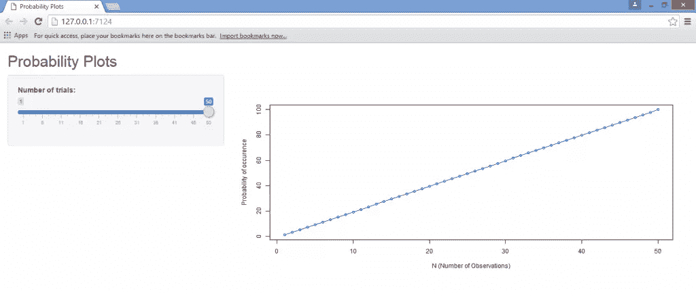
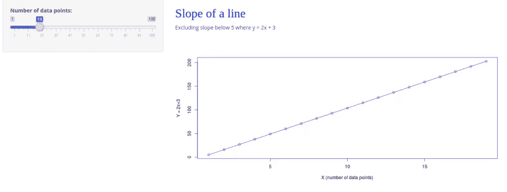
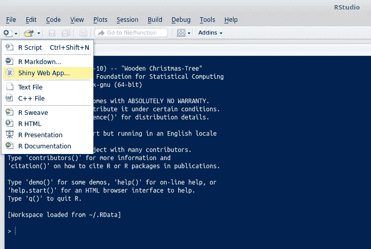
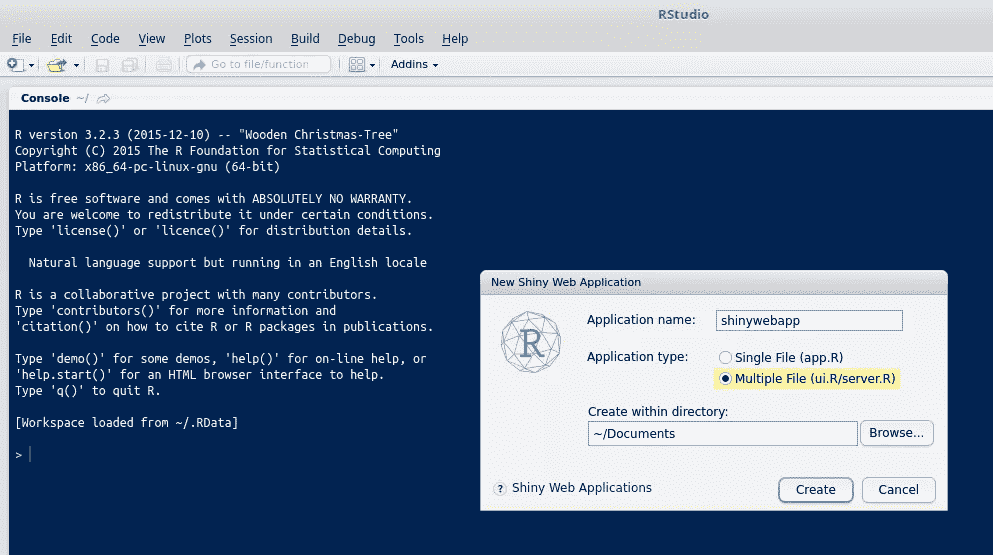
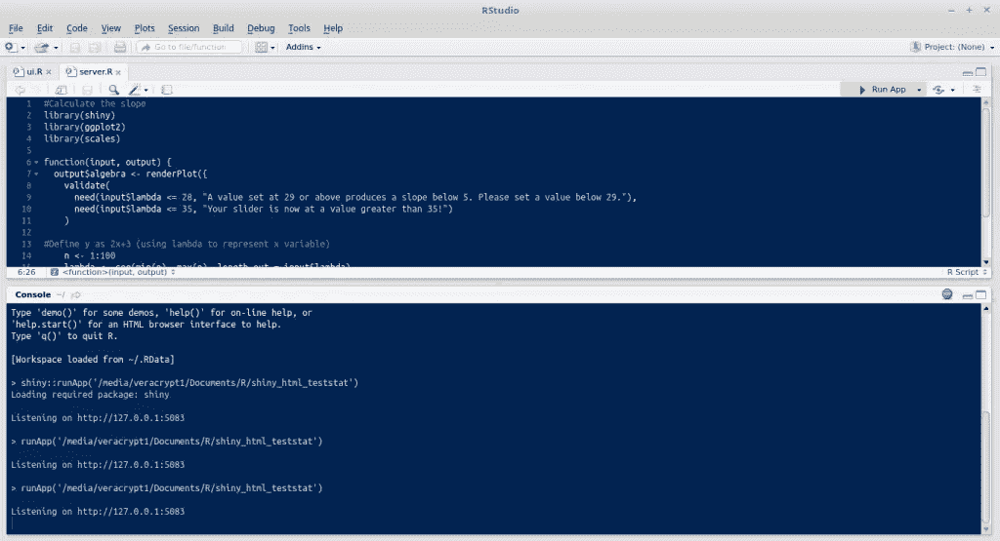
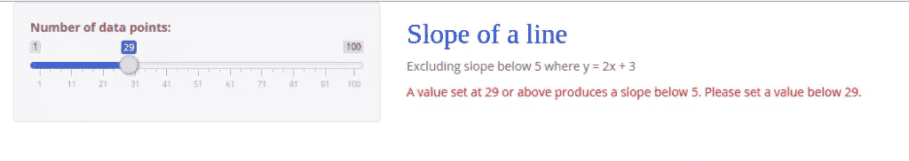
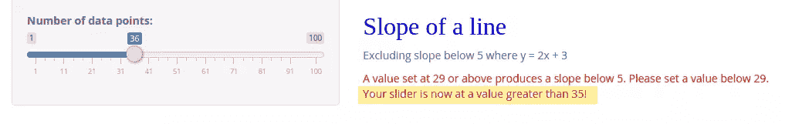

# Shiny 和 R:如何添加主题和定制错误消息

> 原文：<https://www.sitepoint.com/shiny-and-r-how-to-add-themes-and-customize-error-messages/>


Shiny 的目的是为 R 提供一个直观和用户友好的界面。R 是一个非常受欢迎的统计环境，用于进行繁重的数据分析和构建统计模型，因此在数据科学家中非常受欢迎。然而，对于一个没有编码背景的用户来说，使用 R 来进行这样的分析可能会变得相当密集。这就是闪亮的网络应用的用武之地。本质上，Shiny 允许更直观的图形用户界面，仍然能够进行复杂的数据分析，而不需要终端用户进行大量的编码。

在我关于使用 Shiny with R 和 HTML 的文章中，我展示了如何创建一个交互式 web 应用程序来进行分析，而不需要直接操作代码。在本文中，我将使用一个略有不同的模型来说明如何定制 Shiny 环境，以更直观的方式与最终用户一起工作。本质上，本文的目标是说明用户如何能够:

1.  通过链接 UI 和服务器端来构建应用程序
2.  如何定制闪亮主题库中可用的主题
3.  实现错误消息，以便为最终用户提供如何使用特定程序的指导

为本教程开发的程序本身非常基本:滑块输入允许用户通过反应性来操纵程序中的变量，这导致通过反应性开发的线图输出的瞬时变化。

这种固有的功能使 Shiny 比单独使用 R 代码具有显著的优势。传统上，为了分析特定变量的变化，必须直接操作代码(或代码读取的数据)，这最终会变得非常低效。然而，Shiny 允许用户以高度直观的方式操纵变量，从而大大加快了这个过程，并且变化会立即反映出来。

但是，Shiny 的整个目的就是让一个 R 脚本尽可能的**交互**。在这方面，用户将希望能够向程序添加远远超出反应性的特性。我将在本教程中讨论的两个方面是:

1.  使用`shinythemes`来定制我们闪亮的外观
2.  构建一个`validate()`函数，以便在变量以某种方式被操纵时显示一个警告

## 闪亮的主题

在我们最初程序的 UI 中，我们没有指定主题，因此最终得到了一个非常基本的(默认引导)输出视图:



当我们定义`shinyUI(fluidPage(…))`函数时，我们没有指定主题。在这个例子中，我们将从[闪亮主题](https://rstudio.github.io/shinythemes/)包中指定几个可用的主题。

在我们指定了`shinyUI(fluidPage(…))`之后，我们还指定了我们的主题如下:

```
shinyUI(fluidPage(theme = shinytheme("cyborg") 
```


从上面，我们看到选择**电子人**主题给了我们的网络应用一个黑暗的背景。作为另一个例子，现在让我们选择**太空实验室**主题，看看我们会想到什么:



这些主题展示了更多级别的定制，这取决于闪亮代码中的其他属性，如附加按钮、选项卡等。在 [RStudio GitHub](https://rstudio.github.io/shinythemes/) 帐户上随意尝试其他主题，看看你能想到什么！

## 验证()函数

validate 函数是处理闪亮代码时不可或缺的工具。本质上，validate 允许在 Shiny 程序的某个部分被操作时触发一条警告消息。

在这个特殊的例子中，我讨论了当我们在程序中操作滑块时，如何使用`validate`和`need`函数来触发警告消息。

程序本身，和上次一样，就其功能而言是非常基本的。本质上，我们闪亮的程序在 X 轴上产生一个 1 到 100 之间的值，这取决于滑块的选择。

然后，每当计算出的斜率低于 5 °,即值为 29 或更大时，我们使用相应的 y 值产生一条**错误消息**。请注意，程序不是直接计算斜率，而是用户在本例中使用值 29 作为基于手动计算的斜率的截止点。

在用户界面中，我们在 shinyUI 下指定验证触发器，如下所示:

```
shinyUI(fluidPage(theme = shinytheme("spacelab"),
tags$head(
  tags$style(HTML("
    .shiny-output-error-validation {
    color: red;
    }
    "))
), 
```

在服务器下，我们在`input-output`功能下指定`validate`和`need`命令:

```
function(input, output) {
  output$algebra < - renderPlot({
    validate(
      need(input$lambda <= 28, "A value set at 29 or above produces a slope below 5\. Please set a value below 29.")
    ) 
```

## 完整程序代码

**UI** 和**服务器**代码整体显示如下:

### 用户界面

```
#Load libraries
library(shiny)
library(shinythemes)

#Define Shiny theme and specify shiny-output-error-validation
shinyUI(fluidPage(theme = shinytheme("spacelab"),

tags$head(
  tags$style(HTML("
    .shiny-output-error-validation {
    color: red;
    }
    "))
),

sidebarLayout(
  sidebarPanel(
    sliderInput("lambda",
      "Number of data points:",
      min = 1,
      max = 100,
      value = 1)
),

mainPanel(
  h3("Slope of a line", style = "font-family: 'Jura'; color: blue; font-size: 32px;"),
  HTML("<p>Excluding slope below 5 where y = 2x + 3"),
  plotOutput("algebra")
)
)
)) 
```

### 计算机网络服务器

```
#Load libraries
library(shiny)
library(ggplot2)
library(scales)

#Define validate function
function(input, output) {
  output$algebra <- renderPlot({
    validate(
      need(input$lambda <= 28, "A value set at 29 or above produces a slope below 5\. Please set a value below 29.")
    )

#Define y as 2x+3 (using lambda to represent x variable)
    n <- 1:100
    lambda <- seq(min(n), max(n), length.out = input$lambda)
    plot((2*lambda)+3, type = "o", col = 'blue',
         fg = 'blue', xlab= "X (number of data points)", ylab = "Y = 2x+3")
  })
} 
```

简单回顾一下，我们通过以下方式运行该计划:

*   打开 R Studio，选择**新图标** → **闪亮的网络应用**



*   我们看到，我们可以选择单个文件(带有`UI.R`和`server.R`)，或者多个文件(其中`UI.R`和`server.R`在不同的脚本中)。这里我们将使用**多个文件**。



*   现在，我们将上面的 UI 和服务器代码粘贴到它们各自的部分，并通过选择 **Run App** 来运行程序。



我们看到，根据我们操作滑块的方式，我们的折线图在 x 轴上的数据点中增长。但是，您会注意到，一旦滑块移动到 29 或更高的值，就会显示错误消息，**“设置为 29 或更高的值会产生低于 5°的斜率。请设置一个小于 29"** 的值。



当开发者希望指导外部用户使用这样的程序时，显示这样的错误消息会非常有用。例如，如果不显示错误消息，那么用户可以自由地向程序中输入不一定合适的信息。通过这种方式，开发人员可以针对外部用户的无意输入提供进一步的保护，而只在 R 代码中这样做会使输入容易被操纵。

例如，[闪亮的网站](http://shiny.rstudio.com/articles/validation.html)本身给出了一个如何将`validate`函数应用于列表的例子。UI 和服务器产生一个直方图作为输出，但是当在列表中选择一个特定的数据集时，程序产生一个错误消息。通过这种方式，`validate`命令就可以做到这一点——验证特定的输入，而`need`函数则允许我们通过定制错误消息来个性化相同的输入——也就是说，`input$lambda <= 28`，**“值设置为 29 或更高会产生低于 5 的斜率。请设置一个低于 29 的值。**

此外，虽然我们只指定了一个错误消息，但是我们也可以指定多个错误消息。例如，现在让我们假设当滑块的值超过 35 时，我们希望显示一条额外的错误消息:

```
function(input, output) {
  output$algebra <- renderPlot({
    validate(
      need(input$lambda <= 28, "A value set at 29 or above produces a slope below 5\. Please set a value below 29."),
      need(input$lambda <= 35, "Your slider is now at a value greater than 35!")
    ) 
```

在服务器代码中使用一个额外的`need`函数，操作滑块到一个大于 35 的值意味着我们现在显示额外的错误消息，**“你的滑块现在是一个大于 35 的值！”**



## 结论

在本文中，我们已经看到了如何使用闪亮的主题来操作我们闪亮的应用程序的设计，并学习了如何对代码的参数应用过滤器，以及在违反某些条件时显示错误消息。

最终，Shiny 的重点是在进行分析时提供比单独使用 R 更好的用户友好和直观的体验，并且通过正确指定特定程序的参数，将用户输入错误的风险降至最低。

## 分享这篇文章