# 展示:滚动作为创新设计工具的 20 个例子

> 原文：<https://www.sitepoint.com/showcase-20-examples-of-scrolling-as-an-innovative-design-tool/>

滚动通常被认为是一种平凡的设计需要，但是一些创新的网页设计师不仅仅将滚动作为典型的页面导航的一部分，而是将它融入到设计本身中。一些设计师正在创建相当简单的网站，使用你的浏览器画布大小来创建“幻灯片”,你可以通过滑动来查看所有的内容。一些极具创造力的设计师正在尝试创新的、非正统的滚动技术:使用滚动来触发动画，用滚动来讲述故事般的叙事，甚至用视差滚动效果来创造深度——滚动时背景图像比前景图像移动得更慢。

这里展示了 20 种极不寻常的滚动技巧，帮助你培养自己的滚动技巧。

### 真实工作慈善组织:水

[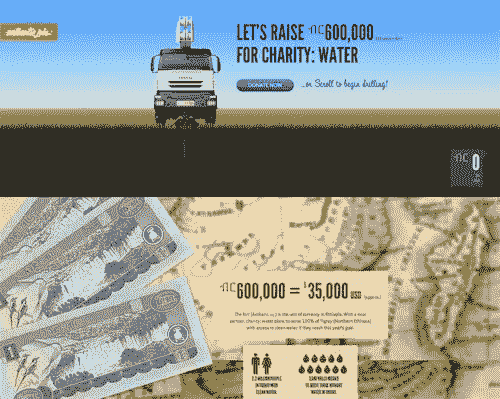](http://www.authenticjobs.com/six/)

### 博尔德数字工厂

[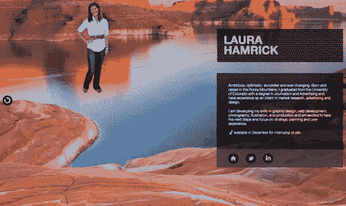](http://bdw3.com/)

### 耐克美好世界

[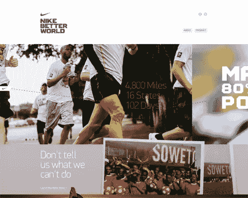](http://www.nikebetterworld.com/)

### 啤酒营 2011

### 苏黎世 lang strasse 360 号

### 银河应用指南

[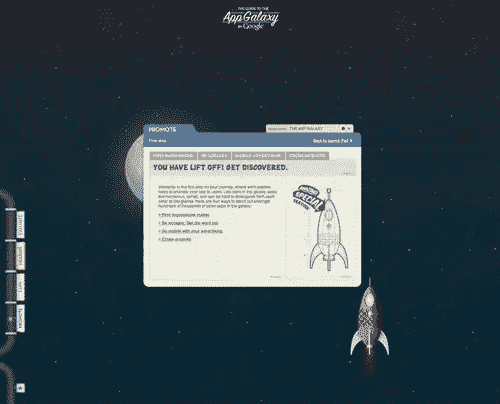](http://www.guidetotheappgalaxy.com/#/developersguide/)

### Pixelschupser 媒体设计

[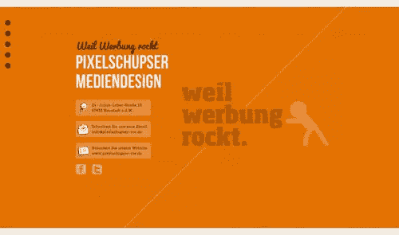](http://www.werbungrockt.de/)

### 展开

[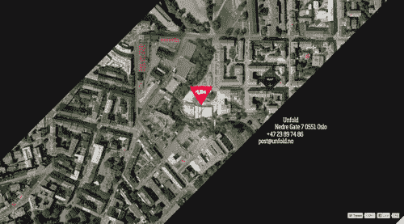](http://unfold.no/)

### 保镖本

[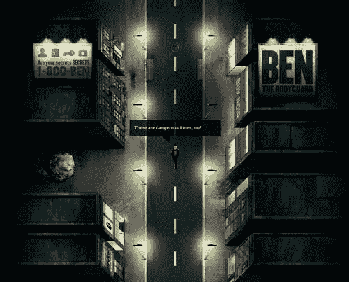](http://benthebodyguard.com/index.php)

### 优质橱柜

[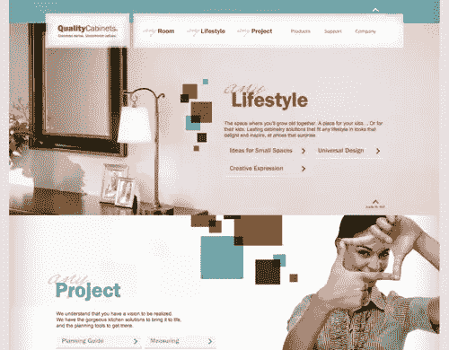](http://www.qualitycabinets.com/)

### XS 巴尔的摩

[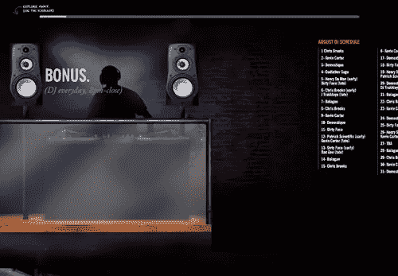](http://www.xsbaltimore.com/)

### 香肠和啤酒

[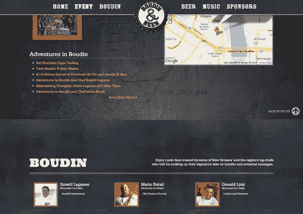](http://boudinandbeer.com/)

### 厄伯拉松的孩子

[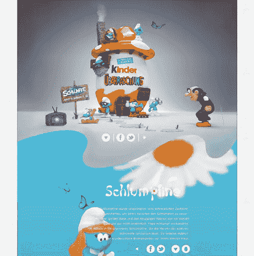](http://www.kinderueberraschung.de/index2.html)

### 《替用礼文书》

[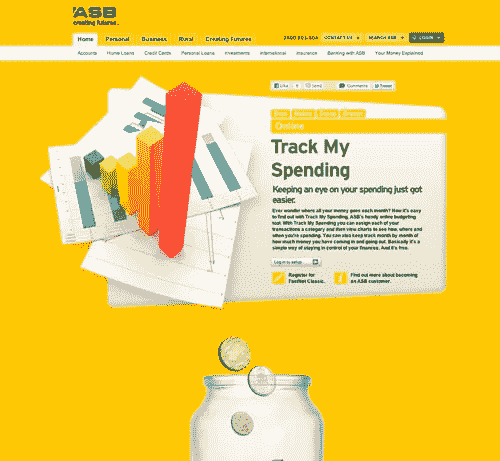](http://www.asb.co.nz/futureready/online.aspx)

### 塞萨尔湖

[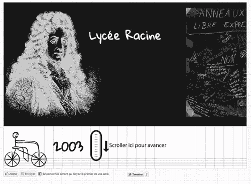](http://www.cesar.lc/cv)

### 失落的世界博览会:亚特兰蒂斯

[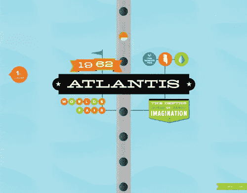](http://lostworldsfairs.com/atlantis/)

### 丹纳-斯顿普顿

[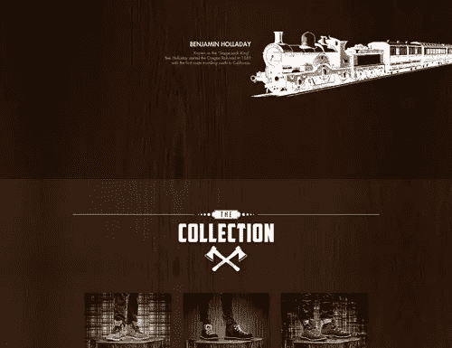](http://stumptown.danner.com/)

### 使活动

[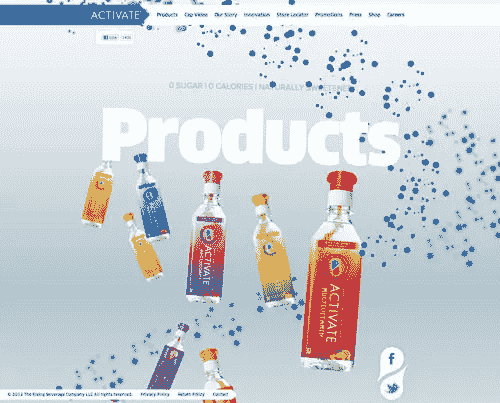](http://activatedrinks.com/)

### 22 火星

[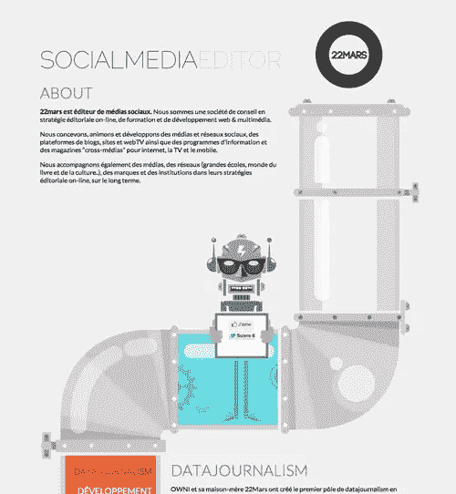](http://22mars.com/en)

### 拼字塔

[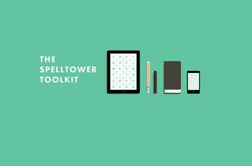 ](http://www.spelltower.com/) *你有最喜欢的例子吗？你在自己的项目中创造了一些有趣的滚动吗？你认为滚动是一个平凡的设计必需品，不应该被玩弄，还是你认为它是一个未被充分利用的机会来做出更具创新性的设计？* 

## 分享这篇文章