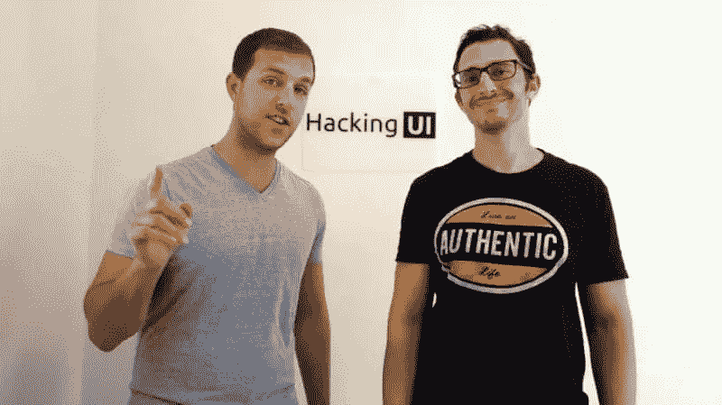

# 把你的兼职项目变成一份全职工作:入侵 UI 的技巧

> 原文：<https://www.sitepoint.com/side-project-full-time-gig-hacking-ui/>

Hacking UI 和 Side Project Accelerator 联合创始人 David Tintner(左)和 Sagi Shrieber(右)。图:黑 Ui

这篇文章是一个名为 [Startup Spotlight](https://www.sitepoint.com/startup-website-examples/) 的新系列的一部分，在这个系列中，我们关注成功的企业家和正在席卷网络行业的新兴创业公司。

“成功不会在一夜之间发生，”当被问及对那些希望将副业变成全职工作的人有什么建议时，大卫·廷特纳回答道。

> “我和很多从事副业的人交谈过……他们相信他们会在几周内创造出一些东西，它会爆炸，然后赚上百万。这种情况几乎从未发生过。”

大卫·廷特纳(David Tintner)居住在以色列，是黑客 UI(T1)和 T2 辅助项目加速器(T3)的幕后策划者之一，这两个项目取得了巨大成功，旨在告知、启发和展示不断发展的技术世界。这对创意组合的另一半是萨基·施里贝尔(Sagi Shrieber)，廷特纳是在他们一起成为另一家名为 Moolta 的初创公司的联合创始人时认识他的。

虽然 Hacking UI 是一本数字杂志，还有它自己的[播客系列](http://hackingui.com/podcast)和定期发布的[时事通讯](http://hackingui.com/sign-up/)，但 Side Project Accelerator 是一门为期八周的课程，教你如何将你的副业变成全职工作——这是许多新兴企业家的梦想。

Tintner 说，当他和 Shrieber 决定创建一个从 Photoshop 中导出 SVG 文件的脚本时，构建黑客 UI 的“灯泡时刻”到来了。当时，这个困扰设计师和开发人员的永无止境的问题没有解决方案，所以，当然，这两位科技企业家自己解决了这个问题。

“我们写了剧本，以及几篇关于它和我们工作流程的文章，公开发布供免费下载，”他说。

Hacking UI 是一个面向充满热情的设计师、开发人员和创意企业家的社区。图:黑 UI

当这个脚本开始在网络世界获得牵引力时，类似的脚本开始出现，有些甚至卖到 20 美元。虽然廷特纳和施里伯本可以效仿，但他们认为剧本的盈利能力是有期限的，所以把它作为免费提供。

“你看，这笔钱在短期内会是一笔不错的额外收入，但是当 Photoshop 的下一个版本出来并内置了 SVG 导出功能时，这个脚本就变得不那么重要了。他在发表于 Hacking UI 的一篇[文章中写道:“我们可能已经停止在这上面赚钱了，而且可能已经回到了我们开始的位置。”。](http://hackingui.com/side-projects/the-best-decision-we-ever-made/)

相反，他们通过撰写信息丰富的文章、管理链接以及开发工具和资源来帮助自己项目的忠实追随者，从下载了他们的 SVG 脚本的人那里建立了他们的受众。

稳定地建立他们的观众群也帮助他们快速地从黑客 UI 中获利。事实证明，在简讯中销售广告空间非常有益，这一策略后来扩展到了[主网站](http://hackingui.com/advertise/)和[播客](http://hackingui.com/podcast/)。快进到现在，[课程](https://sideprojectaccelerator.com/newsletter-course)正在制作中，以帮助观众创建他们自己的成功的带有策划链接的每周时事通讯。

但这一切都是阳光和彩虹吗？肯定不是。全职工作、家庭责任以及生活中的其他一切通常会抛给你，他们发现很难找到时间来做这些。

“我们通过两种方式克服了这一挑战。首先，我们在日历上安排了时间，并坚持执行……只有在绝对必要的情况下，我们才会跳过。[其次],我们在自动化和建筑系统上投入了大量资金，以使我们的工作更加轻松。我们编写了大量的脚本，使用了各种服务，开发了各种工具，并找到了将几乎所有可重复任务自动化的方法。”

> “我能给任何从事副业的人的最重要的建议之一就是投资自动化。这在前期需要时间，但从长远来看，每 5 或 10 分钟你都可以在这里或那里节省宝贵的时间。”

虽然全职从事黑客 UI 工作的转变是一个缓慢的过程(在 Tintner 和 Shrieber 全职从事在线杂志之前，该杂志是一个兼职项目长达三年)，但一致性是该项目的整体成功的关键因素。

伴随着这种动力，在尝试了不同的内容货币化方式后，他们发现有些策略每月的收入超过了 1 万美元。有机地扩大受众使他们两个都比 SVG 脚本赚了更多的钱，体现了对受众诚实的重要性。

“永远不要失去观众的信任。这听起来很简单，但随着你开始扩大你的品牌和受众，你将面临许多诱人的提议，需要做出决定，比如拒绝金钱，或者不做某些类型的促销，或者其他各种可能导致受众不相信你的事情。”

“从长远来看，维持观众的信任对你的品牌至关重要，如果你失去了它，你可能永远也找不回来了。”

Sagi Shrieber 与来自辅助项目加速器计划的学生在一起。照片:侧面项目加速器

事实上，正是他们透明的诚实(以及与之保持一致的受众)让廷特纳和施莱博在企业家世界中不可小觑，为他们的另一项努力铺平了另一条成功之路 Side Project Accelerator，这是他们第一个直接销售给受众的产品。

丁特纳说:“我们创建这个项目是为了给那些刚开始做副业的人提供我们希望在开始做副业时就能得到的所有信息和资源。”。

> “就成功故事而言，一名成员在阅读了他在节目中写的几篇文章后，被他试图为之工作的公司录用了。另一名成员将老板给他加薪归因于他在项目上所做的工作以及围绕项目所做的推广，比如播客和文章。

“但最重要的是，每个成员现在都有一个在互联网上称之为‘家’的平台，在那里他们可以分享自己的想法，表达自己，并扩大自己的受众。”

尽管同时从事两个主要项目的平衡工作，Tintner 和 Shrieber 没有表现出停止的迹象，因为他们继续通过 [Hacking UI Master Class 系列](https://www.crowdcast.io/e/masterclass/register)发展 Hacking UI，邀请设计、开发和技术方面的最佳专家来讨论新想法。

“我们在辅助项目加速器上投入了大量时间，真的希望与每个成员密切合作，以确保他们成功。我们计划围绕它开发许多新项目，并在每一批新项目中继续改进它。至于侵入用户界面，我们正在继续创造新的内容，我们也非常关注我们的[播客](http://hackingui.com/podcast)。

## 大卫给新兴企业家的最佳建议

“记住，对于一个副业项目，你已经在时间和金钱上捉襟见肘了。注意小的成功，并注意增量改进。保持一致，即使看起来你没有取得进展，也要相信你正在做的事情，或者干脆不做。”

***了解更多关于 [Hacking UI](http://hackingui.com/) 和 [Side Project Accelerator](https://sideprojectaccelerator.com/) 这里。你也可以在这里注册他们的[大师班系列](https://www.crowdcast.io/e/masterclass/register)。***

Hacking UI 和 Side Project Accelerator 联合创始人 David Tintner(左)和 Sagi Shrieber(右)。图:黑 UI

## 分享这篇文章