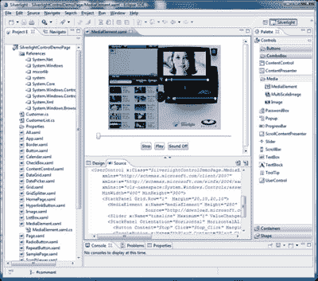

# Silverlight 2.0 扩展。NET 支持，添加控件

> 原文：<https://www.sitepoint.com/silverlight-20-expands-net-support-adds-controls/>

Adobe Flash 10 并不是本周发布里程碑版本的唯一主要 web 运行时。微软的 Flash 竞争对手， [Silverlight](http://silverlight.net/) ，昨天正式发布了 2.0 版本。

Silverlight 2 发布之前，微软跨浏览器富媒体和 RIA 插件经历了一个非常好的夏天，在一些成功的公开部署之后，它的采用率迅速上升。[据微软](http://www.microsoft.com/presspass/press/2008/oct08/10-13Silverlight2PR.mspx)称，Silverlight 在一些国家的市场渗透率已经接近 50%，这在很大程度上归功于他们快速增长的开发者生态系统。微软表示，今年夏天 Silverlight 在 NBCOlympics.com 的在线奥运视频报道(可能是迄今为止最大的一次)获得了 13 亿次页面浏览，7000 万个视频流和 6 亿分钟的视频观看，并将 Silverlight 在美国的渗透率提高了 30%。

Silverlight 还处理了今年民主党全国代表大会的视频，由于美国总统竞选的高调性质，这是历史上收视率最高的视频之一。微软表示，CBS 大学体育网每年使用 Silverlight 传输超过 20，000 小时的直播内容。

微软已经为他们的插件签署了一份令人印象深刻的公司开发合作伙伴名单，即将推出的应用来自 Blockbuster、Hard Rock Cafe、CBS、AOL、Yahoo！日本和丰田。

## Silverlight 2 有什么新功能？

Silverlight，本质上是微软对 Flash 的回应:一个跨平台的浏览器插件，支持交付富媒体内容和开发。NET 的富 Internet 应用程序，为版本 2 添加了许多引人注目的新功能。

*   文本渲染在 Silverlight 2 中得到了改进。[微软 Silverlight 项目经理 Tim Heuer](http://timheuer.com/blog/archive/2008/10/14/silverlight-2-released-officially.aspx) 表示，文本是他们将继续关注和改进的领域。
*   Silverlight 控件包–Silverlight 2 增加了一系列内置控件，帮助开发人员快速构建新的应用程序。via Scott Guthrie:“Silverlight 2 版本包括核心表单控件(文本框、复选框、单选按钮、组合框等)、内置布局管理面板(堆栈面板、网格、面板等)、通用功能控件(滑块、滚动查看器、日历、日期选择器等)和数据操作控件(数据网格、列表框等)。”计划是在接下来的几个月里继续发布新的控件，并最终拥有 100 多个。
*   **网络支持**—“开箱即用的支持允许调用 REST、WS*/SOAP、POX、RSS 和标准 HTTP 服务，使用户能够创建易于与现有后端系统集成的应用程序，”微软的新闻稿说。
*   **扩大了。NET 框架支持**——RIA 现在可以使用任何。NET 语言，包括 C#，JavaScript，VB，IronRuby，IronPython。
*   深度变焦(Deep Zoom)–微软正在大肆宣传 Silverlight 中的新“深度变焦”功能，该功能本质上是一种控制，允许在没有太多加载时间的情况下平滑缩放和平移超高分辨率图像。这很酷，但看起来它只有有限的、小众的吸引力，这让我想知道为什么它被包含在插件中这么低的级别。

Blockbuster 的首席信息官基思·莫罗(Keith Morrow)在一份新闻稿中说:“我们希望建立一个先进的、丰富的互联网应用程序，使我们的客户能够搜索我们庞大的内容和元数据数据库，以便他们可以访问电影评论，观看高质量的电影预告片，并从我们新的 MovieLink 应用程序中租赁或购买电影。”因为 Silverlight 2 现在包含了几个新的丰富控件，如数据网格和高级皮肤功能，以及对。NET 框架，允许我们访问我们现有的 Web 服务，我们能够轻松地保持 Blockbuster 品牌的高标准，并在创纪录的时间内将应用程序推向市场。”

微软也在宣传他们对 Silverlight 2 的“开放性和互操作性”的承诺。他们将资助一个项目，将 Silverlight 开发功能添加到开源 Eclipse IDE 中，将在开源许可下发布 Silverlight 控制包，并计划发布 Silverlight XAML 词汇表规范。

正如我们[上个月](https://www.sitepoint.com/microsoft-announces-h264-support-for-silverlight/)报道的，微软已经在开发 Silverlight 3，它将支持 h.264 和 AAC 音频。

## 分享这篇文章