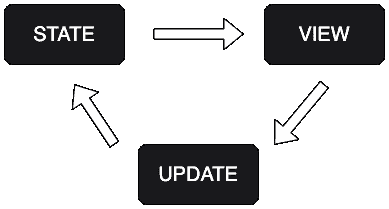

# 使用保姆状态在 JavaScript 中进行简单的状态管理

> 原文：<https://www.sitepoint.com/simple-state-management-nanny-state/>

Nanny State 是一个很小的库，我写它是为了让使用普通 JS 构建基于状态的 web 应用变得容易。它类似于 React，但是开销少得多，而且需要学习新的语法。它还使用单个应用程序范围的状态对象，而不是每个单独的组件都有自己的状态。它的灵感来自 HyperApp，与 Elm 有很多相似之处。

在这篇文章中，我将解释保姆状态是如何工作的，然后用几个例子来演示它能做什么。

# 单向数据流

Nanny State 使用单向数据流模型，由 3 部分组成:

*   **状态**–存储所有应用数据的对象
*   **视图**–基于当前状态返回 HTML 字符串的函数
*   **更新**–这是改变状态和重新渲染视图的唯一方法



在保姆州，州就是一切。状态对象是你的应用的唯一来源——应用的每一点数据都是这个对象的属性。甚至视图中使用的事件处理程序也是状态对象的方法。

视图是 HTML 形式的状态表示。它会随着状态的变化而变化，并允许用户与应用程序进行交互。

更新功能是改变状态的唯一方法。它是更新状态的单一入口点，并确保更改具有确定性、一致性和可预测性。

这三样东西是你在保姆状态下构建一个应用所需要的。事实上，可以通过问自己以下三个问题来总结:

1.  我需要在我的应用程序中存储哪些数据？这将构成`State`对象的属性
2.  我希望应用程序数据如何呈现在页面上？这将帮助您创建`View`函数
3.  用户与之交互时，app 数据会有怎样的变化？为此将需要`Update`函数

## 你好保姆州！

要了解保姆状态是如何工作的，最简单的方法就是编写一些代码！我们将从一个基本的例子开始，然后试着做一些更复杂的东西。

运行下面的例子最简单的方法是使用在线代码编辑器，比如 CodePen，或者您可以通过使用 NodeJS 安装`nanny-state`包在本地运行它。

将以下代码复制到 CodePen 的 JS 部分:

```
import { Nanny,html } from 'https://cdn.skypack.dev/nanny-state';

const View = state => html`<h1>Hello ${state.name}</h1>`

const State = {
  name: "Nanny State",
  View
}

const Update = Nanny(State) 
```

这显示了保姆式国家的三个部分是如何协同工作的。让我们分别仔细看看每个部分:

```
const View = state => html`<h1>Hello ${state.name}</h1>` 
```

保姆状态使用 [html](https://github.com/WebReflection/uhtml) 渲染 html。`View`函数*总是*接受状态对象作为其唯一的*参数*。然后，它使用 html 提供的`html`函数，根据作为参数提供的模板文字创建 HTML。

使用模板文字意味着我们可以使用`${variable}`符号将状态属性插入到视图中。在这个例子中，我们用它在`<h1>`元素中插入`name`属性的值。

```
const State = {
  name: "Nanny State",
  View
} 
```

对象是存储所有应用程序数据的地方。它包括将在`View`中显示的任何属性和值，并且可能在应用程序的生命周期中发生变化，例如本例中的`name`属性。

注意，`View`也是使用对象简写符号的`State`的一个属性。记住*国家就是一切*——应用程序的每个部分都是国家的财产。

```
const Update = Nanny(State) 
```

最后一行将`Update`函数定义为`Nanny`函数的返回值。这现在可以用来更新`State`的任何属性的值。事实上，这是唯一可以更新`State`属性的**方式。它还根据`State`中提供的值执行`View`的初始渲染。这意味着将显示一个标题“Hello Nanny State ”,如下面的代码栏所示:**

见 [CodePen](https://codepen.io) 上 DAZ ( [@daz4126](https://codepen.io/daz4126) )的笔[保姆邦——你好保姆邦(SitePoint)](https://codepen.io/daz4126/pen/vYdMVmG) 。