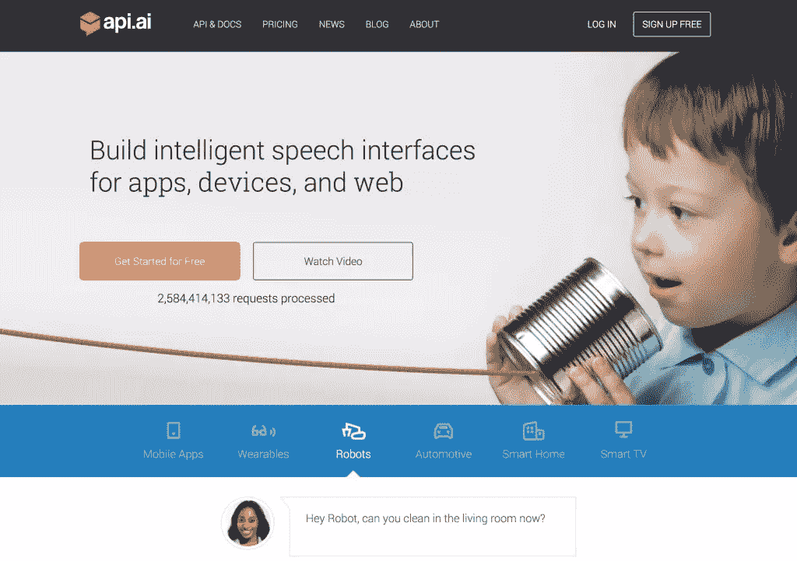
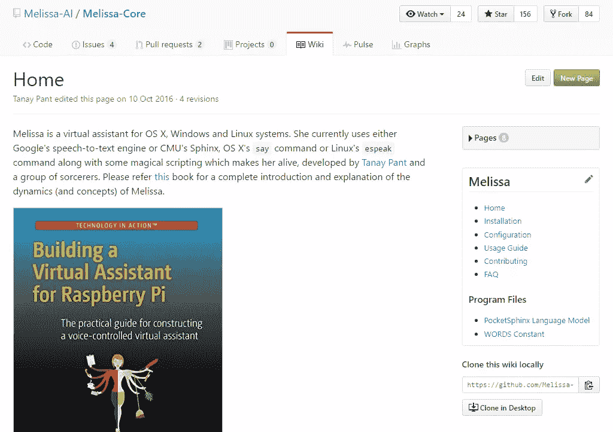
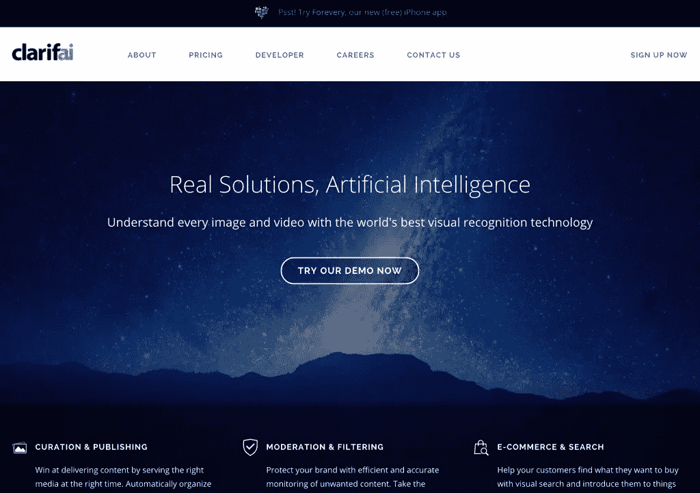
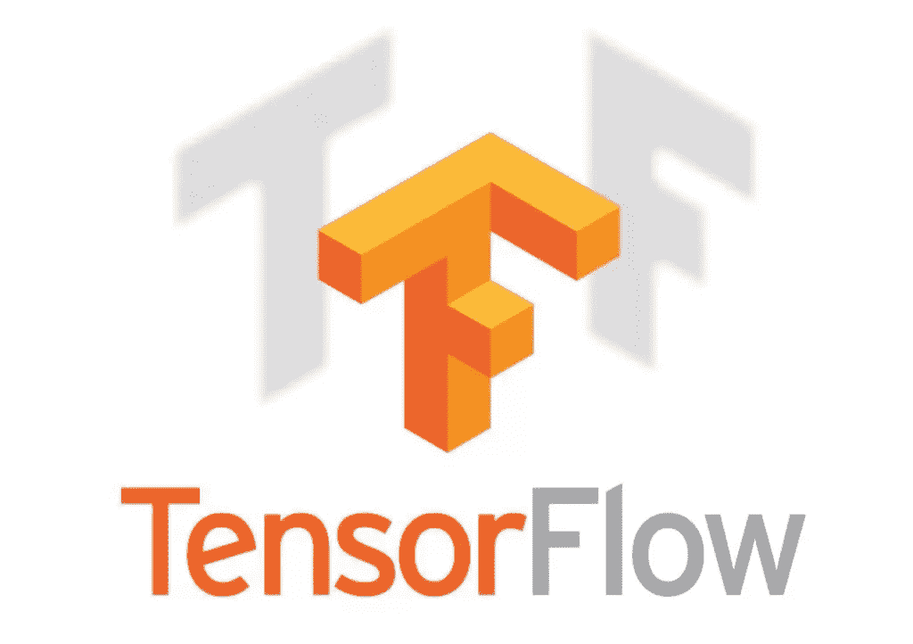

# 构建人工智能的五种简单方法

> 原文：<https://www.sitepoint.com/simple-ways-to-build-artificial-intelligence/>

人工智能、个人助理和聊天机器人领域发展迅速。拥有一个你可以用“Siri”、“Alexa”、“Cortana”或“Ok Google”这些词召唤的个人助理的想法将我们连接到网络和不断增长的物联网(IoT)正变得越来越普遍。2017 年，几乎每个信使程序和智能手机操作系统都有聊天机器人或个人助理可用！虽然他们的“人工智能”的真实水平是有争议的，但我们正在见证一个世界的开始，在这个世界中，我们都有虚拟助手供我们支配！

幸运的是，对于想要参与其中的开发者来说，有一系列服务可以让你轻松地开始构建自己的人工智能、聊天机器人和/或个人助理，无论你想达到什么目的。连接你的智能家居，控制一个自制的媒体中心，通过个人人工智能助理传递各种信息…由于 API 和服务，有如此多的选项可用。这种在 2015 年和 2016 年的领先优势使 2017 年成为开发商拥有比以往更多选择的一年。开发人员真的可以开始构建他们自己的解决方案。

在这个概述中，我们将了解现有的服务，这些服务可以使开发人员在 2016 年开始将自己的应用和物联网设备连接到语音识别、聊天机器人和人工智能。

## Wit.ai

Wit.ai 是一项为开发者提供语音识别和机器学习完美结合的服务。它提供将口头命令转换成文本的服务，还可以训练如何理解这些命令。它也有一种机器学习的形式，你可以训练它理解对它说的命令，这些命令它以前不理解，但是这不是一个自动的过程(它还不是一个完全智能的生物！).2015 年初，他们加入了脸书，并开放了整个平台，对公共和私人实例免费开放。从那以后，它的发展一直起起伏伏，但是[团队对 2017 年](https://wit.ai/blog/2017/02/10/wit-community-update)有很大的计划。

Wit.ai 有两个主要元素，你可以在你的应用程序中设置它们——意图和实体。意图是指令应该采取什么动作*(例如开灯)*。一个实体是一个特定的物体或一条信息，我们的人工智能需要知道它来实现那个意图*(例如，哪种光？是智能灯吗？它应该理解光可以转换成的特定颜色吗？)*。Wit.ai 不需要从头开始创建意图，它还提供了对开发者社区中现有意图的访问，这非常简洁！

Wit.ai 也有“角色”的概念，它可以学习区分不同上下文中的实体(例如，一条指令不同部分的数字可以指不同的东西——如年龄、订单、计数)。它还内置了一些它能理解的实体类型，比如温度、网址、电子邮件、持续时间等等。

Wit.ai 中的一个新功能是“故事”功能，它允许你以一种新的方式定义典型的对话。你可以设置初始问题，比如“悉尼的天气怎么样？”然后定义系统应该询问的步骤和后续问题。它有“分支”的概念，如果系统没有提前获得所有需要的信息(例如，如果用户改为说“天气如何？”).

有针对 iOS，Android，Node.js，Raspberry Pi，Ruby，Python，C，Rust，Windows Phone 开发者的 Wit.ai API。它甚至有一个面向前端开发者的 JavaScript 插件。

## Api.ai

[Api.ai](https://api.ai) 是一个聊天机器人 Api，它提供了与 Wit.ai 类似的功能，具有意图和实体。它提供了机器学习功能，有时可以猜测某人使用的短语是否与你硬编码到你的助手中的略有不同。他们最近[在 2016 年 9 月](https://techcrunch.com/2016/09/19/google-acquires-api-ai-a-company-helping-developers-build-bots-that-arent-awful-to-talk-to/)被谷歌收购。它现在是为谷歌的家庭平台构建对话界面的主要方式之一。

Api.ai 与 Wit.ai 不同的一个关键点是它的“域”。领域是来自 Api.ai 的知识和数据结构的完整集合，可以在每个 Api.ai 代理中使用(应用程序在 Api.ai 中被称为“代理”)。领域可以包括常见动词和内容类型的知识。例如，与“预订酒店”相比，它理解“预订餐馆”请求所需的不同类型的数据。它有一系列关于类似百科全书的主题的真实信息，如历史、单词定义、重要人物(如名人、作家、人物)、电影、股票价格等等。

Api.ai 可以免费使用，但目前在他们的网站上有一点误导——截至 2016 年，它还没有完全免费。大多数“域名”现在需要你的账户升级，但是价格还不清楚(开发者需要联系 Api.ai 的销售团队)。Api.ai 还有一个付费企业选项，允许整个服务在内部的私有云上运行，更多的服务来自他们的服务团队。如果您的使用需要完全保密，这可能很有价值。

Api.ai 拥有适用于 Android、iOS、Apple Watch、Node.js、Cordova、Unity、C++、Xamarin、Python 和 JavaScript 的 SDK。尤其是 Unity 集成可能会为上面没有列出的一系列其他平台打开大门！它还可以与亚马逊的 Echo、Skype、Slack、Facebook Messenger、微软的 Cortana 等等集成。

如果你想试试 Api.ai，[我在 SitePoint 这里有一系列关于 Api.ai 的入门文章。请记住，域名需要付费账户，所以我的例子不再回答每个问题，因为我没有付费账户。](https://www.sitepoint.com/series/building-an-ai-assistant-with-api-ai/)

## 蜜蜂花

如果你宁愿自己做更多人工智能的编程工作，并且你是树莓派的粉丝，你可以看看[梅丽莎](https://github.com/melissa-ai)。Melissa 是一个用 Python 编写的开源个人助理，可以在 Raspberry Pi、Windows、OS X 和 Linux 上运行。它的更新非常频繁，有很多人对它评价很高！

Melissa 有永远在线的语音控制，并且有一系列现成的示例对话，包括做笔记、告诉你的星座、从维基百科获得定义、播放音乐等等。对于想要完全控制的 Python 开发人员来说——Melissa 可能正适合您！为了了解更多，并获得它是如何组装的全部细节，它的主要开发者 Tanay Pant 有一整本书更详细地介绍了它，并作为 Melissa 的详细文档。实际上，在年初的时候，我和他谈论了关于梅丽莎[的一切。他在这上面做了很多工作！](https://devdiner.com/artificial-intelligence/building-open-source-jarvis-virtual-assistant)

## 克拉里菲

一项从完全不同的角度来看的服务是 [Clarifai](http://www.clarifai.com/) ，这是一项可以识别图像和视频内容的人工智能服务。它有自己的深度学习引擎，每次使用都会不断改进。如果你热衷于将你的 AI 原型提升到一个全新的水平，为什么不赋予它看到和识别物体的能力呢？它可以做各种各样的事情，从标记图像，搜索视觉上相似的其他图像，以及标记不合适的图像。如果您想让它更上一层楼，您甚至可以通过用您自己的例子训练它来教给这个平台全新的概念。

为了将它集成到您自己的应用程序中，Clarifai 有一个 REST API，可以与您喜欢的语言集成，还有一个 Python、Java 和 Node.js API。他们的服务每月免费使用 5000 次。我在 SitePoint 这里有一个关于使用 Clarifai 的指南，供那些想尝试一下的人使用— [如何通过图像识别让你的网络应用更智能](https://www.sitepoint.com/how-to-make-your-web-app-smarter-with-image-recognition/)。

## TensorFlow

如果你想超越为你做大量繁重工作的服务，并且真的想从相对的零开始制造真正的人工智能系统，谷歌的 TensorFlow 可能是你的选择！虽然这需要更长的时间来整合，但你会学到更多关于深度学习和人工智能的知识。TensorFlow 是“一个使用数据流图进行数值计算的开源软件库”。它最适合用来训练你自己的图像识别系统或者学习语言处理。你也可以用 TensorFlow 制作对话式人工智能，它是根据特定数据训练的，例如 [SpeakEasy AI](http://lauragelston.ghost.io/speakeasy/) ，它是一个聊天机器人，建立在根据 Reddit 的数百万条评论训练的神经模型上。

你可以让 TensorFlow 驱动的程序做的事情没有限制，[这位开发者训练它编写 90 年代热门节目《老友记》的新剧集](http://fortune.com/2016/01/21/robot-friends-sequel/)。

## 结论

有一系列服务和 API 可以提供人工智能、个人助理、聊天机器人等等。在自己的应用中实现一些核心基础知识，你不需要成为计算机科学专家！试试上面的几种，看看你能创造出什么。如果你觉得超级自信，直接去 TensorFlow，做点真正令人兴奋的东西。

如果你确实使用上述任何服务组装了自己的人工智能原型，或者你对上述服务或我没有提到的服务有一些经验——请在评论中分享或在 Twitter 上与我联系( [@thatpatrickguy](http://www.twitter.com/thatpatrickguy) )。我很想听听！

## 分享这篇文章