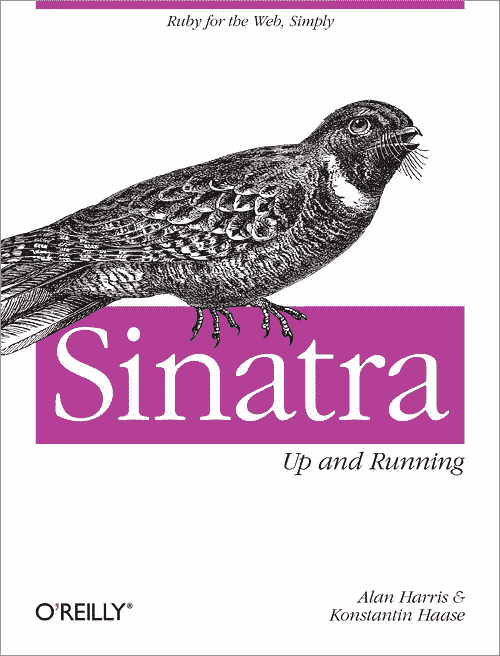

# 辛纳特拉启动和运行:书评

> 原文：<https://www.sitepoint.com/sinatra-up-and-running-a-book-review/>

去年底，奥赖利出版社出版了《辛纳特拉:开始运作》一书，这是第一本专门写 T2 辛纳特拉的书。作者是[阿兰·哈里斯](https://twitter.com/#!/anachronistic)和[康斯坦丁·哈斯](http://rkh.im/)。康斯坦丁是 Sinatra 目前的维护者，他可能比任何人都了解它(你可以在[我的采访](https://www.sitepoint.com/interview-with-konstantin-haase/)中找到更多关于他的信息)。Alan 已经写了两本关于 Python 的书，也是一个热情的 Rubyist 和 Sinatra 用户。我一直在等一本关于辛纳屈的书，我真的很期待这本书，它没有让我失望。

这本书很薄，只有 100 多页。但是，像辛纳屈一样，它将强大的冲击力融入了一个小而瘦的包装中。它涵盖了撰写本文时 Sinatra 的最新版本(1.3.1)并快速入门:第一章介绍了 Sinatra 及其设计目标和理念。还有一个有趣的部分是关于学习 Sinatra 将如何帮助开发可以在其他开发环境中使用的可转移技能。第一章以一个快速教程结束，该教程使用 Sinatra 构建一个完整的 web 应用程序。这是经典儿童游戏[石头剪子布](http://en.wikipedia.org/wiki/Rock-paper-scissors)的一个非常基本的再现，完美地强调了辛纳特拉快速发展的资质。这一章确实直接深入到了 Sinatra 的一些更高级的方面，但它更多的是为了激起人们对后续内容的兴趣，而不是关于它如何工作的教程(这一点在正文中已经说得很清楚了)。

第二章在本质上非常具有参考性，因为它通过大量的辛纳屈的方法和他们是如何工作的。它首先介绍 HTTP 头和动词的基础知识，如 GET、POST、PUT、DELETE 和新添加的补丁，这有助于理解 Sinatra 本质上是一个位于路由 HTTP 请求的 [Rack](http://rack.rubyforge.org/) 之上的包装器。事实上，这一章说明了这样一个事实，即 Sinatra 实际上只是为 Rack 的方法提供语法糖的助手方法的集合。本章的一个亮点是引入了新的流 API，它允许您保持与服务器的连接并执行以下操作: