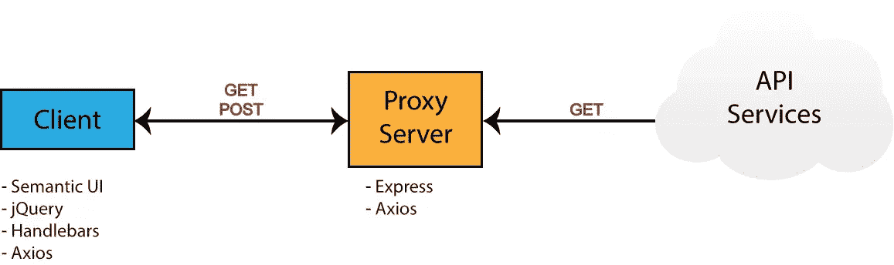
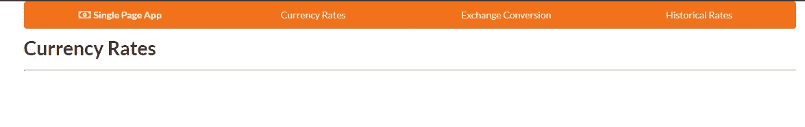
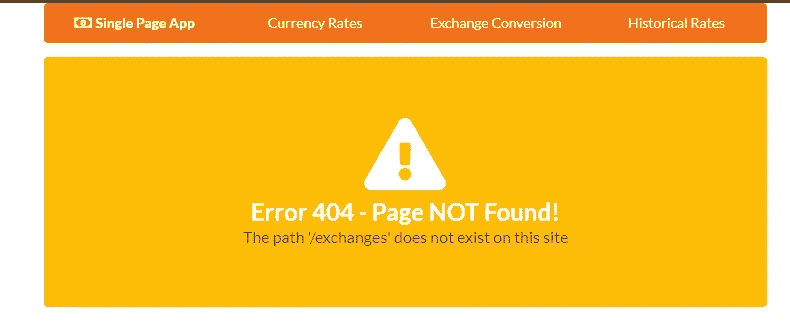
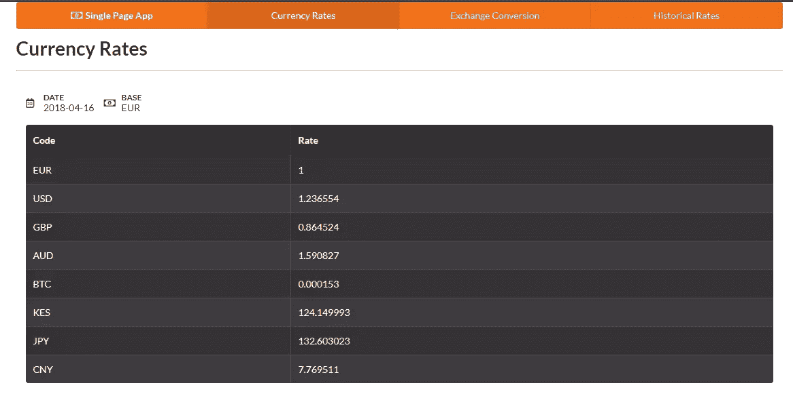
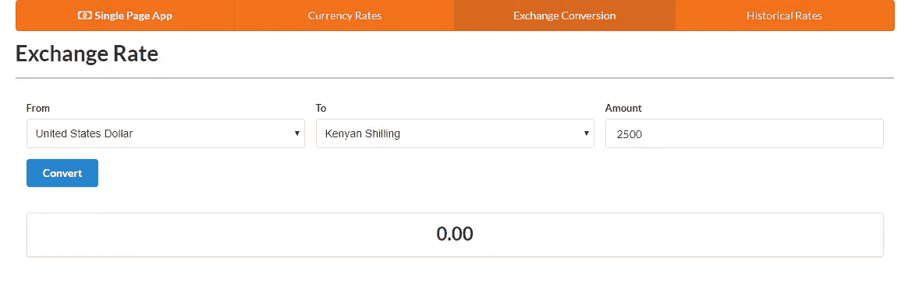
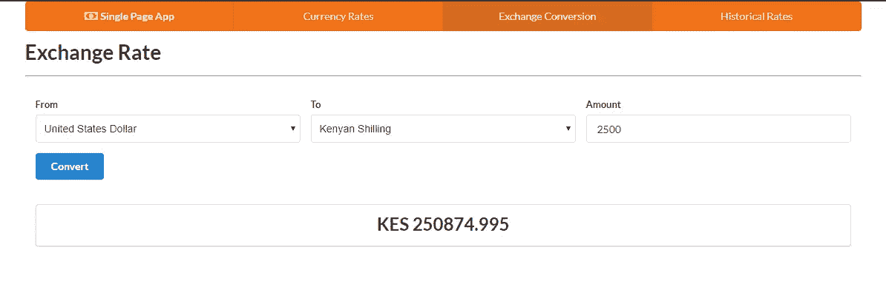
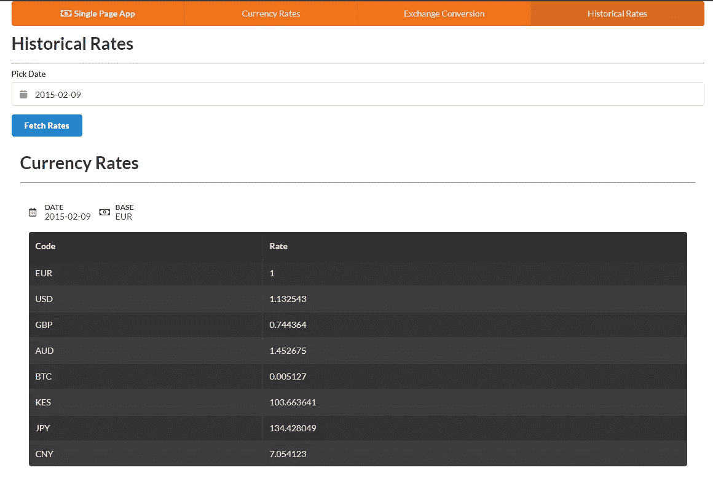
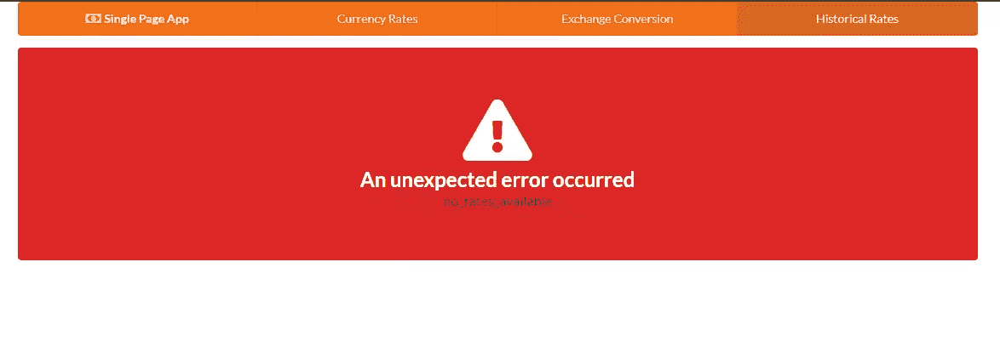

# 构建一个没有框架的 JavaScript 单页应用程序

> 原文：<https://www.sitepoint.com/single-page-app-without-framework/>

前端框架非常棒。它们抽象出构建单页应用程序(SPA)的大部分复杂性，并帮助您随着项目的增长以一种可理解的方式组织代码。

然而，也有不利的一面:这些框架带来了一定程度的开销，并且会引入它们自己的复杂性。

这就是为什么在本教程中，我们将学习如何从零开始构建一个 SPA，而不使用客户端 JavaScript 框架。这将帮助您评估这些框架实际上为您做了什么，以及在什么情况下使用它们是有意义的。它还会让你了解组成典型水疗中心的各个部分，以及它们是如何连接在一起的。

让我们开始吧…

## 先决条件

对于本教程来说，你需要对现代 JavaScript 和 T2 jQuery 有一个基本的了解。使用[车把](https://handlebarsjs.com/)、[快车](https://expressjs.com/)和[轴](https://github.com/axios/axios)的一些经验会派上用场，尽管这并不是绝对必要的。您还需要在您的环境中进行以下设置:

*   [Node.js](https://www.sitepoint.com/quick-tip-multiple-versions-node-nvm/)
*   针对窗口用户的 [Git](https://git-scm.com/downloads) 或 [Git Bash](https://gitforwindows.org/) 。

你可以在我们的 [GitHub 库](https://github.com/sitepoint-editors/single-page-application)上找到完成的项目。

## 构建项目

我们将构建一个简单的货币应用程序，它将提供以下特性:

*   显示最新的汇率
*   从一种货币兑换成另一种货币
*   显示基于指定日期的过去汇率。

我们将利用以下免费的在线 REST APIs 来实现这些特性:

*   固定。io API
*   [自由货币转换器 API](https://free.currencyconverterapi.com/) 。

Fixer 是一个构建良好的 API，它提供了一个外汇和货币转换 JSON API。不幸的是，这是一项商业服务，免费计划不允许货币兑换。所以我们还需要使用免费的货币转换器 API。转换 API 有一些限制，幸运的是不会影响我们应用程序的功能。不需要 API 键就可以直接访问它。然而，Fixer 需要一个 API 键来执行任何请求。只需在他们的网站上注册，就可以获得免费计划的访问密钥。

理想情况下，我们应该能够在客户端构建完整的单页面应用程序。然而，由于我们将处理敏感信息(我们的 API 密钥),所以不可能将它存储在我们的客户端代码中。这样做将使我们的应用程序易受攻击，并向任何初级黑客开放，以绕过应用程序并直接从我们的 API 端点访问数据。为了保护如此敏感的信息，我们需要将它放在服务器代码中。因此，我们将设置一个 [Express](https://expressjs.com/) 服务器作为客户端代码和云服务之间的代理。通过使用代理，我们可以安全地访问这个密钥，因为服务器代码永远不会暴露给浏览器。下面是一个图表，说明我们完成的项目将如何工作。



记下每个环境(即浏览器(客户端)和服务器)将使用的 npm 包。现在您已经知道了我们将构建什么，请转到下一部分开始创建项目。

## 项目目录和依赖项

转到您的工作区目录，创建文件夹`single-page-application`。在 VSCode 或您喜欢的编辑器中打开文件夹，并使用终端创建以下文件和文件夹:

```
touch .env .gitignore README.md server.js
mkdir public lib
mkdir public/js
touch public/index.html
touch public/js/app.js 
```

打开`.gitignore`并添加这些行:

```
node_modules
.env 
```

打开`README.md`并添加这些行:

```
# Single Page Application

This is a project demo that uses Vanilla JS to build a Single Page Application. 
```

接下来，通过在终端内部执行以下命令来创建`package.json`文件:

```
npm init -y 
```

您应该得到为您生成的以下内容:

```
{
  "name": "single-page-application",
  "version": "1.0.0",
  "description": "This is a project demo that uses Vanilla JS to build a Single Page Application.",
  "main": "server.js",
  "directories": {
    "lib": "lib"
  },
  "scripts": {
    "test": "echo \"Error: no test specified\" && exit 1",
    "start": "node server.js"
  },
  "keywords": [],
  "author": "",
  "license": "ISC"
} 
```

看到 npm 命令有多方便了吧？内容是根据项目结构生成的。现在让我们安装项目所需的核心依赖项。在您的终端中执行以下命令:

```
npm install jquery semantic-ui-css handlebars vanilla-router express dotenv axios 
```

包安装完成后，转到下一节，开始构建应用程序的基础。

## 应用基础

在我们开始编写前端代码之前，我们需要实现一个服务器-客户端基础。这意味着从 Express 服务器提供一个基本的 HTML 视图。出于性能和可靠性的原因，我们将直接从`node_modules`文件夹中注入前端依赖项。我们必须以一种特殊的方式来设置我们的 Express 服务器，这样才能正常工作。打开`server.js`并添加以下内容:

```
require('dotenv').config(); // read .env files
const express = require('express');

const app = express();
const port = process.env.PORT || 3000;

// Set public folder as root
app.use(express.static('public'));

// Allow front-end access to node_modules folder
app.use('/scripts', express.static(`${__dirname}/node_modules/`));

// Listen for HTTP requests on port 3000
app.listen(port, () => {
  console.log('listening on %d', port);
}); 
```

这为我们提供了一个基本的 Express 服务器。我已经对代码进行了注释，所以希望这能让您对正在发生的事情有一个相当好的了解。接下来，打开`public/index.html`并输入:

```
<!DOCTYPE html>
<html lang="en">
<head>
  <meta charset="UTF-8">
  <meta name="viewport" content="width=device-width, initial-scale=1.0">
  <meta http-equiv="X-UA-Compatible" content="ie=edge">
  <link rel="stylesheet" href="scripts/semantic-ui-css/semantic.min.css">
  <title>SPA Demo</title>
</head>
<body>
  <div class="ui container">
    <!-- Navigation Menu -->
    <div class="ui four item inverted orange menu">
      <div class="header item">
        <i class="money bill alternate outline icon"></i>
        Single Page App
      </div>
      <a class="item" href="/">
        Currency Rates
      </a>
      <a class="item" href="/exchange">
        Exchange Rates
      </a>
      <a class="item" href="/historical">
        Historical Rates
      </a>
    </div>

    <!-- Application Root -->
    <div id="app"></div>
  </div>

  <!-- JS Library Dependencies -->
  <script src="scripts/jquery/dist/jquery.min.js"></script>
  <script src="scripts/semantic-ui-css/semantic.min.js"></script>
  <script src="scripts/axios/dist/axios.min.js"></script>
  <script src="scripts/handlebars/dist/handlebars.min.js"></script>
  <script src="scripts/vanilla-router/dist/vanilla-router.min.js"></script>
  <script src="js/app.js"></script>
</body>
</html> 
```

我们使用语义用户界面来设计风格。请参考[语义 UI 菜单](https://semantic-ui.com/collections/menu.html)文档来理解我们的导航栏所使用的代码。转到您的终端并启动服务器:

```
npm start 
```

在浏览器中打开 [localhost:3000](http://localhost:3000) 。您应该有一个空白页面，只显示导航栏:


现在让我们为我们的应用程序编写一些视图模板。

## 前端骨架模板

我们将使用[手柄](https://handlebarsjs.com/)来编写模板。JavaScript 将用于根据当前 URL 呈现模板。我们将创建的第一个模板将用于显示错误消息，如 404 或服务器错误。将此代码放在导航部分之后的`public/index.html`中:

```
<!-- Error Template -->
<script id="error-template" type="text/x-handlebars-template"> <div class="ui {{color}} inverted segment" style="height:250px;">
    <br>
    <h2 class="ui center aligned icon header">
      <i class="exclamation triangle icon"></i>
      <div class="content">
        {{title}}
        <div class="sub header">{{message}}</div>
      </div>
    </h2>
  </div> </script> 
```

接下来，添加以下模板，这些模板将代表我们在导航栏中指定的每个 URL 路径的视图:

```
<!-- Currency Rates Template -->
<script id="rates-template" type="text/x-handlebars-template"> <h1 class="ui header">Currency Rates</h1>
  <hr> </script>

<!-- Exchange Conversion Template -->
<script id="exchange-template" type="text/x-handlebars-template"> <h1 class="ui header">Exchange Conversion</h1>
  <hr> </script>

<!-- Historical Rates Template -->
<script id="historical-template" type="text/x-handlebars-template"> <h1 class="ui header">Historical Rates</h1>
  <hr> </script> 
```

接下来，让我们编译`public/js/app.js`中的所有模板。编译后，我们将渲染`rates-template`并看看它看起来像什么:

```
window.addEventListener('load', () => {
  const el = $('#app');

  // Compile Handlebar Templates
  const errorTemplate = Handlebars.compile($('#error-template').html());
  const ratesTemplate = Handlebars.compile($('#rates-template').html());
  const exchangeTemplate = Handlebars.compile($('#exchange-template').html());
  const historicalTemplate = Handlebars.compile($('#historical-template').html());

  const html = ratesTemplate();
  el.html(html);
}); 
```

请注意，我们将所有 JavaScript 客户端代码包装在一个`load`事件中。这只是为了确保所有的依赖项都已经加载，并且 DOM 已经完成加载。刷新页面，看看我们有什么:



我们正在取得进展。现在，如果你点击除了*汇率*之外的其他链接，浏览器将尝试获取一个新页面，并以这样的消息结束:`Cannot GET /exchange`。

我们正在构建一个单页面应用程序，这意味着所有的操作都应该发生在一个页面上。我们需要一种方法来告诉浏览器在 URL 改变时停止获取新页面。

## 客户端路由

为了控制浏览器环境中的路由，我们需要实现客户端路由。有许多客户端路由库可以帮助解决这个问题。对于我们的项目，我们将使用[普通路由器](https://www.npmjs.com/package/vanilla-router)，这是一个非常易于使用的路由包。

如果您还记得，我们之前已经在`index.html`中包含了我们需要的所有 JavaScript 库。因此我们可以马上调用`Router`类。删除您添加到`app.js`中的最后两条语句，并用以下代码替换它们:

```
// Router Declaration
const router = new Router({
  mode: 'history',
  page404: (path) => {
    const html = errorTemplate({
      color: 'yellow',
      title: 'Error 404 - Page NOT Found!',
      message: `The path '/${path}' does not exist on this site`,
    });
    el.html(html);
  },
});

router.add('/', () => {
  let html = ratesTemplate();
  el.html(html);
});

router.add('/exchange', () => {
  let html = exchangeTemplate();
  el.html(html);
});

router.add('/historical', () => {
  let html = historicalTemplate();
  el.html(html);
});

// Navigate app to current url
router.navigateTo(window.location.pathname);

 // Highlight Active Menu on Refresh/Page Reload
const link = $(`a[href$='${window.location.pathname}']`);
link.addClass('active');

$('a').on('click', (event) => {
  // Block browser page load
  event.preventDefault();

  // Highlight Active Menu on Click
  const target = $(event.target);
  $('.item').removeClass('active');
  target.addClass('active');

  // Navigate to clicked url
  const href = target.attr('href');
  const path = href.substr(href.lastIndexOf('/'));
  router.navigateTo(path);
}); 
```

花些时间浏览代码。我已经在各个部分添加了注释来解释正在发生的事情。您会注意到，在路由器的声明中，我们指定了`page404`属性来使用错误模板。现在让我们测试这些链接:


链接现在应该可以工作了。但是我们有一个问题。点击`/exchange`或`historical`链接，然后刷新浏览器。我们得到和以前一样的错误— `Cannot GET /exchange`。要解决这个问题，请转到`server.js`并在 listen 代码之前添加这条语句:

```
// Redirect all traffic to index.html
app.use((req, res) => res.sendFile(`${__dirname}/public/index.html`)); 
```

您必须使用`Ctrl` + `C`并执行`npm start`来重启服务器。回到浏览器并尝试刷新。现在，您应该可以看到页面正确呈现了。现在，让我们尝试在 URL 中输入一个不存在的路径，如`/exchanges`。应用程序应该显示 404 错误消息:



我们现在已经实现了创建单页面应用程序框架的必要代码。现在让我们开始列出最新的汇率。

## 最新汇率

对于这个任务，我们将利用[固定器最新利率端点](https://fixer.io/documentation#latestrates)。打开`.env`文件并添加您的 API 密钥。我们还将指定超时时间和我们将在页面上列出的符号。如果您的互联网连接速度较慢，请随意增加超时值:

```
API_KEY=<paste key here>
PORT=3000
TIMEOUT=5000
SYMBOLS=EUR,USD,GBP,AUD,BTC,KES,JPY,CNY 
```

接下来创建文件`lib/fixer-service.js`。在这里，我们将为我们的 Express 服务器编写助手代码，以便轻松地从 Fixer 请求信息。复制以下代码:

```
require('dotenv').config();
const axios = require('axios');

const symbols = process.env.SYMBOLS || 'EUR,USD,GBP';

// Axios Client declaration
const api = axios.create({
  baseURL: 'http://data.fixer.io/api',
  params: {
    access_key: process.env.API_KEY,
  },
  timeout: process.env.TIMEOUT || 5000,
});

// Generic GET request function
const get = async (url) => {
  const response = await api.get(url);
  const { data } = response;
  if (data.success) {
    return data;
  }
  throw new Error(data.error.type);
};

module.exports = {
  getRates: () => get(`/latest&symbols=${symbols}&base=EUR`),
}; 
```

同样，花些时间浏览代码，了解发生了什么。如果你不确定，你也可以查看一下 [dotenv](https://www.npmjs.com/package/dotenv) 、 [axios](https://www.npmjs.com/package/axios) 的文档，并阅读一下[模块导出](https://www.sitepoint.com/understanding-module-exports-exports-node-js/)。现在让我们做一个快速测试来确认`getRates()`功能正在工作。

打开`server.js`并添加以下代码:

```
const { getRates } = require('./lib/fixer-service');

...
// Place this block at the bottom
const test = async() => {
  const data = await getRates();
  console.log(data);
}

test(); 
```

运行`npm start`或`node server`。几秒钟后，您应该会得到以下输出:

```
{
  success: true,
  timestamp: 1523871848,
  base: 'EUR',
  date: '2018-04-16',
  rates: {
    EUR: 1,
    USD: 1.23732,
    GBP: 0.865158,
    AUD: 1.59169,
    BTC: 0.000153,
    KES: 124.226892,
    JPY: 132.608498,
    CNY: 7.775567
  }
} 
```

如果您得到与上面类似的东西，这意味着代码正在工作。价值当然会有所不同，因为汇率每天都在变化。现在注释掉测试块，并将这段代码插入到将所有流量重定向到`index.html`的语句之前:

```
// Express Error handler
const errorHandler = (err, req, res) => {
  if (err.response) {
    // The request was made and the server responded with a status code
    // that falls out of the range of 2xx
    res.status(403).send({ title: 'Server responded with an error', message: err.message });
  } else if (err.request) {
    // The request was made but no response was received
    res.status(503).send({ title: 'Unable to communicate with server', message: err.message });
  } else {
    // Something happened in setting up the request that triggered an Error
    res.status(500).send({ title: 'An unexpected error occurred', message: err.message });
  }
};

// Fetch Latest Currency Rates
app.get('/api/rates', async (req, res) => {
  try {
    const data = await getRates();
    res.setHeader('Content-Type', 'application/json');
    res.send(data);
  } catch (error) {
    errorHandler(error, req, res);
  }
}); 
```

正如我们所看到的，有一个定制的错误处理函数，用于处理不同的错误场景，这些错误场景可能发生在服务器代码的执行过程中。当出现错误时，将构造一条错误消息并发送回客户端。

让我们确认这段代码正在工作。重启 Express 服务器，将浏览器导航到这个 URL:[localhost:3000/API/rates](http://localhost:3000/api/rates)。您应该会看到与控制台中显示的相同的 JSON 结果。我们现在可以实现一个视图，在一个整洁优雅的表格中显示这些信息。

打开`public/index.html`并用此代码替换`rates-template`:

```
<!-- Currency Rates Template -->
<script id="rates-template" type="text/x-handlebars-template"> <h1 class="ui header">Currency Rates</h1>
  <hr>
  <div class="ui loading basic segment">
    <div class="ui horizontal list">
      <div class="item">
        <i class="calendar alternate outline icon"></i>
        <div class="content">
          <div class="ui sub header">Date</div>
          <span>{{date}}</span>
        </div>
      </div>
      <div class="item">
        <i class="money bill alternate outline icon"></i>
        <div class="content">
          <div class="ui sub header">Base</div>
          <span>{{base}}</span>
        </div>
      </div>
    </div>

    <table class="ui celled striped selectable inverted table">
      <thead>
        <tr>
          <th>Code</th>
          <th>Rate</th>
        </tr>
      </thead>
      <tbody>
        {{#each rates}}
        <tr>
          <td>{{@key}}</td>
          <td>{{this}}</td>
        </tr>
        {{/each}}
      </tbody>
    </table>
  </div> </script> 
```

请记住，我们使用语义 UI 为我们提供样式。我希望您密切关注[段加载](https://semantic-ui.com/elements/segment.html#loading)组件。这将是一个指示，让用户知道当应用程序获取数据时发生了一些事情。我们还使用[表格 UI](https://semantic-ui.com/collections/table.html) 来显示价格。如果你是语义新手，请浏览链接的文档。

现在让我们更新`public/js/app.js`中的代码来使用这个新模板。用以下代码替换第一个`route.add('/')`函数:

```
// Instantiate api handler
const api = axios.create({
  baseURL: 'http://localhost:3000/api',
  timeout: 5000,
});

// Display Error Banner
const showError = (error) => {
  const { title, message } = error.response.data;
  const html = errorTemplate({ color: 'red', title, message });
  el.html(html);
};

// Display Latest Currency Rates
router.add('/', async () => {
  // Display loader first
  let html = ratesTemplate();
  el.html(html);
  try {
    // Load Currency Rates
    const response = await api.get('/rates');
    const { base, date, rates } = response.data;
    // Display Rates Table
    html = ratesTemplate({ base, date, rates });
    el.html(html);
  } catch (error) {
    showError(error);
  } finally {
    // Remove loader status
    $('.loading').removeClass('loading');
  }
}); 
```

第一个代码块实例化了一个 API 客户机，用于与代理服务器通信。第二块是处理错误的全局函数。它的工作只是在服务器端出现问题时显示一个错误提示。第三个块是我们从`localhost:3000/api/rates`端点获取费率数据并将其传递给`rates-template`来显示信息的地方。

只需刷新浏览器。您现在应该有以下视图:



接下来，我们将构建一个转换货币的接口。

## 外汇兑换

对于货币转换，我们将使用两个端点:

*   [固定器的符号端点](https://fixer.io/documentation#supportedsymbols)
*   [自由货币转换器端点](https://www.currencyconverterapi.com/docs)。

我们需要 symbols 端点来获取受支持的货币代码列表。我们将使用这些数据来填充用户用来选择要转换的货币的下拉列表。打开`lib/fixer-service.js`并在`getRates()`功能后添加该行:

```
getSymbols: () => get('/symbols'), 
```

创建另一个助手文件`lib/free-currency-service.js`，并添加以下代码:

```
require('dotenv').config();
const axios = require('axios');

const api = axios.create({
  baseURL: 'https://free.currencyconverterapi.com/api/v5',
  timeout: process.env.TIMEOUT || 5000,
});

module.exports = {
  convertCurrency: async (from, to) => {
    const response = await api.get(`/convert?q=${from}_${to}&compact=y`);
    const key = Object.keys(response.data)[0];
    const { val } = response.data[key];
    return { rate: val };
  },
}; 
```

这将帮助我们免费获得从一种货币到另一种货币的兑换率。在客户端代码中，我们必须通过将金额乘以汇率来计算转换金额。现在让我们将这两个服务方法添加到我们的 Express 服务器代码中。打开`server.js`并相应更新:

```
const { getRates, getSymbols, } = require('./lib/fixer-service');
const { convertCurrency } = require('./lib/free-currency-service');
...
// Insert right after get '/api/rates', just before the redirect statement

// Fetch Symbols
app.get('/api/symbols', async (req, res) => {
  try {
    const data = await getSymbols();
    res.setHeader('Content-Type', 'application/json');
    res.send(data);
  } catch (error) {
    errorHandler(error, req, res);
  }
});

// Convert Currency
app.post('/api/convert', async (req, res) => {
  try {
    const { from, to } = req.body;
    const data = await convertCurrency(from, to);
    res.setHeader('Content-Type', 'application/json');
    res.send(data);
  } catch (error) {
    errorHandler(error, req, res);
  }
}); 
```

现在我们的代理服务器应该可以得到符号和转换率。注意`/api/convert`是一个 POST 方法。我们将在客户端使用一个表单来构建货币兑换 UI。随意使用`test`功能来确认两个端点都在工作。这里有一个例子:

```
// Test Symbols Endpoint
const test = async() => {
  const data = await getSymbols();
  console.log(data);
}

// Test Currency Conversion Endpoint
const test = async() => {
  const data = await convertCurrency('USD', 'KES');
  console.log(data);
} 
```

每次测试都必须重启服务器。一旦你确认代码到目前为止都工作正常，记得注释掉测试。现在让我们来看看我们的货币兑换 UI。打开`public/index.html`并用以下代码替换现有代码来更新`exchange-template`:

```
<script id="exchange-template" type="text/x-handlebars-template"> <h1 class="ui header">Exchange Rate</h1>
  <hr>
  <div class="ui basic loading segment">
    <form class="ui form">
      <div class="three fields">
        <div class="field">
          <label>From</label>
          <select class="ui dropdown" name="from" id="from">
            <option value="">Select Currency</option>
            {{#each symbols}}
              <option value="{{@key}}">{{this}}</option>
            {{/each}}
          </select>
        </div>
        <div class="field">
          <label>To</label>
          <select class="ui dropdown" name="to" id="to">
            <option value="">Select Currency</option>
            {{#each symbols}}
              <option value="{{@key}}">{{this}}</option>
            {{/each}}
          </select>
        </div>
        <div class="field">
          <label>Amount</label>
          <input type="number" name="amount" id="amount" placeholder="Enter amount">
        </div>
      </div>
      <div class="ui primary submit button">Convert</div>
      <div class="ui error message"></div>
    </form>
    <br>
    <div id="result-segment" class="ui center aligned segment">
      <h2 id="result" class="ui header">
        0.00
      </h2>
    </div>
  </div> </script> 
```

花点时间浏览剧本，理解发生了什么。我们使用[语义 UI 表单](https://semantic-ui.com/collections/form.html)来构建界面。我们还使用 Handlebars 符号来填充下拉框。下面是固定器的符号端点使用的 JSON 格式:

```
{
  "success": true,
  "symbols": {
    "AED": "United Arab Emirates Dirham",
    "AFN": "Afghan Afghani",
    "ALL": "Albanian Lek",
    "AMD": "Armenian Dram",
  }
} 
```

请注意，符号数据是地图格式的。这意味着信息存储为键`{{@key}}`和值`{{this}}`对。现在让我们更新`public/js/app.js`,让它和新模板一起工作。打开文件，用以下代码替换现有的`/exchange`路线代码:

```
// Perform POST request, calculate and display conversion results
const getConversionResults = async () => {
  // Extract form data
  const from = $('#from').val();
  const to = $('#to').val();
  const amount = $('#amount').val();
  // Send post data to Express(proxy) server
  try {
    const response = await api.post('/convert', { from, to });
    const { rate } = response.data;
    const result = rate * amount;
    $('#result').html(`${to}  ${result}`);
  } catch (error) {
    showError(error);
  } finally {
    $('#result-segment').removeClass('loading');
  }
};

// Handle Convert Button Click Event
const convertRatesHandler = () => {
  if ($('.ui.form').form('is valid')) {
    // hide error message
    $('.ui.error.message').hide();
    // Post to Express server
    $('#result-segment').addClass('loading');
    getConversionResults();
    // Prevent page from submitting to server
    return false;
  }
  return true;
};

router.add('/exchange', async () => {
  // Display loader first
  let html = exchangeTemplate();
  el.html(html);
  try {
    // Load Symbols
    const response = await api.get('/symbols');
    const { symbols } = response.data;
    html = exchangeTemplate({ symbols });
    el.html(html);
    $('.loading').removeClass('loading');
    // Validate Form Inputs
    $('.ui.form').form({
      fields: {
        from: 'empty',
        to: 'empty',
        amount: 'decimal',
      },
    });
    // Specify Submit Handler
    $('.submit').click(convertRatesHandler);
  } catch (error) {
    showError(error);
  }
}); 
```

刷新页面。您现在应该有以下视图:



选择您选择的一些货币，并输入一个金额。然后点击*转换*按钮:


哎呀！我们刚刚遇到了一个错误。至少我们知道我们的错误处理代码在工作。为了找出错误发生的原因，返回到服务器代码并查看`/api/convert`函数。具体看写着`const { from, to } = req.body;`的那一行。

Express 似乎无法从`request`对象读取属性。为了解决这个问题，我们需要安装中间件来解决这个问题:

```
npm install body-parser 
```

接下来，更新服务器代码，如下所示:

```
const bodyParser = require('body-parser');
...

/** Place this code right before the error handler function **/

// Parse POST data as URL encoded data
app.use(bodyParser.urlencoded({
  extended: true,
}));

// Parse POST data as JSON
app.use(bodyParser.json()); 
```

再次启动服务器并刷新浏览器。尝试进行另一次转换。现在应该可以工作了。



现在让我们关注最后一点——历史汇率。先说观点。

## 历史汇率

实现此功能就像合并第一页和第二页中的任务。我们将构建一个微小的表单，用户将被期待输入日期。当用户单击 submit 时，指定日期的汇率将以表格格式显示。我们将使用 Fixer API 中的[历史汇率端点](https://fixer.io/documentation#historicalrates)来实现这一点。API 请求如下所示:

```
https://data.fixer.io/api/2013-12-24
    ? access_key = API_KEY
    & base = GBP
    & symbols = USD,CAD,EUR 
```

响应将会是这样的:

```
{
  "success": true,
  "historical": true,
  "date": "2013-12-24",
  "timestamp": 1387929599,
  "base": "GBP",
  "rates": {
    "USD": 1.636492,
    "EUR": 1.196476,
    "CAD": 1.739516
  }
} 
```

打开`lib/fixer-service.js`，历史利率端点如下:

```
...
  /** Place right after getSymbols **/
  getHistoricalRate: date => get(`/${date}&symbols=${symbols}&base=EUR`),
... 
```

打开`server.js`并添加以下代码:

```
...
const { getRates, getSymbols, getHistoricalRate } = require('./lib/fixer-service');
...
/** Place this after '/api/convert' post function **/

// Fetch Currency Rates by date
app.post('/api/historical', async (req, res) => {
  try {
    const { date } = req.body;
    const data = await getHistoricalRate(date);
    res.setHeader('Content-Type', 'application/json');
    res.send(data);
  } catch (error) {
    errorHandler(error, req, res);
  }
});
... 
```

如果你对代码的编排有任何疑问，请参考 [GitHub](https://github.com/sitepoint-editors/single-page-application/blob/master/server.js) 上的完整`server.js`文件。请随意编写一个快速测试来确认历史端点正在工作:

```
const test = async() => {
  const data = await getHistoricalRate('2012-07-14');
  console.log(data);
}

test(); 
```

确认一切正常后，一定要记得注释掉测试块。现在让我们开始处理客户端代码。

打开`index.html`。删除我们用作占位符的现有`historical-template`，并替换为以下内容:

```
<script id="historical-template" type="text/x-handlebars-template"> <h1 class="ui header">Historical Rates</h1>
  <hr>
  <form class="ui form">
    <div class="field">
      <label>Pick Date</label>
      <div class="ui calendar" id="calendar">
        <div class="ui input left icon">
          <i class="calendar icon"></i>
          <input type="text" placeholder="Date" id="date">
        </div>
      </div>
    </div>
    <div class="ui primary submit button">Fetch Rates</div>
    <div class="ui error message"></div>
  </form>

  <div class="ui basic segment">
    <div id="historical-table"></div>
  </div> </script> 
```

先看一下表格。我想指出的一点是，语义 UI 没有正式的日期输入。然而，由于迈克尔·德·胡格的贡献，我们有了 T2 语义界面日历模块。只需使用 npm 安装即可:

```
npm install semantic-ui-calendar 
```

返回到`public/index.html`并将其包含在脚本部分:

```
...
<script src="scripts/semantic-ui-css/semantic.min.js"></script>
<script src="scripts/semantic-ui-calendar/dist/calendar.min.js"></script>
.... 
```

为了显示历史汇率，我们将简单地重用`rates-template`。接下来打开`public/js/app.js`并更新`/historical`的现有路线代码:

```
const getHistoricalRates = async () => {
  const date = $('#date').val();
  try {
    const response = await api.post('/historical', { date });
    const { base, rates } = response.data;
    const html = ratesTemplate({ base, date, rates });
    $('#historical-table').html(html);
  } catch (error) {
    showError(error);
  } finally {
    $('.segment').removeClass('loading');
  }
};

const historicalRatesHandler = () => {
  if ($('.ui.form').form('is valid')) {
    // hide error message
    $('.ui.error.message').hide();
    // Indicate loading status
    $('.segment').addClass('loading');
    getHistoricalRates();
    // Prevent page from submitting to server
    return false;
  }
  return true;
};

router.add('/historical', () => {
  // Display form
  const html = historicalTemplate();
  el.html(html);
  // Activate Date Picker
  $('#calendar').calendar({
    type: 'date',
    formatter: { //format date to yyyy-mm-dd
      date: date => new Date(date).toISOString().split('T')[0],
    },
  });
  // Validate Date input
  $('.ui.form').form({
    fields: {
      date: 'empty',
    },
  });
  $('.submit').click(historicalRatesHandler);
}); 
```

再次，花时间阅读评论，理解代码和它在做什么。然后重启服务器，刷新浏览器并导航到`/historical`路径。选择 1999 年之前的任何日期，然后点击*获取利率*。你应该有这样的东西:



如果您选择 1999 年之前的日期或未来的日期，当您提交表单时，将显示一个错误横幅。



## 摘要

既然我们已经到了本教程的末尾，您应该会看到，在不使用框架的情况下构建一个由 REST APIs 支持的单页面应用程序并不困难。但是有几件事我们应该关心:

*   **DOM 性能**。在我们的客户端代码中，我们直接操作 DOM。随着项目的增长，这种情况很快就会失去控制，导致 UI 变得迟钝。

*   **浏览器性能**。我们已经在`index.html`中加载了相当多的前端库作为脚本，这对于开发目的来说是可以的。对于生产部署，我们需要一个捆绑所有脚本的系统，以便浏览器使用一个请求来加载必要的 JavaScript 资源。

*   **单片代码**。对于服务器代码，将代码分解成模块化部分更容易，因为它在节点环境中运行。然而，对于客户端代码，组织成模块并不容易，除非你使用像 [webpack](https://www.sitepoint.com/beginners-guide-webpack-module-bundling/) 这样的捆绑器。

*   **测试**。到目前为止，我们一直在做手工测试。对于生产就绪的应用程序，我们需要建立一个测试框架，如 Jasmine、Mocha 或 Chai，来自动完成这项工作。这将有助于防止重复出现错误。

当您在不使用框架的情况下进行项目开发时，这些只是您将面临的许多问题中的一部分。使用诸如 Angular、React 或 Vue 之类的东西将会帮助你减轻很多这样的担忧。我希望这篇教程对你有所帮助，能够帮助你成为一名专业的 JavaScript 开发人员。

## 分享这篇文章