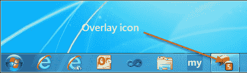
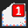
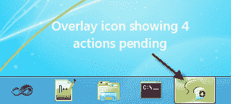

# 站点锁定:旋转覆盖图标

> 原文：<https://www.sitepoint.com/site-pinning-rotating-overlay-icons/>

在我的[上一篇文章](https://www.sitepoint.com/using-site-pinning-and-overlay-icons-for-enhanced-user-engagement/)中，我讲述了如何使用 [IE9 的站点锁定 API](http://msdn.microsoft.com/en-us/library/gg491731(v=VS.85).aspx) 来实现叠加图标以增强用户通知。这个演示集中在如何显示一个数字图标来指示一个特定事件(例如:收件箱中的消息)何时发生。

[](https://blog.reybango.com/wp-content/uploads/2011/10/overlay-icon.png) 
*用覆盖图标钉住站点*

这是一个让你的用户知道有待定信息等待他们检查的好方法。但是如果你的站点提供多种类型的通知会怎么样呢？如今，随着网站提供如此多的功能，它们也提供多种类型的通知是很常见的，从朋友请求和事件提醒到新消息和游戏邀请。

## 旋转多个覆盖图标

站点锁定 API 的伟大之处在于它非常灵活，通过一些 JavaScript 魔法，您可以轻松地为您拥有的各种服务显示多个覆盖图标。在这个演示中，我想通过 3 个不同的覆盖图标来提醒用户待处理的消息、请求和操作。

和以前一样，我不得不使用 x-icon 编辑器通过创建叠加图标来发挥我的艺术天赋。我分别创建了 5 个，下面是前三个的样子:

[](https://blog.reybango.com/wp-content/uploads/2011/10/messages-1.png)[](https://blog.reybango.com/wp-content/uploads/2011/10/requests-1.png)[](https://blog.reybango.com/wp-content/uploads/2011/10/actions-1.png)

代码与上一个演示略有不同，以适应每次读取多位数据。之前，我只获取了一条数据，在本演示中，我将返回 3 条数据，每条数据对应一种通知类型:

```
 myPin.init([{ "data" : [{ "label" : "Messages", "ntype" : "M", "num": 2 }, { "label" : "Requests", "ntype" : "R", "num": 1 }, { "label" : "Actions", "ntype" : "A", "num": 3 }] },
		        { "data" : [{ "label" : "Messages", "ntype" : "M", "num": 1 }, { "label" : "Requests", "ntype" : "R", "num": 5 }, { "label" : "Actions", "ntype" : "A", "num": 2 }] },
		        { "data" : [{ "label" : "Messages", "ntype" : "M", "num": 5 }, { "label" : "Requests", "ntype" : "R", "num": 1 }, { "label" : "Actions", "ntype" : "A", "num": 4 }] }
			   ]);
```

提醒一下，方法 *getData()* **模拟**抓取远程数据。因此，如果我们看上面的数据，我们可以模拟拉回三个不同的数据位。这就是为什么我们使用 setInterval 每 10 秒钟调用一次该方法。这使我们可以看到通知在一段时间内的样子。

```
setInterval(function () { myPin.getData() }, 10000);
```

下一个变化是使用了一个计时器，允许在渲染叠加图标时有轻微的延迟。使用 *setTimeout()* 提供足够的延迟，以便在旋转到下一个图标之前，用户可以看到单独的覆盖图标。如果我们没有这种延迟，轮换将会太快而无法提供任何有用的通知。如果我们看下图，我们可以看到通知的样子:

[](https://blog.reybango.com/wp-content/uploads/2011/10/overlay.png) 
*叠加图标显示数字通知*

这是通过以下代码实现的:

```
// Grab the current set of data...
currData = this.dataBin[this.currIndex++].data;		

/* We're going to display a new overlay every x number of seconds to display a new overlay icon so
   let's loop through the data elements for the current set of data... */
for (var i=0; i < currData.length; i++ ){

	(function(idx) { setTimeout( function(){ myPin.dispOverlay( currData[idx] ); }, 1000 * idx); }( i ));					

}
```

事情是这样的。在第一行中，我获取包含所有通知信息(消息、请求和操作)的当前数据集。这些数据看起来像这样:

```
[{ "label" : "Messages", "ntype" : "M", "num": 2 },
{ "label" : "Requests", "ntype" : "R", "num": 1 },
{ "label" : "Actions", "ntype" : "A", "num": 3 }]
```

我遍历每组数据，并使用 *setTimeout()* 分配一个计时器，该计时器将以大约 1 秒的间隔调用 *dispOverlay()* 。这就是我之前提到的允许图标逐渐渲染延迟的神奇代码。预期的功能是“消息”图标将呈现，然后是“请求”图标 1 秒钟后，最后是“行动”图标。

现在，你可能想知道为什么我用一个匿名函数包装 *setTimeout()* 。这是因为我在 setTimeout 中有一个闭包，它会[导致一个常见的作用域问题](http://james.padolsey.com/javascript/closures-in-javascript/)，在这个问题中，我用来获取数据的当前索引的变量‘I’将只更新到最后一个索引值。詹姆斯·帕多塞对此有一个[的精彩解释](http://james.padolsey.com/javascript/closures-in-javascript/)，感谢[约翰·大卫·道尔顿](https://twitter.com/jdalton)帮我解决这个问题。

最后一个变化是在 *dispOverlay()* 中，我需要确定需要显示哪个覆盖图标。由于我现在有三种不同类型的通知，我需要一个条件语句来确定类型并构建正确的图标名称:

```
if (theData.ntype == "M") {
	oImg = "images/messages-" + theData.num + ".ico";
} else if (theData.ntype == "R") {
	oImg = "images/requests-" + theData.num + ".ico";
} else if (theData.ntype == "A") {
	oImg = "images/actions-" + theData.num + ".ico";
}
```

这将检查类型，并根据类型和该类型的待处理通知数量提供正确的图标。

## 演示和最终代码

你可以在 IE9:

[http://reybango.com/demos/sprotate/index.html](http://reybango.com/demos/sprotate/index.html)

当页面呈现时，将选项卡向下拖动到任务栏并固定它。您应该会看到一个新窗口，显示您新固定的站点。接下来，你会看到重叠图标出现在任务栏中，它们应该开始每 10 秒循环一次。

这是完整的源代码。你也可以[在这里](https://reybango.com/demos/sprotate/src/sprotate.zip)下载一切。

```
<!DOCTYPE html>
<html>

<head>
<title>Pinned Site - Rotating Overlay Icons</title>
<link rel="shortcut icon" type="image/ico" href="favicon.ico" />

<meta name="application-name" content="Pinned Site Test" />
<meta name="msapplication-starturl" content="http://reybango.com/demos/sprotate/index.html" />
<meta name="msapplication-navbutton-color" content="#3480C0" />

<meta name="msapplication-window" content="width=1024;height=768" />
<meta name="msapplication-tooltip" content="Testing the Pinned Site API" />
<style>

body {
    background: none repeat scroll 0 0 #4492CE;
    font: 440%/1.4em 'Segoe Light',Segoe,'Segoe UI','Meiryo Regular','Meiryo',sans-serif;
    color: #EDEFF4;
}

</style>

</head>

<body>

<div>
<h1>Pinned Sites</h1>
<p>Rotating Overlay Icons</p>

</div>

<script>

	var myData = [];

    var myPin = {

        currIndex: 0,
        dataBin: [],

        getData: function () {

			var idx = 0, currData = [], cntr = 0, theData;

            // Determines whether the current page was launched as a pinned site...
            if (window.external.msIsSiteMode()) {

				// Grab the current set of data...
				currData = this.dataBin[this.currIndex++].data;		

				/* We're going to display a new overlay every x number of seconds to display a new overlay icon so
				   let's loop through the data elements for the current set of data... */
				for (var i=0; i < currData.length; i++ ){

					(function(idx) { setTimeout( function(){ myPin.dispOverlay( currData[idx] ); }, 1e3 * idx); }( i ));					

				}

				if (this.currIndex > 2) { this.currIndex = 0 }

            }

        },

        dispOverlay: function (theData) {

            var oImg = "";

            // Is there any data?
            if (theData) {

                // Clear any preexisting overlay icon
                window.external.msSiteModeClearIconOverlay();

				// Render the overlay icon based on the data returned...
				if (theData.ntype == "M") {
					oImg = "images/messages-" + theData.num + ".ico";
				} else if (theData.ntype == "R") {
					oImg = "images/requests-" + theData.num + ".ico";
				} else if (theData.ntype == "A") {
					oImg = "images/actions-" + theData.num + ".ico";
				}				

                // Go ahead and create the overlay image and it's label...
                this.setOverlay(oImg, theData.label);

            }

        },

        setOverlay: function (icon, desc) {

            // Sets the overlay icons...
            window.external.msSiteModeSetIconOverlay(icon, desc);
            window.external.msSiteModeActivate();

        },

        init: function (myData) {

            this.dataBin = myData;
			this.getData();

        }

    };

    // This clears out any previously set overlay icons...
    window.external.msSiteModeClearIconOverlay();

    // Run it once to kick everything off...
    myPin.init([{ "data" : [{ "label" : "Messages", "ntype" : "M", "num": 2 }, { "label" : "Requests", "ntype" : "R", "num": 1 }, { "label" : "Actions", "ntype" : "A", "num": 3 }] },
		        { "data" : [{ "label" : "Messages", "ntype" : "M", "num": 1 }, { "label" : "Requests", "ntype" : "R", "num": 5 }, { "label" : "Actions", "ntype" : "A", "num": 2 }] },
		        { "data" : [{ "label" : "Messages", "ntype" : "M", "num": 5 }, { "label" : "Requests", "ntype" : "R", "num": 1 }, { "label" : "Actions", "ntype" : "A", "num": 4 }] }
			   ]);

    // This is only here because I want to simulate pulling data on a regular interval...
    setInterval(function () { myPin.getData() }, 10000);

</script>
</body>
</html>
```

*本文原载[由作者](http://blog.reybango.com/2011/10/10/using-site-pinning-and-overlay-icons-for-enhanced-user-notifications-and-engagement/)发布。它是再版，稍加修改，经允许。*

## 分享这篇文章