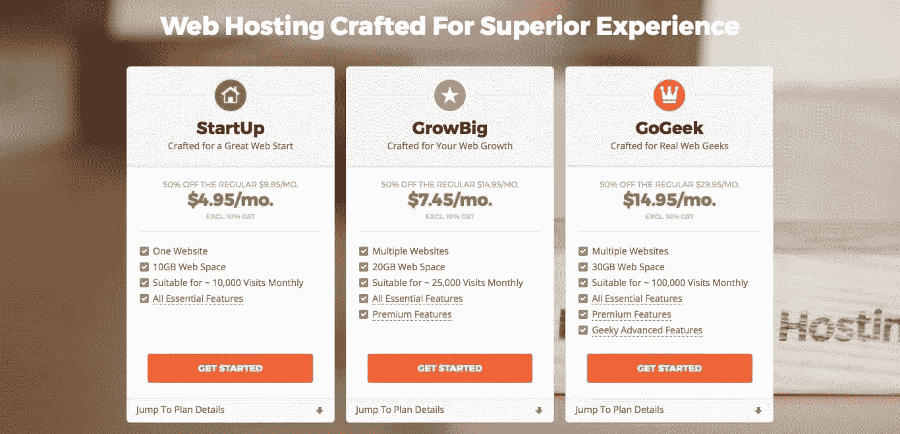
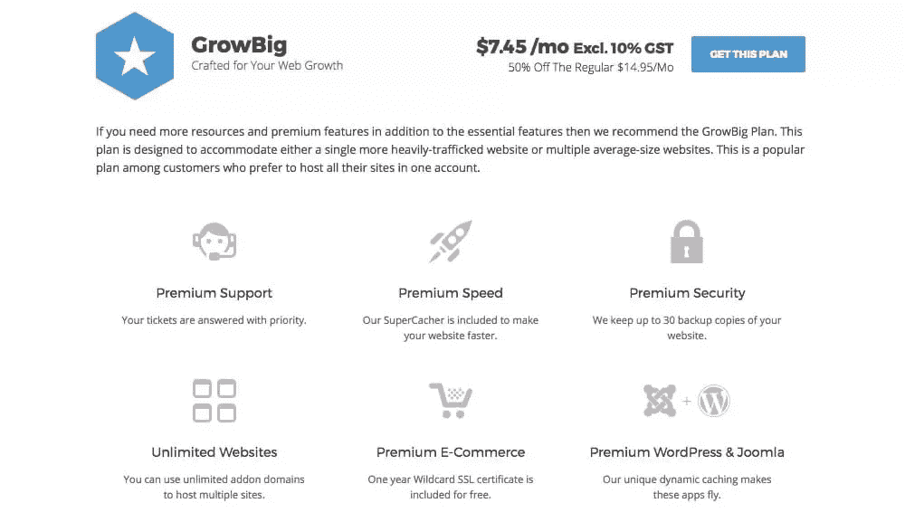
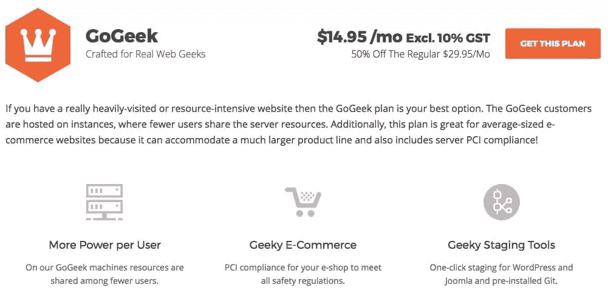

# 网站背景回顾:共享主机越积越多

> 原文：<https://www.sitepoint.com/siteground-review-shared-hosting-stacks/>

你正在选择虚拟主机提供商吗？那么你已经听说过 [SiteGround](https://www.sitepoint.com/go/recommended-hosting-siteground) 了。这是最受欢迎的推荐公司之一。经过 13 年的业务，SiteGround 有丰富的经验提供优秀的托管服务给他们的客户。

令人印象深刻。但是这些评论和建议都是准确的吗？SiteGround 实际上有看起来那么好吗？很明显，它做了很多正确的事情，但如果不注册并尝试一下，很难知道它的表现如何。

所以我就这么做了。

自 2007 年以来，我一直在使用各种主机提供商(包括 GoDaddy 和 Crazy Domains)。2017 年 3 月，我用自己的钱获得了一个 [SiteGround GrowBig 账户](https://www.sitepoint.com/go/recommended-hosting-siteground)，并转让了我的一个网站。

有了四个月使用 SiteGround 及其免费迁移服务、联系支持和评估性能的经验，我还从其他几个方面研究了这家公司:

*   当我为 WordPress 用户写 [5 个主机提供商比较](https://www.sitepoint.com/5-hosting-providers-wordpress-users-compared/)和其他主机相关的文章时，我花了几十个小时比较主机公司。场地比较有利。
*   我有机会在几个场合与管理团队的成员聊天，听取他们对是什么让 SiteGround 脱颖而出的看法。我将在整篇文章中向您详细介绍。

因此，我觉得自己是唯一有资格对 SiteGround 如何应对竞争给出详细意见的人。但首先，它提供了什么计划？

## SiteGround 提供什么计划？

SiteGround 为企业提供[共享托管](https://www.sitepoint.com/go/recommended-hosting-siteground)、[专用服务器](https://www.sitepoint.com/go/recommended-dedicated-hosting-siteground)、[定制托管解决方案。在这篇文章中，我们将重点放在它的三个共享主机计划。](https://www.siteground.com/enterprise-hosting)

### [1。启动计划](https://www.sitepoint.com/go/recommended-hosting-siteground)

> 专为一个伟大的网络开端而设计

*   成本:促销价 3.95 美元/月(标准价 9.95 美元)
*   存储:10GB
*   带宽:每月 10，000 次访问
*   网站:一个

SiteGround 最便宜的计划是为那些从他们的第一个(单一)网站开始的人设计的:

> 启动计划为你提供了容纳一个“刚刚起步”的网站或一个现有的中等规模的博客、个人或商业网站所需的所有基本的主机功能。即使对于拥有合理数量产品的小型网上商店来说，启动计划也很有效。如果你开始定期每月吸引超过 10，000 次的独立访问，你很可能会超出这个计划。

[启动计划](https://www.sitepoint.com/go/recommended-hosting-siteground)提供以下功能和服务:

#### 免费迁移和设置

更换虚拟主机提供商的最大障碍之一是将你的网站迁移到新公司的服务器上的工作量。这个障碍会导致无休止的拖延，让你呆在一家你并不完全满意的公司。

SiteGround 认为用户应该能够在主机平台之间自由移动，所以它为一个网站提供免费的设置和传输。我在从 GoDaddy 迁移我的网站时使用了这项服务，你可以在对 SiteGround 的迁移服务的回顾中了解我的经历。在提供了必要的登录信息并澄清了几个问题后，迁移过程变得快速而轻松。整个过程只花了几天时间(包括 DNS 传播期和其他不可避免的等待时间)。

当然，SiteGround 不是唯一一家提供网站迁移服务的公司。但它是唯一免费做这件事的公司之一——host gator 是另一家。大多数公司将其视为可选的付费附加服务。GoDaddy 的迁移服务收费 99.99 美元，Bluehost 收费 149.99 美元。

#### 免费每日备份

我们都知道电脑备份的重要性，希望我们能为此做些什么。你的网站是又一个需要备份的资源，SiteGround(和大多数主机提供商一起)会免费备份。这很方便，不过我建议你保留自己的备份，作为你定期维护网站的一部分。

当你需要后援的时候，橡胶上路了！恢复您的数据有多容易？还有额外的费用吗？使用 SiteGround 很容易。它让您能够免费恢复您的备份。没有烦恼，没有等待，没有费用。Bluehost 也是如此。

但并不是所有公司都这么容易做到。HostGator 更愿意为您恢复您的网站，所以您填写在线表格请求恢复，然后等待他们来做。

其他公司对每次恢复收费。我很震惊地(艰难地)得知 GoDaddy 收取 149.99 美元来恢复你的网站。这让“免费”备份变得完全不同！

#### 启用 HTTP/2 的服务器

HTTP 是未来，[超文本传输协议(HTTP)](https://www.sitepoint.com/what-is-http2/) 的最新演进。新协议的主要目的是通过减少延迟来加快访问你的网站。它成功了。HTTP/2 大约快十倍！

当网络浏览器和服务器都支持新的协议时，你今天就遇到了障碍。最近版本的 Firefox、Safari、Edge 和 Chrome 都支持 HTTP/2，但是你的 web 主机呢？

对于共享主机，许多主机提供商还不支持 HTTP/2。Bluehost 没有，HostGator 没有，GoDaddy 也没有。SiteGround 有——事实上，它是第一批采用它的网站之一。

#### 免费让我们加密 SSL

安全是一个越来越重要的问题。通过提供 HTTPS 访问，确保您的站点为所有用户提供安全的私有连接。为此，您需要 SSL。

Let's Encrypt 是一项免费的 SSL 服务，对 web 行业来说是革命性的，SiteGround 是第一批支持它的虚拟主机提供商之一。他们会为您设置并负责所有证书更新。其他 SSL 选项也是可用的，其中一个免费包含在更高层的计划中。

与竞争对手相比如何？嗯，你不会得到任何其他入门级主机计划的免费 SSL。GoDaddy 不将它包括在任何共享主机计划中，而 HostGator 和 Bluehost 将它包括在他们更昂贵的第三层计划中。

当然，它们都允许您建立自己的 SSL 解决方案，但是在这个价位上，只有 SiteGround 可以为您完成这项工作。在我们的文章[中了解为什么每个网站都需要 HTTPS](https://www.sitepoint.com/why-every-website-needs-https/) 。

#### 免费 CloudFlare CDN

内容交付网络是提升网站性能的另一种方式。它通过将静态资源存储在其他地方来减轻服务器的负担。这包括图像和其他附件，以及脚本和 CSS 文件。

SiteGround 包括 CloudFlare，这是最受欢迎的 cdn 之一，通过您的共享托管帐户免费提供。

与其他供应商相比如何？虽然 GoDaddy 目前没有在其共享主机计划中包括 CDN，但其他提供商(包括 Bluehost 和 HostGator)也包括 CloudFlare。

#### 24/7 技术支持

人们经常在工作时间之外工作，通常是在午夜之后。你有同感吗？希望您不需要经常联系支持人员，但是当您联系支持人员时，情况可能很紧急，您不想等待答复。

质量 24/7 的技术支持是必须的，SiteGround 拥有业内最好的技术支持。通过聊天和电话，它的响应时间是即时的，通过支持票，响应时间长达 10 分钟。在“站点背景如何叠加？”中了解更多信息本综述的一节。

#### 退款保证

选择虚拟主机提供商可能是一场磨难。要考虑的事情太多了。但是在注册之前，你不会真正了解你的主机提供商。退款保证让你放心。

SiteGround 对其所有共享主机计划提供 30 天退款保证。其他流行的主机提供商也提供类似的条款。

#### cPanel 和 SSH 访问

cPanel 是一个流行的虚拟主机控制面板，允许您轻松访问您的计划的所有功能。SSH 是登录你的网络主机的一种更古怪的方式。SiteGround 和所有流行的主机提供商都提供这两种服务。

#### 固态硬盘存储

固态硬盘存储是大幅提升笔记本电脑速度的一种方式，它比旋转硬盘要快得多。SiteGround 通过在其服务器上仅使用 SSD 存储，为您的网站提供了相同的速度提升。这种做法正在流行，现在其他主机提供商(包括 GoDaddy、Bluehost 和 HostGator)也在这么做。

### [2。GrowBig 计划](https://www.sitepoint.com/go/recommended-hosting-siteground)

> 专为您的网络发展而设计

*   费用:每月 7.45 美元
*   存储:20GB
*   带宽:每月 25，000 次访问
*   网站:多个

SiteGround 的第二层计划旨在应对多个网站或单个网站的更多流量:

> 如果除了基本功能之外，您还需要更多资源和高级功能，那么我们推荐 GrowBig 计划。该计划旨在适应单个流量较大的网站或多个平均规模的网站。这是一个受客户欢迎的计划，他们喜欢在一个帐户中托管他们所有的网站。

除启动计划外， [GrowBig 计划](https://www.sitepoint.com/go/recommended-hosting-siteground)还提供以下功能和服务:

#### 无限的网站

比较 StartUp 和 GrowBig 计划时，你得到的最大提升是能够托管多个网站。虽然入门级计划是为那些只有一个网站的人设计的，但 GrowBig 计划可以使用无限的附加域来托管多个网站。

其他主机提供商遵循同样的模式。因此，如果你从一开始就知道你需要多个站点，那么第一层计划就不适合你。

#### 速度更快的网站的超级缓存器

缓存是加速网站的一个常用策略，当你的网站遇到流量高峰时尤其有效。如果你的虚拟主机没有准备好，当你的网站吸引了大量的访问者时，你的网站可能会变得不可用。超级跑车是 SiteGround 增强性能的秘密武器的一部分。

[他们解释](https://www.siteground.com/blog/supercacher/):

> SuperCacher 是我们在 SiteGround 内部独家开发的网络缓存服务。它位于 web 服务器的前面(例如 Apache)。每当浏览器请求从 SiteGround 的 web 服务器加载网页时，web 服务器会将 HTML 结果返回给浏览器，缓存会存储同一页面的副本。下一次请求特定页面时，在 web 服务器空闲时，请求直接从缓存中得到服务。

该定制解决方案涉及三个级别的缓存:

1.  当一个页面被加载时，*静态缓存*将你的图像、样式表和脚本保存在 RAM 中，这样下次它们会加载得更快。
2.  Memcached 将数据库查询的结果存储在 RAM 中，因此下次查询将是即时的。
3.  对于 WordPress 和 Joomla 用户来说，整个网页都是用*动态缓存*缓存的。

SiteGround 用户对结果很满意。一位用户声称，仅使用 Memcached 就节省了 4 秒钟的加载时间。

大多数主机提供商不提供共享主机方案的缓存解决方案。GoDaddy 没有，Bluehost 没有，HostGator 没有。它们都允许您安装和配置自己的缓存解决方案，但超级缓存在这样一个负担得起的计划中是真正物有所值的，并将给你的网站带来显著的速度提升。

#### 高级电子商务的通配符 SSL

通配符是对 Let's Encrypt SSL 的升级，包含在启动计划中。它们在安全性方面是平等的，但是[通配符提供了两个优势](https://www.siteground.com/kb/differences-between-lets-encrypt-and-the-other-ssls/):

1.  Let's Encrypt 不提供一些访问者可能会感到放心的动态站点密封。通配符有。
2.  使用通配符 SSL，您可以为您的域和所有子域使用一个证书。使用“让我们加密”,您应该为每个人安装单独的证书。

免费提供一年的通配符 SSL 证书。之后，每年续费 70 美元。电动 SSL 是第三种选择，每年售价 499 美元。

SiteGround 将这一功能称为“高级电子商务”，因为 SSL 是安全在线交易的一项重要功能。在我们的文章[中了解更多关于电子商务需要什么，我准备好开一家网上商店了。应该选择什么主机？](https://www.sitepoint.com/im-ready-online-store-hosting-choose/)

#### 高级支持

SiteGround 的支持非常好，但是有了这个计划，它会变得更好。您的票证会优先得到答复，这意味着您可以更快地解决复杂的托管问题。

#### 额外的备份以获得高级安全性

有了这个计划，你会得到额外的安心:你的网站备份存储 30 份。[设计炸弹](https://www.designbombs.com/best-wordpress-hosting/)认为这个计划最好的特点。和往常一样，我建议你也做好自己的备份——安全总比后悔好。

### [3 .go get 计划〔t1〕](https://www.sitepoint.com/go/recommended-hosting-siteground)

> 专为真正的网络极客打造

*   费用:14.95 美元/月
*   存储:30GB
*   带宽:每月 100，000 次访问
*   网站:多个

SiteGround 的顶级共享托管计划旨在应对非常繁忙的网站和中等规模的电子商务网站:

> 如果你有一个访问量很大或者资源密集型的网站，那么 GoGeek 计划是你最好的选择。GoGeek 客户托管在实例上，很少有用户共享服务器资源。此外，该计划非常适合中等规模的电子商务网站，因为它可以容纳更大的产品线，并且还包括服务器 PCI 合规性！

[GoGeek 计划](https://www.sitepoint.com/go/recommended-hosting-siteground)提供以下附加功能和服务:

#### 每用户更高的功率

有了共享主机，许多用户和他们的站点共享一个 web 服务器，大大降低了成本。你们共享相同的硬盘、处理器、内存和其他资源。在我们的文章[共享服务器托管:利与弊](https://www.sitepoint.com/shared-server-hosting/)中了解更多。

使用 GoGeek 计划，您可以与更少的用户共享服务器，从而获得更多的系统资源。这对于一个规模或流量不断增长的网站来说非常理想。

#### 电子商务的 PCI 合规性

为一个电子商务网站选择合适的主机方案是很重要的——有很多独特的要求。如果你将在网上支付，你有更多的注意义务。因此，许多网上银行和支付处理商要求您的主机符合 PCI 标准，以确保您符合所有安全法规。

[GoGeek 计划](https://www.sitepoint.com/go/recommended-hosting-siteground)满足所有合规要求。对于共享主机计划来说，这是非常独特的。大多数竞争对手把如何变得合规留给你，或者给你一个更昂贵的购物车托管计划的选项。

在我们的文章[中了解更多关于在线商店的托管问题，我准备开一家在线商店。应该选择什么主机？](https://www.sitepoint.com/im-ready-online-store-hosting-choose/)

#### 暂存工具

如果你正在考虑定期更新你的网站，或者给它一个重大的重新设计，网站升级会让你的生活更轻松。它允许你在不影响主网站的情况下对“克隆”网站进行修改。这给了你时间来彻底测试这些变化，然后在你准备好的时候把它们推出来。

并非所有的托管计划都提供分期付款。GoGeek 计划提供一键分期，GoDaddy 更昂贵的共享计划也是如此。Bluehost、HostGator 等很多根本不提供。

延伸阅读:

*   [网站搭建入门指南](https://www.sitepoint.com/beginners-guide-website-staging/)
*   [为什么暂存环境对 WordPress 网站至关重要](https://www.sitepoint.com/why-staging-environments-are-critical-for-wordpress-sites/)

## 我应该选择哪个计划？

好吧，这是很多关于 SiteGround 共享主机计划的细节，但哪一个最适合你呢？SiteGround 的[主机功能](https://www.siteground.com/go/article-sp)表将帮助您逐个功能地比较计划。

还在迷茫？以下是一些问题，可以帮助您明确哪个计划符合您的优先事项:

你计划建多少个站点？

*   一个小站点:[启动](https://www.sitepoint.com/go/recommended-hosting-siteground)
*   几个小网站: [GrowBig](https://www.sitepoint.com/go/recommended-hosting-siteground)
*   多个平均规模的站点: [GoGeek](https://www.sitepoint.com/go/recommended-hosting-siteground)

你预计会有多少流量？

*   轻流量(10000 次/月以下):[启动](https://www.sitepoint.com/go/recommended-hosting-siteground)
*   更高的流量(高达 25，000 次访问/月): [GrowBig](https://www.sitepoint.com/go/recommended-hosting-siteground)
*   高流量(每月高达 100，000 次访问): [GoGeek](https://www.sitepoint.com/go/recommended-hosting-siteground)
*   每月超过 100，000 次访问:选择专用服务器或云托管
*   请注意，所有三种共享主机方案都不支持数据传输。

您需要多少存储空间，包括网页、图像、多媒体和附加文件？

*   刚启动(10GB): [启动](https://www.sitepoint.com/go/recommended-hosting-siteground)
*   平均大小(20GB): [GrowBig](https://www.sitepoint.com/go/recommended-hosting-siteground)
*   资源密集型(30GB): [GoGeek](https://www.sitepoint.com/go/recommended-hosting-siteground)

你打算开网店吗？

*   如果是一个产品很少的小型在线商店，启动计划或 GrowBig 计划就足够了
*   但是一般来说，我们推荐电子商务的 GoGeek 计划——它符合 PCI 标准，并且有很大的发展空间。

分期会有好处吗？

*   如果是这样，那就去执行 [GoGeek 计划](https://www.sitepoint.com/go/recommended-hosting-siteground)

成本考虑

*   选择计划时，成本是最不重要的因素。
*   SiteGround 的所有三个计划都是可以负担得起的商业费用，并且可以与其他提供商的计划相媲美。
*   前两个选项之间只有 3 美元，你可以绕过启动计划，直接进入 [GrowBig 计划](https://www.sitepoint.com/go/recommended-hosting-siteground)，除非成本是绝对优先的。

## SiteGround 如何堆叠？

因此，有 SiteGround 的共享主机计划，以及它如何与其他提供商提供的相比。但是公司本身呢？SiteGround 如何堆叠？很好！

SiteGround 是一家令人印象深刻的公司，它关心服务质量，对员工和用户充满热情。以下是一些细节。

### 1.SiteGround 拥有最积极的支持

> 团队完全实现了他们宣称的“顶级的 24/7 支持的卓越虚拟主机解决方案”！谢谢大家！
> 
> —计算机 monkey(@计算机 monkey)[2017 年 8 月 11 日](https://twitter.com/thecompmonkey/status/896062609014661121)