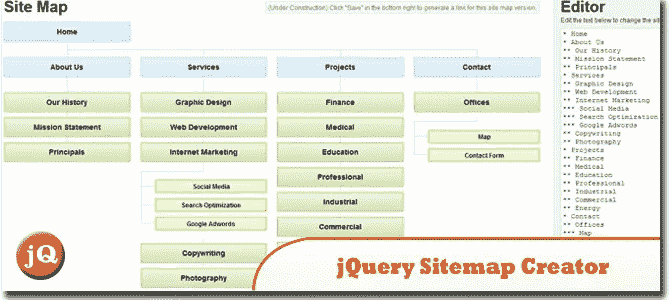
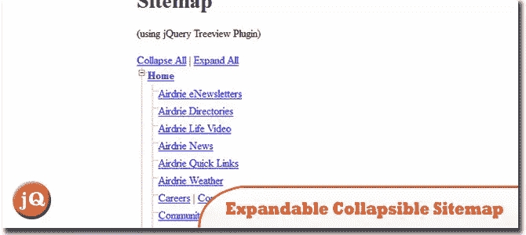
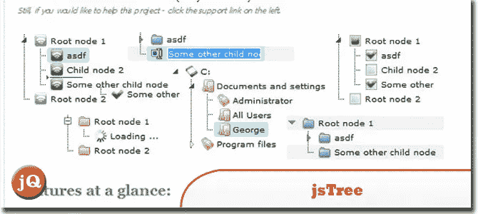
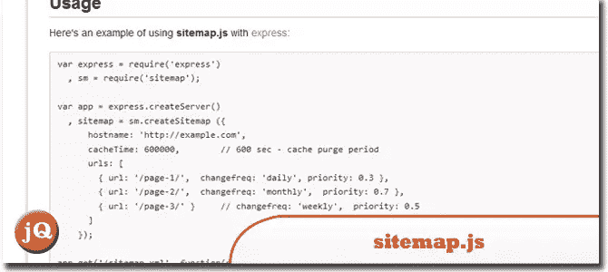

# 5+ jQuery 站点地图插件和生成器工具

> 原文：<https://www.sitepoint.com/sitemap-generator-tools/>

使用 JavaScript(也可能是 PHP)生成站点地图从未如此简单，所以我们分享了我们收集的 **jQuery 站点地图插件和生成器工具**来帮助你创建一个动态的站点地图到你的网站前端，没有任何后端的麻烦。玩得开心！

**相关帖子:**

*   [**庞大的 jQuery 链接&资源列表**](http://www.jquery4u.com/jquery-links/)
*   [**10 在线网站按钮生成器**](http://www.jquery4u.com/tools/10-online-button-generators/)
*   [**18 jQuery 拖拽&掉落插件**](http://www.jquery4u.com/drag-and-drop/18-jquery-drag-drop-plugins/)

## 1.使用 jQuery 站点地图创建器快速构建和共享站点地图

有了这个工具，很容易在网站地图上创建和协作。
 
[来源](http://www.gethifi.com/blog/hifi-sitemap-creator) [演示](http://www.gethifi.com/tools/sitemap)

## 2.用 jQuery 创建一个丰富多彩的站点地图

在这篇演示文章中，我们将构建一个视觉上有趣的网站地图，通过使用颜色使层次结构更加清晰。
 
[来源](http://coding.smashingmagazine.com/2009/01/22/ask-sm-how-to-create-a-colorful-sitemap-with-jquery/) [演示](http://css-tricks.com/examples/Sitemap/)

## 3.带有 jQuery Treeview 插件的可扩展可折叠站点地图

使用 Treeview 插件创建的站点地图演示。
 
[来源](http://designgala.com/expandable-collapsible-sitemap-with-jquery-treeview-plugin/) [演示](http://www.cssbreak.com/examples/sitemap-treeview/)

## 4.jsTree

基于 javascript 的跨浏览器树组件。它被打包成一个 jQuery 插件。绝对免费(许可与 jQuery 相同——根据麻省理工学院许可或 GNU 通用公共许可(GPL)第 2 版的条款)
 
[源代码](https://github.com/vakata/jstree#readme) [演示](http://www.jstree.com/)

## 5.SlickPlan:基于 Web 的网站地图和流程图生成器

一个基于网络的网站地图/流程图生成器，允许创建免费的网站地图和流程图设计。
 
[来源](http://blogfreakz.com/tools/slickplan-web-based-sitemap-and-flowchart-generator/) [演示](http://slickplan.com/login)

## 6.Node.js 中的 XML 站点地图生成器–sitemap.xml.gz

为网站生成 XML 站点地图可以通过 web 应用程序手动完成，也可以由网站自己完成。如果你是技术型的，可能你想使用最后一个选项，亲自控制你的网站上 XML 站点地图的生成。
 
[源+演示](http://www.hacksparrow.com/xml-sitemap-generator-in-node-js-sitemap-xml-gz.html)

## 7.sitemap.js

这是一个用于生成 XML 站点地图的 Node.js 模块。
 
[源+演示](https://github.com/ekalinin/sitemap.js#readme)

## 分享这篇文章