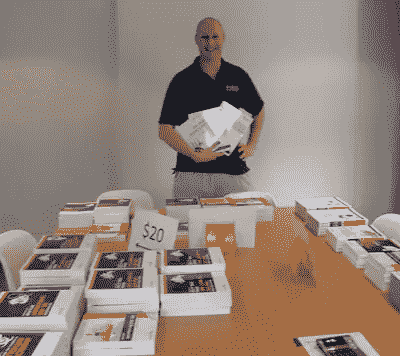
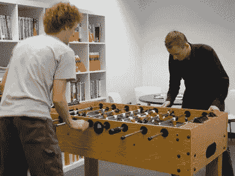

# SitePoint 赠送基于桌上足球技能的书籍！

> 原文：<https://www.sitepoint.com/sitepoint-giving-away-books-based-on-foosball-skills/>

如果你经常订阅 Alex 的 Design View 时事通讯，那么你可能听说过 SitePoint 团队最近搬了办公室——我们现在很高兴地住在我们位于 Collingwood 巴黎端的奢华新居里。为了庆祝这一举动，我们想我们应该向所有的墨尔本顾客敞开大门……举办一场图书销售。

我们在我们所有的办公室书籍库存上贴了一些疯狂的价格，邀请任何住在墨尔本的人(或本周将在墨尔本的人)来抢购便宜货。然而，在典型的 SitePoint 风格中，我们认为我们会给图书销售带来一些变化。

你们都看过那句老掉牙的“买二送一！”以及“买一送二半价！”地毯仓库卖家和 CD 批发商提供的交易。但是说真的，这有什么意思呢？

这是我们的提议:购买**三本书**，你将有机会挑战 SitePoint 团队成员之一，在 office X-box 上进行足球游戏或高速比赛。如果你赢了，你会免费得到第四本书。

现在听起来有趣多了！

今天第一个进门的是[罗汉·鲍曼](http://www.websitesbydesign.com.au/)(下图)，他迅速抢购了一把书:

所以，如果你在科林伍德地区，请在周五关门前随意进来打个招呼。谁知道呢，你可能会有机会给 SitePoint 的联合创始人之一上一堂桌上足球课！

## 分享这篇文章