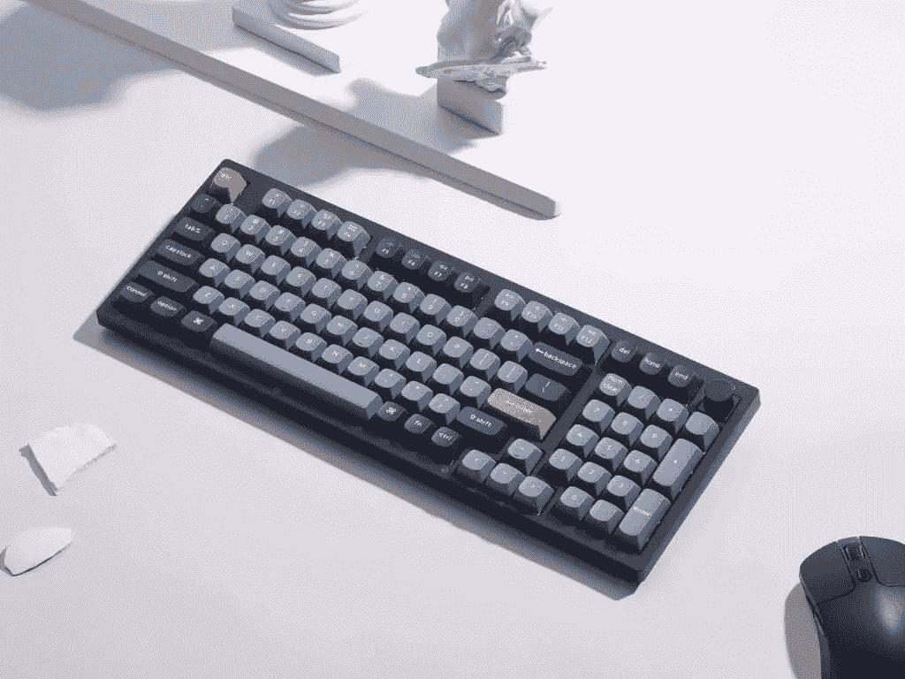
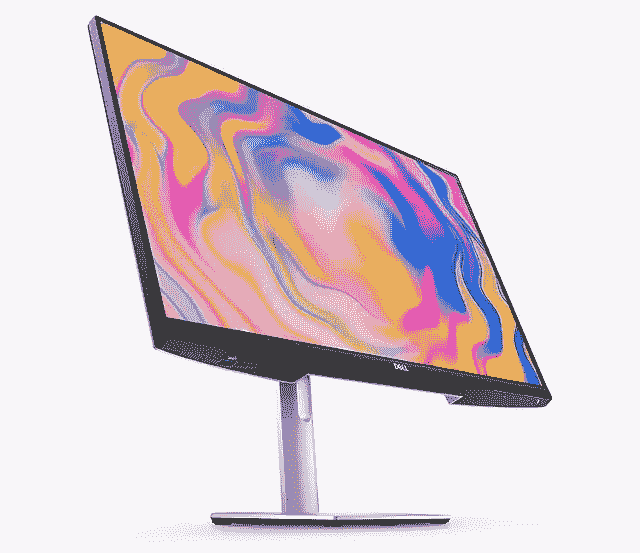
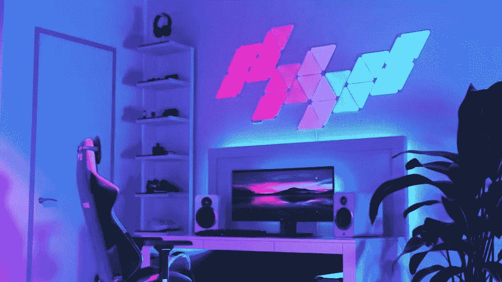
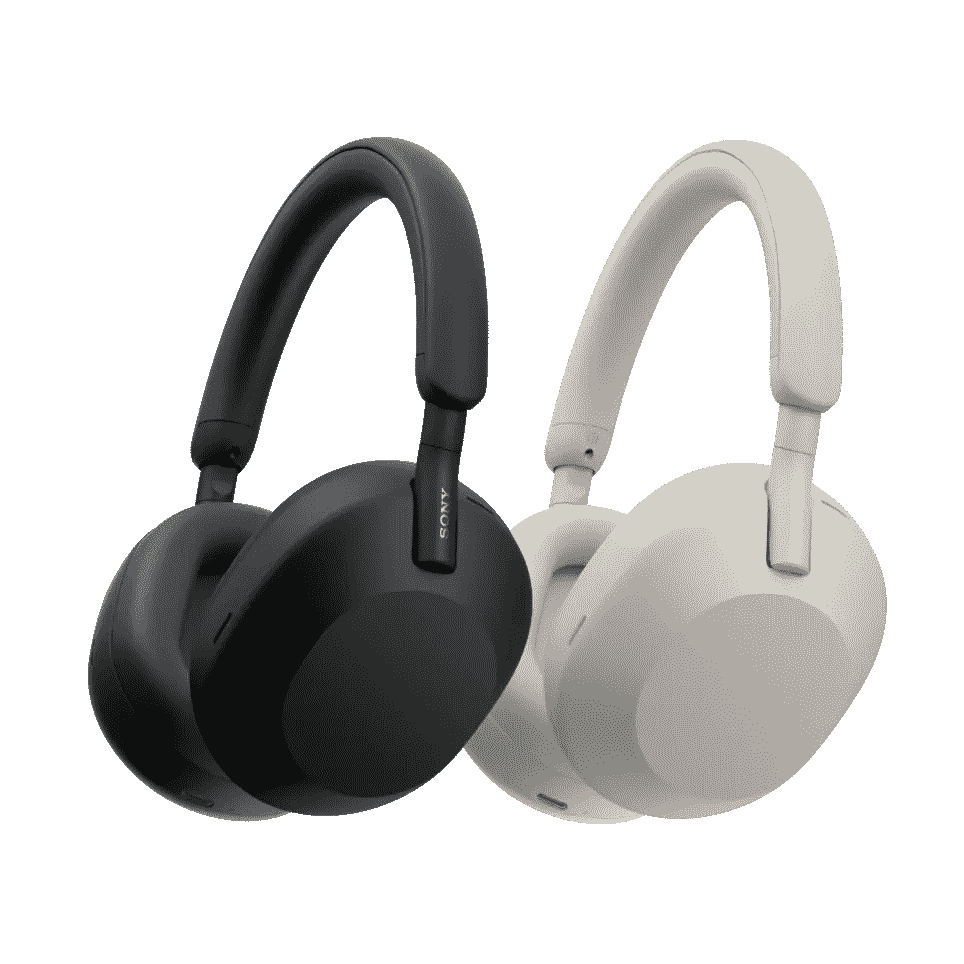
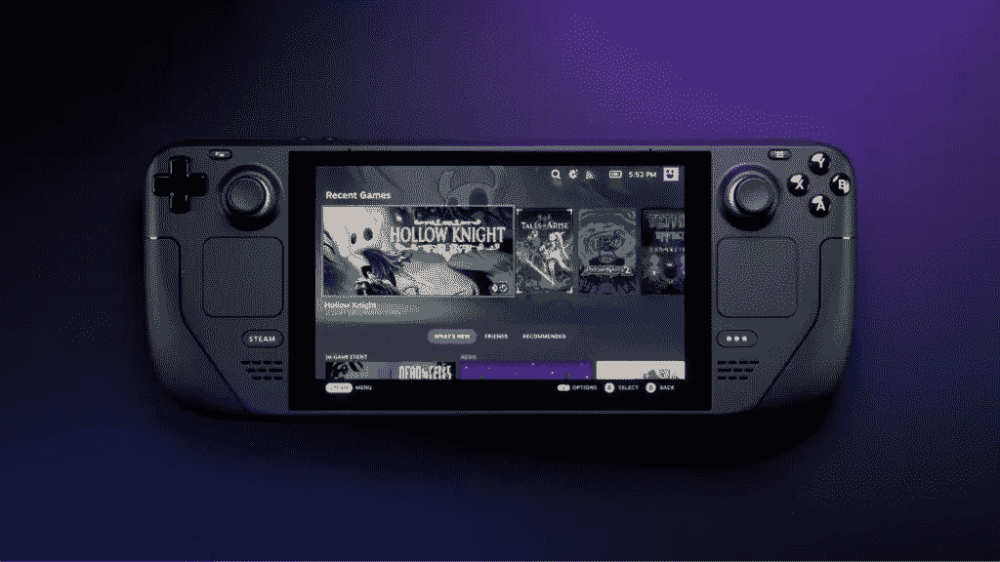
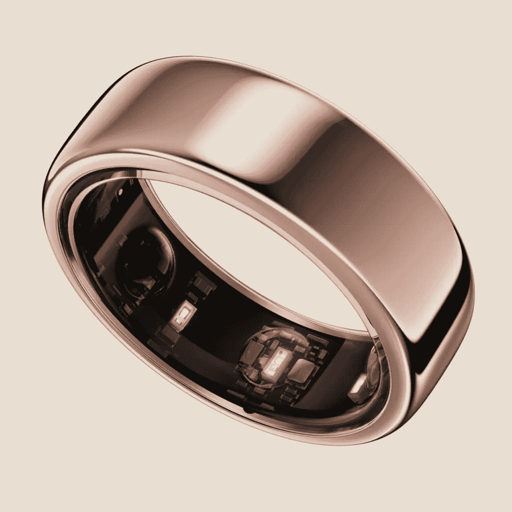
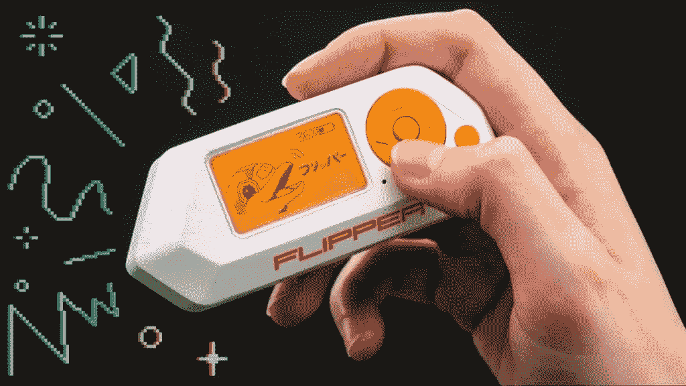

# SitePoint 假日礼品指南 2022

> 原文：<https://www.sitepoint.com/sitepoint-holiday-gift-guide-2022/>

黑色星期五到了——一年中最大的购物日，也是圣诞购物季的非正式开始。如果你还没有决定给你生活中的极客买什么——或者也许你想把一些顶级技术的想法放在你自己的愿望清单上，或者甚至给你自己买！SitePoint 团队提出了一些建议。这是我们的礼物指南，里面有我们希望在圣诞节看到包装在圣诞树下的工具、小配件和玩具！

## 目录

*   [家庭办公室](#h-home-office)
    *   [机械键盘](#h-mechanical-keyboard)
    *   [桌面清理](#h-desk-decluttering)
    *   [监视器](#h-monitor)
    *   [智能照明](#h-smart-lighting)
*   [生产率](#h-productivity)
    *   [笔记本](#h-notebook)
    *   [耳机](#h-headphones)
*   [小工具和玩具](#h-gadgets-and-toys)
    *   [蒸汽甲板](#h-steam-deck)
    *   [金戒指](#h-oura-ring)
    *   [翻板归零](#h-flipper-zero)
*   [教育和职业](#h-education-and-career)
    *   [SitePoint Premium](#h-sitepoint-premium)

## 内政部

### 机械键盘

近年来，机械键盘越来越受欢迎，尤其是在开发人员群体中。这些键盘使用机械开关，比典型的湿软薄膜键盘更能激发自信。更重要的是，它们对你的健康有好处，尤其是如果你是一个繁重的打字员。我们喜欢 [Keychron V5 QMK 定制机械键盘](https://www.keychron.com/products/keychron-v5-qmk-custom-mechanical-keyboar)。它经济实惠、可定制、坚固、超级稳定，并且是无线的。如果钥匙环不适合你，有一系列很好的选择；点击查看[我们的概览。](https://www.sitepoint.com/best-mechanical-keyboards/)

### 桌面清理

Grovemade 的[书桌搁板系统](https://grovemade.com/desk-shelf-system/)是一个组合式显示器升降器和智能存储系统，有三种尺寸可供选择。它看起来很棒，还能方便地存放所有堆满桌子的东西。

### 班长

我们喜欢戴尔 27 4K UHD USB-C 显示器–s 2722 QC。这是 Wirecutter 的[目前选择的最佳 4K 显示器](https://www.nytimes.com/wirecutter/reviews/best-4k-monitors/)，称“这是一款高质量、色彩准确的显示器，可以通过 USB-C 为你的笔记本电脑充电，而且价格也不贵。”

### 智能照明

我们喜欢 [Nanoloeaf 的智能灯](https://nanoleaf.me/en-US/)，它非常适合提供时髦、可定制的装饰，还可以在缩放通话时提供有趣的背景。它们提供了一种定制办公室外观的方式，并在沉闷的日子里增加额外的照明。此外，你可以通过一个方便的应用程序改变灯光的情绪。

## 生产力

### 笔记本

我们喜欢 Moleskine 智能笔记本电脑系统。智能笔记本系统由高端笔记本品牌制造，多年来一直是无数设计师的座上宾，它将事物提升了一个档次。它允许以前只存在于纸上的笔记无缝过渡到数字领域。

[https://www.youtube.com/embed/-mEmh6APKjQ?feature=oembed](https://www.youtube.com/embed/-mEmh6APKjQ?feature=oembed)

### 耳机

如果你需要在办公室集中注意力，或者在咖啡店或公共交通工具上工作，有效的噪音消除是必须的。最受欢迎的挂耳式无线耳机是索尼 WH-1000XM5 ，因其顶级的噪音消除和出色的音质而受到称赞。

## 小工具和玩具

### 蒸汽甲板

*热门的新游戏平台， [Steam Deck](https://store.steampowered.com/steamdeck) 让您可以随时随地访问您的 Steam 库。更重要的是，有了 dock，你甚至可以用它来进行开发工作，所以它几乎可以算作一项工作支出！*

 *### 欧拉环

当然，有许多可穿戴设备可以提供睡眠和健康跟踪，但 [Oura ring](https://ouraring.com/oura-experience) 时尚、低调，看起来很酷。它提供高级睡眠跟踪、可操作的恢复目标，并提供长电池寿命。

### 脚蹼零

可能*终极黑客的小工具， [Flipper Zero](https://flipperzero.one/) 是一个整洁的开源便携式多功能工具，可以探索数字材料。您可以使用它与无线电协议、访问控制系统、硬件等进行交互。它提供了大量的连接，包括低于 1 GHz 的收发器，RFID，蓝牙和红外。*

 *## 教育和职业

### SitePoint Premium

当然，这是一种无耻的自我推销，但我们真的认为 SitePoint Premium 会员是难以置信的价值！我们有涵盖各种主题的书籍、课程和技术讲座，包括 JavaScript、PHP、Python、设计、UX、DevOps 等等。现在，我们已经为 12 个月的会员提供了一个令人难以置信的黑色星期五交易，你可以通过代金券将它送给你爱的人、同事，甚至是你自己！** 

## **分享这篇文章**