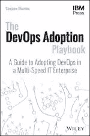
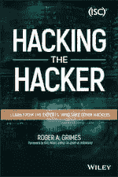

# SitePoint Premium 新版本:网络安全和 DevOps 采用

> 原文：<https://www.sitepoint.com/sitepoint-premium-new-releases-cybersecurity-devops-adoption/>

我们正努力通过 SitePoint Premium 让您在自己的领域保持领先地位。我们有很多新书可以在图书馆借阅——让我们给你介绍一下。

## DevOps 领养行动手册

这本获奖的书提供了关于在大规模企业 IT 环境中实施 DevOps 的可操作的现实指导，解释了如何以低成本和低风险实现高价值的创新和优化，并以更高的产品发布效率超越传统的业务目标。

➤阅读了 DevOps 领养手册。

## 黑客入侵

在本书中，顶级道德黑客讨论了高级持久威胁、公钥加密、防火墙、黑客汽车、工具和技术、社会工程、密码学、渗透测试、网络攻击、给年轻黑客父母的建议、道德黑客守则等等。

➤阅读[黑客黑客](https://www.sitepoint.com/premium/books/hacking-the-hacker/read?utm_source=blog&utm_medium=articles)。

## 还会有更多…

我们几乎每天都在 SitePoint Premium 上发布新内容，所以下周我们将带着最新更新回来。别忘了:如果你还没有查看我们的产品，可以去我们的[图书馆转转](https://www.sitepoint.com/?utm_source=blog&utm_medium=articles)。

## 分享这篇文章