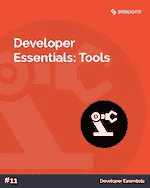
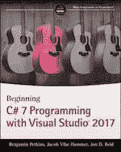
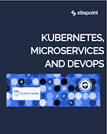

# SitePoint Premium 新版本:开发工具、C#和 Kubernetes

> 原文：<https://www.sitepoint.com/sitepoint-premium-new-releases-dev-tools-c-kubernetes/>

我们正努力通过 SitePoint Premium 让您在自己的领域保持领先地位。我们有很多新书可以在图书馆借阅——让我们给你介绍一下。

## 开发人员必备:工具

在这个简短的集合中，我们收集了一些可用的最佳开发工具，提供了一些关于如何使用 Gulp 改进工作流程以及如何编写更好的 JavaScript 的技巧。

➤阅读了[开发者基础:工具](https://www.sitepoint.com/premium/books/developer-essentials-tools/read?utm_source=blog&utm_medium=articles)。

## 使用 Visual Studio 2017 开始 C# 7 编程

在本书中，顶级道德黑客讨论了高级持久威胁、公钥加密、防火墙、黑客汽车、工具和技术、社会工程、密码学、渗透测试、网络攻击、给年轻黑客父母的建议、道德黑客守则等等。

➤阅读[开始用 Visual Studio 2017](https://www.sitepoint.com/premium/books/beginning-c-7-programming-with-visual-studio-2017/read?utm_source=blog&utm_medium=articles) 进行 C# 7 编程。

## Kubernetes、微服务和 DevOps

Kubernetes 的容器编排指南。本版本指南提供了一个阅读指南，由版本大师 Adam Roberts 策划。它将涵盖安装、对象、集群交互、部署等等。

➤阅读了 Kubernetes、微服务和 DevOps。

## 还会有更多…

我们几乎每天都在 SitePoint Premium 上发布新内容，所以下周我们将带着最新更新回来。别忘了:如果你还没有查看我们的产品，可以去我们的[图书馆转转](https://www.sitepoint.com/?utm_source=blog&utm_medium=articles)。

## 分享这篇文章