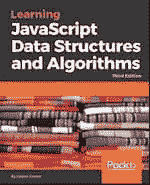
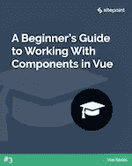
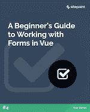
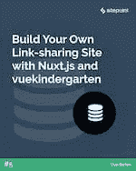

# SitePoint Premium 新版本:更多 Vue、Nuxt.js + JS 数据结构

> 原文：<https://www.sitepoint.com/sitepoint-premium-new-releases-more-vue-nuxt-js-js-data-structures/>

我们正努力通过 SitePoint Premium 让您在自己的领域保持领先地位。我们有大量新书和迷你书可以在图书馆借阅——让我们向你介绍一下。

## 学习 JavaScript 数据结构和算法第三版 Packt

创建经典的数据结构和算法，如深度优先和广度优先搜索。您还将学习递归、使用 JavaScript 的堆数据结构、如何实现通用数据结构等等。

阅读[学习 JavaScript 数据结构和算法第三版](https://www.sitepoint.com/premium/books/learning-javascript-data-structures-and-algorithms-third-edition/)。

## 在 Vue 中使用组件的初学者指南

在 Vue 中使用组件的介绍。我们将了解如何创建组件，如何在组件之间传递数据(通过 props 和事件总线)以及如何使用 Vue 的`<slot>`元素在组件中呈现附加内容。

阅读[在 Vue](https://www.sitepoint.com/premium/books/a-beginner-s-guide-to-working-with-components-in-vue/) 中使用组件的初学者指南。

## 在 Vue 中使用表单的初学者指南

了解如何在 Vue 中使用表单。我们将从创建一个简单的表单开始，看看如何使用双向数据绑定来保持用户输入与我们的数据模型同步。然后我们将看看修改器和过滤器，并以验证结束。每个部分都有一个可运行的 CodePen 演示。

阅读[在 Vue](https://www.sitepoint.com/premium/books/a-beginner-s-guide-to-working-with-forms-in-vue/) 中使用表单的初学者指南。

## 用 Nuxt.js 和 vue-幼儿园建立你自己的链接分享网站

在本教程中，我们将创建我们自己的链接共享新闻网站，很像 Echo JS 或 Hacker News，带有评论和向上投票。我们将使用的技术栈由 Vue.js、Nuxt.js Vue 框架和一个名为 Vue-幼儿园的访问控制/授权库组成。

阅读[用 Nuxt.js 和 vue-幼儿园](https://www.sitepoint.com/premium/books/build-your-own-link-sharing-site-with-nuxt-js-and-vue-kindergarten/)建立你自己的链接分享网站。

## 还会有更多…

我们几乎每天都在 SitePoint Premium 上发布新内容，所以下周我们将带着最新更新回来。别忘了:如果您还没有查看我们的产品，请参加我们的 [7 天免费试用](https://www.sitepoint.com/)。

## 分享这篇文章