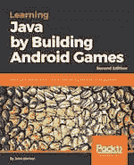
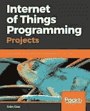
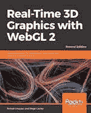
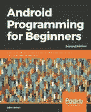
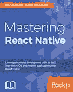
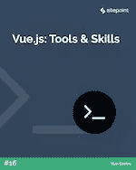
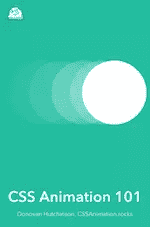
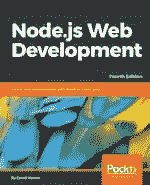

# SitePoint Premium 新版本:Node、Android、React Native 等等

> 原文：<https://www.sitepoint.com/sitepoint-premium-new-releases-node-android-react-native-more/>

我们正努力通过 SitePoint Premium 让您在自己的领域保持领先地位。我们有大量新书和迷你书可以在图书馆借阅——让我们向你介绍一下。

## 用 PHP、MySQL 和 JavaScript 掌握更快的网络

借助先进的 PHP、SQL 和 JS 技术，让数据驱动的 web 应用程序运行得更快。确保无缝实现基于 JS、HTML 5 和 CSS 的前端和基于 PHP 的后端。了解问题识别、最佳策略和 UI 设计模式，并构建一个干净、快速的 web 应用程序。

阅读[用 PHP、MySQL、JavaScript](https://www.sitepoint.com/premium/books/mastering-the-faster-web-with-php-mysql-javascript/) 掌握更快的网络。

## 通过构建 Android 游戏学习 Java 第二版

用 Java 为 Android 平台开发引人入胜的游戏。从头开始学习 Java、Android 和面向对象编程。建立游戏，包括潜艇猎人，复古乒乓，子弹地狱。创建和设计你自己的游戏，比如一个开放世界的平台游戏。

阅读[通过构建 Android 游戏学习 Java 第二版](https://www.sitepoint.com/premium/books/learning-java-by-building-android-games-second-edition)。

## 物联网编程项目

这本书是一个实用的，基于项目的指南，帮助您建立和控制您的物联网项目。通过 Raspberry Pi 3 和 Python 的结合，充分发挥物联网的潜力。利用物联网构建复杂的基于 Python 的应用。参与各种物联网项目，了解电子基础知识。

阅读[物联网编程项目](https://www.sitepoint.com/premium/books/internet-of-things-programming-projects/)。

## 使用 WebGL 2 的实时 3D 图形–第二版

使用 JavaScript 和 WebGL 2 为 web 创建交互式、视觉震撼的高性能 3D 应用程序。这个关于 3D 计算机图形的完整课程涵盖了渲染、3D 数学、照明、相机等，解锁了各种新的和先进的 WebGL 2 功能。

使用 WebGL 2 阅读[实时 3D 图形–第二版](https://www.sitepoint.com/premium/books/real-time-3d-graphics-with-webgl-2-second-edition/)。

## 面向初学者的 Android 编程——第二版

通过这个 Java，via Android 的基本原理介绍，您将学习所有您需要的 Java 和 Android 技能，以实用可行的步骤开始制作强大的移动应用程序，以及如何将应用程序发布到 Google Play marketplace。

阅读 [Android 编程初学者第二版](https://www.sitepoint.com/premium/books/android-programming-for-beginners-second-edition/)。

## 掌握 React Native

借助 React 的所有本机构建模块，快速创建专业、前沿的应用程序。了解如何应用 Flexbox、构建丰富的动画、集成第三方库、开发定制组件、将 React Native 与 Redux、Redux 中间件、远程 API 等结合起来。

阅读[掌握 React 原生](https://www.sitepoint.com/premium/books/mastering-react-native/)。

## Vue.js:工具和技能

在本书中，我们将研究一些最流行的 Vue.js 工具，并了解一些相关的技能，这些技能将帮助您成为 Vue 开发专家。

阅读 [Vue.js:工具&技能](https://www.sitepoint.com/premium/books/vue-js-tools-skills/)。

## CSS 动画 101

我们将学习 CSS 过渡和动画。到本书结束时，你会对 CSS 动画以及创建和实验我们自己的工具有一个很好的理解。

阅读 [CSS 动画 101](https://www.sitepoint.com/premium/books/css-animation-101/) 。

## 如何用 Vue.js 构建游戏

在本教程中，我们将探索 Vue 的一个不太明显的用途:游戏开发。我们将建立一个流行的配对游戏的电子版本。

阅读[如何用 Vue.js](https://www.sitepoint.com/premium/books/how-to-build-a-game-with-vue-js/) 构建游戏。

## Node.js Web 开发第四版

使用 Node.js、Docker、MySQL、MongoDB 和 Socket.IO 创建实时应用。了解实时部署，包括 HTTPS 和强化安全性、最新的 js 功能和 es 模块，并了解使用 Node.js 10 开发健壮应用的不同阶段。

阅读 [Node.js Web 开发第四版](https://www.sitepoint.com/premium/books/node-js-web-development-fourth-edition/)。

## 还会有更多…

我们几乎每天都在 SitePoint Premium 上发布新内容，所以下周我们将带着最新更新回来。别忘了:如果您还没有查看我们的产品，请参加我们的 [7 天免费试用](https://www.sitepoint.com/premium/sign-up?step=0)。

## 分享这篇文章