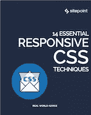

# SitePoint Premium 新版本:响应式 CSS + React Native

> 原文：<https://www.sitepoint.com/sitepoint-premium-new-releases-responsive-css-react-native/>

我们正努力通过 SitePoint Premium 让您在自己的领域保持领先地位。我们有很多新书可以在图书馆借阅——让我们给你介绍一下。

## 14 种基本的响应 CSS 技术

在 6 个简单的章节中，我们将帮助你获得响应 CSS 技术的基础，帮助你使你的网站和应用程序在任何设备上都看起来很棒。

从检查 em 响应单元开始，强调它的缺点，然后转到 rem 单元，以及它如何克服这些缺点。

最后，我们将看看媒体查询如何与 em 和 rem 一起工作，以提供一个完整的响应性 web 设计解决方案。

➤阅读了 [14 种基本的响应 CSS 技术](https://www.sitepoint.com/premium/books/14-essential-responsive-css-techniques/?utm_source=blog&utm_medium=articles)。

## 在 React Native 中使用 Android 原生模块

在本教程中，我们将开发一个简单的应用程序来显示当前的电池百分比和充电状态。为此，我们将创建一个带有获取所需信息的方法的本机模块。

➤在 React Native 中使用 Android 原生模块阅读[。](https://www.sitepoint.com/premium/books/using-android-native-modules-in-react-native/?utm_source=blog&utm_medium=articles)

## 还会有更多…

我们会定期在 SitePoint Premium 上发布新内容，因此我们将在下周为您带来最新更新。别忘了:如果你还没有查看我们的产品，可以去我们的[图书馆转转](https://www.sitepoint.com/?utm_source=blog&utm_medium=articles)。

## 分享这篇文章