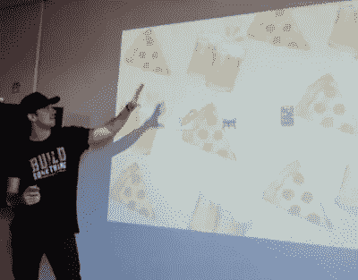
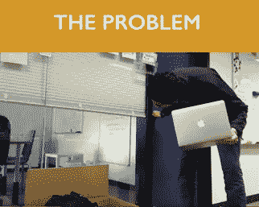
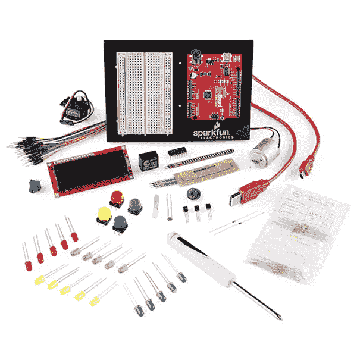
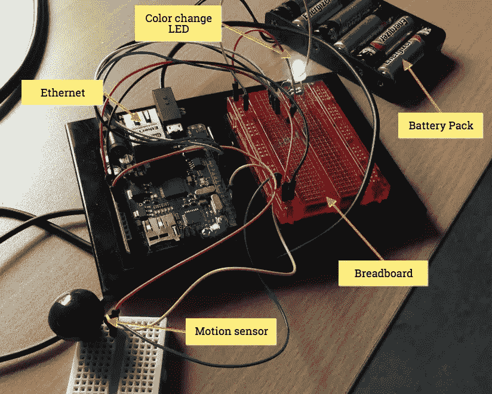
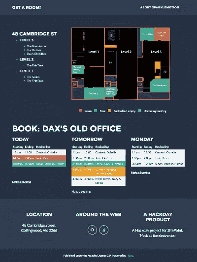
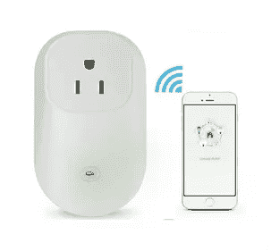
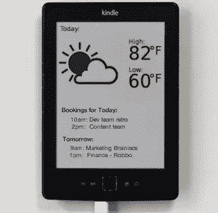

# SitePoint/Flippa 黑客日:入侵我们的第一个物联网项目

> 原文：<https://www.sitepoint.com/sitepointflippa-hack-day-hacking-first-iot-project/>


SitePoint 的第 10 周！整个星期，我们都在发布关于互联网和物理世界的交集的文章，所以请继续查看[物联网标签](https://www.sitepoint.com/blog/)以获取最新更新。

最近，在 SitePoint，我们与[Flippa.com](http://flippa.com/)联合举办了首次全公司范围的[黑客日](https://gitblame.flippa.com/2016/06/06/hack-day.html)。



周四上午以“开放式麦克风”会议开始，公司的任何人都可以提出他们喜欢的任何想法。每个人都投票选出他们最喜欢的，我们有两天的时间来计划、构建并在周五晚些时候向小组提交我们的想法。

这很严肃，还有奖品——我们甚至做了 t 恤衫！

## 音高

一些精彩的推介包括:

*   免费给你的祖母寄一张印有个人信息的明信片。
*   **Bot-bot:** 一个赛事/乒乓球/足球组织 Slackbot。
*   **少数派报告:**对历史记录使用机器学习以获得更好的网站估值。
*   通过更好地了解客户，为他们提供更好的选择。

然而，这篇文章是关于 SitePoint 首席开发人员 Jude Aakjæ提出的一个物联网想法。

## 裘德的想法:火花运动

你可能不知道，SitePoint 总部实际上是一个开放式的三层建筑，目前容纳了四家共享资源的公司——[Flippa.com](https://flippa.com/)、【Influx.com】T2、[PromisePay.com](https://promisepay.com/)，当然还有 SitePoint。在整栋建筑中，我们有各种大小的会议室和会议室。



### 问题？开房

虽然我们有预订这些房间的日程安排系统，但公平地说，并没有严格遵守。

此外，人们经常需要在没有事先通知的情况下使用 Skype、视频聊天或打电话。你会看到这些可怜的人带着笔记本电脑在大楼里跌跌撞撞地走着，在百叶窗下偷看，寻找一个避难所。

Jude 的想法是构建物联网硬件和软件，这些硬件和软件将知道哪些房间目前被占用，并通过现场指示灯和网络前端随时提供这些信息。他将其命名为“火花运动”，并希望建立一个概念的证明。这将是我们的第一个物联网项目。


团队火花

虽然 Sparklemotion 在技术上没有赢得投票，但我们中的一些人受到了足够的启发，无论如何都想继续努力。谁说这是民主了？

我们自行组建的团队是我们的系统管理员亚当·博尔特(Adam Bolte)，SitePoint 执行主编 Adam Roberts，安吉拉·摩琳娜和 SitePoint 设计和 UX 编辑亚历克斯·沃克(Alex Walker)。

我们当中有谁以前制造过电子产品吗？没有。但是我们一起看了《麦克盖佛》的大部分剧集，所以我们觉得准备得很充分。

## 范围

我们估计在两天内可能会建造:

*   支持互联网的 Arduino 单元，带运动传感器单元
*   监控信令的简单服务器
*   web 前端

## 1.硬件构建

在 Hack Days 开始之前，我们已经在办公室里推广了 SparkleMotion 的概念，并发现了它需要如何工作的基本原理。办公室周围的一些人捐赠了 Arduino 套件，并采购了一个 [PIR](https://en.wikipedia.org/wiki/Passive_infrared_sensor) 运动传感器。

由于团队中没有人使用过 Arduino，我们的 C 技能徘徊在生疏和不存在之间，我们发现 [Sparkfun](https://www.sparkfun.com/products/12060) 工具包中的设置说明非常方便。它有一些很棒的初学者教程，我们广泛地用它来研究 Arduino 是如何工作的。

Arduinos 非常适合这种黑客行为，你可以不用焊接，只需要相当有限的编程技能，就可以快速制作出一个电子产品的原型。它们由一个带有几个数字和模拟 I/O 引脚的微控制器组成，可以插入灯、电机、传感器、LCD 板，以及你能想象到的任何东西！

我们得到了我们的 SparkFun 板，并开始玩…

我们的基本作战计划是

*   开灯和关灯！
*   让 RGB 灯工作
*   设计出运动传感器
*   和互联网对话！

开灯和关灯[非常简单](https://learn.sparkfun.com/tutorials/sik-experiment-guide-for-arduino---v32/experiment-1-blinking-an-led)，所以我们很快转向开着 RGB 灯的。这表明读写数据有两种方式，模拟和数字。数字写入包括打开或关闭开关，在我们的 RGB LED 示例中，这意味着循环切换三个开关提供的所有组合。

```
// Red (turn just the red LED on):

digitalWrite(RED_PIN, HIGH);
digitalWrite(GREEN_PIN, LOW);
digitalWrite(BLUE_PIN, LOW); 
```

然而，通过做一个`analogWrite`，我们可以将每种颜色设置为特定的强度，从 0 到 255。这意味着我们可以书写更大范围的颜色。

```
// Whatever values we want!
analogWrite(RED_PIN, 4);
analogWrite(BLUE_PIN, 200);
analogWrite(GREEN_PIN, 150); 
```

在惊讶地看到 LED 穿过彩虹的所有颜色后，我们将注意力转向了 PIR 传感器。不幸的是，我们没有为我们购买的传感器提供任何文档，然而，一些互联网调查发现我们的 PIR 有接地、电源和信息引脚。我们插上电源，写了一些代码，然后开始测试！这就是数字和模拟的区别变得明显的地方。通过使用`digitalRead`,我们得到了 1 或 0；动议或不动议。

然而，通过使用`analogRead`,我们得到了一个从 0 到 255 的值，基于运动的接近度和强度。从 PIR 中获取模拟值，并将其插入 LED 的模拟彩色显示器，这意味着我们的灯会根据您的接近程度改变颜色。相当酷！

所以现在我们有了一个对运动有反应的灯，下一步是把它连接到互联网上。这就是 Arduino 规范真正拯救我们的地方。怎么会？Sparkfun 板没有任何开箱即用的互联网连接，但我们也有[另一个 Arduino](https://www.arduino.cc/en/Main/ArduinoBoardEthernet) 板，*有*内置以太网端口！由于 Arduino 的标准形状和引脚位置，我们在不同的电路板上实现了零故障的提升和移位移植！

我们在这个项目中发现的一件事是 Arduino 社区绝对令人敬畏，并且有你需要的几乎所有东西的大量例子。快速搜索让我们找到了与互联网沟通的教程，在初步测试后，我们根据自己的特殊需求进行了调整。在这种情况下，与 web 应用程序通信。





## 2.服务器

SparkleMotion 的宏伟愿景不仅仅是显示一个房间的状态，我们希望能够显示多个房间，并连接到日历上，以显示即将发生的事件。由于 SitePoint 广泛使用 [RoR](http://rubyonrails.org/) ，这是在中构建快速 API 的合理选择。当然，我们可以用[仙丹](http://elixir-lang.org/)或 [Node.js](https://nodejs.org/) 来编造一些东西，但是考虑到时间紧迫，我们决定用我们知道的东西！

尽管如此，我们还是尝试了 Rails 5，尤其是项目创建的 [API only](http://edgeguides.rubyonrails.org/api_app.html) 方法，它精简了`rails new`生成的内容。在对一个简单的房间模型建模之后，我们继续创建一个简单的控制器来更新房间状态，或者显示房间状态。

```
class RoomsController < ApplicationController
  before_action :ensure_valid_room

  def state
    render plain: room.state
  end

  def update
    room.update_attribute(:occupied, params[:state] == "1")
    render :ok
  end

  private

  def room
    @_room ||= Room.where(id: params[:id] || params[:room_id]).first
  end

  def ensure_valid_room
    not_found if room.nil?
  end
end 
```

为了获得日历预订，我们开始探索 [Google Calendar API](https://developers.google.com/google-apps/calendar/quickstart/ruby) 来从我们的共享日历中获取数据。然而，在最后一天时间紧迫的情况下，我们做了所有伟大的黑客项目都会做的事情……伪造！ [Google API Explorer](https://developers.google.com/apis-explorer/) 是一个很棒的工具，可以进行真正的 API 调用，看看你会得到什么数据。我们使用[事件列表](https://developers.google.com/apis-explorer/#p/calendar/v3/calendar.events.list) API 调用来获取我们的工人服务将来会使用的格式的真实数据，并将其存储在数据库中。嘿，如果组装它对第一个 iPhone 演示来说足够好，那么对我们来说也足够好！

一旦我们针对房间存储了我们的事件，检查是否有任何事件安排在接下来的 15 分钟内，或者是否有事件安排在现在，这是一个简单的任务。[范围#封面？](http://ruby-doc.org/core-2.3.0/Range.html#method-i-cover-3F)方法在这里真的很方便，我们可以很好的利用 ActiveSupport 的时间扩展。

```
# event is our parsed JSON event from the Google Calendar API
start_date = event['start']['dateTime'].to_datetime
if ((start_date - 15.minutes) ... start_date).cover? Time.current
  return true
end 
```

有了这些，现在显示四种不同的房间状态就变得很简单了:

*   房间被占了！
*   空的，但是很快会有预订
*   空的但是现在被预订了
*   空的

## 3.Web 前端

我们想要一个相当吸引人的视觉展示，展示哪些房间是免费的，显然，我们很快就需要它。Alex 通过整合以下组件专注于前端:

*   [雨果](https://gohugo.io/)静止站点发电机
*   [自由职业者模板](http://themes.gohugo.io/freelancer/)
*   SVG 地图组件
*   日历组件

我们从 [Hugo](https://gohugo.io/) 开始——一个用 go 编写的伟大的静态站点生成器。你可以将网站创建为 HTML 组件——导航、页脚等 Hugo 将这些组件编译成一个静态网站，以备上传。这是让一个基本的站点结构快速工作的快速方法。

[](https://www.sitepoint.com/wp-content/uploads/2016/06/1467171756iot-sparkfun_007.png)

Hugo/sparkle motion 前端

Hugo 还有一个很棒的主题系统，让我们可以在几秒钟内获得一个真实的外观和感觉。我们选择了[自由职业者主题](http://themes.gohugo.io/freelancer/)作为我们的出发点，因为它有着酷炫的外观和简洁实用的布局。

Alex 从头开始绘制 SVG 计划，踱步出大楼以获得粗略的比例。CSS 类是为房间状态创建的。

### 房间状态

我们决定了四种房间状态，用四种颜色表示。

1.  红色-房间已被占用！
2.  绿色–空的
3.  蓝色–空着，但很快就会有人预订
4.  黄色–空着，但现在已被预订

Adam Roberts 编写了一些 JavaScript 代码，从服务器获取信号，并在 SVG 中的相应房间 ID 上附加了一个额外的 CSS 类。

最终，我们知道我们需要将来自传感器的数据与来自日历的数据集成在一起，但对于 v0.1，我们只想得到我们的前端地图，显示有人使用传感器时的情况。

我们测试了又测试，准备了又准备。

## 周五下午 4:00:表演时间，表演时间！

[](https://www.sitepoint.com/wp-content/uploads/2016/06/1467171761iot-sparkfun_008.jpg)

我们聚集在桑拿房里，每个团队都展示了他们的项目。Angela 是我们的主讲人，她带领观众了解了我们的构建流程和问题。

然而，当我们将现场网络前端放到投影仪屏幕上，裘德走向监控会议室时，关键时刻到来了。紧张的几秒钟过去了，我们看着地图上的绿色房间，等待它变成红色…

令我们大为欣慰的是，的确如此，房间里一片欢呼。

我们不得不说:制造在现实世界中运行而不是完全躲在屏幕后面的硬件是一种不同的感觉。

## 决定

面对一些激烈的竞争，这是一场势均力敌的比赛。获胜者将由 hack day 参与者投票和 Flippa 首席执行官和 SitePoint GM 分别打分选出。

《少数派报告》在展示了亚马逊机器学习服务的一些很酷的应用程序后，赢得了参与者的投票。

但赢得评委奖的是火花运动。耶！团队火花获得集体午餐和机会，把事情发展到下一个水平。

## 那么，现在去哪里？

### 第一步:gcal 整合

通过点击地图预订房间感觉比点击日历更自然。将 GCal API 插入 web UI 应该不会花太长时间。

#### 第二步:安装六个房间传感器

我们的下一步是在每个会议室安装传感器。这意味着我们需要六个传感器，但不一定需要六个处理器。我们的传感器组可以和一个中央控制单元对话。

我们*可以*再次用原始组件构建这些传感器单元，但每个单元都有实际问题需要解决。

*   对于传感器单元，我们没有明显的理由。
*   我们如何给它供电？电源，USB。我们不想管理电池。
*   我们需要电工来安装吗？(理想情况下不会)



[节能可编程遥控运动传感器插头](http://www.alibaba.com/product-detail/Energy-Saving-Programmable-Remote-Control-Motion_60427544219.html?spm=a2700.7724838.0.0.51ySlV)

我们认为这可能是一个安装“预制”传感器组件的好地方。像图中这样的设备可以在任何标准电源插座上运行，并且内置 wi-fi。它们被设计成与简单的手机应用程序进行通信。如果我们能够嗅到这些设备传输的 wi-fi 信号，并找出如何与它们交谈，我们将拥有一个相对便宜、有吸引力、wi-fi 就绪的市电供电设备，我们可以在几乎任何房间部署，而不需要合格的电工。

诚然，在任何给定的情况下，电源插座可能并不总是处于最佳位置，但我们认为一根三英尺长的延长线在大多数情况下可以解决这个问题。也许是一次黑客攻击，但我们认为对 MVP 来说是值得的。

#### 第三步:交互式现场显示器



我们可以看到使用低功耗平板电脑——甚至是旧的电子纸 Kindles 在每个房间的门上广播即将到来的预订的潜力。电子纸需要很少的能量，重新利用旧技术做一些有用的事情总是感觉很好！

那只是暂时掩护我们。


敬请期待我们的下一篇文章“火花运动 II——更加闪亮”。

## 分享这篇文章