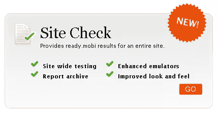
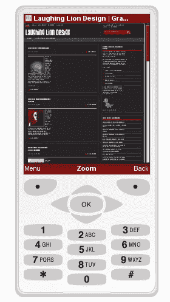
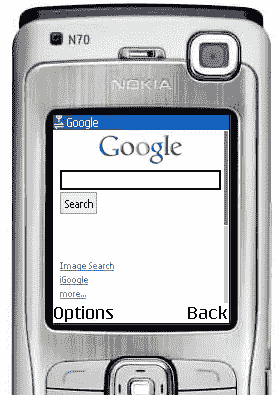
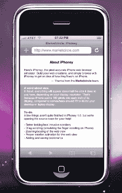

# 6 个在移动设备上测试设计的工具

> 原文：<https://www.sitepoint.com/six-tools-for-testing-designs-on-mobile-devices/>

为网站设计时，最重要的过程之一就是测试。我们都知道网页设计的挑战之一是确保网站在多种浏览器下都好看。随着移动网络变得越来越重要，你可能还想知道你现有的网站或小部件在移动设备上是什么样子，但是有这么多设备，我们如何测试它们呢？

随着使用移动设备的人数增加，确保我们的网站在移动设备上美观易读的压力也在增加。理想和不现实的情况是在真实的手机上进行测试，但显然这对大多数设计师来说是不可能的。幸运的是，网上有很多工具，可以让你的网站适应移动的节奏。

[Device Anywhere](http://deviceanywhere.com/) 是一项商业运营，允许客户注册并测试“任何设备”。任何网络。任何地方。”有一系列的订阅计划，但你可以注册免费试用。

[MobiReady](http://ready.mobi/launch.jsp?locale=en_EN) 采用行业最佳实践和标准测试移动就绪性。测试后，你会收到一份免费报告，概述你的网站表现如何。

Opera Mini 是 Opera Mini 浏览器的现场演示，其功能就像安装在手机上一样。

W3C Mobile OK Checker 对网页进行一系列测试，以确定其移动友好程度。生成的简短报告会告诉你哪里出错了。

[dotMobi 模拟器](http://mtld.mobi/emulator.php)模拟真实的手机网页浏览器。这有点限制，因为你只能从两个不同的手机中选择你喜欢的皮肤。

[iPhoney](http://www.marketcircle.com/iphoney/) ，可以想象，是专门针对 iPhone 测试的。这是一个可下载的应用程序，精确到像素，对于设计 iPhone 应用程序的设计师来说非常有用。

还有其他模拟器和仿真器可用，特别是如果你愿意付费的话，但是这一套将会给你一个相当简单的免费测试设计的方法。你使用过这些或其他工具来检查你的设计吗？

**相关阅读:**

*   [Brian Suda 为移动网络设计](https://www.sitepoint.com/article/designing-for-mobile-web/)
*   [iPhone 开发:斯托扬·斯特凡诺夫的 12 个入门技巧](https://www.sitepoint.com/article/iphone-development-12-tips/)
*   移动网页设计:快动手吧！作者:哈拉·科尔宾斯多蒂

## 分享这篇文章