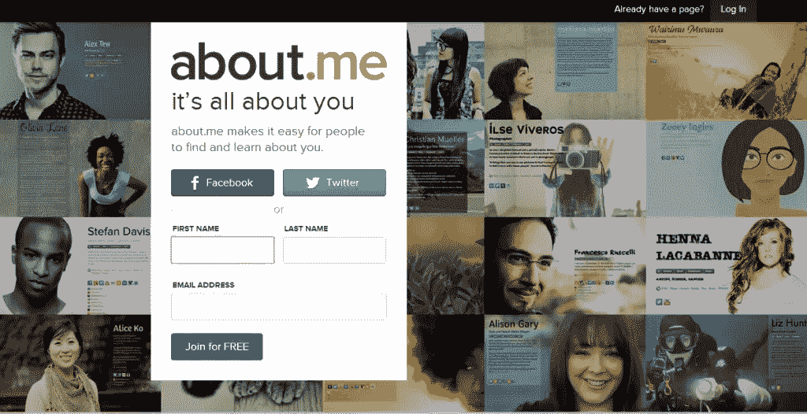
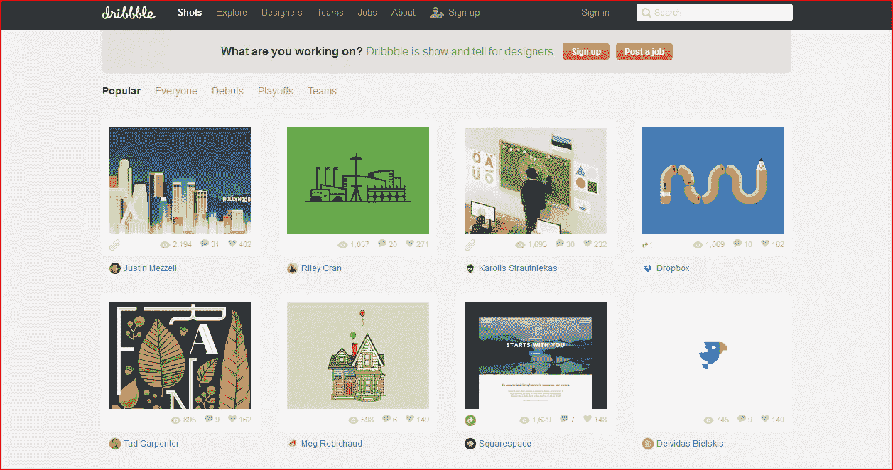
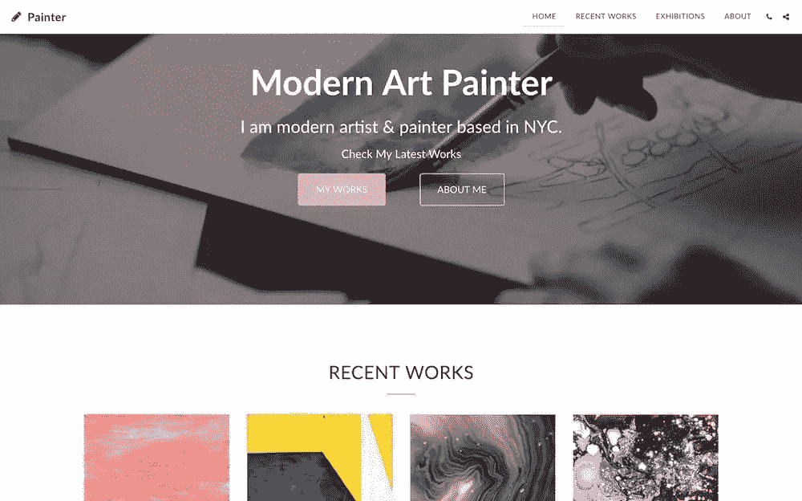

# 看着我！提升设计形象的六种方法

> 原文：<https://www.sitepoint.com/six-ways-boost-design-presence/>

2014 年，几乎所有人和所有东西都在网上，如果说设计师/开发者找工作有一条金科玉律的话，那就是:**让自己引人注目！**

这个规则同样适用于平面设计师、前端开发人员、UX 人或任何其他视觉设计领域。

虽然我们都知道脸书和推特在你现有的网络中发挥着不可估量的作用，但也有一些很棒的在线设计社区可以立即扩大你的影响力，提高你在未来客户中的知名度。

加入在线社区不仅能让你展示自己的才华，还能让你获得反馈，甚至可能为更大的项目找到新的朋友和合作者。

因此，这里是我的网站名单，可以帮助你进入更多的大门。

### About.Me

如果你只是在寻找一个简单的平台来展示你的东西，一个叫做[的小地方。我](https://about.me/)可能非常适合。这个平台是你能得到的最简单的东西，但是它是免费的，而且很有效。

不利的一面是，About.me 不允许你自定义自己的域名，但这对许多人来说可能不是一个障碍。

我想。如果你对管理一个成熟的网站犹豫不决，Me 是一个很好的起点。虽然这是一个简单的单页格式，你仍然可以营销和推广你的工作和服务。决定你想向访问者透露多少(或少)自己的能力也是一种不错的接触。

**底线:**如果你只是想用一份迷你简历的方式让自己出名，那么。我是你要去的地方。

### Dribbble

[Dribbble.com](http://dribbble.com/)是著名篮球迷、作家兼网页设计师[丹·塞德霍尔姆](http://simplebits.com/about/)的创意，也是许多人想到设计社区时首先想到的网站之一。有充分的理由。

在某种程度上，Dribbble 就像一个超视觉版的 Twitter，设计师们没有 140 个字符的限制，而是每个截图有 12 万像素的限制。

Dribbble 称自己是一个为艺术家创造在线空间，展示、讲述、推广、发现和探索设计的网站。

诚然，这是一个相当紧密的社区，围绕内部声誉系统建立，因此获得认可可能需要一些时间和努力。

然而，这不应该阻止你加入，因为有很多 Dribbble 免费资源提供，包括模板，自定义画笔，图标等。

专业账户也是可用的，它允许你在你的页面上添加一个“雇佣我”按钮，寻找工作机会，创建成员列表和其他有用的功能。

#### 底线:

Dribbble 不是一个经典的对开网站，但如果你是一个专注的设计师，不仅希望分享，而且希望与你的同行交流，给 Dribbble 一个..嗯……中枪了？

### DeviantArt

这个网站绝不是新的，但是如果你是一名设计师，你很可能以前在谷歌旅行中遇到过 [DeviantArt](http://www.deviantart.com/) 。

DeviantArt 合法地面向平面设计师、传统艺术家、网页设计师和摄影师。你会发现这里的每一个人，从新手，高级艺术学生，一直到大名鼎鼎的专业艺术家，如[流行漫画艺术家亚当·休斯，](http://www.deviantart.com/?q=Adam+Hughes)谁曾参与 DC，漫威和黑马漫画。

与 Flickr 类似，有无数的团体和社区供你加入，在那里你可以分享、合作、推广和接收对你工作的反馈。DeviantArt 也是免费库存的一个很好的资源，比如纹理、字体、3d 模型等等。

所以，即使只是为了免费的资源，这也是一个值得花些时间的好网站。

还应该提到的是，DeviantArt 提供了一个强大的谷歌 Chrome 扩展，称为“ [DeviantArt Muro](https://chrome.google.com/webstore/detail/deviantart-muro/namljbfbglehfnlonjmebceimaalofei?hl=en) ”，它允许你在 web 应用程序内直接创建和绘制 DeviantArt。它不是 Photoshop，但对于一个免费的基于浏览器的应用程序来说，它非常强大。

如果你对拓展设计领域感兴趣，DeviantArt 和 extension 都是你应该去看看的。

#### 底线:

无论你的设计技能或专业领域如何，DeviantArt 都能为每个人找到合适的位置。

### 行为

如果你对你的手艺很认真，那么 Behance 可能就是你开店的好地方。使用这个网站的设计师来自各种各样的背景，从自学到机构教育，到时装设计师、插画师、印刷工人和摄影师，不一而足。

虽然你有机会在 Flickr 和 DeviantArt 等基于社区的网站上被发现，但 Behance 将自己标榜为“创意者的 LinkedIn ”,因此将设计师与客户机会联系起来绝对是其商业模式的核心。

你的作品在 Behance 通常也是非常好的公司，因为他们拥有许多著名设计师和机构的画廊，包括罗德岛设计学院。、[妮可·马丁内斯](http://www.behance.net/iconico)和[罗布·普拉特](http://www.behance.net/RobPratt)。

Behance 提供了根据您的风格定制画廊的机会。正如你可能猜到的，这是一个高级特性，但是如果你从服务中得到结果，这可能是一个很小的代价。

有大量的观众，有能力在热爱他们的行业的人面前展示你的才华，并可能在你的职业生涯中帮助你，真的没有理由拒绝 Behance。

#### 底线:

Behance 不适合设计师新手，但是如果你想增加被发现从事严肃工作的机会，那就注册吧。

### 闪烁（光）

毫无疑问，许多人会把 Flickr 视为一个非常适合摄影的网站，虽然这在某种程度上是真实的，但这并不意味着你不能在那里开辟自己的设计领域。

自 2004 年推出以来，Flickr 成为第一个成功的、真正全球规模的创意网站，但似乎几乎从 Yahoo！2005 年收购的。

令人高兴的是，它仍然拥有庞大的用户群(最近报道称有 8700 万用户),并重新引起了雅虎的关注。CEO Marissa Myer —去年的重新发布和新的 1tb 账户限额证明了这一点。

许多数字艺术家和设计师使用该网站展示各种形式的创意作品，从 t 恤印花到游戏角色设计，再到网站布局等等。人才、年龄和种族多样性的范围令人兴奋，因为你知道你不会从每个用户那里得到同样的东西。

Flickr 上有许多活跃的、充满活力的、热情的团体在寻找展示设计师的机会，所以如果一个强大的、友好的社区吸引了你，这可能是你应该加入的网站。

#### 底线:

Flickr 是一个没有压力的环境，为各种类型的创造性思维提供了空间，并提供了支持和可见性的伟大社区。

### 推出自己的网站

当然，到目前为止，我们讨论的每个网站都有自己的内置格式、限制、规则和约束。完成创造性控制的唯一途径是从零开始建立你自己的网站。

你甚至不一定需要有很强的 HTML 或 CSS 技能。像 [Site123](https://www.site123.com/) 、 [Wix](http://www.wix.com/) 或 [Webydo](http://www.webydo.com/) 这样的免费网站建设者允许你定制和创建一个相当令人印象深刻的网站——即使你选择退出他们的高级选项。

另一个选择是通过像 WordPress.com 或 T2 这样的平台来写博客。

不言而喻，这些都是强大、成熟的平台，一点点创造性的闪光可以走很长的路——更不用说如果你喜欢，用域名给你的网站打上品牌的宝贵能力。

#### 底线:

对于最终的创意和个人自由，它很难与拥有自己的网站竞争。

### 结论

这些网站只是数百个平台的冰山一角，你可以求助于这些平台来提高你的网站知名度。Coroflot 、 [Carbonmade](http://carbonmade.com/) 和其他一些平台也是你应该去看看的。尝试不同的选择，找出更适合你的需求。谁知道呢，你可能会看到在网上是多么的有益。
你是上述网站的成员吗？

你最喜欢用什么平台？

## 分享这篇文章