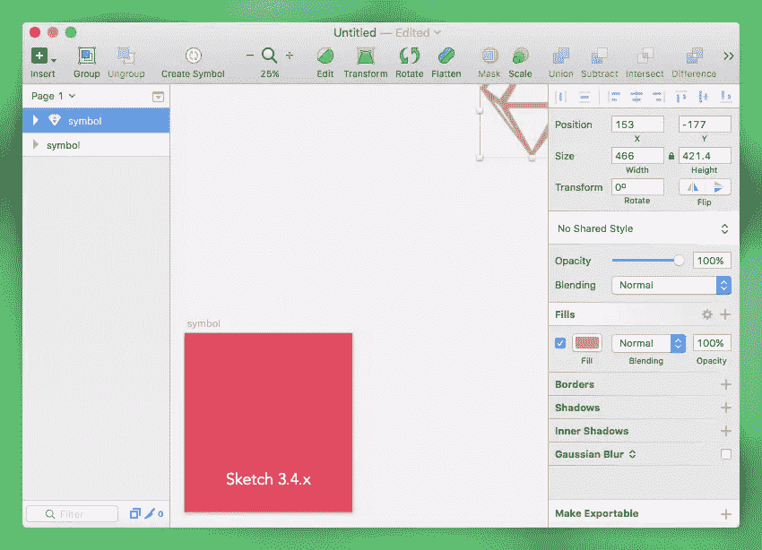
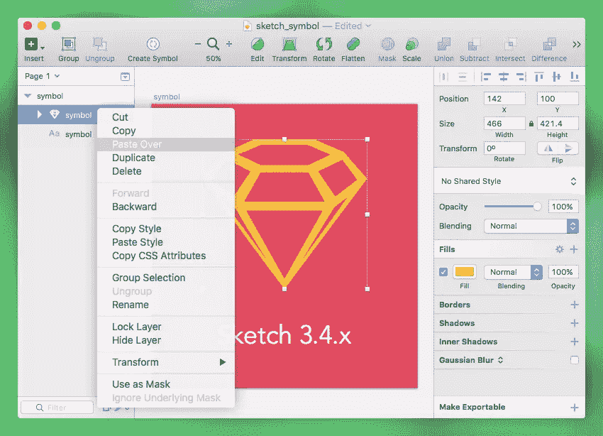
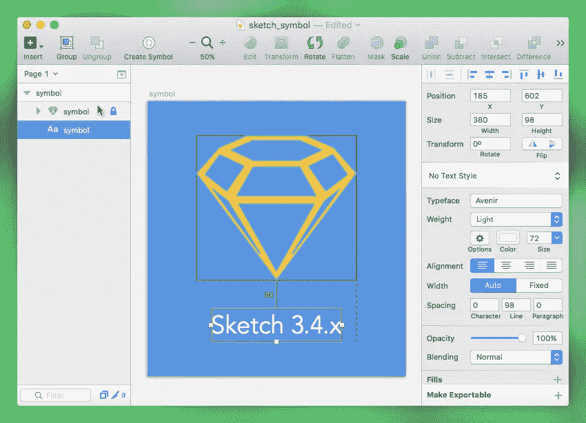
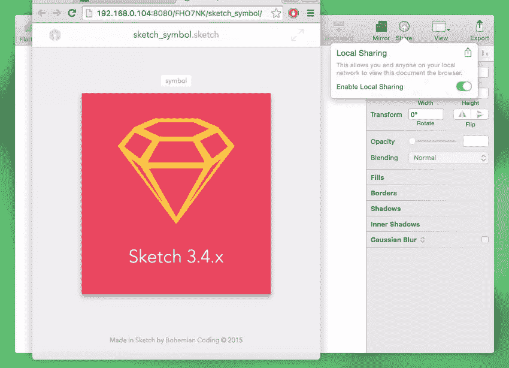
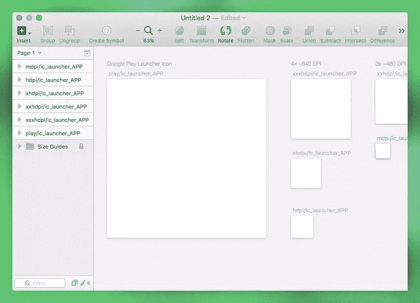
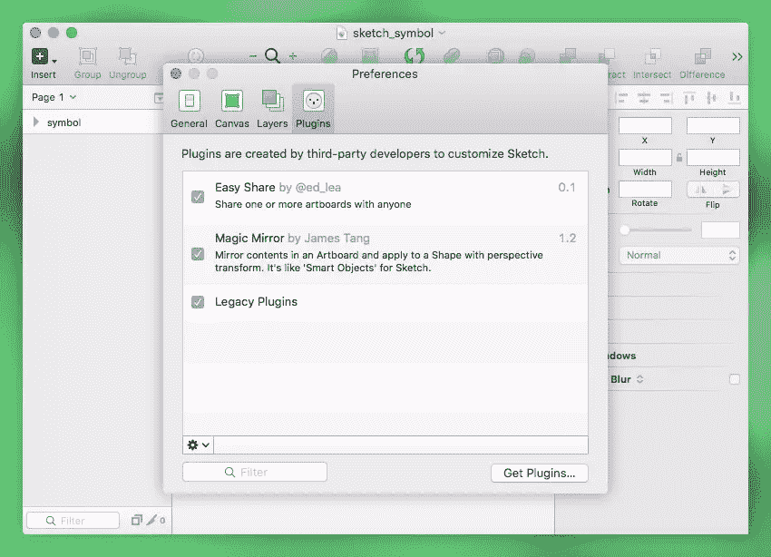
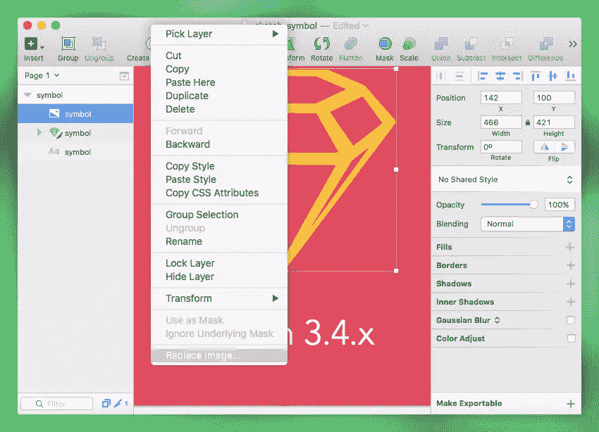
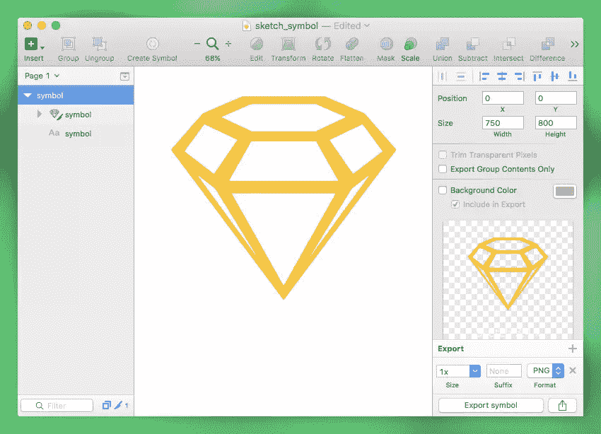

# Sketch App: 10 个让你眼花缭乱的新增强功能

> 原文：<https://www.sitepoint.com/sketch-app-10-new-enhancements-will-make-giddy/>

虽然对 [Sketch](http://www.sketchapp.com/) 用户应用的最新更新没有包括任何新的功能发布，但它们是如此辉煌的一系列改进，以至于我认为值得撰写一篇短文，列出红色字母项目。

对于一个素描用户来说，这真是一个前所未有的好时机。

虽然 Sketch 开发团队一直以他们对 Sketch 应用程序的简单、极简方法而自豪，但 bug 将永远是应用程序设计不可避免的一部分。我不得不称赞 Bohemian 编码团队在更新和 bug 修复方面的辛勤工作和透明度。

所以，让我们来看看 10 个肯定会加速你的工作流程的最佳增强，其中一些会减少眼泪，另一些会在很大程度上改善团队协作。

## 1.改进的、更可预测的复制和粘贴

几乎每个人都使用 *`Copy`* 和 *`Paste`* ，尤其是我，因为我很懒，我通常通过复制相似的图层来开始设计新图层。任何经历过你`cmd+V`一个复制层，它出现在画布的下层世界这一令人愤怒的问题的人都会对这个美丽的消息感到高兴。

回到 Sketch 3.2，Bohemian Coding 在当时的上下文菜单中引入了“粘贴到这里”的功能，这是复制层的唯一明智的方法，但是正如你们中的许多人所知道的，一个快速、方便的键盘快捷键是一个更好的解决方案。现在你可以正常使用备受喜爱的 **cmd+c** 和 **cmd+v** 快捷键了。

3.4 版本也改善了层列表的用户体验。如果你右击列表中的一个层并打开上下文菜单，你会看到“将*粘贴到*上”的选项，这在你需要非常具体的时候特别有用。

## 2.智能指南功能现在扩展到了图层列表

通过选择一个层，按住**选项**并悬停在另一个层上(也称为 option-hover)，我们可以测量它们之间的距离。任何经常使用 Sketch 应用程序的用户都会知道这是一个*智能向导*，尽管它可以说是 Sketch 最有用的功能，但在嵌套层上使用它可能会很麻烦。

随着新的 Sketch 应用程序的更新，您可以通过在层列表中按住 option 键来激活智能指南，这有助于 Sketch 准确了解您想要比较的层。

或者，你现在可以使用众所周知的**命令**快捷键，同时按住 option-悬停，点击*到*到嵌套层，节省我们重新定位布局的时间。

## 3.画板可以在本地网络上共享

如果你在一个团队中工作，点击“共享”(在菜单栏中，在“镜像”旁边)，让你的合作者从他们的浏览器中看到你正在做什么。只要你们都在同一个网络上，这就能立即生效，而且对任何人来说，不需要任何设置。

最重要的是，它可以即时更新；有点像现场素描反馈！在 3.4 版本之前，我们不得不依赖于协作工具，如 InVision App，Sketch 插件，如 Easier.cc 和 Slack，甚至是老派的电子邮件。然而，如果你和你的团队远程工作(即在本地网络之外)，你仍然需要使用这些工具。

本地网络画板共享是任何 Sketch 3.4.x 更新中最接近新功能的内容。就我个人而言，我很感激 Bohemian 编码在推出任何新功能之前关注现有功能的用户体验。

## 4.新鲜的画板预设和模板文件

Sketch 经常因其多种多样的*画板预设*和*模板文件*而受到赞赏。在这次更新中，他们不仅用新的 Android 图标模板更新了应用程序，而且 Sketch 3.4.2 预计将包括 iPad Pro 和苹果 tvOS goodies。在撰写本文时，Sketch App [3.4.2](http://www.sketchapp.com/beta/) 仅提供测试版，但这可能会在几天内发生变化。

## 5.改进的撤消/重做可靠性

在过去，Sketch 中的*撤销* (command+z)和*重做* (command+shift+z)有时会成为一场噩梦，我不认为有人能找出原因。如果你试图撤销对*共享样式*或*符号*的更改，它只会在当前正在编辑的图层上起作用，弄乱你的整个文档。

当*撤销*不允许你返回到上一步时，问题也会出现，所以你会不知不觉地撤销你所有的步骤(或者无论你多么沮丧地试图*撤销*)。

谢天谢地，这个问题已经在这次更新中得到解决。

## 6.插件现在可以在偏好设置面板中管理

插件现在可以打开和关闭——你所要做的就是导航到*文件→首选项*,然后取消勾选不需要的插件。安装过多的额外组件会影响性能，并导致应用程序崩溃。除此之外，还有一个[的便捷链接](http://www.sketchapp.com/plugins/)，链接到 Bohemian Coding 自己的推荐草图插件。

对于那些担心 Sketch App 3.4 与某些插件不兼容的人来说，不要担心，这在 3.4.1 中已被迅速修复。

## 7.符号现在可以很好地在文本层中使用多种字体样式

我们并不总是需要指定不同文本块之间的边距；有时一个简单的换行符就可以了——这允许我们在一个文本层中保存不同的文本块。

然而，在过去，草图符号只会注意到文本层中使用的第一种字体样式，并将其应用于整个层。你可以手动设置它，但如果你有很多符号，这是一个真正的麻烦！

## 8.右键单击图像时的“替换图像…”选项

*替换图像*可能是 Sketch App 最被低估的新功能之一，因为直到项目结束时你才需要它(*可能是*)。假设您正在使用一个带水印的股票图像，因为客户还没有签署，然后您需要稍后用更高质量的许可版本替换它。

“替换图像”让这项任务变得异常简单。

如果这个概念对你来说有点熟悉，那是因为 Photoshop 开始在 Adobe Creative Cloud 2015 中推出一个类似的功能，名为 [Adobe Stock](https://www.sitepoint.com/streamlining-stock-image-use-with-adobe-stock/) 。

## 9.默认情况下，新渐变基于填充颜色

梯度调谐器是那些挑剔的界面之一，摆弄起来令人不愉快，当我们想要实现的只是按钮的小深度时，这尤其令人讨厌。

Sketch 应用程序著名的直觉再次改善了用户体验，它根据你为*填充*选择的颜色巧妙地建议渐变。以前，这种风格会默认为令人讨厌的黑白色渐变，这让任何人都不高兴。

## 10.导出预览现在显示透明区域

默认情况下，Sketch 中的白色画板并不意味着白色背景，当我们导出所有屏幕并随后发现背景是透明的(doh！).预览现在显示透明区域，新的键盘快捷键( **control+c** )使更改画板背景颜色变得更加容易。

### 额外收获:3 个讨厌的虫子，你会很高兴看到它们消失

我知道这些 bug 修复并不有趣，但是我觉得它们值得特别一提(哈利路亚！)因为它们实在是太让人生气了。对...说再见:

*   当你放大和缩小太多的时候不再崩溃
*   当你输出大的东西时不再崩溃
*   删除图层时不再自动折叠群组

# 结论

所以你有它；Bohemian Coding 版捆绑了一些关键的 bug 修复和增强。bug，尤其是在它们出现的时候，会让我们非常沮丧。然而，在软件设计领域，这是不可避免的，任何种类的应用程序随着时间的推移而演变都是完全正常的。

在我完成这篇文章之前，3.4.1 和 3.4.2 版本就已经发布了，我必须对其进行几次修改以适应新的更新。我认为这证明了 Sketch App 对他们的工艺是认真的，并且非常契合 UX 设计师的需求。

这是草图 3.4 和 [3.4.1](http://www.sketchapp.com/support/updates/sketch-3.4.1/) 的完整更新列表(3.4.2 即将推出！)–如果真的有一个卑鄙的错误已经被修复，而我没有覆盖它，很可能我侥幸逃脱了它，但我鼓励你在下面的评论中咆哮、欢呼或鼓掌。

在所有这些修复中，哪一个真正让你尖叫？

## 分享这篇文章