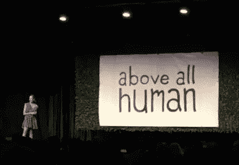
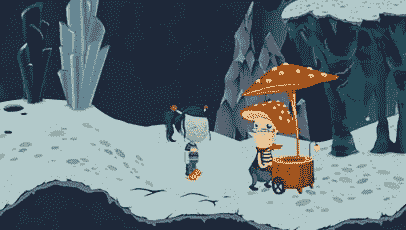
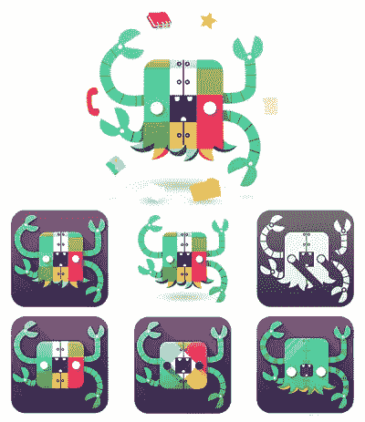
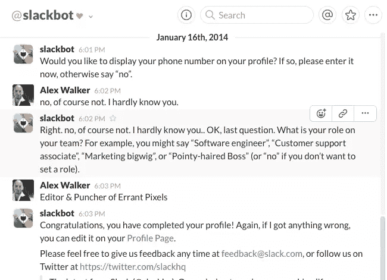
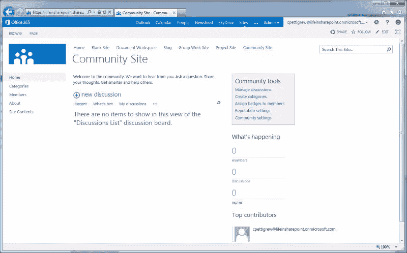

# 变得懒散:故障之子的故事

> 原文：<https://www.sitepoint.com/slack-story-son-glitch/>

上周五，我和几个 SitePointers 参加了一个有趣的新会议，名为“[Above All Human-2016](http://aboveallhuman.co/)”,现在是第二年了。

“AAH”是一个专注于人类和技术之间的交集的会议，因此涵盖了从医疗技术到天体物理学到游戏设计理论的各种主题。发言人中有阿尼尔·达什、T2、迈克·蒙泰罗和 T4、凯蒂·麦克。

但我不得不说我最喜欢的演讲是由阿里·雷尔发表的。Ali 是 Slack 的客户体验总监，她讲述了一个有趣的 Slack 起源故事。

如果你对 Slack 不熟悉的话，它是一款职场通讯 app，将 IM、email 和 Dropbox 结合成一个统一的协作工具。

虽然 Slack 并没有什么突破性的新东西，但不知何故，他们的功能和 UX 的结合确实引起了用户的共鸣，这款应用在过去三年里像野火一样迅速发展。

事实上，世界各地的用户已经开始围绕他们自己的主题组织“松弛频道”——从 CSS 到星球大战到认知科学。有一种独特的“类似 Reddit”的自组织社区的感觉。当用户想在业余时间使用您的作业工具时，您知道您有所收获。

多年来，许多公司都试图建立“商务沟通工具”。像微软、Lotus 和 SalesForce 这样的大公司的口袋也能伸进鞋子里。

但是他们都没有成功获得大规模的认同。

## 是什么让 Slack 与众不同？

虽然很多人知道 Slack，但很少有人知道它背后的公司——当时被称为[小斑点](https://en.wikipedia.org/wiki/Slack_Technologies)——实际上是一家失败的游戏公司。早在 2009 年，阿里就是开发并发布一款名为《T2》Glitch 游戏的团队成员之一。

Glitch 是一款基于浏览器的大型多人在线游戏。它提供了一个 2D 漫画式的开放世界，玩家可以:

*   相互交流
*   收集/开采资源
*   利用这些资源来建造房屋和其他商品
*   个性化和开发他们的头像

没有具体的“最终目标”或目的地——它被设计成一个用户可以无休止地玩下去的游戏空间。它有来自《我的世界》和法姆维尔的可辨认的元素。

不幸的是，这并不十分奏效。尽管 Glitch 在吸引观众方面相对成功，但他们选择了错误的开发平台——Adobe Flash。随着越来越多的用户花时间在 iPhone 和 Android 上，对基于 flash 的游戏的兴趣直线下降。Glitch 于 2012 年关闭。

但这并不是小灰尘的终结。

当他们决定建立一个通讯工具时，他们从一个与微软这样的传统商业软件公司完全不同的起点开始。在 Glitch 上工作时，他们学会了如何将无聊、耗时的游戏任务——比如打碎石头——变成一项有趣的活动。

因为让人们参与游戏是他们成功的核心，他们投入了难以置信的大量工作来使每一次互动变得有趣、好玩和不敬。Glitch 用户执行的实际“工作”没有内在价值，但这个过程必须足够有趣，才能吸引他们。

问题是:你能在真正的商业工作中采用这种方法吗？

Slack 是为了找出答案的实验。从一开始，他们就避开了商业软件的所有标准特征。名字有点前卫，标志和配色方案明亮、欢快，还有点傻气。

Slack 设计师 Slackbot 的早期化身[@ meowza](https://twitter.com/meowza/status/612492815637975040)

有一个厚脸皮的“懒汉机器人”欢迎你，还有无尽的快乐表情文件夹。毫不费力地搜索和发布 gif 让每个人都变成了喜剧演员。

很快人们就开始[定制](https://www.sitepoint.com/getting-started-slack-bots/)、[黑客](https://www.sitepoint.com/spice-up-your-slack-channel-with-hubot/)和[随心所欲](https://www.sitepoint.com/supercharge-slack-powerful-workplace-collaboration/)。

首先，这是一个很酷的地方，人们可以在这里闲逛、聊天、大笑。因为他们已经在那里，人们也开始做实际的工作。交换文件，讨论想法，制定议程。为什么不呢，对吗？

突然之间，你可以让人们在一个商业应用中处理业务——几乎是悄无声息的。

将这种方法与更安全、更传统的商业应用程序设计进行比较很有意思。

大多数商业应用程序都是“以文档为中心”的。当微软创建 MS Word 时，他们正在建造一个“Word 文档之家”。当然，人们*使用* Word，但是文档才是真正的 Word 的‘明星’。同样，Excel 是电子表格的存放地，Outlook 是电子邮件的存放地。

因此，[微软 Sharepoint](https://products.office.com/en-us/sharepoint/collaboration) 将主要被设计为“*一个文件和对话之家*也就不足为奇了。采用这种方法，人们几乎被视为对话的附件。

SharePoint:信用—[SharePoint](http://www.lifeinsharepoint.co.uk/2012/07/17/sharepoint-2013-screenshots/)生活 

就像一个整洁的郊区火车站，人们可能会经过 SharePoint，但他们绝不会想到在那里社交。人们穿过去，然后出来。而对谈话艺术来说是致命的。

我在这里用微软做比较是不公平的，但他们的竞争对手都没有做得更好。SharePoint 是一款非常优秀的软件，但我不记得有谁说过他们喜欢它。

另一方面，我一直听到人们宣称他们喜欢懒散。在软件设计中，这是一项成就。很高兴知道格林奇的 DNA 激发了这种爱。

## 小故障又出现了

有趣的是，Glitch 用户的一个专门团体多年来一直在争取它的回归。去年[, Slack 团队开源了 Glitch 背后的 10，000 多个艺术文件](http://www.glitchthegame.com/public-domain-game-art/),一个基层志愿者团队正在努力将 Glitch 重新放回互联网。

显然，爱:这是一个小故障(我必须得到一个双关语)。

*原载于 [SitePoint 设计简讯](https://www.sitepoint.com/newsletter/)* 。

## 分享这篇文章