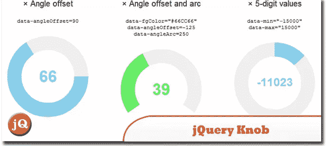
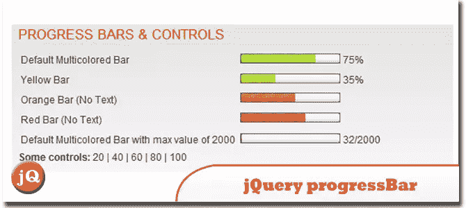
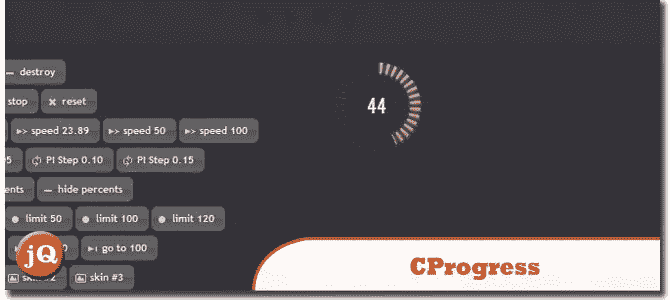
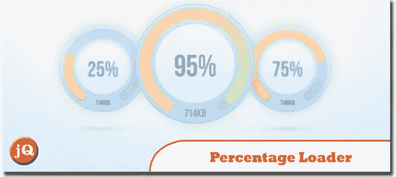
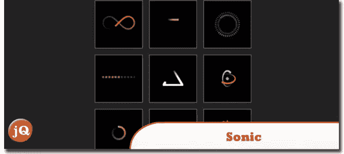

# 5 个时髦的 jQuery 进度条插件

> 原文：<https://www.sitepoint.com/snazzy-progress-bar-plugins/>

已经有很多进度条插件出现，所以我们决定列出一些最好的。下面是 5 个时髦的 jQuery 进度条插件。他们每个人都有独特性和风格。你会喜欢它们被整合到你的网站中，这是你可能会“等待”的东西？；)

## 1.jQuery 旋钮

这是一个很好的向下兼容、可触摸的 jQuery 拨号插件。
 
[源+演示](http://anthonyterrien.com/knob/)

## 2.jQuery 进度栏

一个基于 mootools progressBar 的 jQuery 动画进度条。现在，根据大众的需求，它有了一些时髦的多色进度条..
 
[来源](http://t.wits.sg/jquery-progress-bar/) [演示](http://t.wits.sg/misc/jQueryProgressBar/demo.php)

## 3.CProgress

jQuery 循环进度条。
 
[源+演示](http://p.ar2oor.pl/cprogress/)

## 4.HTML5 & jQuery 进度条插件:百分比加载器

一个很小的 jQuery 插件，以一种视觉化和吸引人的方式显示进度。
 
[来源](http://www.downgraf.com/coding/html_css/html5-jquery-progress-bar-plugin-percentage-loader/) [演示](http://widgets.better2web.com/loader/)

## 5.音速的

一个快速小巧的类，可以用来生成不同形状、颜色、速度等的装载指示器。
 
[来源](https://github.com/padolsey/Sonic#readme) [演示](http://padolsey.net/p/Sonic/repo/demo/demo.html)

## 分享这篇文章