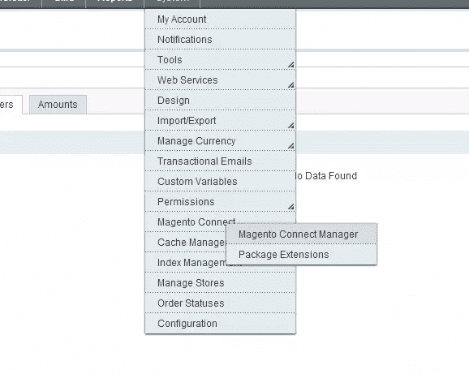
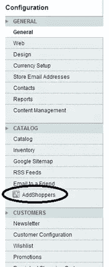
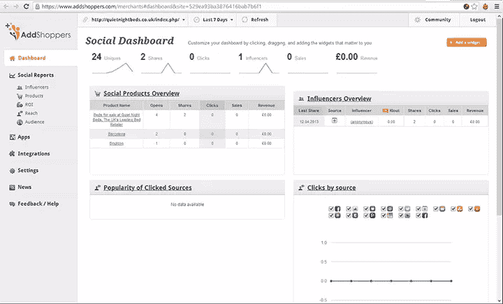
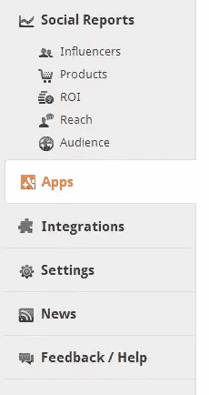
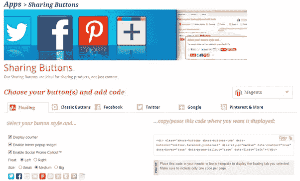
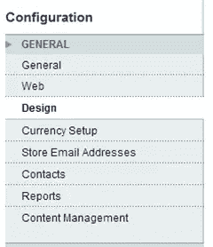
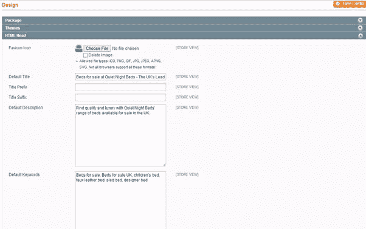
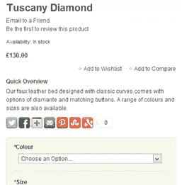

# 电子商务的社会营销

> 原文：<https://www.sitepoint.com/social-marketing-ecommerce/>

问任何一个在线企业主，他们都会告诉你营销是推动收入的最重要的方面。媒体本身为这一古老的技艺增加了自己的维度，尤其是社交媒体，为营销者提供了最有趣的机会。

与搜索引擎驱动的流量不同，社交媒体遵守自己的规则，电子商务网站所有者可以做很多事情来渗透这些小团体和个人关系网络。首先，重要的是要确保临时访客可以很容易地分享，比如，发推特，+1 或者以其他方式传播和推广你的产品。另一方面，跟踪这些分享和点击来自哪里可以成为你整体商业战略的重要组成部分。

Magento 是一款专门针对电子商务的开箱即用 CMS 解决方案，它为管理您的整个社交媒体战略提供了许多解决方案。这反过来会让你对营销活动中最重要的方面有一个实际的控制。

我们将使用的扩展是 AddShoppers 的电子商务社交营销应用。该扩展可用于 PrestaShop、WooCommerce、Shopify 和其他几个平台。然而，对于本教程，我们将坚持 Magento 版本，因为这是我在自己的电子商务网站上运行的平台。

对于这个网站，一家完全经营床的家具店，我希望我们的客户能够在社交网络上与人们分享我们的产品。我也希望能够在他们分享活动的同时进行推广。

AddShoppers 有能力管理这一切，安装相对简单。

首先获取 AddShoppers 的安装密钥，然后将其粘贴到 Magento 管理区的 Magento Connect Manager 中。



请确保您运行的是 Magento 1.8(2013 年 9 月发布)，否则安装可能会返回错误。安装后，您需要配置您的 AddShoppers 帐户，以便在您的商店上运行。仍然在 Magento 管理区，进入**系统>配置**。



在左栏的 CATALOG 选项卡下，您将看到 AddShoppers 的新选项。当你在 Magento 后端注册后，这个特殊的软件会自动与你的网站整合。但是，要使用它，您需要通过 AddShoppers 网站访问您的仪表板。

一旦你在 Magento 后端注册了 AddShoppers 帐户，点击 [AddShoppers 商户管理](https://www.addshoppers.com/merchants)站点的链接，你就会看到你的社交仪表盘。



这让你对你的网站在脸书、Twitter、G+、Pinterest 或任何其他社交网络上的活动有一个总体的了解。它还允许你定制网站的社交媒体整合。您可以通过在左侧菜单中选择应用程序来完成此操作。



然后选择并配置共享按钮应用程序。



作为一个电子商务商店的所有者，我有两个关于在我的床上零售网站放置社交媒体按钮的考虑。第一个是在主页上放置按钮的位置，第二个是在产品页面上放置按钮的位置。

主页向我的客户介绍我的零售品牌。重要的是要让这个页面能够快速地在人们的推特上分享或者张贴在脸书的墙上。然而，通过产品页面上的社交分享按钮，我可以了解有多少人对某个特定商品感兴趣，以及这种兴趣来自哪里。

关于社交媒体与电子商务网站的整合，我收到的最重要的建议之一来自朱慧珊·弗里德曼，他是 Wizler 的社交媒体经理。她的建议是，确保你的产品页面至少包含社交媒体按钮，因为你的产品是你想引起客户注意的东西，而不是你的网站本身。

在 AddShoppers Dashboard 中，第一个共享按钮选项卡将允许您插入浮动的社交媒体按钮，包括 Twitter 和脸书。G+，Email，Pinterest，Stumbleupon 等等，都在主页上。在仪表板中，你可以选择是否有一个计数器来显示推文的数量，喜欢等。您的主页已收到；启用悬停弹出窗口；并启用社交宣传电话。

您还可以选择让按钮浮动在左侧还是右侧，以及显示小、中还是大按钮。

一旦你创建了你的主页浮动按钮，你需要复制右边的代码并粘贴到你的 Magento 网站的页眉或页脚区域。

```
<div class="share-buttons share-buttons-tab" data-buttons="twitter,facebook,pinterest" data-style="medium" data-counter="true" data-hover="true" data-promo-callout="true" data-float="left"></div>
```

在你的 Magento 管理区进入**系统>配置**。然后在**通用**选项卡中，点击**设计**。



这将调出设计菜单。



在 **HTML 头**或**页脚**中，将上述代码粘贴到杂项脚本/杂项 HTML 框中。这应该让社交媒体按钮浮动在你网站的主页上。

现在我们需要在我们的产品页面上放置社交媒体按钮。在 AddShoppers 仪表板中，您需要创建按钮，然后手动将它们放置在产品页面模板中。

您可以自定义垂直或水平堆叠的按钮，并选择要显示的单个按钮。



为这组按钮自动生成的代码是:

```
<div class="share-buttons share-buttons-panel" data-style="medium" data-counter="true" data-oauth="true" data-hover="true" data-promo-callout="left" data-buttons="twitter,facebook,google,email,pinterest,stumbleupon"></div>
```

这需要粘贴到您的产品页面模板中，您希望按钮出现在页面上的任何位置。您可以通过访问 view.phtml 来编辑此文档。如果您使用 Magento 的默认主题用于您的网络商店，您可以通过:*app/design/frontend/base/default/template/catalog/product*在您主机的文件管理器中访问此文件。但是，如果您已经安装了自己的主题，您需要访问您的主题文件夹中的产品页面模板。对我来说，使用 Hello Wired 主题，我通过:*/app/design/frontend/default/Hello Wired/template/catalog/product/*访问这个文件。

在 view.phtml 文件中，您可以看到我插入社交媒体按钮代码的粗体部分。

```
<?php if ($_product->getShortDescription()):?>
                <div class="short-description">
                    <h2><?php echo $this->__('Quick Overview') ?></h2>
                    <div class="std"><?php echo $_helper->productAttribute($_product, nl2br($_product->getShortDescription()), 'short_description') ?></div>
                </div>
            <?php endif;?>

<strong><div class="share-buttons share-buttons-panel" data-style="medium" data-counter="true" data-oauth="true" data-hover="true" data-promo-callout="none" data-buttons="twitter,facebook,google,email,pinterest,stumbleupon"></strong></div>
```

这将代码放在产品页面上的**快速概述**描述部分之后。

用社交媒体按钮设置你的网站只是你可以用 AddShoppers 扩展做的事情的开始。每当有人在你的网站上与这些按钮互动时，数据就会返回到你的 AddShoppers 仪表板。

这将为你提供大量关于你的网站在社交网络上表现如何的分析信息，甚至是来自推文、赞和大头针的投资回报指标。

设置起来可能有点复杂，但是将你的网站与社交媒体相结合是任何电子商务网站的基本工具。

## 分享这篇文章