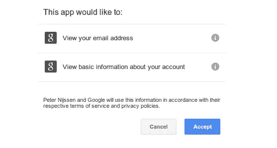

# 社交网络认证:Google+

> 原文：<https://www.sitepoint.com/social-network-authentication-google/>

在本系列的前一部分中，我们创建了初始接口，我们将在以后的所有部分中使用这些接口。在本文中，我们将在应用程序中集成 Google+。

你可以在这个 [Github 页面](https://github.com/peternijssen/sitepoint-social-login)上查看所有文章的代码。

## Google+登录

我们首先创建以下目录:`src/SitePoint/SocialLogin/Google`。这将是我们在本文剩余部分工作的目录。在这个目录中，我们创建了`GoogleLogin`类。这个类实现了我们在上一篇文章中创建的`SocialLoginInterface`接口。确保名为`service`的属性可用于存储我们的服务(参见下面的代码)。

谷歌有一些特定的需求，以确保我们可以登录。因此，确保我们在类中有以下 3 个属性:
–客户端 id
–键
–回调 URL

因为我们的应用程序需要这 3 个属性才能工作，所以我们的构造函数将接收这 3 个变量作为参数并设置属性。

到目前为止，我们的代码是这样的。

```
<?php

namespace SitePoint\SocialLogin\Google;

use SitePoint\SocialLogin\Interfaces\SocialLoginInterface;

class GoogleLogin implements SocialLoginInterface {

    /**
     * Google service
     *
     * @var string
     */
    protected $service;

    /**
     * OAuth client ID
     *
     * @var string
     */
    protected $clientId;

    /**
     * OAuth key
     *
     * @var string
     */
    protected $key;

    /**
     * Callback url
     *
     * @var string
     */
    protected $callbackUrl;

    /**
     * Constructor
     *
     * @param $clientId string
     * @param $key string
     * @param $callbackUrl string
     */
    public function __construct($clientId, $key, $callbackUrl)
    {
        $this->clientId = $clientId;
        $this->key = $key;
        $this->callbackUrl = $callbackUrl;
    }

    /**
     * Initializes our service
     */
    public function init()
    {

    }

    /**
     * Returns the login url for the social network
     *
     * @return string
     */
    public function getLoginUrl()
    {
    }

    /**
     * Handles the login callback from the social network
     *
     * @param string $accessCode
     *
     * @return SocialUserInterface
     */
    public function loginCallback($accessCode)
    {

    }
}
```

下一步是创建我们的 Google+服务。正如您在上一篇文章中看到的，我们使用 OAuth 库来建立与 Google+的连接。我们将使用我们的`init`方法来创建服务。

在开始之前，我们必须在类的顶部添加一些 use 语句。

```
use OAuth\ServiceFactory;
use OAuth\OAuth2\Service\Google;
use OAuth\Common\Storage\Session;
use OAuth\Common\Consumer\Credentials;
```

我们的 init 方法的所有东西现在都存在了。是时候设置我们与 Google+的连接了。我们用我们正在使用的 OAuth 库的基本例子来做到这一点。

```
/**
     * Initializes our service
     */
    public function init()
    {
        $storage = new Session();
        $serviceFactory = new ServiceFactory();
        $credentials = new Credentials($this->clientId, $this->key, $this->callbackUrl);
        $this->service = $serviceFactory->createService('google', $credentials, $storage, array('userinfo_email', 'userinfo_profile'));

        return $this;
    }
```

我们的服务现在已经设置好了，所以我们可以通过从接口填充其他方法来继续。我们将从`getLoginUrl`方法开始。此方法将返回一个 URL，您将把您的用户重定向到该 URL。

```
/**
 * Returns the login url for the social network
 *
 * @return string
 */
public function getLoginUrl()
{
    return $this->service->getAuthorizationUri();
}
```

下一个要定义的方法是`loginCallback`方法。当用户接受 Google+与您的应用程序共享数据时，用户将被重定向回您定义为`callbackUrl`的 url。当用户请求那个 URL 时，你应该从这个类中调用`loginCallback`方法。

如果一切顺利，我们现在可以从 Google+检索数据。

```
/**
 * Handles the login callback from the social network
 *
 * @return SocialUserInterface
 */
    public function loginCallback()
    {
        $userData = json_decode($this->service->request('https://www.googleapis.com/oauth2/v1/userinfo'), true);
        $googleUser = new GoogleUser($userData);
        return $googleUser;
    }
```

你可能会注意到我们在这里使用了一个名为`GoogleUser`的类，并且我们用接口`SocialUserInterface`返回了一个类。但是，这个类还没有出现。

## Google+用户

每个社交网络以不同的方式返回用户数据。我们不只是返回这些数据，而是将它们规范化，这样我们就可以轻松地使用它们。我们需要创建一个名为`GoogleUser`的类。这个类将实现我们在上一篇文章中创建的`SocialUserInterface`。

在这种情况下，该类的构造函数需要 Google 的原始数据。在每个 getter 中，我们将从 Google 的原始数据中检索我们想要的数据。最后，您的`GoogleUser`类可能看起来像这样。

```
<?php

namespace SitePoint\SocialLogin\Google;

use SitePoint\SocialLogin\Interfaces\SocialUserInterface;

class GoogleUser implements SocialUserInterface {

    /**
     * @var mixed user data
     */
    private $userData;

    /**
     * Constructor.
     *
     * @param $userData mixed Raw social network data for this particular user
     */
    public function __construct($userData)
    {
        $this->userData = $userData;
    }

    /**
     * Get the provider name
     *
     * @return string
     */
    public function getProvider()
    {
        return "google";
    }

    /**
     * Get the UID of the user
     *
     * @return string
     */
    public function getUid()
    {
        if(array_key_exists('id', $this->userData)) {
            return $this->userData['id'];
        }
        return null;
    }

    /**
     * Get the first name of the user
     *
     * @return string
     */
    public function getFirstname()
    {
        if(array_key_exists('given_name', $this->userData)) {
            return $this->userData['given_name'];
        }
        return null;
    }

    /**
     * Get the last name of the user
     *
     * @return string
     */
    public function getLastname()
    {
        if(array_key_exists('family_name', $this->userData)) {
            return $this->userData['family_name'];
        }
        return null;
    }

    /**
     * Get the username
     *
     * @return string
     */
    public function getUsername()
    {
        if(array_key_exists('family_name', $this->userData)) {
            return str_replace(" ", "_", $this->userData['family_name']);
        }

        return null;
    }

    /**
     * Get the emailaddress
     *
     * @return string
     */
    public function getEmailAddress()
    {
        if(array_key_exists('email', $this->userData)) {
            return $this->userData['email'];
        }
        return null;
    }

    /**
     * Get the city
     *
     * @return string
     */
    public function getCity()
    {
        return null;
    }

    /**
     * Get the birthdate
     *
     * @return string
     */
    public function getBirthDate()
    {
        return null;
    }

    /**
     * Get the gender
     *
     * @return string
     */
    public function getGender()
    {

        if(array_key_exists('gender', $this->userData)) {
            return $this->userData['gender'];
        }
        return null;
    }
}
```

## 在您的应用程序中实现它

根据您使用的框架(如果您正在使用的话)，实现可能会略有不同。但是，我建议您使用如下方法。

```
public function loginForm() 
{
    //Renders a login form with a button to login with google+ (calls the LoginWithGoogle method).
}
```

```
public function loginWithGoogle()
{
    $googleLogin = new GoogleLogin("clientId", "key", "url/loginCallbackGoogle");
    $googleUrl = $googleLogin->init()->getLoginUrl();
    // Redirect user to $googleUrl.
}
```

```
public function loginCallbackGoogle()
{
    $googleLogin = new GoogleLogin("clientId", "key", "url/loginCallbackGoogle");
    $googleUser = $googleLogin->init()->loginCallback();
    // You can now either save or merge this user.
    // Next, you can log the user in and redirect him to any page you like
}
```

*建议 1:*

您也可以将 Google URL 放入您的视图中，而不是在您的登录表单中将您重定向到`loginWithGoogle`方法的链接。但是，请注意，您已经创建了与 Google 的连接。这可能会降低您的页面速度。尤其是在使用多个社交网络的时候。总的来说，我会推荐上面的方式。

*建议二:*

如果你打算使用多个社交登录，你可以很容易地在`loginWith`和`loginCallback`方法中添加一个名为`$socialNetwork`的参数，并在其中添加一个 switch 语句。

## 快速试验

如果您想运行一个快速测试来测试代码，将 [Github 库](https://github.com/peternijssen/sitepoint-social-login)克隆到您的本地计算机上，并切换到名为`part2`的分支。在`testGoogle.php`文件中填写您的 Google+ API 详细信息，并在您的浏览器中运行该文件。当请求该页面时，您将被重定向到一个 Google 页面，请求您共享信息。



单击接受时，您将被重定向回您配置为回拨 URL 的页面，显示您的名字和姓氏。

### 结论

在本文中，我们采用了上一篇文章中设置的基础，并在此基础上做了进一步的工作。我们实现了一种使用 Google+登录的方法，并确保我们返回了一个对象，该对象将您从 Google 收到的数据规范化。在接下来的文章中，我们将看看当人们使用多重登录时，我们如何合并帐户。在接下来的文章中，我们将看看如何在我们的系统中添加更多的社交网络。

## 分享这篇文章