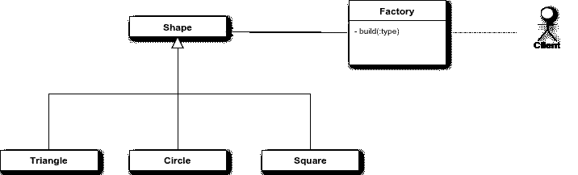
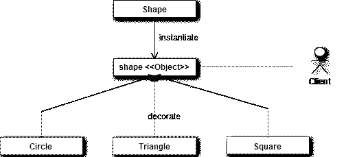
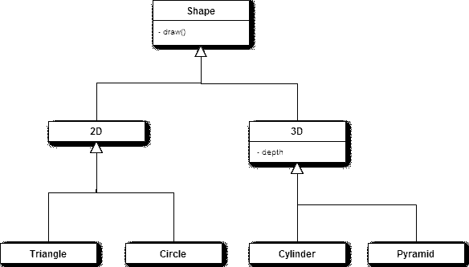
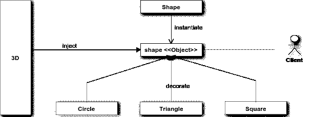

# 解决 Ruby 中的设计反模式:修复工厂

> 原文：<https://www.sitepoint.com/solving-design-anti-patterns-in-ruby-fix-the-factory/>


在[的前一篇文章](https://www.sitepoint.com/how-to-solve-coding-anti-patterns-for-ruby-rookies/)中，我们研究了 Ruby 新手程序员使用的一些常见的编码反模式。本文将探索一些 Ruby 新手经常应用到他们的解决方案中的设计反模式，使用一个 Ruby 最常用的构造提供一些替代方案:T2 模块 T3。

## 工厂谬误

从 Java 来到 Ruby 的开发人员往往对工厂类和方法有特殊的偏好。许多 Ruby 新手会这样写他们的工厂:

```
class Shape
  def initialize(*args)
    # code for dynamically creating attributes from args list
  end
  def draw
    raise "not allowed here"
  end
end

class Triangle < Shape
  def draw
    "drawing triangle"
  end
end

class Square < Shape
  def draw
    "drawing square"
 end
end

# ...more shapes here

class ShapeFactory
  def self.build(shape, *args)
    case shape
    when :triangle
     Triangle.new(*args)
    when :square
     Square.new(*args)
    when :circle
      Circle.new(*args)
    end
  end
end 
```

他们现在可以使用一种通用的构造方法来决定他们想要创建什么样的形状。

```
puts ShapeFactory.build(:triangle, 3, 2, 45)
puts ShapeFactory.build(:square, 5) 
```



这种方法没有什么严重的问题，当然，除了它完全没有必要这一事实。线索就在那里:我们有这个`Shape`基类，除了服务于类层次结构之外，它并没有真正给我们的代码增加任何价值。此外，我们有一个单独的类(`ShapeFactory`)来处理任何 Ruby 类都可以自己轻松完成的事情(即动态创建自身的实例)，这一事实给有经验的 Ruby 专家留下了不好的印象。这种设计风格经常被 C#或 Java 等面向类的语言的支持者所遵循，在这些语言中，所有的东西都必须符合类的层次结构。另一方面，Ruby 是面向对象的，所以所有东西——T2，甚至是类——都是对象，类层次结构并不总是必要的。考虑到这一点，我们可以这样考虑工厂模式:

> > We want to create an object of general "type", but with object-specific behavior.

或者，甚至:

> > We want to create specialized objects in an abstract way.

#### 作为对象装饰者的模块

一个 Ruby [模块](http://ruby-doc.org/core-2.1.0/Module.html)位于 Java 的*接口*和 C#的*抽象类*之间，但是比它们都更灵活。让我们使用模块重新设计我们的*形状*解决方案:

```
class Shape
  def initialize(*args)
  end
end

module Triangle
  def draw
    "drawing triangle"
  end
end

module Square
  def draw
    "drawing square"
  end
end 
```

我们可以用一些专门的行为来扩展一个形状对象:

```
triangle = Shape.new( 3, 2, 45).extend(Triangle)
square = Shape.new(5).extend(Square) 
```



我们现在用我们需要的行为动态地装饰我们的形状，所以我们的三角形是一个行为像三角形的形状

```
puts triangle.draw
=> drawing triangle 
```

在这个过程中，我们抛弃了类的层次结构，工厂类，产生了更干净、更精简的代码。太好了。

#### 型戒断症状

有些人可能会对三角形是一种行为类似三角形的形状，而不是“真正的”三角形这一事实感到不安:

```
p triangle
=> #<Shape:0x00000000956d98> 
```

如果你是这些人中的一员，请放心:Ruby 足够灵活，可以满足任何人的需求。我们可以很容易地使用模块的钩子方法跟踪“类型”:

```
class Shape
  attr_accessor :type

  def initialize(*args)
    @type = []
  end
end

module Triangle
  def draw
    "drawing triangle"
  end

  def self.extended(mod)
    mod.type << :Triangle
  end
end 
```

现在，我们可以确切地知道我们正在处理的是什么“类型”:

```
triangle = Shape.new( 3, 2, 45).extend(Triangle)
puts triangle.type
=> Triangle 
```

您可能已经注意到,`type`属性是一个数组。这是因为我们可以用多个模块来扩展一个形状。以下内容在语义上是正确的，尽管在概念上是无意义的:

```
my_shape = Shape.new( 3, 2, 45).extend(Triangle).extend(Square)
puts my_shape.type
=> Triangle Square 
```

这里的问题是最新的模块扩展将覆盖任何同名的现有方法。因此，在我们的形状上调用`draw`方法现在将绘制一个正方形。Ruby 给了我们强大的能力，但是明智地使用它取决于我们自己。

## I^3^(继承抑制实现)

让我们重新看看我们的新秀造型设计。这一次，我们需要能够创建三维形状，以及 2D 的。最基本的方法是这样的:



虽然这种设计是可行的，但它给我们带来了一个维护问题。也就是说，它有效地加倍了我们的代码库。我们不仅要维护两倍数量的形状，而且我们的工厂也扩大了一倍。更多善于观察的新手会注意到许多 3D 形状只是沿 Z 轴延伸的 2D 形状，从而试图缓解这个问题。立方体只是一个三维的正方形，圆柱体只是一个三维的圆，等等。因此，他们可能会在 2D 图形中添加额外的方法，将它们转换为 3D 图形。


这种方法肯定会减少类的层次结构并节省一些代码，但是它带来了一系列新的问题:

1.  如果我们的基类中有`#transform`方法，那么每个派生类将会携带这个方法，即使它不能使用它(即金字塔),所以我们在设计中得到*冗余*。
2.  我们可以通过将`#transform`方法仅添加到需要它的类中来消除冗余，但这样我们最终会有大量的*重复*。
3.  我们很可能打破利斯科夫替代原理(那是[固体设计原理](https://en.wikipedia.org/wiki/SOLID_(object-oriented_design)中的 L)。通过将 2D 形状转换成 3D 形状，我们使它的`draw`方法无效，这意味着我们不能用 3D 对象替换 2D，除非我们首先覆盖`#draw`。

这些问题是由核心问题引起的，尽管`draw`行为适用于所有类型的形状，但它的实现从根本上取决于形状的尺寸。如果不回到我们以前的多分支类设计，似乎没有办法克服这些。看起来我们不能在正确建模问题域的同时拥有精益、灵活的代码。或者我们可以吗？模块再一次拯救了我们。

#### 方法注入

我们将使用`ThreeD`模块来确保我们的形状有正确的行为。当我们用它扩展一个形状对象时，`ThreeD`模块将把`#draw`方法的正确实现注入到对象中，覆盖现有的实现。我们正在把以前的[弱点](#weakness)变成我们的优势:

```
class Shape
  attr_accessor :type
  def initialize(*args)
    @type = []
  end
end

module Triangle
  def draw
    "drawing triangle"
  end
  def self.extended(mod)
    mod.type << :Triangle
  end
end

module Square
  def draw
   "drawing square"
  end
  def self.extended(mod)
    mod.type << :Square
  end
end

module ThreeD
  def self.extended(mod)
    mod.type << :ThreeD
    case mod.type.first
    when :Triangle
      mod.instance_eval do
        def draw(depth)
          puts "drawing a Wedge"
        end
      end
    when :Square
      mod.instance_eval do
        def draw(depth)
          puts "drawing a Box"
        end
      end
    end
  end
end 
```



ThreeD 模块使用`type`属性来确定它正在扩展的形状的类型，并为其动态创建适当的`draw`方法。先前模块中已经混合的任何其他方法仍然存在。看看这个:

```
sq = Shape.new.extend(Square)
puts sq.draw
=>  drawing square
sq.extend(ThreeD)
puts sq.draw(4)
=> drawing a Box
puts sq.type
=> Square ThreeD 
```

这样，一个形状只有它需要的行为，并且只在它需要的时候。无重复、无冗余和可靠的设计。

## 摘要

在许多语言中，继承和基于工厂的设计是必要的(有时是唯一的)设计选择。然而，它们并不总是模拟某些现实生活问题的最佳方式。Ruby 是一种多范式语言，因此提供了一些更具创造性的设计选择。在本文中，我们使用了模块和 Ruby 元编程技术来消除工厂和复杂或不适当的类层次结构。我希望你喜欢它。

你经常在代码中发现什么反模式吗？如何减轻这些反模式？

## 分享这篇文章